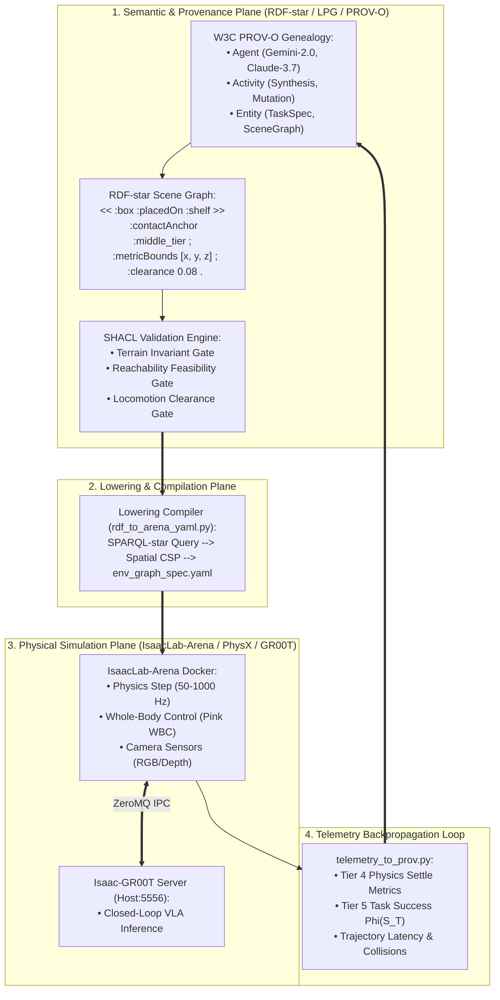
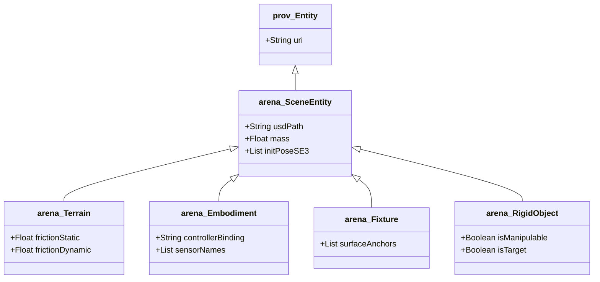
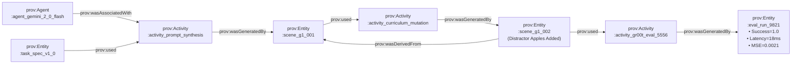
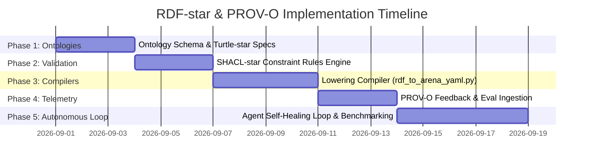

# Master Plan: RDF-star, Labeled Property Graphs (LPG), and PROV-O Architecture for Agentic Environment Generation

Implementation blueprint and architectural roadmap for upgrading **IsaacLab-Arena**'s declarative scene synthesis into a formal **Semantic Web & Property Graph Pipeline** utilizing **RDF-star ($\text{RDF}^*$)**, **SHACL Constraints**, and the **W3C PROV-O (Provenance Ontology)**.

---

## 1. Executive Summary & Architectural Vision

Current LLM-driven environment generation in robotics relies on ad-hoc YAML files. While functional, flat declarative representations suffer from:
1. **Lack of First-Class Spatial Edge Metadata**: Relations like `ON` or `INSIDE` cannot natively express metric bounding intervals, contact normals, or concavity clearance without nesting arbitrary dictionary fields.
2. **Zero Provenance & Auditability**: When an end-to-end VLA policy (like NVIDIA Isaac-GR00T) fails or succeeds, there is no formal graph record of which prompt, model temperature, asset version, or curriculum mutation produced the scene.
3. **Fragile Runtime Validation**: Validation relies on custom Python scripts rather than formal semantic constraint reasoning.



### The Dual-Plane Architectural Boundary
* **Semantic & Provenance Plane (Graph Store)**: Represents the immutable ground truth, spatial topology, semantic constraints, and evolutionary genealogy at $t=0$.
* **Physical Simulation Plane (Isaac Sim / PhysX)**: Operates over continuous Lie Group dynamics ($T\mathcal{Q}$), Whole-Body Quadratic Programs (HQP), and motor torques at $50\text{ Hz} - 1000\text{ Hz}$.
* **The Bridge**: The **Lowering Compiler** (`rdf_to_arena_yaml.py`) lowers RDF-star triples into validated `env_graph_spec.yaml` files, while the **Telemetry Engine** backpropagates simulation results into PROV-O evaluation triples.

---

## 2. Formal Ontology Architecture & RDF-star Schemas

### Core Namespaces
```turtle
@prefix arena: <https://isaac-sim.github.io/arena/schema#> .
@prefix prov:  <http://www.w3.org/ns/prov#> .
@prefix sh:    <http://www.w3.org/ns/shacl#> .
@prefix xsd:   <http://www.w3.org/2001/XMLSchema#> .
@prefix geo:   <http://www.opengis.net/ont/geosparql#> .
@prefix rdfs:  <http://www.w3.org/2000/01/rdf-schema#> .
```

### Class Hierarchy


### Reified Spatial Relations via RDF-star
RDF-star allows statements about statements without cumbersome traditional RDF reification nodes:

```turtle
# Example: G1 Loco-Manipulation Unit Scene in Turtle-star (TTL*)
:scene_g1_box_transfer_001 a arena:EnvironmentGraph, prov:Entity ;
    prov:wasGeneratedBy :activity_llm_synthesis_104 ;
    arena:hasTerrain :default_ground ;
    arena:hasEmbodiment :robot_unitree_g1 ;
    arena:hasFixture :shelf_main, :table_work ;
    arena:hasObject :box_target, :bin_receptacle .

:default_ground a arena:Terrain ;
    arena:classType "isaaclab_arena.terrains.default_ground_plane" ;
    arena:staticFriction "1.0"^^xsd:float ;
    arena:dynamicFriction "0.8"^^xsd:float .

:robot_unitree_g1 a arena:Embodiment ;
    arena:classType "unitree_g1" ;
    arena:spawnPose [ geo:asWKT "POINT Z (0.0 0.0 0.79)" ; arena:yaw "0.0"^^xsd:float ] ;
    arena:controllerBinding "g1_decoupled_wbc_pink_action" ;
    arena:hasSensor "ego_view" .

:shelf_main a arena:Fixture ;
    arena:usdPath "isaaclab_arena/assets/shelf.usd" ;
    arena:spawnPose [ geo:asWKT "POINT Z (1.0 0.0 0.0)" ; arena:yaw "0.0"^^xsd:float ] .

:table_work a arena:Fixture ;
    arena:usdPath "isaaclab_arena/assets/maple_table.usd" ;
    arena:spawnPose [ geo:asWKT "POINT Z (0.8 -1.4 0.0)" ; arena:yaw "0.0"^^xsd:float ] .

:box_target a arena:RigidObject ;
    arena:usdPath "isaaclab_arena/assets/brown_box.usd" ;
    arena:isTarget "true"^^xsd:boolean .

:bin_receptacle a arena:RigidObject ;
    arena:usdPath "isaaclab_arena/assets/blue_bin.usd" ;
    arena:isReceptacle "true"^^xsd:boolean .

# RDF-star Reified Spatial Edges with Continuous Metric Constraints
<< :box_target arena:placedOn :shelf_main >>
    arena:surfaceAnchor "middle_tier" ;
    arena:nominalHeight "0.75"^^xsd:float ;
    arena:boundXMin "0.95"^^xsd:float ; arena:boundXMax "1.05"^^xsd:float ;
    arena:boundYMin "-0.10"^^xsd:float ; arena:boundYMax "0.10"^^xsd:float ;
    arena:requiredClearance "0.08"^^xsd:float .

<< :bin_receptacle arena:placedOn :table_work >>
    arena:surfaceAnchor "tabletop" ;
    arena:nominalHeight "0.70"^^xsd:float ;
    arena:boundXMin "0.75"^^xsd:float ; arena:boundXMax "0.85"^^xsd:float ;
    arena:boundYMin "-1.45"^^xsd:float ; arena:boundYMax "-1.35"^^xsd:float ;
    arena:requiredClearance "0.05"^^xsd:float .
```

---

## 3. PROV-O Genealogy & Experiment Lineage Model

Tracking the complete causal graph of synthetic data generation allows systematic benchmarking and continuous curriculum improvement.



```turtle
# PROV-O Lineage Example
:activity_llm_synthesis_104 a prov:Activity ;
    prov:wasAssociatedWith :agent_gemini_2_0_flash ;
    prov:used :grounded_markdown_spec_v1 ;
    prov:startedAtTime "2026-08-27T20:45:00Z"^^xsd:dateTime ;
    prov:endedAtTime "2026-08-27T20:45:03Z"^^xsd:dateTime .

:eval_run_9821 a arena:EvaluationRun, prov:Entity ;
    prov:wasGeneratedBy :activity_gr00t_eval_5556 ;
    arena:evaluatedGraph :scene_g1_box_transfer_001 ;
    arena:foundationModel "nvidia/GR00T-N1.6-DROID" ;
    arena:taskPredicateSuccess "true"^^xsd:boolean ;
    arena:meanZeroMQLatencyMs "18.4"^^xsd:float ;
    arena:actionTrajectoryMSE "0.00231"^^xsd:float .
```

---

## 4. SHACL-star Semantic Validation Engine

Before an environment graph reaches simulation, it must pass formal SHACL constraint verification.

```turtle
# validation/arena_constraints.shacl.ttl

# Rule 1: Mandatory Terrain Invariant
arena:MandatoryTerrainShape a sh:NodeShape ;
    sh:targetClass arena:EnvironmentGraph ;
    sh:property [
        sh:path arena:hasTerrain ;
        sh:minCount 1 ;
        sh:maxCount 1 ;
        sh:message "FATAL: Every EnvironmentGraph MUST contain exactly 1 physical terrain ground plane." ;
    ] .

# Rule 2: Kinematic Reachability Bounding Constraint
arena:KinematicReachabilityShape a sh:NodeShape ;
    sh:targetClass arena:RigidObject ;
    sh:property [
        sh:path arena:nominalHeight ;
        sh:minInclusive 0.20 ;
        sh:maxInclusive 1.40 ;
        sh:message "ERROR: Manipulable object nominal height exceeds standard bipedal/manipulator workspace manifold [0.2m, 1.4m]." ;
    ] .

# Rule 3: Single-Threaded Pinocchio Invariant for Pink WBC
arena:PinkWBCEnvironmentCountShape a sh:NodeShape ;
    sh:targetClass arena:Embodiment ;
    sh:sparql [
        a sh:SPARQLConstraint ;
        sh:message "CRITICAL: When using Pink Whole-Body Control (g1_decoupled_wbc_pink_action), num_envs MUST equal 1 due to single-threaded Pinocchio QP solver." ;
        sh:select """
            SELECT $this
            WHERE {
                $this arena:controllerBinding "g1_decoupled_wbc_pink_action" .
                $this arena:numEnvs ?envs .
                FILTER (?envs > 1)
            }
        """ ;
    ] .
```

---

## 5. Lowering & Telemetry Compiler Specifications

### 5.1 Lowering Compiler (`tools/rdf_to_arena_yaml.py`)

The lowering compiler executes a SPARQL-star query over the graph store and outputs the canonical `env_graph_spec.yaml`:

```python
# tools/rdf_to_arena_yaml.py (Reference Implementation Blueprint)
import rdflib
import yaml
from pathlib import Path

SPARQL_EXTRACT_SCENE = """
PREFIX arena: <https://isaac-sim.github.io/arena/schema#>
PREFIX geo:   <http://www.opengis.net/ont/geosparql#>

SELECT ?robot_class ?controller ?terrain_class ?fixture ?fixture_usd ?obj ?obj_usd ?surface ?z_nom ?xmin ?xmax ?ymin ?ymax
WHERE {
    ?scene a arena:EnvironmentGraph ;
           arena:hasTerrain ?terrain ;
           arena:hasEmbodiment ?robot .
    ?terrain arena:classType ?terrain_class .
    ?robot arena:classType ?robot_class ;
           arena:controllerBinding ?controller .
    
    OPTIONAL {
        ?scene arena:hasFixture ?fixture .
        ?fixture arena:usdPath ?fixture_usd .
    }
    OPTIONAL {
        ?scene arena:hasObject ?obj .
        ?obj arena:usdPath ?obj_usd .
        << ?obj arena:placedOn ?fixture >>
            arena:surfaceAnchor ?surface ;
            arena:nominalHeight ?z_nom ;
            arena:boundXMin ?xmin ; arena:boundXMax ?xmax ;
            arena:boundYMin ?ymin ; arena:boundYMax ?ymax .
    }
}
"""

def lower_rdf_to_arena_yaml(ttl_path: str, output_yaml_path: str):
    g = rdflib.Graph()
    g.parse(ttl_path, format="turtle")
    
    results = g.query(SPARQL_EXTRACT_SCENE)
    # Parse query bindings into dictionary structure
    spec_dict = {
        "terrain": {"class_type": "isaaclab_arena.terrains.default_ground_plane", "friction": 1.0},
        "embodiment": {},
        "fixtures": {},
        "objects": {}
    }
    # (Populate spec_dict from query rows...)
    with open(output_yaml_path, "w") as f:
        yaml.dump(spec_dict, f, sort_keys=False)
```

---

## 6. Phased Implementation Roadmap



### Phase 1: Core Ontology & Asset Taxonomy (Days 1–3)
* Codify `ontology/isaac_arena_schema.ttl` with classes for Embodiments, Fixtures, Terrains, and Objects.
* Build asset catalog bindings mapping Nucleus / local USD paths to formal URIs.
* Define RDF-star reified property templates for spatial relations (`placedOn`, `placedInside`, `facing`).

### Phase 2: SHACL Validation Engine (Days 4–6)
* Write `validation/arena_constraints.shacl.ttl` enforcing the 5 physical invariants (ground plane, reachability manifolds, concavity clearances, WBC thread limits).
* Integrate `pyshacl` validation runner into the CI/CD pipeline.

### Phase 3: Lowering Compiler (`rdf_to_arena_yaml.py`) (Days 7–10)
* Develop the SPARQL-star lowering pipeline converting graph stores into executable `env_graph_spec.yaml`.
* Implement the reverse parser (`arena_yaml_to_rdf.py`) to lift legacy YAML task files into the graph database.

### Phase 4: Telemetry Backpropagation & PROV-O Engine (Days 11–13)
* Instrument `policy_runner.py` to write JSON execution telemetry summaries upon rollout completion.
* Develop `tools/telemetry_to_prov.py` to transform execution metrics into RDF-star `prov:EvaluationRun` triples.

### Phase 5: Agentic Self-Healing Synthesis & 100-Scene Benchmark (Days 14–18)
* Update LLM agent prompts to output grounded Turtle-star graphs directly.
* Implement an automated feedback loop: if SHACL validation fails, feed the validation report back to the LLM agent for zero-shot self-healing before simulation launch.
* Execute a 100-scene automated benchmark spanning Unitree G1, OXE Droid, and Franka Emika.

---

## 7. Risk Matrix & Mitigations

| Risk | Impact | Likelihood | Mitigation Strategy |
| :--- | :--- | :--- | :--- |
| **SPARQL-star Query Latency** | Low | Low | Use in-memory `rdflib` or embedded `Oxigraph` (Rust-based) for sub-millisecond query execution. |
| **LLM Syntax Errors in Turtle-star** | Medium | Medium | Provide few-shot in-context `task_spec.md` templates and utilize SHACL error feedback loops for automatic correction. |
| **Schema Drift between IsaacLab-Arena versions** | High | Low | Version control ontologies alongside IsaacLab-Arena tags (`0.3.0-prerelease`) using `prov:wasDerivedFrom`. |
| **Graph DB Overhead for Local Dev** | Low | Low | Maintain dual support: standalone lightweight Turtle-star files for local dev, centralized GraphDB (Neo4j / GraphDB) for CI/cloud scale. |
