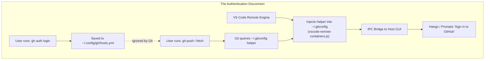
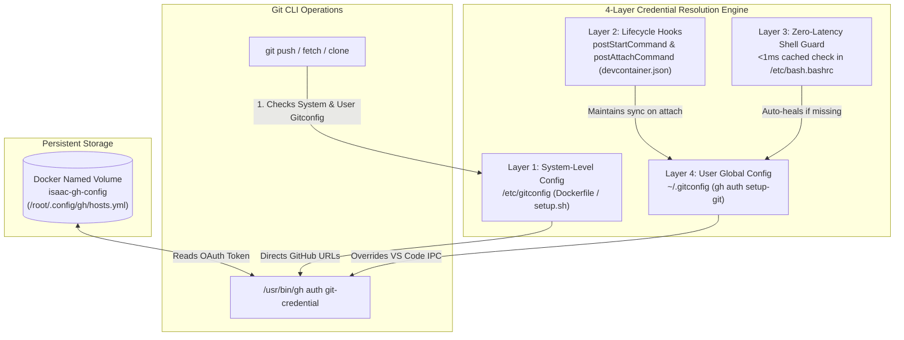

# DevContainer Git & GitHub Authentication Strategy

A comprehensive technical reference and architectural evaluation for Git and GitHub CLI (`gh`) authentication inside development containers, cloud workstations, and multi-agent environments.

---

## 1. Executive Summary & The Authentication Dilemma

When running containerized development environments (such as the Isaac Automator DevContainer), developers and autonomous agents need to execute `git` operations (`fetch`, `pull`, `push`, `clone`) and GitHub CLI operations (`gh pr`, `gh issue`, `gh auth`).

A frequent friction point occurs when a developer authenticates inside the container via `gh auth login`, but subsequent `git` commands still fail or cause VS Code to prompt for browser sign-in repeatedly.



### The Root Cause
1. **Separation of Credential Stores**: `gh auth login` writes OAuth credentials exclusively for the `gh` tool (`~/.config/gh/hosts.yml`). It does not alter Git's global credential configuration unless `--git-protocol https` is passed or `gh auth setup-git` is executed.
2. **VS Code Injected Helper**: When VS Code attaches to any devcontainer, it injects a JavaScript-based credential helper into `~/.gitconfig` and `/etc/gitconfig`. This helper routes Git credential requests back across the VS Code server bridge to the host machine's VS Code window. If the host VS Code is unauthenticated or encounters an IPC delay, Git commands in the container hang or trigger authentication modals.
3. **Container Ephemerality**: In a default container lifecycle, rebuilds destroy the root/user home filesystem, wiping any manual `gh auth login` state.

---

## 2. Comparative Analysis of Authentication Patterns

| Pattern | Mechanism | Secret Storage Location | Rebuild Persistence | Cloud VM Portability | Best Use Case |
| :--- | :--- | :--- | :---: | :---: | :--- |
| **Pattern A: VS Code Native** | `github.gitAuthentication: true` | Host OS Keychain / VS Code SecretStore | N/A (Host-managed) | 🟡 Needs active VS Code GUI | Standard VS Code desktop developers |
| **Pattern B: Persistent Named Volume (Adopted)** | Named Docker volume mounted to `~/.config/gh` + `gh auth setup-git` | Docker named volume (`isaac-gh-config`) | 🟢 **100% Persistent** | 🟢 **Full (Docker-native)** | CLI-first developers, container power users, multi-agent workflows |
| **Pattern C: SSH Agent Forwarding** | `ForwardAgent yes` (`ssh -A`) | Host RAM (Agent socket forwarding) | 🟢 **100% (No state)** | 🟢 **Highest Security** | Remote cloud VMs (EC2, GCP), production bastion hosts |
| **Pattern D: `GH_TOKEN` Env Variable** | Exported Personal Access Token | In-memory environment variable | 🟢 **100% (Env-driven)** | 🟢 **Full (Headless)** | Headless automation, CI/CD runners, scheduled pipelines |
| **Pattern E: Host Bind Mount** | Bind-mount host `~/.config/gh` | Host filesystem | 🟢 Persistent on host | 🔴 **Fails on cloud VMs & UID mismatches** | Local single-user machines only (fragile) |

---

## 3. Pattern B Architecture (Multi-Layer Defense-in-Depth)

Isaac Automator adopts **Pattern B (Named Volume + 4-Layer Defense-in-Depth)** as the primary authentication strategy for its DevContainer.



### 3.1 Architectural Implementation

#### 1. Volume Definition in `.devcontainer/devcontainer.json`
```json
{
  "mounts": [
    "source=isaac-gh-config,target=/root/.config/gh,type=volume"
  ]
}
```
* **Why Named Volume over Bind Mount**: Named volumes are managed directly by Docker. They do not depend on the host operating system's filesystem layout, work seamlessly across Linux, macOS, and Windows WSL2, and avoid host-vs-container UID/GID file ownership corruption.

#### 2. System-Level Defaults in `.devcontainer/Dockerfile` & `.devcontainer/setup.sh`
```bash
git config --system "credential.https://github.com.helper" ""
git config --system --add "credential.https://github.com.helper" "!/usr/bin/gh auth git-credential"
git config --system "credential.https://gist.github.com.helper" ""
git config --system --add "credential.https://gist.github.com.helper" "!/usr/bin/gh auth git-credential"
```
* Pre-configuring `/etc/gitconfig` ensures all users, subshells, and headless agent tools resolve `https://github.com` credentials immediately without relying on manual user config.

#### 3. Container Lifecycle Hooks in `.devcontainer/devcontainer.json`
```json
{
  "postCreateCommand": "bash .devcontainer/setup.sh",
  "postStartCommand": "gh auth setup-git 2>/dev/null || true",
  "postAttachCommand": "gh auth setup-git 2>/dev/null || true"
}
```
* Ensures that whenever VS Code connects or re-attaches, the credential helper is verified in user scope (`~/.gitconfig`).

#### 4. Fast Shell Initialization Guard (`/etc/bash.bashrc` & `~/.bashrc`)
```bash
command -v gh &>/dev/null && ! git config --global --get credential.https://github.com.helper &>/dev/null && gh auth setup-git 2>/dev/null || true
```
* Runs a sub-millisecond check (`<1ms`). If already configured, it exits instantly without disk writes; if missing or clobbered, it automatically repairs `~/.gitconfig`.

---

## 4. Lifecycle Edge-Case Analysis: Why Single-Hook Approaches Fail

Relying on a single lifecycle stage (such as only `postCreateCommand` or only interactive login prompts) fails due to the following container runtime dynamics:

1. **Active Containers vs Rebuilds**: `postCreateCommand` only runs on the very first container initialization. Existing running containers or reconnects do not re-run `postCreateCommand`.
2. **Delayed User Authentication**: On a fresh machine, `setup.sh` runs *before* the developer executes `gh auth login`.
3. **VS Code Helper Ingestion**: VS Code injects generic `[credential]` helpers on container attach. Having system-level and URL-specific overrides (`[credential "https://github.com"]`) prevents VS Code's helper from intercepting GitHub calls and timing out.

The **4-layer defense-in-depth** model guarantees that credentials are resolved seamlessly in all scenarios: active terminal tabs, VS Code GUI operations, subshells, and background agent processes.

---

## 5. Operator Runbook: First-Time Setup & Workflow

### 5.1 Initial Setup on a Fresh Machine
1. Open the repository in the DevContainer.
2. Open a terminal and log in once:
   ```bash
   gh auth login
   ```
3. Follow the interactive prompts:
   - Select **GitHub.com**.
   - Select **HTTPS** as preferred Git protocol.
   - When asked **`Authenticate Git with your GitHub credentials? (Y/n)`**, press **`Y`** (Enter).
   - Complete authentication via browser or one-time device code.

### 5.2 Subsequent Container Rebuilds
* When you rebuild the container, recreate it, or update branches, Docker reattaches the `isaac-gh-config` volume.
* `setup.sh` runs `gh auth setup-git` automatically.
* **No user action required**: `git fetch`, `git push`, and `gh` CLI commands work instantly out of the box.

### 5.3 Verifying Authentication Status
To confirm that Git and `gh` are configured properly:
```bash
# Check GitHub CLI login
gh auth status

# Test credential resolution for Git
echo -e "protocol=https\nhost=github.com\n" | git credential fill
```
Output should display `username` and `password=gho_...` without hanging or prompting.

---

## 6. Security Profile & Token Lifecycle

1. **Token Scope**: `gh auth login` requests standard scopes (`repo`, `read:org`, `gist`, `workflow`).
2. **Isolation**: The `isaac-gh-config` named volume is restricted to the local Docker daemon. It is never committed to Git and is ignored by version control.
3. **Revocation / Logout**: To clear credentials at any time, run:
   ```bash
   gh auth logout
   ```
   or prune the Docker volume:
   ```bash
   docker volume rm isaac-gh-config
   ```
