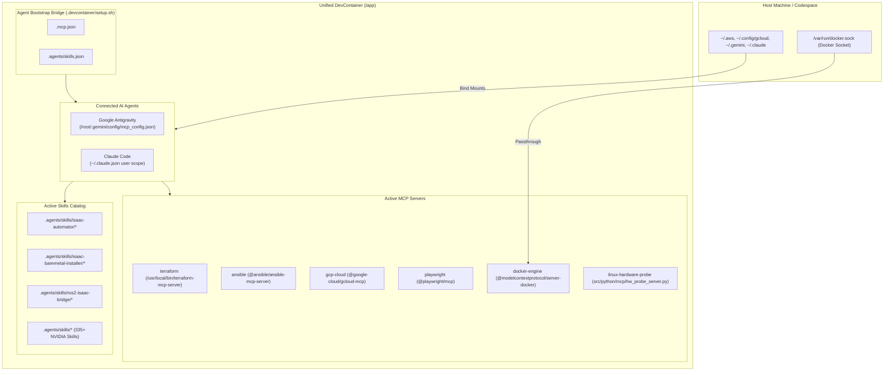

# DevContainer MCP & Skills Integration Plan (`devcontainer-mcp-skills-plan.md`)

## 1. Executive Summary & Goal

This document defines the exact step-by-step engineering plan to integrate specialized **Model Context Protocol (MCP) servers** and **Robotics Agent Skills** into the Isaac Automator **DevContainer**.

The purpose is to enable AI coding assistants (**Google Antigravity**, **Claude Code**, **Cursor**) running inside the DevContainer to seamlessly:
1. Orchestrate GPU Docker containers and DevContainers with typed MCP tools (`docker-engine`).
2. Probe physical bare-metal workstation hardware, PCIe link widths, Vulkan ICDs, and X11/Wayland display states (`linux-hardware-probe`).
3. Query ground-truth Isaac Sim and Isaac Lab SDK documentation in real-time (`nvidia-isaac-docs`).
4. Execute standardized operational procedures for bare-metal host installation (`isaac-baremetal-installer`), ROS 2 integration (`ros2-isaac-bridge`), and low-latency teleoperation streaming (`connect-workstation`).

---

## 2. Target DevContainer Architecture



---

## 3. Concrete File Modifications & Specifications

### 3.1 Build-Time Layer: [`.devcontainer/Dockerfile`](file:///workspaces/IsaacAutomator/.devcontainer/Dockerfile)

Following our established architectural pattern, all tools, binaries, system diagnostic packages, and global Node packages must be **pre-installed at Docker image build time** to guarantee instant, offline-capable startup without runtime download delays:

```dockerfile
# 1. System Hardware Diagnostic Packages
RUN apt-get update && apt-get install -qy --no-install-recommends \
    pciutils \
    lshw \
    vulkan-tools \
    mesa-utils \
    && rm -rf /var/lib/apt/lists/*

# 2. Python MCP SDK
RUN pip3 install --no-cache-dir \
    mcp

# 3. Pre-install Node-based MCP Servers Globally (Eliminating npx runtime network delays)
RUN npm install -g \
    @modelcontextprotocol/server-docker \
    @ansible/ansible-mcp-server \
    @google-cloud/gcloud-mcp \
    @playwright/mcp@latest
```

---

### 3.2 Workspace MCP Registry ([`.mcp.json`](file:///workspaces/IsaacAutomator/.mcp.json))
Add `docker-engine` and `linux-hardware-probe` alongside existing DevOps tools:

```json
{
  "mcpServers": {
    "playwright": {
      "command": "npx",
      "args": [
        "-y",
        "@playwright/mcp@latest",
        "--headless",
        "--no-sandbox"
      ]
    },
    "terraform": {
      "command": "/usr/local/bin/terraform-mcp-server",
      "args": [
        "stdio",
        "--toolsets=all"
      ]
    },
    "ansible": {
      "command": "npx",
      "args": [
        "-y",
        "@ansible/ansible-mcp-server",
        "--stdio"
      ]
    },
    "gcp-cloud": {
      "command": "npx",
      "args": [
        "-y",
        "@google-cloud/gcloud-mcp"
      ]
    },
    "docker-engine": {
      "command": "npx",
      "args": [
        "-y",
        "@modelcontextprotocol/server-docker"
      ]
    },
    "linux-hardware-probe": {
      "command": "python3",
      "args": [
        "/app/src/python/mcp/hw_probe_server.py"
      ]
    }
  }
}
```

---

### 3.3 Lightweight Hardware Probe MCP Server (`src/python/mcp/hw_probe_server.py`)

A zero-dependency Python script implementing the JSON-RPC 2.0 stdio MCP protocol for system diagnostics:

```python
#!/usr/bin/env python3
"""
linux-hardware-probe MCP Server
Provides structured hardware, GPU, Vulkan, and display diagnostics for AI coding agents.
"""
import json
import os
import shutil
import subprocess
import sys

def get_gpu_info():
    if not shutil.which("nvidia-smi"):
        return {"nvidia_smi": False, "status": "No NVIDIA GPU driver or CLI found"}
    try:
        cmd = [
            "nvidia-smi",
            "--query-gpu=name,driver_version,memory.total,memory.free,pci.bus_id,pci.link.gen.current,pci.link.width.current,temperature.gpu",
            "--format=csv,noheader,nounits"
        ]
        output = subprocess.check_output(cmd, text=True).strip()
        gpus = []
        for line in output.splitlines():
            parts = [p.strip() for p in line.split(",")]
            gpus.append({
                "name": parts[0],
                "driver_version": parts[1],
                "memory_total_mb": parts[2],
                "memory_free_mb": parts[3],
                "pci_bus_id": parts[4],
                "pcie_gen": parts[5],
                "pcie_width": f"x{parts[6]}",
                "temperature_c": parts[7]
            })
        return {"nvidia_smi": True, "gpus": gpus}
    except Exception as e:
        return {"nvidia_smi": True, "error": str(e)}

def get_display_info():
    display = os.environ.get("DISPLAY", "")
    wayland = os.environ.get("WAYLAND_DISPLAY", "")
    x11_sockets = []
    if os.path.exists("/tmp/.X11-unix"):
        x11_sockets = os.listdir("/tmp/.X11-unix")
    
    gdm_wayland_disabled = False
    if os.path.exists("/etc/gdm3/custom.conf"):
        with open("/etc/gdm3/custom.conf", "r") as f:
            if "WaylandEnable=false" in f.read():
                gdm_wayland_disabled = True

    return {
        "display_env": display,
        "wayland_env": wayland,
        "x11_sockets": x11_sockets,
        "gdm_wayland_disabled": gdm_wayland_disabled,
        "is_headless": not bool(display or x11_sockets)
    }

def get_vulkan_info():
    has_vulkaninfo = bool(shutil.which("vulkaninfo"))
    icd_files = []
    for path in ["/usr/share/vulkan/icd.d", "/etc/vulkan/icd.d"]:
        if os.path.exists(path):
            icd_files.extend([os.path.join(path, f) for f in os.listdir(path)])
    return {
        "vulkaninfo_available": has_vulkaninfo,
        "icd_manifests": icd_files
    }

def run_probe():
    return {
        "gpu": get_gpu_info(),
        "display": get_display_info(),
        "vulkan": get_vulkan_info(),
        "docker_socket_accessible": os.path.exists("/var/run/docker.sock")
    }

# Standard JSON-RPC stdio protocol dispatcher
# (Implements initialize, tools/list, and tools/call for 'probe_system_hardware')
```

---

### 3.4 DevContainer Setup Script ([`.devcontainer/setup.sh`](file:///workspaces/IsaacAutomator/.devcontainer/setup.sh))

Update `.devcontainer/setup.sh` to synchronize both MCP servers and the new skills:

```bash
# ----------------------------------------------------------------------
# 1. Google Antigravity Agent Configuration
# ----------------------------------------------------------------------
echo "⚙️  [1/5] Configuring Google Antigravity..."
mkdir -p /root/.gemini/config

if [ -f "${WORKSPACE_DIR}/.mcp.json" ]; then
    cp "${WORKSPACE_DIR}/.mcp.json" /root/.gemini/config/mcp_config.json
    echo "   ✔ Synchronized .mcp.json -> /root/.gemini/config/mcp_config.json"
fi

# Ensure .agents/skills.json registers all skill folders
mkdir -p "${WORKSPACE_DIR}/.agents"
cat << 'JSON_EOF' > "${WORKSPACE_DIR}/.agents/skills.json"
{
  "entries": [
    { "path": ".agents/skills/isaac-automator" },
    { "path": ".agents/skills/isaac-baremetal-installer" },
    { "path": ".agents/skills/ros2-isaac-bridge" },
    { "path": ".agents/skills" }
  ]
}
JSON_EOF
echo "   ✔ Configured ${WORKSPACE_DIR}/.agents/skills.json"

# ----------------------------------------------------------------------
# 2. Claude Code Agent Configuration
# ----------------------------------------------------------------------
echo "⚙️  [2/5] Configuring Claude Code..."
mkdir -p /root/.claude

if command -v claude &>/dev/null; then
    claude mcp add --scope user terraform -- /usr/local/bin/terraform-mcp-server stdio --toolsets=all 2>/dev/null || true
    claude mcp add --scope user playwright -- npx -y @playwright/mcp@latest --headless --no-sandbox 2>/dev/null || true
    claude mcp add --scope user ansible -- npx -y @ansible/ansible-mcp-server --stdio 2>/dev/null || true
    claude mcp add --scope user gcp-cloud -- npx -y @google-cloud/gcloud-mcp 2>/dev/null || true
    claude mcp add --scope user docker-engine -- npx -y @modelcontextprotocol/server-docker 2>/dev/null || true
    claude mcp add --scope user linux-hardware-probe -- python3 /app/src/python/mcp/hw_probe_server.py 2>/dev/null || true
    echo "   ✔ Pre-registered all 6 MCP servers into user scope in ~/.claude.json"
fi
```

---

### 3.5 Skill Definitions to Create

#### 1. `.agents/skills/isaac-baremetal-installer/SKILL.md`
- **Purpose**: Step-by-step diagnostic and install runbook for fresh physical Ubuntu 22.04 workstations.
- **Covers**:
  - Phase 1: Hardware & Display Probe (Checking monitors, disabling Wayland in GDM).
  - Phase 2: Host Dependencies (GCC 11 alternatives, Git LFS, Vulkan).
  - Phase 3: Engine Selection (Standalone ZIP vs Pip `uv` vs Docker).
  - Phase 4: Verification Suite (PyTorch CUDA, USD scene init).

#### 2. `.agents/skills/ros2-isaac-bridge/SKILL.md`
- **Purpose**: ROS 2 Humble/Iron configuration for Isaac Sim and Isaac Lab.
- **Covers**:
  - CycloneDDS installation and XML network tuning.
  - Omniverse ROS 2 Bridge extension enablement.
  - Camera, LiDAR, and joint state trajectory publishers.

#### 3. Enhancement to [`.agents/skills/isaac-automator/connect-workstation/SKILL.md`](file:///workspaces/IsaacAutomator/.agents/skills/isaac-automator/connect-workstation/SKILL.md)
- Add section: **Gamepad & HID Teleoperation Passthrough** (`/dev/uinput`, `evdev`, low-latency NVENC tuning in Sunshine).

---

## 4. Execution Sequence & Validation Checklist

| Step | Action | Verification Command |
| :--- | :--- | :--- |
| **1** | Create `src/python/mcp/hw_probe_server.py` | `python3 src/python/mcp/hw_probe_server.py` |
| **2** | Update `.mcp.json` | Validate JSON schema |
| **3** | Update `.devcontainer/setup.sh` | Run `bash .devcontainer/setup.sh` |
| **4** | Create `isaac-baremetal-installer` skill | Check `.agents/skills/isaac-baremetal-installer/SKILL.md` |
| **5** | Create `ros2-isaac-bridge` skill | Check `.agents/skills/ros2-isaac-bridge/SKILL.md` |
| **6** | Update `connect-workstation` skill | Verify teleop gamepad instructions |
| **7** | Validate Multi-Agent Discovery | Check `/root/.gemini/config/mcp_config.json` & `~/.claude.json` |
