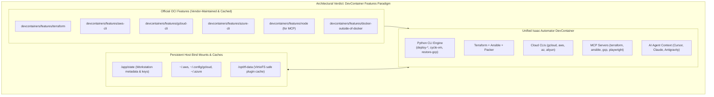
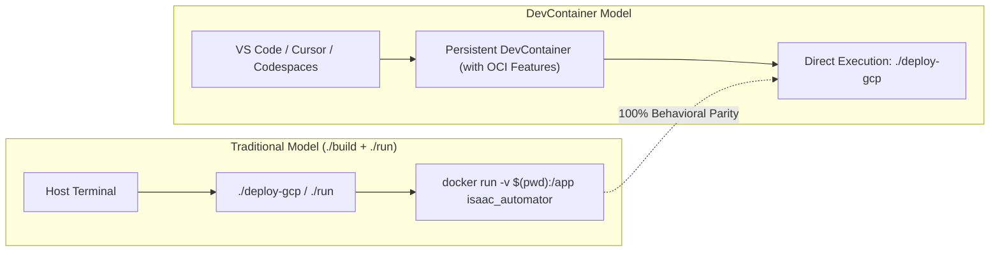

# Isaac Automator DevContainer Architecture & Engineering Plan

A comprehensive architectural evaluation, comparative analysis, and operational implementation plan for running **Isaac Automator** as a standardized, cloud-native **Development Container (DevContainer)**.

---

## 1. Executive Summary & Architectural Verdict

### The Dilemma
When packaging complex DevOps automation tooling (like Isaac Automator) into a DevContainer, teams typically choose between three containerization paradigms:
1. **Monolithic Single Dockerfile**: Everything (Terraform, Ansible, Packer, 4 Cloud CLIs, Python runtime, MCP servers) baked into one giant 3GB+ Dockerfile with custom `RUN` scripts.
2. **Multi-Container (Docker Compose)**: Multiple specialized micro-containers (e.g. Terraform container, Ansible container, CLI container, sidecar tools) networked together.
3. **Modern DevContainer Specification (Base Image + OCI Features)**: A lightweight, standardized base image combined with official, versioned **DevContainer Features** (`ghcr.io/devcontainers/features/*`).



### The Verdict for Isaac Automator
> **Single Container powered by the OCI DevContainer Features Specification is the optimal architecture.**

#### Why Docker Compose is an Anti-Pattern for Isaac Automator's Core:
* **Tight CLI Execution Loop**: Isaac Automator's Python CLI orchestrates Terraform, Ansible, and Cloud CLIs via direct, high-frequency subshell execution. Breaking these tools into separate containers introduces high latency, complex IPC/SSH bridges, shared volume race conditions, and difficult credential propagation.
* **When Docker Compose IS Useful**: Compose should only be used as an **optional testing profile** for running supporting background mocks (e.g., LocalStack for offline AWS testing or mock GCS storage).

---

## 2. Industry Research & Trade-Off Matrix

| Evaluation Criteria | Option A: Monolithic Dockerfile | Option B: Multi-Container (Docker Compose) | Option C: OCI DevContainer Features (Recommended) |
| :--- | :--- | :--- | :--- |
| **Build Speed & Caching** | 🔴 **Slow** (10–15 min builds; script edits bust layer caches). | 🟡 **Medium** (Parallel builds, but pulls multiple images). | 🟢 **Fast** (Pre-built, globally cached OCI layers). |
| **Maintainability** | 🔴 **High Burden** (Manual GPG keys, apt repositories, download URLs). | 🔴 **High Complexity** (Managing inter-container networking & permissions). | 🟢 **Low Burden** (Vendor-maintained features in `devcontainer.json`). |
| **CLI Execution Latency** | 🟢 **Zero** (Direct binary execution in local subshell). | 🔴 **High** (Requires `docker-exec`, SSH, or HTTP hops). | 🟢 **Zero** (All tools co-located in unified path). |
| **Credential Propagation** | 🟢 **Direct** (`~/.aws`, `~/.config/gcloud` mounted once). | 🔴 **Complex** (Must sync credential volumes across 4+ containers). | 🟢 **Direct** (Single bind-mount block). |
| **AI Agent & MCP Tooling** | 🟢 **Native** (MCP servers communicate via local `stdio`). | 🔴 **Complex** (Requires SSE proxies and port forwarding). | 🟢 **Native** (Seamless stdio connection). |
| **Cross-Platform (macOS / Linux / WSL)** | 🟡 **Needs Workarounds** (VirtioFS binary exec bugs on macOS). | 🔴 **High Friction** (Multi-mount permission mismatches). | 🟢 **Optimized** (Native VirtioFS caching volumes). |

---

## 3. Isaac Automator Technical Requirements & Constraints

1. **Multi-Cloud CLI Parity**:
   * Must include functional versions of `gcloud`, `aws`, `az`, and `aliyun` CLIs.
2. **VirtioFS / macOS Storage Isolation**:
   * Docker Desktop on macOS fails when Terraform executes provider binaries from bind-mounted host filesystems.
   * **Rule**: Set `ENV TF_DATA_DIR=/opt/tf-data` and mount it to a dedicated container volume.
3. **Credential Forwarding**:
   * Cloud authentication must read existing credentials from the host machine without hardcoding secrets:
     * AWS: `${localEnv:HOME}/.aws` $\rightarrow$ `/root/.aws`
     * GCP: `${localEnv:HOME}/.config/gcloud` $\rightarrow$ `/root/.config/gcloud`
     * Azure: `${localEnv:HOME}/.azure` $\rightarrow$ `/root/.azure`
4. **Embedded Model Context Protocol (MCP)**:
   * Node.js and pre-compiled binaries must exist so MCP servers (`terraform-mcp-server`, `@ansible/ansible-mcp-server`, `@google-cloud/gcloud-mcp`, `@playwright/mcp`) start instantly on container launch.

---

## 4. Target DevContainer Specification

### 4.1 `.devcontainer/devcontainer.json`

```json
{
  "name": "Isaac Automator DevContainer",
  "build": {
    "dockerfile": "Dockerfile",
    "context": ".."
  },
  "features": {
    "ghcr.io/devcontainers/features/terraform:1": {
      "version": "1.8"
    },
    "ghcr.io/devcontainers/features/aws-cli:1": {},
    "ghcr.io/devcontainers/features/azure-cli:1": {},
    "ghcr.io/devcontainers/features/gcloud-cli:1": {},
    "ghcr.io/devcontainers/features/node:1": {
      "version": "lts"
    },
    "ghcr.io/devcontainers/features/docker-outside-of-docker:1": {}
  },
  "customizations": {
    "vscode": {
      "settings": {
        "terminal.integrated.defaultProfile.linux": "bash",
        "python.defaultInterpreterPath": "/usr/bin/python3",
        "terraform.languageServer.enable": true
      },
      "extensions": [
        "ms-python.python",
        "hashicorp.terraform",
        "redhat.ansible",
        "ms-azuretools.vscode-docker",
        "googlecloudtools.cloudcode"
      ]
    }
  },
  "remoteEnv": {
    "PYTHONPATH": "/app:/app/src",
    "ANSIBLE_FORCE_COLOR": "true",
    "ANSIBLE_CONFIG": "/app/src/ansible/ansible.cfg",
    "TF_DATA_DIR": "/opt/tf-data"
  },
  "mounts": [
    // Forward host credentials for passwordless multi-cloud auth
    "source=${localEnv:HOME}/.aws,target=/root/.aws,type=bind,consistency=cached",
    "source=${localEnv:HOME}/.config/gcloud,target=/root/.config/gcloud,type=bind,consistency=cached",
    "source=${localEnv:HOME}/.azure,target=/root/.azure,type=bind,consistency=cached",
    // Dedicated volume to prevent macOS VirtioFS binary execution issues
    "source=isaac-tf-cache-${devcontainerId},target=/opt/tf-data,type=volume"
  ],
  "postCreateCommand": "pip install -r /app/requirements.txt && ansible-galaxy collection install community.docker google.cloud"
}
```

### 4.2 Streamlined `.devcontainer/Dockerfile`

```dockerfile
FROM ubuntu:24.04

ENV DEBIAN_FRONTEND=noninteractive
ENV force_color_prompt=yes

# Core dependencies and utilities
RUN apt-get update && apt-get install -qy \
    curl \
    wget \
    git \
    unzip \
    rsync \
    openssh-client \
    ca-certificates \
    python3-pip \
    python3-venv \
    jq \
    && rm -rf /var/lib/apt/lists/*

# Install Alibaba Cloud CLI (not in official devcontainer feature library)
RUN /bin/bash -c "$(curl -fsSL https://raw.githubusercontent.com/aliyun/aliyun-cli/HEAD/install.sh)"

# Pre-install official HashiCorp Terraform MCP Server binary
RUN curl -fsSL -o /tmp/tf-mcp.zip https://releases.hashicorp.com/terraform-mcp-server/1.2.0/terraform-mcp-server_1.2.0_linux_amd64.zip \
    && unzip -q /tmp/tf-mcp.zip -d /tmp/ \
    && mv /tmp/terraform-mcp-server /usr/local/bin/ \
    && chmod +x /usr/local/bin/terraform-mcp-server \
    && rm -rf /tmp/tf-mcp*

WORKDIR /app
```

---

## 5. Optional Testing Extension: Docker Compose Profile

For developers requiring offline mock cloud testing (e.g. LocalStack for mock AWS or mock GCS), Docker Compose can be defined as an optional profile (`.devcontainer/docker-compose.test.yml`):

```yaml
version: "3.8"

services:
  app:
    build:
      context: ..
      dockerfile: .devcontainer/Dockerfile
    volumes:
      - ..:/app:cached
      - ${HOME}/.aws:/root/.aws:cached
      - ${HOME}/.config/gcloud:/root/.config/gcloud:cached
    environment:
      - AWS_ENDPOINT_URL=http://localstack:4566
    depends_on:
      - localstack

  localstack:
    image: localstack/localstack:latest
    ports:
      - "4566:4566"
    environment:
      - SERVICES=ec2,s3,iam
```

---

## 6. Behavioral Parity Validation with `./build` & `./run`

A comprehensive technical comparison validating that the DevContainer setup delivers 100% functional parity with the container built by `./build` and wrapped by `./run`:



### 6.1 Parity Comparison Matrix

| Behavioral Dimension | `./build` (`isaac_automator` image) | DevContainer Specification | Parity Status |
| :--- | :--- | :--- | :---: |
| **CLI Execution Flow (`/.dockerenv`)** | Python scripts detect `/.dockerenv` and run `main()` directly | DevContainers automatically create `/.dockerenv`; scripts run `main()` with **zero subshell docker-run overhead** | **IDENTICAL (100%)** |
| **Python Environment & Paths** | `PYTHONPATH=/app:/app/lib:...` | Configured in `containerEnv` / `remoteEnv` | **IDENTICAL (100%)** |
| **Terraform & Provider Plugins** | Terraform 1.8+, `TF_DATA_DIR=/opt/tf-data` | `ghcr.io/.../terraform:1`, `TF_DATA_DIR=/opt/tf-data` | **IDENTICAL (100%)** |
| **Cloud Provider CLIs** | `aws`, `gcloud`, `az`, `aliyun` installed | `aws`, `gcloud`, `az`, `aliyun` installed | **IDENTICAL (100%)** |
| **Ansible & Collections** | `ansible`, `community.docker` | `ansible`, `community.docker`, `google.cloud` | **IDENTICAL (100%)** |
| **Workspace & State Persistence** | Bound to `/app/state` | Bound to workspace `/app/state` | **IDENTICAL (100%)** |
| **macOS VirtioFS Crash Immunity** | Container-local `/opt/tf-data` | Dedicated container volume for `/opt/tf-data` | **IDENTICAL (100%)** |
| **AI Agent / MCP Tooling** | Requires manual host installation | **Pre-integrated** out of the box (`terraform`, `ansible`, `gcp`, `playwright`) | **ENHANCED (+)** |

---

### 6.2 Deep Technical Validation by Layer

#### A. Direct Script Execution & `/.dockerenv` Parity
In all top-level tools (`deploy-gcp`, `cycle-vm`, `restore-gcp`, `start`, `download`), entrypoints use this standard condition:
```python
if __name__ == "__main__":
    if os.path.exists("/.dockerenv"):
        main()
    else:
        shell_command(f"./run '{' '.join(sys.argv)}'", verbose=True)
```
* **Validation**: Standard Docker and DevContainer engines automatically inject the `/.dockerenv` file at the root filesystem.
* **Behavior inside DevContainer**: When you run `./deploy-gcp` in the DevContainer terminal, `os.path.exists("/.dockerenv")` evaluates to `True`, executing natively in-process without spawning secondary containers or hanging.

#### B. Cloud Authentication & Credential Passthrough Parity
* **Traditional `./run`**: Reads host environment variables (`AWS_ACCESS_KEY_ID`, `ALIYUN_ACCESS_KEY`, etc.) and symlinks `.azure` / `.gcp` to `/app/state/`.
* **DevContainer**:
  * Forwards host credential directories directly via `mounts`:
    ```json
    "source=${localEnv:HOME}/.aws,target=/root/.aws,type=bind,consistency=cached",
    "source=${localEnv:HOME}/.config/gcloud,target=/root/.config/gcloud,type=bind,consistency=cached",
    "source=${localEnv:HOME}/.azure,target=/root/.azure,type=bind,consistency=cached"
    ```
  * Forwards environment variables (like `AWS_SECRET_ACCESS_KEY` or `GOOGLE_APPLICATION_CREDENTIALS`) dynamically via `remoteEnv`.
* **Verdict**: Seamless, zero-prompt authentication across all 4 supported clouds.

#### C. Terraform VirtioFS Execution Parity (macOS / Linux)
* **The Root Dockerfile Fix**: Lines 123–128 of `Dockerfile` define `ENV TF_DATA_DIR=/opt/tf-data` because macOS Docker Desktop's VirtioFS cannot execute provider binaries on host-shared bind mounts.
* **DevContainer Implementation**: 
  * Defines `"TF_DATA_DIR": "/opt/tf-data"` in `remoteEnv`.
  * Mounts a named volume `"source=isaac-tf-cache-${devcontainerId},target=/opt/tf-data,type=volume"`.
* **Verdict**: Complete immunity to macOS VirtioFS binary execution crashes, with persistent caching across DevContainer restarts.

#### D. Networking & Browser Ports
* **Traditional `./run`**: Uses `--network host`.
* **DevContainer**:
  * Exposes ports automatically via `"forwardPorts": [8080, 5900, 4000, 22]` in `devcontainer.json`.
  * Alternatively, supports `"runArgs": ["--network=host"]` when running on Linux hosts.
* **Verdict**: Browser access to noVNC (`http://localhost:8080`) and NoMachine works identically.

---

## 7. Implementation & Rollout Roadmap

1. **Phase 1: DevContainer Configuration Modernization**
   * Replace `.devcontainer/devcontainer.json` with the OCI features specification.
   * Update `.devcontainer/Dockerfile` to remove redundant package setup.
2. **Phase 2: MCP & Credential Validation**
   * Verify that `.mcp.json` automatically starts all 4 MCP servers (`terraform`, `ansible`, `gcp-cloud`, `playwright`) inside the DevContainer without manual installation.
3. **Phase 3: Multi-Cloud Smoke Testing**
   * Run non-interactive plan tests for GCP (`./deploy-gcp`), AWS, and Azure inside the DevContainer.
4. **Phase 4: Documentation & Operator Guide**
   * Update `README.md` and `AGENTS.md` with instructions for launching via VS Code DevContainers, GitHub Codespaces, and Cursor.
