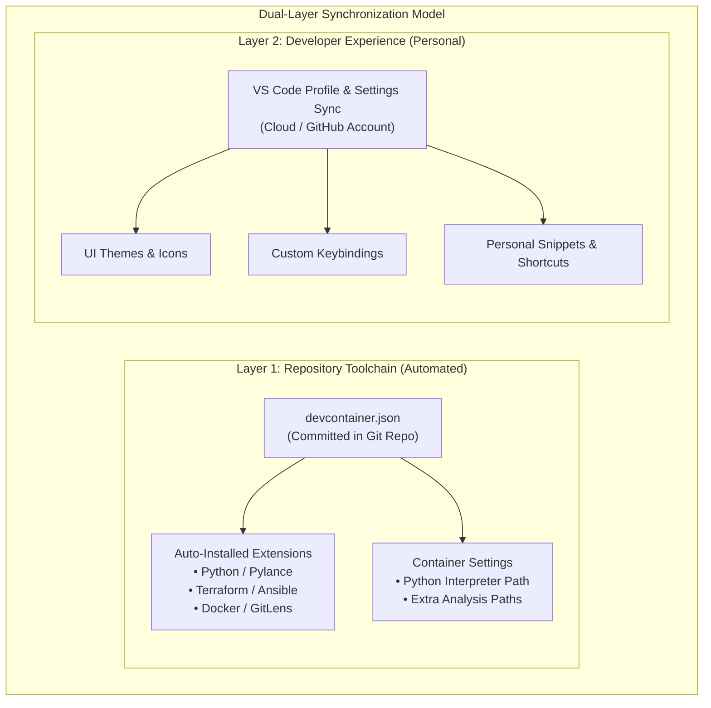

# Cross-Machine VS Code Profiles & DevContainer Extension Management

## 1. Overview & Strategy

When developing across multiple physical computers, laptops, cloud VMs, and AI agents, maintaining **consistent IDE configurations, extensions, and settings** is critical.

The industry-standard consensus is a **dual-layer strategy**:

1. **Repository-Level Parity (Automated via DevContainers)**: Hardcode required extensions, linters, formatters, and runtime paths directly in `.devcontainer/devcontainer.json`. Any developer or machine opening the repository inside a container gets the exact environment automatically—with zero manual setup.
2. **Personal / Workspace-Level Parity (VS Code Profiles & Settings Sync)**: Use VS Code Profiles and native Settings Sync for personal UI themes, custom keybindings, snippets, and cross-project favorite tools.



---

## 2. Layer 1: DevContainer Extension Customizations (`devcontainer.json`)

Embedding extensions inside `devcontainer.json` guarantees that *every* machine running the container has the identical toolchain.

### Configuration for `IsaacAutomator`
```json
{
  "name": "Isaac Automator DevContainer",
  "build": {
    "dockerfile": "Dockerfile"
  },
  "customizations": {
    "vscode": {
      "extensions": [
        "ms-python.python",
        "ms-python.vscode-pylance",
        "hashicorp.terraform",
        "redhat.ansible",
        "eamodio.gitlens",
        "tamasfe.even-better-toml",
        "redhat.vscode-yaml"
      ],
      "settings": {
        "python.defaultInterpreterPath": "/usr/bin/python3",
        "python.analysis.typeCheckingMode": "basic",
        "terraform.languageServer.enable": true
      }
    }
  },
  "remoteUser": "root"
}
```

---

## 3. Layer 2: VS Code Profiles & Settings Sync

### 3.1 Native Settings Sync (Automated Cloud Sync)
* **What it syncs**: Settings, Keybindings, Snippets, UI State, Profiles, and Installed Extensions.
* **How to enable**:
  1. Click the **Gear icon (⚙️)** in the bottom-left corner of VS Code.
  2. Click **"Turn on Settings Sync..."**.
  3. Select **Sign in with GitHub** (or Microsoft).
  4. On any new machine, log in with the same account to automatically restore your entire IDE setup.

---

### 3.2 Exporting & Sharing a Custom Profile (`.code-profile`)

If you want to package a dedicated "Isaac Automator DevOps" profile to share with team members or load without logging into GitHub:

#### Exporting a Profile:
1. Click **Gear (⚙️)** $\to$ **Profiles** $\to$ **Export Profile...**.
2. Select the extensions, settings, and UI configurations to include.
3. Click **Export** $\to$ Save as a file (`isaac-automator.code-profile`) or export to a GitHub Gist URL.

#### Importing a Profile:
1. Click **Gear (⚙️)** $\to$ **Profiles** $\to$ **Import Profile...**.
2. Select the `.code-profile` file or paste the Gist URL.
3. Click **Create Profile** $\to$ VS Code immediately configures the entire workspace environment.

---

## 4. Workspace Recommendations & `.vscode/` Directory Standards

For local and non-container workflows, committing standardized configuration files inside the [`.vscode/`](file:///workspaces/IsaacAutomator/.vscode/) directory ensures consistency across team members and personal machines.

---

### 4.1 Audit & Optimization Recommendations for `IsaacAutomator`

When evaluating the workspace configuration for Isaac Automator, the following key optimizations apply:

1. **Extension Conflicts (`extensions.json`)**:
   * *Avoid duplicate language servers*: Avoid having both `hashicorp.terraform` and legacy `4ops.terraform` active simultaneously.
   * *Include complete DevOps toolchain*: Include `redhat.ansible`, `ms-python.python`, `ms-python.vscode-pylance`, `ms-azuretools.vscode-docker`, and `tamasfe.even-better-toml`.
2. **Path & Linting Alignment (`settings.json`)**:
   * *Pylance Import Resolution*: Set `python.analysis.extraPaths` to `["${workspaceFolder}", "${workspaceFolder}/src"]` so Python modules in `src/python` resolve cleanly without false unresolved-import warnings.
   * *Visual Ruler*: Align `editor.rulers: [120]` with `flake8` 120-character line length limits.
   * *Language Servers*: Enable `terraform.languageServer.enable: true`.
3. **Execution & Debug Environments (`launch.json`)**:
   * *`PYTHONPATH` in Launch Configs*: Ensure Python debug configs pass `"PYTHONPATH": "${workspaceFolder}:${workspaceFolder}/src"` so launching standalone scripts or CLI commands does not encounter `ModuleNotFoundError`.
4. **Operational Task Automation (`tasks.json`)**:
   * Replace generic template Docker tasks with repository-native tasks (`./build`, running unit tests, and recursive Terraform formatting).

---

### 4.2 Production-Ready `.vscode/` File Specifications

#### `extensions.json`
```json
{
  "recommendations": [
    "hashicorp.terraform",
    "redhat.ansible",
    "redhat.vscode-yaml",
    "ms-python.python",
    "ms-python.vscode-pylance",
    "ms-python.black-formatter",
    "ms-python.flake8",
    "ms-python.mypy-type-checker",
    "ms-python.isort",
    "ms-azuretools.vscode-docker",
    "tamasfe.even-better-toml",
    "yzhang.markdown-all-in-one",
    "editorconfig.editorconfig"
  ]
}
```

#### `settings.json`
```json
{
  "files.exclude": {
    "**/.git": true,
    "**/.svn": true,
    "**/.hg": true,
    "**/CVS": true,
    "**/.DS_Store": true,
    "**/Thumbs.db": true,
    "**/.terraform": true,
    "*.swp": true,
    ".mypy_cache": true,
    "**/__pycache__": true,
    "**/.pytest_cache": true
  },
  "editor.rulers": [120],
  "editor.formatOnSave": true,
  "editor.formatOnSaveMode": "file",
  "python.defaultInterpreterPath": "/usr/bin/python3",
  "python.analysis.extraPaths": [
    "${workspaceFolder}",
    "${workspaceFolder}/src"
  ],
  "python.analysis.typeCheckingMode": "basic",
  "flake8.args": [
    "--max-line-length=120"
  ],
  "[python]": {
    "editor.defaultFormatter": "ms-python.black-formatter",
    "editor.formatOnSave": true,
    "editor.codeActionsOnSave": {
      "source.organizeImports": "explicit"
    }
  },
  "terraform.languageServer.enable": true,
  "markdown.extension.toc.levels": "2..4"
}
```

#### `tasks.json`
```json
{
  "version": "2.0.0",
  "tasks": [
    {
      "label": "Build Isaac Automator Container",
      "type": "shell",
      "command": "./build",
      "group": {
        "kind": "build",
        "isDefault": true
      },
      "problemMatcher": []
    },
    {
      "label": "Run All Tests",
      "type": "shell",
      "command": "bash src/tests/run_all.sh",
      "group": {
        "kind": "test",
        "isDefault": true
      },
      "problemMatcher": []
    },
    {
      "label": "Terraform: Format All",
      "type": "shell",
      "command": "terraform fmt -recursive src/terraform",
      "problemMatcher": []
    }
  ]
}
```

#### `launch.json`
```json
{
  "version": "0.2.0",
  "configurations": [
    {
      "name": "Python: Run Current File",
      "type": "python",
      "request": "launch",
      "program": "${file}",
      "console": "integratedTerminal",
      "justMyCode": true,
      "env": {
        "PYTHONPATH": "${workspaceFolder}:${workspaceFolder}/src"
      }
    },
    {
      "name": "Python: Remote Attach (Debugpy)",
      "type": "python",
      "request": "attach",
      "connect": {
        "host": "127.0.0.1",
        "port": 5678
      },
      "pathMappings": [
        {
          "localRoot": "${workspaceFolder}",
          "remoteRoot": "/app"
        }
      ],
      "justMyCode": true
    }
  ]
}
```

---

## 5. Summary & Best Practices

| Use Case | Best Method | Where It Lives |
| :--- | :--- | :--- |
| **Project-required tools & linters** | `devcontainer.json` `customizations.vscode.extensions` | Committed in Git repo (`.devcontainer/`) |
| **Project Python/Path settings** | `devcontainer.json` `customizations.vscode.settings` | Committed in Git repo (`.devcontainer/`) |
| **Personal UI theme & keybindings** | VS Code Settings Sync (GitHub Account) | Microsoft / GitHub Cloud Sync |
| **Sharable team profile template** | Profile Export (`.code-profile`) | Project docs / Gist URL |
| **Fallback for non-container devs** | `.vscode/extensions.json` & `.vscode/settings.json` | Committed in Git repo (`.vscode/`) |
| **Project Build/Test Shortcuts** | `.vscode/tasks.json` & `.vscode/launch.json` | Committed in Git repo (`.vscode/`) |

