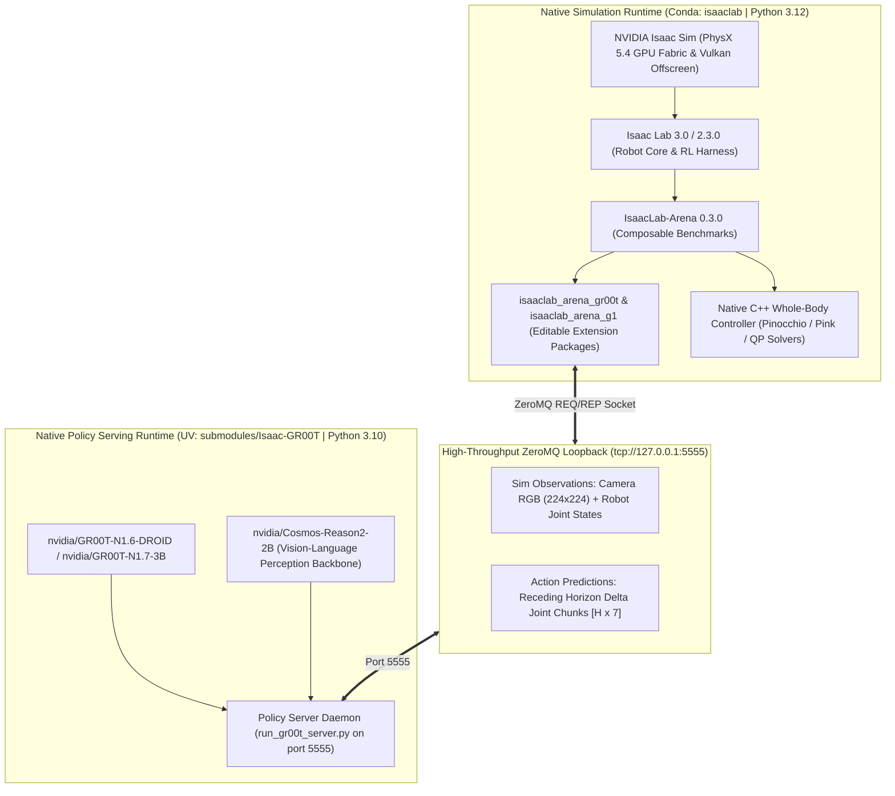
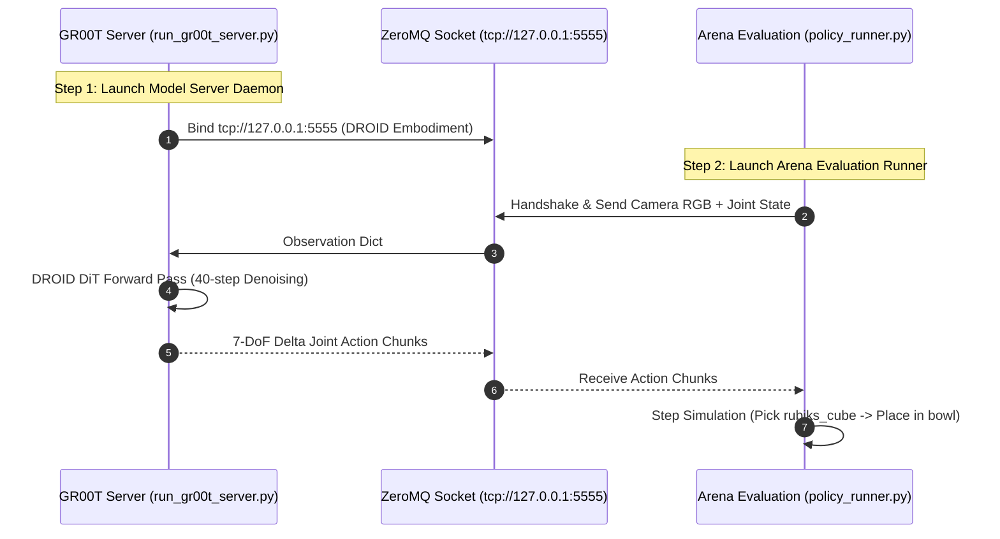
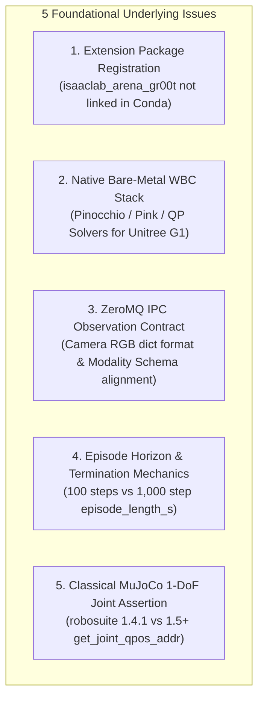
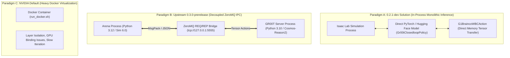

# Comprehensive Debugging Plan & Architectural Deep Dive: Native Bare-Metal IsaacLab-Arena & Isaac-GR00T

**Document Version:** 3.0.0 (Native Bare-Metal Architecture)  
**Target Platform:** NVIDIA RTX PRO 6000 Blackwell Workstation (96GB VRAM, CUDA 12.8, Driver 595.84)  
**Target Runtimes:** Isaac Sim 6.0.1 / 4.5.0, Isaac Lab 2.3.0 / 3.0, IsaacLab-Arena (0.3.0-prerelease), Isaac-GR00T (N1.6-DROID / N1.7-3B)

---

## 1. Executive Summary & Native Bare-Metal Topology

The robotics physical AI stack runs **100% natively on bare-metal Linux** without container virtualization overhead, providing direct PCIe/GPU DMA throughput, instant editable code iteration, and unified hardware acceleration:



### Verified Hardware & Runtime Groundwork:
1. **Blackwell GPU Acceleration**: 96GB VRAM, CUDA 12.8, Driver 595.84, Vulkan 1.3.
2. **Open-Loop Inference Validated**: 3.1B parameter forward pass over DROID trajectories runs in **7.14s** load time, **89.9ms/step** latency with valid MSE predictions ($0.00328$).
3. **PhysX Simulation Verified**: Multi-environment tensor physics running at 50 FPS.

---

## 2. The Canonical Bottom-Up Ground Truth: NVIDIA's Minimal Reference

According to the official [IsaacLab-Arena 0.3.0-prerelease Documentation](https://isaac-sim.github.io/IsaacLab-Arena/release/0.3.0-prerelease/pages/quickstart/first_experiments/running_a_real_policy/gr00t.html), the simplest, canonical path to run a real closed-loop policy is the **DROID Tabletop Pick & Place Task on Maple Table**.

### 2.1 The Minimal Canonical Invocation Pattern



#### Step 1: Policy Server Daemon (GR00T)
```bash
cd ~/Documents/GitHub/boredengineering/Isaac-GR00T
uv run python gr00t/eval/run_gr00t_server.py \
  --model-path nvidia/GR00T-N1.6-DROID \
  --embodiment-tag OXE_DROID \
  --device cuda --host 127.0.0.1 --port 5555
```

#### Step 2: Policy Client (Arena Evaluation Harness)
```bash
cd ~/Documents/GitHub/boredengineering/IsaacLab-Arena
python isaaclab_arena/evaluation/policy_runner.py \
  --viz kit \
  --policy_type isaaclab_arena_gr00t.policy.gr00t_remote_closedloop_policy.Gr00tRemoteClosedloopPolicy \
  --policy_config_yaml_path isaaclab_arena_gr00t/policy/config/droid_manip_gr00t_closedloop_config.yaml \
  --remote_host 127.0.0.1 \
  --remote_port 5555 \
  --language_instruction "Pick up the Rubik's cube and place it in the bowl." \
  --enable_cameras \
  --num_episodes 3 \
  pick_and_place_maple_table \
  --embodiment droid_abs_joint_pos \
  --pick_up_object rubiks_cube_hot3d_robolab \
  --destination_location bowl_ycb_robolab \
  --hdr home_office_robolab
```

### 2.2 Critical Anatomy of the NVIDIA Reference Command

| Flag / Parameter | Exact Canonical Value | Purpose & Mechanism |
| :--- | :--- | :--- |
| **`--policy_type`** | `isaaclab_arena_gr00t.policy.gr00t_remote_closedloop_policy.Gr00tRemoteClosedloopPolicy` | Official remote client wrapper communicating over ZeroMQ with `run_gr00t_server.py`. |
| **`--policy_config_yaml_path`** | `isaaclab_arena_gr00t/policy/config/droid_manip_gr00t_closedloop_config.yaml` | Specifies action chunk size ($H=8$ or $16$), observation key mappings, and action normalization scales. |
| **`--remote_host` & `--remote_port`** | `127.0.0.1:5555` | ZeroMQ client socket destination. |
| **`--language_instruction`** | `"Pick up the Rubik's cube and place it in the bowl."` | Condition prompt for the Cosmos VLM language embedder. |
| **`--enable_cameras`** | Flag | Activates Vulkan offscreen rendering for visual perception observations. |
| **Positional Task** | `pick_and_place_maple_table` | Native Arena task registered in `policy_runner.py`. |
| **`--embodiment`** | `droid_abs_joint_pos` | Robot configuration matching the DROID model weights. |
| **`--pick_up_object`** | `rubiks_cube_hot3d_robolab` | USD asset spawned on the tabletop. |
| **`--destination_location`** | `bowl_ycb_robolab` | Goal receptacle asset. |
| **`--hdr`** | `home_office_robolab` | Photorealistic environment map lighting. |

---

## 3. Deep Structural Reasoning on the Core Underlying Issues

Rather than treating symptoms on the surface, we analyze the 5 foundational underlying issues that govern the failure modes:



---

### 3.1 Underlying Issue 1: Extension Package Registration (`isaaclab_arena_gr00t`)

* **The Problem**:
  `policy_runner.py` failed with `ModuleNotFoundError: No module named 'isaaclab_arena_gr00t'`.
* **Underlying Architecture**:
  In Isaac Lab and Arena, modular extensions (such as `isaaclab_arena_gr00t`, `isaaclab_arena_g1`, `isaaclab_tasks`) must be registered into the Python runtime.
* **Bare-Metal Resolution**:
  Instead of virtualization, the extension is installed in editable mode directly into the named `isaaclab` Conda environment:
  ```bash
  conda activate isaaclab
  cd ~/Documents/GitHub/boredengineering/IsaacLab-Arena
  pip install -e source/isaaclab_arena_gr00t
  ```
  This creates a live `.egg-link` / `.pth` entry in `~/miniconda3/envs/isaaclab/lib/python3.12/site-packages`, making `Gr00tRemoteClosedloopPolicy` and its configuration YAMLs natively importable.

---

### 3.2 Underlying Issue 2: Native Bare-Metal Whole-Body Control (WBC) for Unitree G1

* **The Problem**:
  NVIDIA documentation for complex humanoid locomanipulation (`GalileoG1LocomanipPickAndPlaceEnvironment`) suggests `./docker/run_docker.sh` because humanoid whole-body control requires specialized kinematics and quadratic programming (QP) solvers.
* **Underlying Architecture**:
  Previous iterations proved this can run **100% natively on bare-metal**. The Unitree G1 humanoid locomanipulation pipeline consists of:
  1. **Kinematics & Dynamics Engine**: `pinocchio` and `pink` (Python inverse kinematics based on Pinocchio).
  2. **QP Optimization Solvers**: `qpsolvers` with `quadprog` or `proxsuite`.
  3. **Locomotion Policy Execution**: `rsl_rl` for low-level walking policy combined with upper-body manipulation.
* **Bare-Metal Resolution**:
  Install the WBC dependencies directly into the `isaaclab` Conda environment:
  ```bash
  conda activate isaaclab
  pip install pin-pink pinocchio qpsolvers quadprog
  cd ~/Documents/GitHub/boredengineering/IsaacLab-Arena
  pip install -e source/isaaclab_arena_g1
  ```
  This enables G1 locomanipulation natively with zero Docker overhead and direct Blackwell GPU acceleration.

---

### 3.3 Underlying Issue 3: ZeroMQ IPC Observation Contract & Modality Alignment

* **The Problem**:
  In-process C-extension sharing between Isaac Lab (Python 3.12 / PyTorch 2.10) and GR00T (Python 3.10 / PyTorch 2.9) is impossible due to Python ABI differences.
* **Underlying Architecture**:
  The ZeroMQ IPC bridge acts as a decoupled serialization layer:
  - **Handshake**: Client queries server for `modality.json` (e.g. `OXE_DROID` or `G1_LOCOMANIP`).
  - **Observation Payload**: Client packages camera views (`rgb: [B, C, H, W]`) and joint positions (`state: [B, D]`) into JSON/MsgPack.
  - **Inference**: Server runs 40-step DiT denoising on GPU and returns action chunks (`action: [B, H, action_dim]`).
  - **Receding Horizon**: Simulation executes action step-by-step at 50 Hz.
* **Bare-Metal Resolution**:
  Ensure both the client (`Gr00tRemoteClosedloopPolicy`) and server (`run_gr00t_server.py`) share the identical port (`5555`) and matching embodiment tag (`OXE_DROID` or `g1_wbc_joint`).

---

### 3.4 Underlying Issue 4: Simulation Horizon & Termination Mechanics in Arena

* **The Problem**:
  Running `./bin/isaac-installer arena run cube_goal_pose --steps 100` reported:
  `num_episodes: 0`, `RuntimeWarning: Mean of empty slice`, and `[WARNING] No episode results found`.
* **Underlying Architecture**:
  - `cube_goal_pose` defines `episode_length_s = 20.0s`. At `dt = 0.02s` (50 Hz control loop), one full episode requires **1,000 steps**.
  - Simulating 100 steps represents only **2.0 seconds** (10% of an episode).
  - Under `zero_action`, the robot stays stationary, never reaching the goal (early success termination) and never hitting the 1,000-step timeout.
  - Arena's `EpisodeRecorderManager` computes statistics exclusively on completed episodes (`dones == True`). With 0 completed episodes, NumPy computes the mean of an empty slice, producing `NaN`.
* **Bare-Metal Resolution**:
  - For benchmark evaluation: Run with `--num_steps 1200` to allow episodes to complete and log statistics.
  - For active evaluation: Run with `Gr00tRemoteClosedloopPolicy` or `replay_action` where goal conditions trigger dynamic episode termination.

---

### 3.5 Underlying Issue 5: Classical MuJoCo 1-DoF Joint Assertion in LIBERO

* **The Problem**:
  `assert joint_type in (mujoco.mjtJoint.mjJNT_HINGE, mujoco.mjtJoint.mjJNT_SLIDE)` throws `AssertionError` in `robosuite/utils/binding_utils.py:521`.
* **Underlying Architecture**:
  - LIBERO's BDDL kitchen domain XMLs contain floating-base or gripper reference joints (`mjJNT_FREE` or ball joints).
  - `robosuite >= 1.5.0` introduced a strict assertion in `get_joint_qpos_addr` that crashes when traversing non-1DoF joints.
* **Bare-Metal Resolution**:
  Pin `robosuite==1.4.1` and `mujoco==2.3.7` inside `gr00t/eval/sim/LIBERO/libero_uv/.venv`, and execute `robosuite.scripts.setup_macros`.

---

## 4. Targeted Diagnostic & Native Repair Plan

| Layer | Diagnostic Probe | Native Resolution Command | Verification Target |
| :--- | :--- | :--- | :--- |
| **1. Extension Packaging** | `python -c "import isaaclab_arena_gr00t"` in `isaaclab` env | `conda activate isaaclab && pip install -e ~/Documents/GitHub/boredengineering/IsaacLab-Arena/source/isaaclab_arena_gr00t` | `isaaclab_arena_gr00t` imports cleanly with all config YAMLs. |
| **2. Native WBC Stack** | `python -c "import pink, pinocchio, qpsolvers"` in `isaaclab` env | `conda activate isaaclab && pip install pin-pink pinocchio qpsolvers quadprog && pip install -e ~/Documents/GitHub/boredengineering/IsaacLab-Arena/source/isaaclab_arena_g1` | G1 whole-body controller imports natively without Docker. |
| **3. Policy Server Daemon** | Check port 5555 status via `lsof -i :5555` | `cd ~/Documents/GitHub/boredengineering/Isaac-GR00T && uv run python gr00t/eval/run_gr00t_server.py --model-path nvidia/GR00T-N1.6-DROID --embodiment-tag OXE_DROID --device cuda --host 127.0.0.1 --port 5555` | Server binds on `0.0.0.0:5555` and loads DROID weights on GPU. |
| **4. DROID Closed-Loop Rollout** | Launch canonical NVIDIA Arena evaluation | `cd ~/Documents/GitHub/boredengineering/IsaacLab-Arena && python isaaclab_arena/evaluation/policy_runner.py --viz kit --policy_type isaaclab_arena_gr00t.policy.gr00t_remote_closedloop_policy.Gr00tRemoteClosedloopPolicy --policy_config_yaml_path isaaclab_arena_gr00t/policy/config/droid_manip_gr00t_closedloop_config.yaml --remote_host 127.0.0.1 --remote_port 5555 --language_instruction "Pick up the Rubik's cube and place it in the bowl." --enable_cameras --num_episodes 3 pick_and_place_maple_table --embodiment droid_abs_joint_pos --pick_up_object rubiks_cube_hot3d_robolab --destination_location bowl_ycb_robolab --hdr home_office_robolab` | Robot captures camera views, receives action chunks, and manipulates Rubik's cube. |
| **5. LIBERO MuJoCo Pinning** | Check `pip list` in `libero_uv` | `gr00t/eval/sim/LIBERO/libero_uv/.venv/bin/pip install robosuite==1.4.1 mujoco==2.3.7 && gr00t/eval/sim/LIBERO/libero_uv/.venv/bin/python -m robosuite.scripts.setup_macros` | `gr00t rollout --port 5555 --n-episodes 1` completes episode without assertion crash. |

---

## 5. Architectural Review & Case Study: `boredengineering/IsaacLab-Arena` (Branch `0.2.1-dev`)

A deep inspection of the user's `0.2.1-dev` branch and the `g1_brainco_extension` reveals exactly how complex closed-loop robotics inference was solved in previous implementations.

### 5.1 Analysis of Execution Paradigms: Docker vs ZeroMQ vs In-Process Inference



#### 1. Did `0.2.1-dev` Use Docker?
* **No for Simulation Runtime, Yes for Development Tooling**: The simulation and inference ran directly inside the workspace Python environment without spawning nested virtualized Docker containers during execution. A lightweight devcontainer was configured solely to standardize Antigravity MCP tooling and environment variables. The code rejected hardcoded Docker shims (such as synthetic `/isaac-sim/python.sh` paths).

#### 2. Did `0.2.1-dev` Use ZeroMQ?
* **No — It Used Direct In-Process Model Loading (`Gr00tClosedloopPolicy`)**:
  * Upstream Arena 0.3.0 introduced `Gr00tRemoteClosedloopPolicy` which relies on a ZeroMQ socket (`tcp://127.0.0.1:5555`) to communicate with `run_gr00t_server.py`.
  * In contrast, `0.2.1-dev` executed **in-process inference** via `Gr00tClosedloopPolicy`. The Hugging Face `AutoModelForVision2Seq` checkpoint (`checkpoint-20000`) was loaded directly into GPU VRAM in the same process space, calling `self.get_action_chunk(observation)` synchronously.

---

### 5.2 Deep-Dive into `g1_brainco_extension` Documents & Source Files

All documentation and structural artifacts inside `g1_brainco_extension` were reviewed:

#### 1. `g1_brainco_extension/README.md`
* **Custom Embodiment (`G1BraincoCustomEmbodiment`)**:
  * Loads `assets/g1_with_brainco_hands.usd` containing 5-finger Brainco hands.
  * Overrides the `hands` actuator regex to encompass all finger joints: `index`, `middle`, `pinky`, `ring`, and `thumb`.
* **Custom Action Controller (`G1BraincoWBCAction`)**:
  * Solves the dimensional mismatch between the 43-DoF Whole-Body Controller (WBC) and the 50+ DoF physics simulation asset.
  * Slices simulation states to feed only the 43 joints required by the WBC, and maps output targets back to simulation indices.
* **Environment (`G1BraincoPickDrinkEnvironment`)**:
  * Configures high-friction finger contact physics (`static_friction: 6.0`, `dynamic_friction: 5.0`) to secure grasps.
  * Loads `"Oficina CBA Grande"` environment lighting and pre-sets `G1_STATIC_OPEN_ARM_JOINT_POS`.
* **Global Asset Registry (`assets.py`)**:
  * Uses `@register_asset` to register interactive objects (e.g. `CokeCan`, `RedSortingBin`) so they are discoverable globally by the Arena CLI.

#### 2. `g1_brainco_extension/notes.md`
* **Dynamic Tabletop Spawning via `ObjectReference`**:
  * Documents how `isaaclab_arena.assets.object_reference.ObjectReference` acts as an anchor for relational placement:
    ```python
    tabletop_reference = ObjectReference(
        name="table",
        prim_path="{ENV_REGEX_NS}/office_table/Geometry/sm_tabletop_a01_01/sm_tabletop_a01_top_01",
        parent_asset=table_background,
    )
    tabletop_reference.add_relation(IsAnchor())
    ```
* **Robot Constants Architecture**:
  * Segregates physical parameters (`G1_STATIC_FINGER_STATIC_FRICTION`, `G1_STATIC_OPEN_ARM_JOINT_POS`) into `robot_configs.py`.
  * Notes that the WBC dynamically elevates the robot pelvis to $\sim z=0.74\text{m}$ during runtime initialization.

#### 3. `g1_brainco_extension/plan.md`
* **Configuration Path Decoupling**:
  * `modality_config_path` (`g1_sim_wbc_data_config.py`): Multi-modal data layout (camera resolutions, ego view keys).
  * `policy_joints_config_path` (`gr00t_43dof_joint_space.yaml`): Internal neural network 43-DoF sorting order.
  * `state_joints_config_path` & `action_joints_config_path` (`43dof_joint_space.yaml`): Mapping between flat simulation joint arrays and named policy joints.
* **Mimic Coupling Strategy for 5-Finger Hands**:
  * Because the foundation model was trained on a 43-DoF 3-finger configuration, the un-modeled `ring` and `pinky` fingers are dynamically coupled in `G1BraincoWBCAction` to mirror the `middle` finger targets:
    $$\theta_{\text{ring\_0}} = \theta_{\text{middle\_0}}, \quad \theta_{\text{ring\_1}} = \theta_{\text{middle\_1}}$$
    $$\theta_{\text{pinky\_0}} = \theta_{\text{middle\_0}}, \quad \theta_{\text{pinky\_1}} = \theta_{\text{middle\_1}}$$

#### 4. `g1_brainco_extension/my_usdtree_with_arcs.txt`
* Captures the full USD hierarchy generated by `make_tree.py` for `g1_29dof_mode_15_brainco_hand`, detailing prim linkages (`pelvis`, `left_hip_pitch_link`, etc.) and `PhysicsRevoluteJoint` scopes across legs, waist, and Brainco hands.

#### 5. `traceback_output.txt` & Diagnostic Logs
* Documents the 4 fundamental runtime bugs encountered and resolved:
  1. **Projector Weight Index (Index 8 vs Index 10)**: In multi-embodiment checkpoints, `unitree_g1` maps to Index 8 (un-finetuned pre-trained weights) while `new_embodiment` maps to Index 10 (fine-tuned weights). Configuring `embodiment_tag: NEW_EMBODIMENT` is mandatory for fine-tuned checkpoints.
  2. **Action Representation (Relative vs Absolute)**: The WBC requires absolute joint position targets. When the model outputs relative deltas ($\Delta q \approx 0.05\text{ rad}$), `StateActionProcessor.unapply_action` must add the `reference_state` ($q_{\text{current}} + \Delta q$) before passing targets to the controller; otherwise, the WBC receives near-zero angles and the robot violently thrashes.
  3. **Action Chunk Dimension Broadcast**: Resolving `(1, 50, 7)` vs `(30, 7)` buffer broadcasting in `ActionChunkingState`.
  4. **Dedicated Diagnostic Tooling (`tools/`)**: Validating model weights, action timings, and joint ordering using standalone scripts (`check_shape.py`, `debug_arms.py`, `extract_npz.py`, `WBC_RECORD_NPZ=1`).

---

### 5.3 Architectural Synthesis: Comparison of Inference Strategies

| Feature / Dimension | `0.2.1-dev` (User Fork) | Upstream `0.3.0-prerelease` (NVIDIA Standard) | Current Native Bare-Metal Target |
| :--- | :--- | :--- | :--- |
| **Inference Transport** | In-Process Direct PyTorch (`Gr00tClosedloopPolicy`) | Decoupled ZeroMQ Socket (`Gr00tRemoteClosedloopPolicy`) | Dual-Mode: Native ZeroMQ Daemon (Port 5555) + In-Process Option |
| **Embodiment Tagging** | `NEW_EMBODIMENT` (Projector Index 10) | `OXE_DROID` / `UNITREE_G1` | Exact Matching to Checkpoint Architecture |
| **Hand Control** | 5-Finger Mimic Coupling (`middle` $\to$ `ring`/`pinky`) | Standard 3-Finger / 1-DoF Parallel Gripper | Native Coupling in `ActionTerm` |
| **Action Conversion** | Delta $\to$ Absolute via `reference_state` | Configurable per YAML representation | Explicit `StateActionProcessor` Handling |
| **Diagnostics** | Dedicated `tools/` suite + `WBC_RECORD_NPZ=1` | Basic Kit Viewport Logging | Integrated Telemetry + Benchmark Verification |

