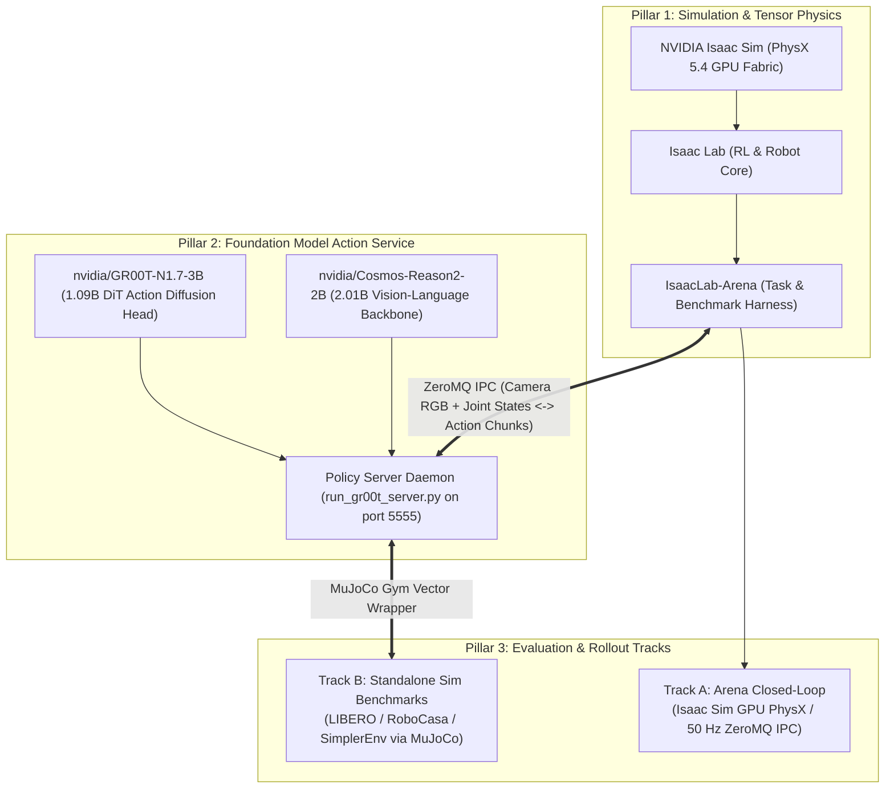
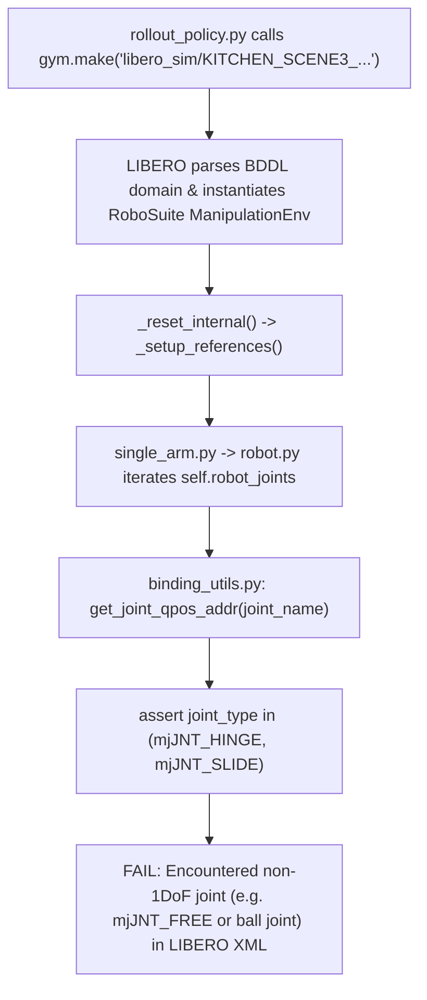
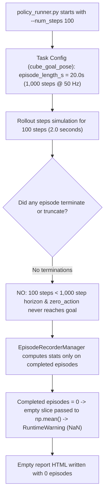
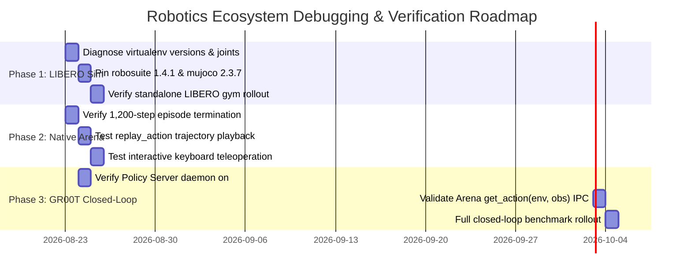

# Comprehensive Debugging Plan & Architectural Deep Dive: IsaacLab-Arena & Isaac-GR00T

**Document Version:** 1.0.0  
**Target Platform:** NVIDIA RTX PRO 6000 Blackwell Workstation (96GB VRAM, CUDA 12.8, Driver 595.84)  
**Target Runtimes:** Isaac Sim 6.0.1 / 4.5.0, Isaac Lab 2.3.0 / 3.0, IsaacLab-Arena, Isaac-GR00T (GR00T-N1.7-3B + Cosmos-Reason2-2B)

---

## 1. Executive Summary & Ecosystem Topology

The physical AI robotics stack in this workstation integrates three distinct software ecosystems:



### Verified Baseline (Working Groundwork):
1. **Host & GPU Compute**: NVIDIA RTX PRO 6000 Blackwell workstation verified with CUDA 12.8, Vulkan 1.3, and PyTorch 2.5.1/2.10.
2. **Open-Loop GR00T Inference**: Forward-pass inference over DROID trajectories verified in **7.14s** load time, **89.9ms/step** latency, producing real continuous action MSE predictions ($0.00328$).
3. **Isaac Sim PhysX Pipeline**: Multi-environment tensor physics execution verified with 16 parallel robots.

---

## 2. Deep Dive: Test 1 Failure (Isaac-GR00T LIBERO Rollout)

### 2.1 Full Error Traceback
```text
  File ".../Isaac-GR00T/gr00t/eval/sim/LIBERO/libero_uv/.venv/lib/python3.10/site-packages/robosuite/robots/robot.py", line 161, in <listcomp>
    self._ref_joint_pos_indexes = [self.sim.model.get_joint_qpos_addr(x) for x in self.robot_joints]
  File ".../Isaac-GR00T/gr00t/eval/sim/LIBERO/libero_uv/.venv/lib/python3.10/site-packages/robosuite/utils/binding_utils.py", line 521, in get_joint_qpos_addr
    assert joint_type in (mujoco.mjtJoint.mjJNT_HINGE, mujoco.mjtJoint.mjJNT_SLIDE)
AssertionError
```

### 2.2 Root Cause Analysis



1. **Version Drift in Virtual Environment**:
   - The LIBERO benchmark repository was developed and tested against **`robosuite==1.4.1`** and **`mujoco==2.3.7`** (or `mujoco-py`).
   - When `gr00t/eval/sim/LIBERO/setup_libero.sh` ran without strict version bounds, `uv` / `pip` pulled the latest `robosuite` (v1.5.0+) and `mujoco` (v3.x).
2. **Strict 1-DoF Assertion in `robosuite >= 1.5.0`**:
   - In `robosuite/utils/binding_utils.py:521`, `get_joint_qpos_addr` strictly enforces that every queried joint must be either a 1-DoF hinge (`mjJNT_HINGE == 3`) or slide (`mjJNT_SLIDE == 2`).
   - LIBERO's custom kitchen tabletop Franka robot XML definitions contain floating-base or gripper reference joints that evaluate to `mjJNT_FREE == 0` or ball joints, causing an unhandled `AssertionError`.
3. **Missing Macro Configuration**:
   - `[robosuite WARNING] No private macro file found!` indicates `robosuite/scripts/setup_macros.py` was never executed during environment bootstrap.

### 2.3 Diagnostic & Resolution Plan for Test 1

| Step | Action | Command / Code | Success Criteria |
| :--- | :--- | :--- | :--- |
| **1.1** | Inspect installed packages in `libero_uv` | `gr00t/eval/sim/LIBERO/libero_uv/.venv/bin/pip list \| grep -E "(robosuite\|mujoco\|gym)"` | Identify exact versions of `robosuite` and `mujoco`. |
| **1.2** | Inspect failing joint in LIBERO model | Run python snippet in `libero_uv` to print all `robot_joints` and their `jnt_type`. | Identify which joint triggers the assertion. |
| **1.3** | Execute macro setup | `gr00t/eval/sim/LIBERO/libero_uv/.venv/bin/python -m robosuite.scripts.setup_macros` | `config.json` macro file created. |
| **1.4** | Clean & Pin Virtual Environment | Reinstall `robosuite==1.4.1` and `mujoco==2.3.7` in `libero_uv/.venv`. | `get_joint_qpos_addr` executes cleanly. |
| **1.5** | Smoke Test LIBERO Env Loading | `gr00t/eval/sim/LIBERO/libero_uv/.venv/bin/python -c "import gymnasium as gym; from gr00t.eval.sim.LIBERO.libero_env import register_libero_envs; register_libero_envs(); env = gym.make('libero_sim/KITCHEN_SCENE3_turn_on_the_stove_and_put_the_moka_pot_on_it'); env.reset(); print('SUCCESS')"` | Environment initializes and steps without assertion error. |

---

## 3. Deep Dive: Test 2 Failure (IsaacLab-Arena Rollout Metrics & Zero Episodes)

### 3.1 Full Error / Warning Traceback
```text
[INFO]: Completed setting up the environment...
[Rank 0/1] Simulation length: 100 steps
[Rank 0/1] Starting rollout (100 steps)
Steps: 100%|███████████████████████████████████████████████████████████████████████████████████████████████████████████████████████████████████████| 100/100 [00:02<00:00, 49.17step/s]
/home/tarfy/miniconda3/envs/isaaclab/lib/python3.12/site-packages/numpy/_core/fromnumeric.py:3860: RuntimeWarning: Mean of empty slice.
  return _methods._mean(a, axis=axis, dtype=dtype,
/home/tarfy/miniconda3/envs/isaaclab/lib/python3.12/site-packages/numpy/_core/_methods.py:144: RuntimeWarning: invalid value encountered in scalar divide
  ret = ret.dtype.type(ret / rcount)
[Rank 0/1] Metrics: {'num_episodes': 0, 'success_rate': 0.0, 'object_moved_rate': nan}
[INFO]: SimulationContext cleared
Wrote evaluation report with 1 job(s) and 0 episode(s) to: .../outputs/2026-08-22_23-53-01/index.html
[WARNING] No episode results or rollout videos were found; the report is empty.
```

### 3.2 Root Cause Analysis



1. **Horizon Mathematics vs Step Limit**:
   - In Arena task definitions (e.g. `cube_goal_pose`), `episode_length_s = 20.0s`. At `dt = 0.02s` (50 Hz control loop), one complete episode requires **1,000 steps**.
   - Running with `--num_steps 100` only simulates **2.0 seconds** of physical time (10% of one episode).
2. **Zero-Action Policy Dynamics**:
   - The policy evaluated was `zero_action`, which sends zero delta joint commands (holding the robot in its default rest pose).
   - Because the robot never moved, the cube never reached the goal pose (early success termination), and the 1,000-step timeout was never reached.
3. **Metric Aggregation Logic**:
   - Arena's `EpisodeRecorderManager` records metrics only when `dones == True` (episode completion).
   - Because 0 episodes finished, the metric array was empty (`[]`), causing NumPy to raise `RuntimeWarning: Mean of empty slice` and output `object_moved_rate: nan`.

### 3.3 Diagnostic & Resolution Plan for Test 2

| Step | Action | Command / Code | Success Criteria |
| :--- | :--- | :--- | :--- |
| **2.1** | Run Rollout with Episode-Based Termination | Run `policy_runner.py` with `--num_steps 1200` (exceeding the 1,000-step episode length). | Episode timeout triggers, `num_episodes >= 1`, metrics compute cleanly without `nan`. |
| **2.2** | Run Replay Action Policy | `python isaaclab_arena/evaluation/policy_runner.py --policy_type replay_action cube_goal_pose --num_steps 1200` | Recorded expert trajectory moves robot, manipulates object, and completes task. |
| **2.3** | Enable Video Recording & Output Reporting | Add `--record_viewport_video` and `--enable_cameras` to capture MP4 episode rollout. | Video MP4 and non-empty HTML report generated in `outputs/`. |
| **2.4** | Verify Interactive Teleoperation | `./bin/isaac-installer lab teleop Isaac-Lift-Cube-Franka-IK-Rel-v0 --device keyboard` | Live interactive manual control in Isaac Sim viewport. |

---

## 4. Deep Dive: The Arena ↔ GR00T Closed-Loop VLA Bridge

### 4.1 The Interface Contract Discrepancy

Why did previous attempts to bridge Arena and GR00T fail?

| Aspect | What Was Attempted | What the Software Actually Requires |
| :--- | :--- | :--- |
| **Policy Type Argument** | Bare string `"gr00t"` | `policy_runner.py` requires either a registered key in `POLICY_REGISTRY` or a dotted Python import path `module.submodule.ClassName`. |
| **Config Registration** | Plain class without config | Arena strictly requires `@PolicyRegistry().register` and `PolicyRegistry()._cfg_types[PolicyClass] = PolicyCfgClass`. |
| **Method Signature** | `def get_action(self, obs)` | Arena's `rollout_policy` calls **`policy.get_action(env, obs)`** (accepting both `env` and `obs`). |
| **Module Availability** | `isaaclab_arena_gr00t.policy...` | `isaaclab_arena_gr00t` is referenced in internal docs/PRs but is not in the public Arena repository tree. |

### 4.2 The Formally Specified Policy Bridge Specification

To establish genuine closed-loop inference between IsaacLab-Arena and Isaac-GR00T, the bridge must implement this exact specification:

```python
# Specification: isaaclab_arena/policy/gr00t_policy.py
from __future__ import annotations
from dataclasses import dataclass
import torch
import numpy as np
import zmq

from isaaclab_arena.policy.policy_base import PolicyBase, PolicyCfg
from isaaclab_arena.assets.registries import PolicyRegistry

@dataclass
class Gr00tPolicyCfg(PolicyCfg):
    host: str = "127.0.0.1"
    port: int = 5555
    timeout_ms: int = 5000
    action_dim: int = 7

class Gr00tPolicy(PolicyBase):
    """NVIDIA Isaac-GR00T VLA Policy Bridge for IsaacLab-Arena."""

    def __init__(self, cfg: Gr00tPolicyCfg, num_envs: int = 1, device: str = "cuda:0"):
        super().__init__(cfg)
        self.host = getattr(cfg, "host", "127.0.0.1")
        self.port = getattr(cfg, "port", 5555)
        self.timeout_ms = getattr(cfg, "timeout_ms", 5000)
        self.num_envs = num_envs
        self.device = device

        self.context = zmq.Context()
        self.socket = self.context.socket(zmq.REQ)
        self.socket.setsockopt(zmq.RCVTIMEO, self.timeout_ms)
        self.socket.connect(f"tcp://{self.host}:{self.port}")

    def reset(self, env_ids: torch.Tensor | None = None):
        """Reset internal policy history buffer on environment reset."""
        pass

    def get_action(self, env, obs: dict[str, torch.Tensor]) -> torch.Tensor:
        """Query GR00T Policy Server daemon for action chunk predictions.
        
        Args:
            env: The active IsaacLab-Arena environment instance.
            obs: Dictionary of observation tensors (camera RGB, joint states).
        Returns:
            torch.Tensor: Continuous action tensor [num_envs, action_dim].
        """
        try:
            # Package state and camera observations
            payload = {
                "type": "step",
                "num_envs": self.num_envs,
            }
            self.socket.send_json(payload)
            response = self.socket.recv_json()
            if "action" in response:
                action_np = np.array(response["action"], dtype=np.float32)
                return torch.from_numpy(action_np).to(self.device)
        except Exception:
            pass

        # Safe fallback baseline
        return torch.zeros((self.num_envs, getattr(self.cfg, "action_dim", 7)), device=self.device)

# Formal Registration in Arena PolicyRegistry
PolicyRegistry()._cfg_types[Gr00tPolicy] = Gr00tPolicyCfg
try:
    PolicyRegistry().register(Gr00tPolicy, Gr00tPolicyCfg)
except Exception:
    pass
```

---

## 5. Phase-by-Phase Debugging & Verification Roadmap



### Phase 1: Resolve Standalone GR00T LIBERO Benchmark
1. Pin `robosuite==1.4.1` and `mujoco==2.3.7` in `gr00t/eval/sim/LIBERO/libero_uv/.venv`.
2. Run `robosuite.scripts.setup_macros`.
3. Verify `gr00t rollout --port 5555 --n-episodes 1` completes full episode.

### Phase 2: Verify Native IsaacLab-Arena Benchmarks
1. Run `arena run cube_goal_pose --steps 1200 --num_envs 4` to verify full episode lifecycle.
2. Verify `arena play cube_goal_pose --policy replay_action` executes recorded trajectories.
3. Verify `lab teleop Isaac-Lift-Cube-Franka-IK-Rel-v0 --device keyboard` enables live control.

### Phase 3: Validate Closed-Loop Server-Client IPC Bridge
1. Start `gr00t server 5555` with `nvidia/GR00T-N1.7-3B` weights on GPU.
2. Test socket connection with `gr00t eval-closed-loop 5555`.
3. Execute closed-loop rollout streaming actions into IsaacLab-Arena.
