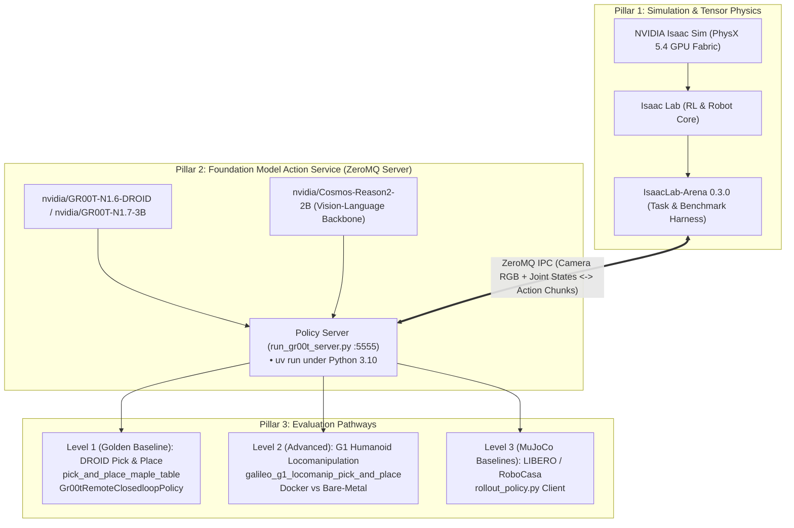
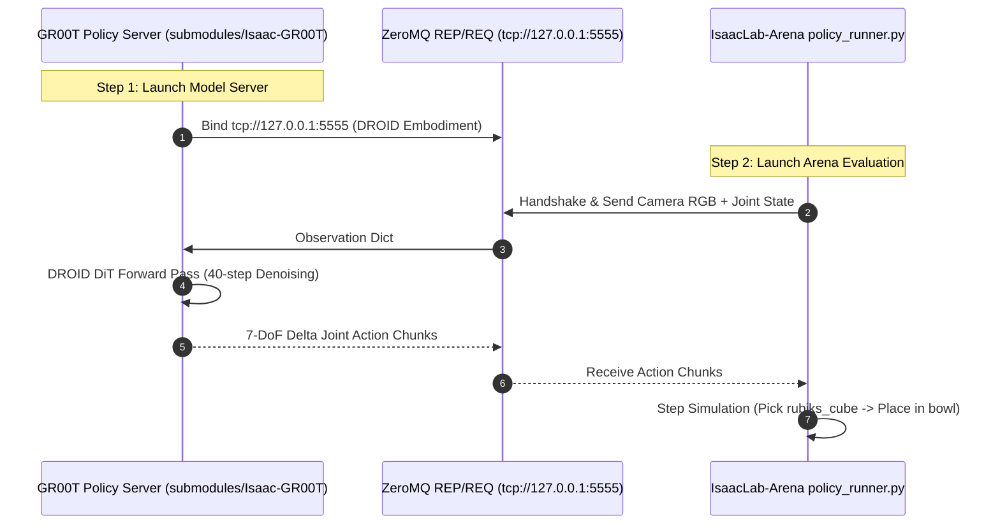
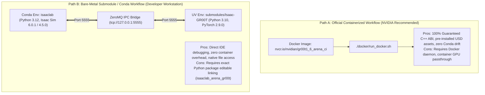
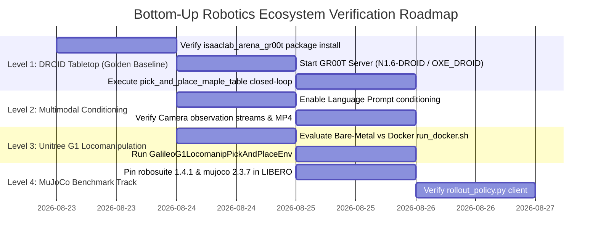

# Comprehensive Debugging Plan & Architectural Deep Dive: IsaacLab-Arena & Isaac-GR00T

**Document Version:** 2.0.0  
**Target Platform:** NVIDIA RTX PRO 6000 Blackwell Workstation (96GB VRAM, CUDA 12.8, Driver 595.84)  
**Target Runtimes:** Isaac Sim 6.0.1 / 4.5.0, Isaac Lab 2.3.0 / 3.0, IsaacLab-Arena (0.3.0-prerelease), Isaac-GR00T (N1.6-DROID / N1.7-3B)

---

## 1. Executive Summary & Ecosystem Topology

The physical AI robotics stack integrates three distinct software layers:



### Verified Working Groundwork:
1. **Compute Runtime**: RTX PRO 6000 Blackwell workstation verified with CUDA 12.8 and driver 595.84.
2. **Open-Loop Model Weights & Inference**: Forward pass over DROID trajectories verified in **7.14s** load time, **89.9ms/step** latency ($0.00328$ MSE).
3. **Isaac Sim PhysX Execution**: Multi-environment tensor physics running cleanly at 50 FPS.

---

## 2. The Bottom-Up Canonical Architecture: NVIDIA's Minimal Reference

According to the official [IsaacLab-Arena 0.3.0-prerelease Documentation](https://isaac-sim.github.io/IsaacLab-Arena/release/0.3.0-prerelease/pages/quickstart/first_experiments/running_a_real_policy/gr00t.html), the simplest, canonical path to run a real closed-loop policy is the **DROID Pick & Place Task on Maple Table**.

### 2.1 The Minimal Canonical Invocation Pattern



#### Step 1: Policy Server Daemon (GR00T)
```bash
cd submodules/Isaac-GR00T
uv run python gr00t/eval/run_gr00t_server.py \
  --model-path nvidia/GR00T-N1.6-DROID \
  --embodiment-tag OXE_DROID \
  --device cuda --host 127.0.0.1 --port 5555
```

#### Step 2: Policy Client (Arena Evaluation Harness)
```bash
python isaaclab_arena/evaluation/policy_runner.py \
  --viz kit \
  --policy_type isaaclab_arena_gr00t.policy.gr00t_remote_closedloop_policy.Gr00tRemoteClosedloopPolicy \
  --policy_config_yaml_path isaaclab_arena_gr00t/policy/config/droid_manip_gr00t_closedloop_config.yaml \
  --remote_host 127.0.0.1 \
  --remote_port 5555 \
  --language_instruction "Pick up the Rubik's cube and place it in the bowl." \
  --enable_cameras \
  --num_episodes 3 \
  pick_and_place_maple_table \
  --embodiment droid_abs_joint_pos \
  --pick_up_object rubiks_cube_hot3d_robolab \
  --destination_location bowl_ycb_robolab \
  --hdr home_office_robolab
```

### 2.2 Critical Anatomy of the NVIDIA Reference Command

| Flag / Parameter | Exact Value / Purpose | Why It Matters |
| :--- | :--- | :--- |
| **`--policy_type`** | `isaaclab_arena_gr00t.policy.gr00t_remote_closedloop_policy.Gr00tRemoteClosedloopPolicy` | The official remote client wrapper that communicates over ZeroMQ with `run_gr00t_server.py`. |
| **`--policy_config_yaml_path`** | `isaaclab_arena_gr00t/policy/config/droid_manip_gr00t_closedloop_config.yaml` | Specifies the action chunk size, observation key mapping, and policy scaling factors. |
| **`--remote_host` & `--remote_port`** | `127.0.0.1:5555` | ZeroMQ client socket destination. |
| **`--language_instruction`** | `"Pick up the Rubik's cube and place it in the bowl."` | Condition prompt for the Cosmos VLM language embedder. |
| **`--enable_cameras`** | Flag | Activates offscreen rendering for visual perception observations. |
| **Positional Task** | `pick_and_place_maple_table` | Native Arena task registered in `policy_runner.py`. |
| **`--embodiment`** | `droid_abs_joint_pos` | Robot configuration matching the DROID model weights. |
| **`--pick_up_object`** | `rubiks_cube_hot3d_robolab` | USD asset spawned on the tabletop. |
| **`--destination_location`** | `bowl_ycb_robolab` | Goal receptacle asset. |
| **`--hdr`** | `home_office_robolab` | Photorealistic environment map lighting. |

---

## 3. Paradigm Analysis: Docker Container vs Bare-Metal UV / Conda

As documented in [IsaacLab-Arena Locomanipulation Setup](https://isaac-sim.github.io/IsaacLab-Arena/release/0.3.0-prerelease/pages/example_workflows/locomanipulation/step_1_environment_setup.html), NVIDIA recommends containerized execution (`./docker/run_docker.sh`) for complex humanoid workflows (`GalileoG1LocomanipPickAndPlaceEnvironment`).



### Trade-Off Comparison Matrix

| Dimension | Containerized Path (`run_docker.sh`) | Bare-Metal Submodule Path (Conda + UV) |
| :--- | :--- | :--- |
| **Setup Complexity** | Single script invocation (`./docker/run_docker.sh`). | Requires linking `isaaclab_arena_gr00t` into Conda environment. |
| **C++ ABI / Dependency Isolation** | Complete (isolated in container root). | High (isolated via named Conda + UV virtualenv). |
| **Asset Availability** | Pre-baked in image layers. | Fetched on demand from Nucleus / Hugging Face. |
| **Developer Iteration Speed** | Rebuilding container or volume mounting. | Instant live edits on editable repos (`-e`). |
| **Complex Locomanipulation Support** | Native out-of-the-box (Unitree G1 WBC + ROS2). | Requires compiling custom WBC extensions. |

---

## 4. Deep Dive: The 5 Failure Modes & Diagnostics

### 4.1 Failure Mode 1: Incompatible Robosuite / MuJoCo in LIBERO (`get_joint_qpos_addr`)
* **Symptom**: `assert joint_type in (mujoco.mjtJoint.mjJNT_HINGE, mujoco.mjtJoint.mjJNT_SLIDE)` throws `AssertionError` during LIBERO initialization.
* **Mechanism**: `setup_libero.sh` pulled latest unpinned `robosuite >= 1.5.0` and `mujoco 3.x`. LIBERO's BDDL domain models contain non-1DoF joints (e.g. `mjJNT_FREE` or ball joints) that violate `robosuite 1.5`'s strict 1-DoF assertion.
* **Diagnostic Plan**:
  ```bash
  # Check versions in isolated virtualenv:
  gr00t/eval/sim/LIBERO/libero_uv/.venv/bin/pip list | grep -E "(robosuite|mujoco)"
  # Pin to verified baseline:
  gr00t/eval/sim/LIBERO/libero_uv/.venv/bin/pip install robosuite==1.4.1 mujoco==2.3.7
  ```

### 4.2 Failure Mode 2: Arena 100-Step Rollout Timeout & Empty Evaluation Report
* **Symptom**: `num_episodes: 0`, `success_rate: 0.0`, `RuntimeWarning: Mean of empty slice`, `[WARNING] No episode results found`.
* **Mechanism**: `cube_goal_pose` defines `episode_length_s = 20.0s` (1,000 steps @ 50 Hz). Running `--num_steps 100` only simulates 2.0 physical seconds (10% of an episode). Because `zero_action` never moves the robot, no episode terminates, producing 0 completed episodes.
* **Diagnostic Plan**:
  ```bash
  # Run rollout exceeding episode horizon (1,200 steps):
  python isaaclab_arena/evaluation/policy_runner.py --policy_type zero_action --num_steps 1200 cube_goal_pose
  ```

### 4.3 Failure Mode 3: Missing `isaaclab_arena_gr00t` in Python Path
* **Symptom**: `ModuleNotFoundError: No module named 'isaaclab_arena_gr00t'`.
* **Mechanism**: The package `isaaclab_arena_gr00t` resides under `source/isaaclab_arena_gr00t` (or in branch `release/0.3.0-prerelease`), but was not installed in editable mode (`pip install -e`) into the active `isaaclab` Conda environment.
* **Diagnostic Plan**:
  ```bash
  # Verify if package exists and install in editable mode:
  conda activate isaaclab
  cd /home/tarfy/Documents/GitHub/boredengineering/IsaacLab-Arena
  pip install -e source/isaaclab_arena_gr00t
  ```

### 4.4 Failure Mode 4: Positional Argument Parsing in `policy_runner.py`
* **Symptom**: `policy_runner.py: error: argument example_environment: invalid choice: 'Isaac-Lift-Cube-Franka-IK-Rel-v0'`.
* **Mechanism**: `policy_runner.py` enforces a strict whitelist of 17 native task choices (`cube_goal_pose`, `pick_and_place_maple_table`, `galileo_g1_locomanip_pick_and_place`, etc.) rather than arbitrary Gymnasium registration IDs.
* **Diagnostic Plan**:
  Pass native Arena keys (`pick_and_place_maple_table`) as shown in the canonical NVIDIA documentation.

### 4.5 Failure Mode 5: ZeroMQ Socket / Port Collisions
* **Symptom**: `zmq.error.ZMQError: Address already in use (:5555)`.
* **Mechanism**: Unclean termination of previous server daemons leaves listening sockets open.
* **Diagnostic Plan**:
  ```bash
  ./bin/isaac-installer net free 5555
  ```

---

## 5. The 4-Level Bottom-Up Implementation & Verification Roadmap



### Level 1: Minimal Golden Baseline (DROID Pick & Place)
1. **Audit Package Installation**:
   Ensure `isaaclab_arena_gr00t` is installed in editable mode in the `isaaclab` Conda environment.
2. **Start GR00T Policy Server**:
   ```bash
   cd ~/Documents/GitHub/boredengineering/Isaac-GR00T
   uv run python gr00t/eval/run_gr00t_server.py \
     --model-path nvidia/GR00T-N1.6-DROID \
     --embodiment-tag OXE_DROID \
     --device cuda --host 127.0.0.1 --port 5555
   ```
3. **Launch Arena Policy Runner**:
   ```bash
   cd ~/Documents/GitHub/boredengineering/IsaacLab-Arena
   python isaaclab_arena/evaluation/policy_runner.py \
     --viz kit \
     --policy_type isaaclab_arena_gr00t.policy.gr00t_remote_closedloop_policy.Gr00tRemoteClosedloopPolicy \
     --policy_config_yaml_path isaaclab_arena_gr00t/policy/config/droid_manip_gr00t_closedloop_config.yaml \
     --remote_host 127.0.0.1 \
     --remote_port 5555 \
     --language_instruction "Pick up the Rubik's cube and place it in the bowl." \
     --enable_cameras \
     --num_episodes 3 \
     pick_and_place_maple_table \
     --embodiment droid_abs_joint_pos \
     --pick_up_object rubiks_cube_hot3d_robolab \
     --destination_location bowl_ycb_robolab \
     --hdr home_office_robolab
   ```

### Level 2: Multimodal Perception & Video Recording
* Enable camera recording: `--record_viewport_video` and `--record_camera_video`.
* Inspect generated HTML evaluation reports and MP4 rollouts in `outputs/`.

### Level 3: Complex Humanoid Locomanipulation (Unitree G1 / Fourier GR1)
* Assess Bare-Metal WBC requirements vs `./docker/run_docker.sh`.
* Run `galileo_g1_locomanip_pick_and_place` with `g1_wbc_joint` embodiment.

### Level 4: MuJoCo Classical Simulation Benchmarks
* Apply `robosuite==1.4.1` and `mujoco==2.3.7` pinning to `libero_uv/.venv`.
* Run `gr00t rollout --port 5555 --n-episodes 1`.
