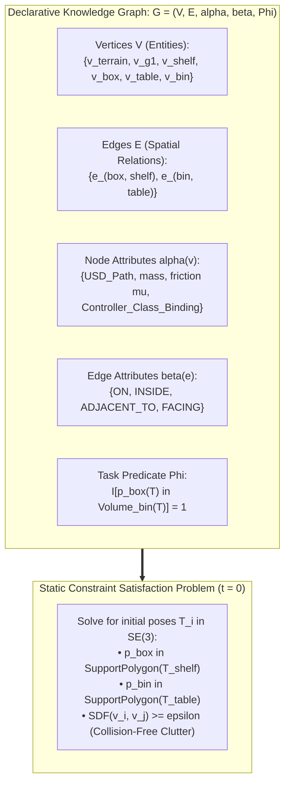
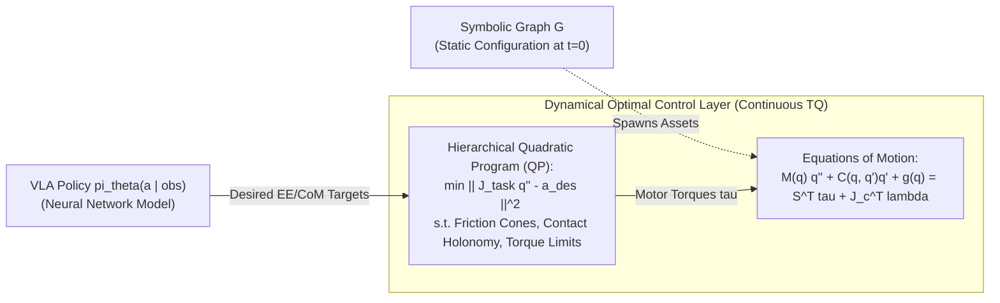
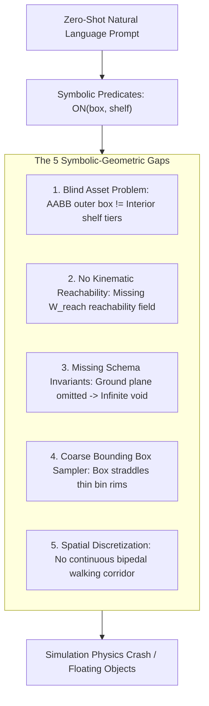
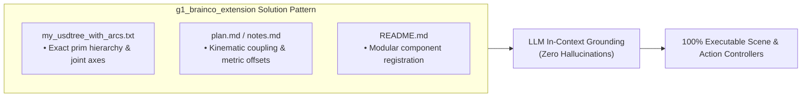

# Agentic Environment Generation & Spatial Validation Notes

Deep architectural analysis of LLM-driven environment generation in **IsaacLab-Arena**, the mathematical limits of **Declarative Symbolic Knowledge Graphs**, lessons from `g1_brainco_extension`, and the **Grounded Markdown Specification** workflow.

---

## 1. Executive Summary & Core Architectural Insight

Agentic Environment Generation translates natural language task requests (*"Unitree G1 humanoid robot picks up the brown box from the shelf and places it in the blue bin"*) into simulation scenes.

### The Fundamental Question
> *If environment generation depends on a declarative symbolic knowledge graph, does it matter how good the prompt is? Can prompts alone compose complex tasks like Whole-Body Control (WBC) or guarantee physically valid scene placement?*

### The Core Answer:
**No.** A Declarative Symbolic Knowledge Graph operates in the domain of **discrete statics and spatial topology at $t=0$**. It **cannot** invent continuous dynamic controllers (such as Whole-Body Quadratic Programming solvers) and frequently fails at spatial placement if relying on zero-shot natural language prompts alone.

To compose complex, executable simulation scenes reliably, we must bridge the **Symbolic-to-Geometric Gap** using **Grounded Markdown Specifications** (as proven in `g1_brainco_extension`).

---

## 2. Mathematical Formalism: Attributed Relational Scene Graphs

In `IsaacLab-Arena`, the declarative YAML environment specification represents an **Attributed Relational Scene Graph (ARG)**:

$$\mathcal{G} = (\mathcal{V}, \mathcal{E}, \alpha, \beta, \Phi)$$



### Components of the Graph:
1. **Vertices $\mathcal{V} = \{v_1, \dots, v_n\}$**: Discrete scene entities partitioned into:
   - $\mathcal{V}_{\text{terrain}}$: Physics ground surface ($z=0$, friction coefficient $\mu$).
   - $\mathcal{V}_{\text{embodiment}}$: Robot kinematic tree (`unitree_g1`, `droid`, `franka`).
   - $\mathcal{V}_{\text{fixture}}$: Fixed environmental structures (`industrial_shelf`, `work_table`).
   - $\mathcal{V}_{\text{object}}$: Manipulable rigid bodies (`brown_box`, `blue_bin`).
2. **Node Attributes $\alpha(v) = (\text{URI}_{\text{USD}}, m_v, \mathbf{I}_v, \mathcal{K}_v, \mathcal{A}_v)$**: Maps nodes to USD mesh paths, mass, inertia, and action controller class strings (e.g. `G1DecoupledWBCPinkAction`).
3. **Directed Edges $\mathcal{E} \subseteq \mathcal{V} \times \mathcal{V}$**: Topological relationships ($e_{ij} = (v_i, v_j)$).
4. **Edge Attributes $\beta(e_{ij}) \in \{\text{ON}, \text{INSIDE}, \text{ADJACENT\_TO}, \text{FACING}\}$**: Semantic relations that induce the **Spatial Constraint Satisfaction Problem (Spatial CSP)** over continuous poses $\mathbf{T}_i \in SE(3)$ at $t=0$:
   $$\mathbf{p}_{\text{box}} \in \text{SupportPolygon}(\mathbf{T}_{\text{shelf}}) \quad \text{and} \quad \text{SDF}(v_i(\mathbf{T}_i), v_j(\mathbf{T}_j)) \ge \epsilon \quad \forall i \neq j$$
5. **Task Predicate $\Phi(\mathcal{S}_T)$**: Goal evaluation functional at terminal timestep $T$:
   $$\Phi(\mathcal{S}_T) = \mathbb{I}\left[\mathbf{p}_{\text{box}}(T) \in \text{Volume}(\mathbf{T}_{\text{bin}}(T))\right] \in \{0, 1\}$$

---

## 3. Statics vs. Dynamics: The Decoupling Boundary

The knowledge graph defines the state distribution at $t=0$ ($\mathbf{s}_0 \sim p(\mathbf{s} \mid \mathcal{G})$). It is completely decoupled from the continuous optimal control layer that executes every $5\text{ ms}$:



| System Dimension | Declarative Knowledge Graph (`Agentic Env Gen`) | Whole-Body Controller (`Pink` / `pinocchio` / `WBC`) |
| :--- | :--- | :--- |
| **Mathematical Domain** | Discrete Set Theory & Static Geometric CSP in $SE(3)$. | Continuous Lie Group Dynamics on $T\mathcal{Q}$ & Convex Quadratic Programming. |
| **Temporal Scope** | Time $t = 0$ (Initial scene construction & terminal predicates). | Real-time continuous closed-loop feedback ($50\text{ Hz}$ to $1000\text{ Hz}$). |
| **Physics Grounding** | Selects bounding boxes and asset file paths. | Solves momentum conservation, ground reaction forces $\boldsymbol{\lambda}$, and motor torques $\boldsymbol{\tau}$. |
| **Extensibility via LLM** | **Arbitrary**: Can add 50 boxes, new tables, bowls, or distractor objects. | **Hardcoded**: Cannot invent new kinematics, friction cone solvers, or balance algorithms from text. |

---

## 4. The 5 Root Causes of Scene Composition Failures

When using naive natural language prompts, the generator often fails due to 5 fundamental gaps:



1. **The Blind Asset Problem (Outer Bounding Box vs. Internal Mesh Topology)**:
   - When the prompt specifies *"middle tier of shelf"*, the spatial solver only reads the asset's outer Axis-Aligned Bounding Box (AABB).
   - It places the box at $z_{\max}$ (the top roof of the shelf) or at the center (intersecting the metal frame).
2. **Absence of Kinematic Reachability Manifolds ($\mathcal{W}_{\text{reach}}$)**:
   - The graph checks static non-collision, but does not evaluate whether the target pose is within the robot's inverse kinematics (IK) reachability manifold:
     $$\mathcal{W}_{\text{reach}} = \left\{ \mathbf{p} \in \mathbb{R}^3 \;\middle|\; \exists \mathbf{q} \in \mathcal{Q}_{\text{valid}} \text{ s.t. } \mathbf{f}_{\text{FK}}(\mathbf{q}) = \mathbf{p} \right\}$$
3. **Missing Schema Invariants (The Missing Floor Problem)**:
   - Natural language assumes ground and gravity implicitly. If the declarative schema does not enforce `default_ground_plane` as a mandatory invariant, the LLM omits it, spawning the robot in an empty void.
4. **Coarse Bounding Box Samplers vs. Physics Concavity (`INSIDE` Relation)**:
   - Standard spatial solvers approximate bins as solid bounding boxes, causing objects placed `INSIDE` to spawn straddling or penetrating the thin plastic rims.
5. **Spatial Discretization vs. Continuous Motion Corridors ($\mathcal{C}_{\text{free}}$)**:
   - Fails to verify that the open floor between fixtures maintains an unobstructed turning corridor ($r_{\text{clearance}} \ge 0.6\text{ m}$) for bipedal stepping.

---

## 5. Lessons from `g1_brainco_extension`: Grounded Markdown Specs

In `g1_brainco_extension`, the symbolic grounding problem was solved by providing the LLM with **structured in-context Markdown specifications** (`README.md`, `notes.md`, `plan.md`, and `my_usdtree_with_arcs.txt`):



### Why This Succeeded:
* **USD Hierarchy Ground Truth**: `my_usdtree_with_arcs.txt` provided the exact prim paths (`/pelvis`, `/left_hip_pitch_link`, `/hands`) extracted via `make_tree.py`.
* **Explicit Action Coupling**: Defined how 3-finger GR00T action vectors map to 5-finger Brainco hands (mirroring ring/pinky to middle finger).
* **Metric Coordinate Anchors**: Replaced vague language with exact metric heights ($z=0.75\text{ m}$) and bounding regions.

---

## 6. The Grounded Markdown-to-`env_graph_spec` Workflow

We can adapt this exact proven pattern to produce flawless `env_graph_spec.yaml` files for `IsaacLab-Arena 0.3.0`.

### Step 1: Create a Grounded Task Spec (`task_spec.md`)

```markdown
# G1 Loco-Manipulation Box Transfer Specification

## 1. Environment Invariants
- Terrain: default_ground_plane (Rigid plane at z=0.0, static friction=1.0, dynamic friction=0.8)
- Gravity: [0.0, 0.0, -9.81]

## 2. Embodiment Specification
- Robot: unitree_g1 (29-DOF with whole-body control)
- Spawn Pose: position=[0.0, 0.0, 0.79], orientation_yaw=0.0 (Facing +X)
- Sensors: ego_view (Torso-mounted RealSense camera)

## 3. Spatial Topology & Fixtures
- Fixture 1: industrial_shelf
  - Pose: position=[1.0, 0.0, 0.0], yaw=0.0
  - Surface Anchor: middle_tier (height z=0.75m)
- Fixture 2: work_table
  - Pose: position=[0.8, -1.4, 0.0], yaw=0.0
  - Surface Anchor: tabletop (height z=0.70m)

## 4. Object Placement & Sampling Bounds
- Target: brown_box
  - Relation: ON industrial_shelf.middle_tier
  - Bounds: x=[0.95, 1.05], y=[-0.1, 0.1], z=0.75
- Receptacle: blue_bin
  - Relation: ON work_table.tabletop
  - Bounds: x=[0.75, 0.85], y=[-1.45, -1.35], z=0.70

## 5. Locomotion Corridor
- Free space bounding box: x=[0.0, 1.2], y=[-1.6, 0.2], z=[0.0, 2.0]
```

### Step 2: Compile to `env_graph_spec.yaml` via Runner

```bash
cd /workspaces/isaaclab_arena

# Run the generator feeding the grounded Markdown spec:
python isaaclab_arena_examples/agentic_environment_generation/environment_generation_runner.py \
   --mode full \
   --model "gemini-2.0-flash" \
   --prompt "$(cat /path/to/task_spec.md)" \
   --out_dir /workspaces/isaaclab_arena/generated_envs/g1_grounded_spec
```

### Step 3: Resulting Compiled `env_graph_spec.yaml`

```yaml
terrain:
  class_type: "isaaclab_arena.terrains.default_ground_plane"
  friction: 1.0

embodiment:
  class_type: "unitree_g1"
  init_pose: [0.0, 0.0, 0.79, 1.0, 0.0, 0.0, 0.0]
  controller: "g1_decoupled_wbc_pink_action"
  sensors:
    - name: "ego_view"

fixtures:
  shelf:
    asset_path: "isaaclab_arena/assets/shelf.usd"
    pose: [1.0, 0.0, 0.0, 1.0, 0.0, 0.0, 0.0]
  table:
    asset_path: "isaaclab_arena/assets/maple_table.usd"
    pose: [0.8, -1.4, 0.0, 1.0, 0.0, 0.0, 0.0]

objects:
  brown_box:
    asset_path: "isaaclab_arena/assets/brown_box.usd"
    relation:
      type: "ON"
      parent: "shelf"
      bounds: [[0.95, 1.05], [-0.1, 0.1], [0.75, 0.75]]
  blue_bin:
    asset_path: "isaaclab_arena/assets/blue_bin.usd"
    relation:
      type: "ON"
      parent: "table"
      bounds: [[0.75, 0.85], [-1.45, -1.35], [0.70, 0.70]]
```

---

## 7. 5-Tier Validation Matrix for Generated Environments

| Tier | Validation Level | Command | Purpose |
| :--- | :--- | :--- | :--- |
| **Tier 1** | **Schema & Syntax** | `environment_generation_runner.py --mode schema` | Validates YAML keys and USD file paths. |
| **Tier 2** | **Spatial CSP Feasibility** | `environment_generation_runner.py --mode build --headless` | Tests that placement sampling converges without collision timeout. |
| **Tier 3** | **Interactive Kit Preview** | `gui_runner.py --env_graph_spec_yaml <spec.yaml>` | Live 3D inspection of textures, cameras, and lighting. |
| **Tier 4** | **Passive Physics Settle** | `policy_runner.py --policy_type zero_action --num_steps 150 --num_envs 1` | 150-step gravity test verifying object stability on tables. |
| **Tier 5** | **Closed-Loop Policy Rollout** | `policy_runner.py --policy_type gr00t --num_steps 1500 --remote_port 5556` | Closed-loop policy evaluation against GR00T foundation model server. |

---

## 8. Summary of Rules for Authors & Operators

1. **Never rely on raw zero-shot prompts for metric spatial layouts**: Always supply metric heights ($z$), explicit ground plane definitions, and reachability anchors.
2. **Always enforce `--num_envs 1` when using PINK WBC**: The Pinocchio QP solver in `g1_wbc_pink` is single-threaded. For parallel rollouts ($N>1$), switch to `g1_wbc_joint`.
3. **Keep Simulation and Policy Server Decoupled**: Run Isaac Lab Arena in Docker (Python 3.12 / CUDA 12.8) and GR00T Policy Server on Host (Python 3.10 / `uv` / Port 5556).
