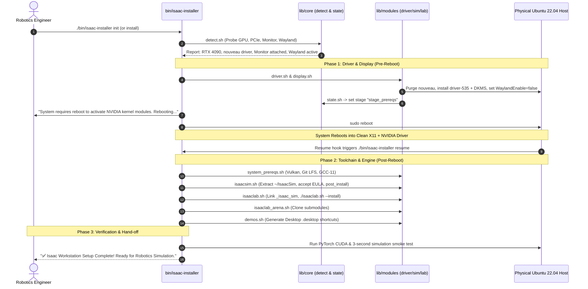

# Universal Isaac Installer Project Plan (`isaac-install-plan.md`)

## 1. Project Mission & Bare-Metal Fallback Purpose

The **Universal Isaac Installer (`isaac-installer`)** is designed as the **zero-infrastructure, bare-metal fallback** for robotics engineers. When cloud deployers (AWS, GCP, Azure, Alibaba) or hosted container platforms (RunPod, Lambda Labs) are unavailable, cost-prohibitive, or prevented by data governance, this tool provisions a **freshly booted physical workstation running Ubuntu 22.04 LTS** into a complete, high-performance robotics simulation station.

### Target Environment:
- **Hardware**: Bare-metal physical workstation or server (e.g. RTX 4090, 4080, 3090, RTX 6000 Ada, or L40S).
- **Base OS**: Fresh installation of Ubuntu 22.04 LTS (Jammy Jellyfish).
- **Display**: Attached physical monitor (HDMI/DisplayPort) or headless rack server.
- **Target Stack**: NVIDIA Drivers, CUDA, Vulkan, Isaac Sim, Isaac Lab, IsaacLab-Arena, and foundation models (Isaac-GR00T, LeRobot, ROS 2).

---

## 2. Concrete Project Structure

The `isaac-installer` is structured as a modular, self-contained, and extensible CLI repository:

```text
isaac-installer/
├── bin/
│   └── isaac-installer            # Main CLI entrypoint (executable dispatcher)
├── config/
│   ├── default-profile.yaml       # Default interactive workstation preset
│   ├── minimal-headless.yaml      # Headless training / CI server preset
│   └── full-ecosystem.yaml        # Full stack preset (+ GR00T, LeRobot, ROS 2)
├── lib/
│   ├── core/
│   │   ├── detect.sh              # OS, GPU, User, Wayland/X11 & Monitor probe functions
│   │   ├── state.sh               # JSON state tracking & reboot-resumption engine
│   │   ├── logging.sh             # Colored UI output, progress spinners & log sinks
│   │   └── package_manager.sh     # System package manager wrapper (apt/dnf/pacman)
│   ├── modules/
│   │   ├── driver.sh              # NVIDIA driver, DKMS, and nouveau blacklisting
│   │   ├── display.sh             # X11 enforcement, GDM Wayland toggle, virtual EDID (if headless)
│   │   ├── system_prereqs.sh      # Vulkan runtime, GCC 11/G++ 11, CMake, Git LFS
│   │   ├── conda.sh               # Miniforge / uv Python environment isolation
│   │   ├── isaacsim.sh            # Standalone ZIP / Pip / Source / Docker provider
│   │   ├── isaaclab.sh            # Isaac Lab core, _isaac_sim symlink, and PyTorch verification
│   │   ├── isaaclab_arena.sh      # Arena benchmark suite with submodules
│   │   ├── streaming.sh           # Hardware streaming (NoMachine, Sunshine NVENC, KasmVNC)
│   │   ├── demos.sh               # Desktop shortcuts (.desktop) and RL launchers (G1, Go2, Franka)
│   │   └── ecosystem.sh           # Isaac-GR00T, LeRobot, and ROS 2 bridges
│   └── templates/
│       ├── xorg.conf.template     # Dummy display template for headless servers
│       ├── vdisplay.edid          # 1080p60 EDID binary for headless GPU rendering
│       ├── gdm-custom.conf        # GDM X11 config snippet (WaylandEnable=false)
│       └── desktop-shortcuts/     # Desktop launcher templates (.desktop.template)
└── README.md                      # Human operator manual and one-line curl installer
```

---

## 3. Detailed Component & File Responsibilities

### 3.1 `bin/isaac-installer` (Main Entrypoint)
The executable dispatcher that parses subcommands and flags:
- `isaac-installer doctor`: Non-destructive hardware, driver, and display diagnosis.
- `isaac-installer init`: Interactive TUI setup wizard for fresh physical machines.
- `isaac-installer install [--profile <path>]`: Automated non-interactive execution.
- `isaac-installer resume`: Resumes execution after a system reboot from saved state.
- `isaac-installer stream setup <provider>`: Configures remote 3D streaming (NoMachine / Sunshine).
- `isaac-installer test`: Runs the end-to-end verification test suite.

### 3.2 `lib/core/` (Foundational Engine)

1. **`lib/core/detect.sh`**:
   - `detect_target_user()`: Identifies non-root `$SUDO_USER` and `$HOME`.
   - `detect_gpu_topology()`: Identifies NVIDIA GPU models, PCIe Bus IDs, and driver status.
   - `detect_display_mode()`: Detects whether a physical monitor is active (`DISPLAY=:0`) or if the host is a headless server requiring a virtual EDID.
   - `detect_wayland()`: Checks if GDM is using Wayland (requiring X11 fallback for Vulkan).
2. **`lib/core/state.sh`**:
   - Manages state file `~/.isaac-installer/state.json`.
   - Records stage transitions: `stage_init` $\to$ `stage_driver` $\to$ `reboot_pending` $\to$ `stage_prereqs` $\to$ `stage_sim` $\to$ `stage_lab` $\to$ `stage_arena` $\to$ `stage_demos` $\to$ `completed`.
   - Installs a one-shot resume service (`/etc/systemd/system/isaac-installer-resume.service`) or `~/.profile` hook to automatically resume post-reboot.
3. **`lib/core/package_manager.sh`**:
   - Abstract package installation interface mapping Debian/Ubuntu (`apt`), RedHat/Fedora (`dnf`), and Arch (`pacman`).

---

### 3.3 `lib/modules/` (Installation Stages)

| Module Script | Stage / Action | Detailed Responsibility |
| :--- | :--- | :--- |
| **`driver.sh`** | Stage 1 (Driver) | Blacklists `nouveau`, installs `linux-headers-$(uname -r)`, `dkms`, and `nvidia-driver-535`. Enables persistence mode (`nvidia-smi -pm 1`). |
| **`display.sh`** | Stage 1 (Display) | Disables Wayland in `/etc/gdm3/custom.conf` (`WaylandEnable=false`). If headless, provisions `/etc/X11/vdisplay.edid` and `xorg.conf`. |
| **`system_prereqs.sh`** | Stage 2 (Prereqs) | Installs `libvulkan-dev`, `vulkan-tools`, `libgl1-mesa-dev`, `libx11-dev`, `cmake`, `git`, `git-lfs`, `gcc-11`, `g++-11`. Sets GCC 11 default. |
| **`conda.sh`** | Stage 3 (Python) | Installs Miniforge / `uv` into `/opt/conda` or `~/.local/share/conda` with non-root ownership. |
| **`isaacsim.sh`** | Stage 4 (Sim) | Downloads standalone ZIP, extracts to `~/IsaacSim`, accepts EULA (`.eula_accepted`), runs `post_install.sh`, pins GPU 0. |
| **`isaaclab.sh`** | Stage 5 (Lab) | Clones `IsaacLab`, symlinks `_isaac_sim -> ~/IsaacSim`, runs `./isaaclab.sh --install`, verifies PyTorch CUDA tensor allocation. |
| **`isaaclab_arena.sh`** | Stage 6 (Arena) | Clones `IsaacLab-Arena` on `release/0.1.1` with recursive submodules. |
| **`streaming.sh`** | Optional Stage | Installs NoMachine (port 4000) or Sunshine NVENC (port 47990) for live 3D teleoperation. |
| **`demos.sh`** | Stage 7 (Demos) | Generates desktop launcher shortcuts (`.desktop`) for Unitree G1, Unitree Go2, and Franka arm RL. |
| **`ecosystem.sh`** | Optional Stage | Installs LeRobot (`v0.4.3`), Isaac-GR00T, and ROS 2 Humble bridge packages. |

---

## 4. Execution Sequence on Fresh Ubuntu 22.04 Bare Metal



---

## 5. Declarative Profile Configuration (`config/default-profile.yaml`)

```yaml
version: "1.0"
profile_name: "workstation-standard"

hardware:
  force_gpu_index: 0
  enforce_x11: true
  auto_blacklist_nouveau: true

isaac_sim:
  method: "standalone" # standalone | pip | source | docker
  version: "5.1.0"
  install_path: "~/IsaacSim"
  accept_eula: true

isaac_lab:
  enabled: true
  repo: "https://github.com/isaac-sim/IsaacLab.git"
  branch: "main"
  install_path: "~/IsaacLab"

isaaclab_arena:
  enabled: true
  repo: "https://github.com/isaac-sim/IsaacLab-Arena.git"
  branch: "release/0.1.1"
  install_path: "~/IsaacLab-Arena"

ecosystem:
  demos: true
  gr00t: false
  lerobot: false
  ros2_bridge: false

streaming:
  enable_nomachine: false
  enable_sunshine: false
```

---

## 6. Implementation Plan & Deliverables

1. **Step 1: Scaffold Directory Structure**
   - Create `isaac-installer/` directory tree (`bin/`, `config/`, `lib/core/`, `lib/modules/`, `lib/templates/`).
2. **Step 2: Implement Core Engine (`lib/core/`)**
   - Implement `detect.sh`, `state.sh`, and `logging.sh`.
3. **Step 3: Implement Installation Modules (`lib/modules/`)**
   - Implement `driver.sh`, `display.sh`, `system_prereqs.sh`, `isaacsim.sh`, `isaaclab.sh`, `isaaclab_arena.sh`, and `demos.sh`.
4. **Step 4: Build Main CLI Dispatcher (`bin/isaac-installer`)**
   - Wire `doctor`, `init`, `install`, `resume`, `test` subcommands.
5. **Step 5: End-to-End Validation**
   - Smoke test against a clean environment and verify zero-interaction unattended installation.
