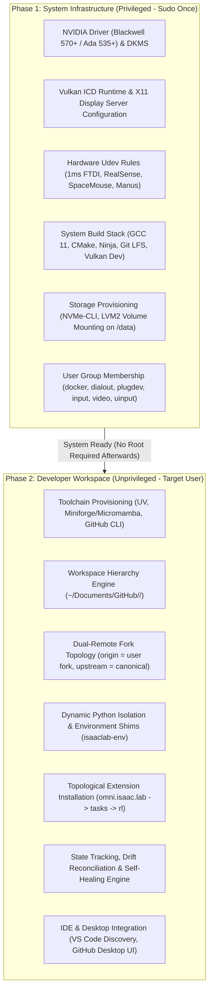
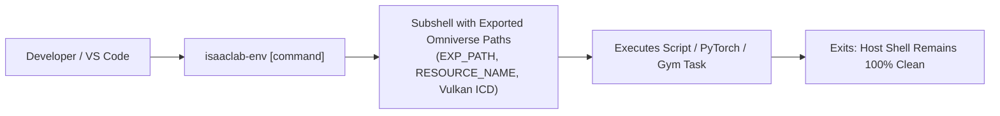
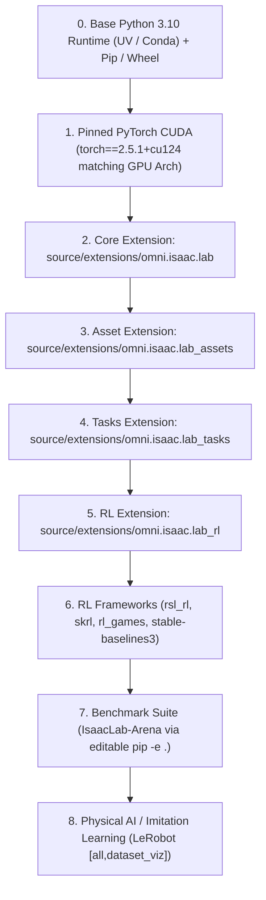
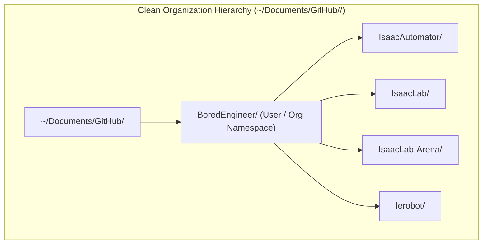
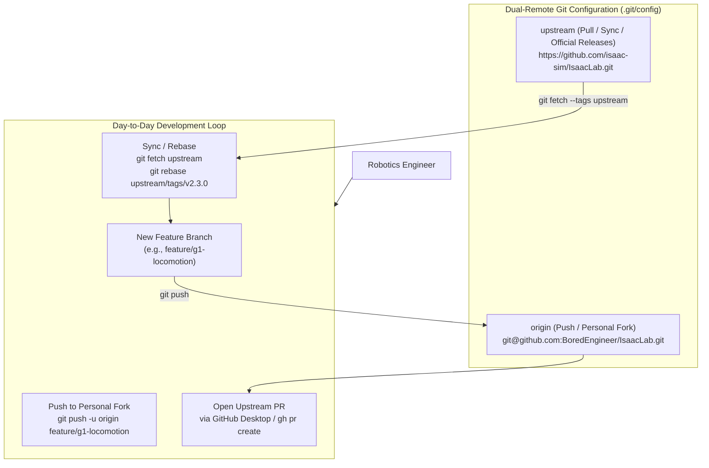
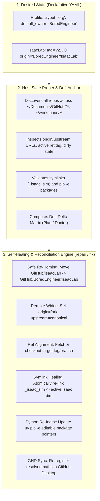
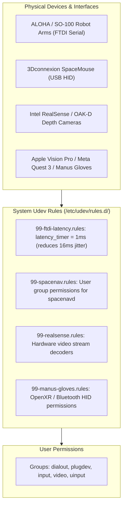

# Universal Isaac & Physical AI Installer Architecture Plan (`isaac-install-plan.md`)

> **Document Status**: Under Active Architectural Review  
> **Target Platform**: Bare-Metal Workstations & Heterogeneous Physical AI Nodes (Ubuntu 22.04 LTS)  
> **Compute Scope**: NVIDIA Blackwell (GB200 / RTX 5090 / RTX PRO 6000), Ada Lovelace (RTX 4090 / L40S / 6000 Ada), Ampere (RTX 3090 / A100)

---

## 1. Executive Summary & Vision

The **Universal Isaac Installer (`isaac-installer`)** is the zero-infrastructure, bare-metal provisioner for robotics, Physical AI, and simulation engineers. While `IsaacAutomator` handles public cloud instances (AWS, GCP, Azure, Alibaba), `isaac-installer` transforms a fresh or existing physical machine into a high-performance, open-ended robotics workstation.

### The Real-World Developer Reality:
In production robotics and Physical AI research, developers do **not** work in a static, monolithic sandbox. They:
1. Maintain active Git forks of core frameworks (`IsaacLab`, `IsaacLab-Arena`, `lerobot`) and switch branches/tags rapidly.
2. Structure repositories cleanly under user/organization hierarchies (`~/Documents/GitHub/<Owner>/<Repo>`) matching their GitHub Desktop accounts.
3. Manage different Python dependencies across tasks without corrupting Isaac Sim's underlying runtime.
4. Require automated state tracking and self-healing: if repos are misplaced, remotes misconfigured, or symlinks broken, the installer automatically detects the drift, reconciles the state, and heals the workspace based on declarative YAML profiles.
5. Integrate real-time teleoperation hardware (ALOHA leader-follower arms, SpaceMouse, VR headsets, cameras) with sub-millisecond serial latency.

---

## 2. Realistic System-Space vs. User-Space Decoupled Architecture

A primary flaw of naive installer scripts is executing everything under `sudo`, polluting user directories, creating `root:root` permission locks in `~/.cache` and Python runtimes, and hardcoding global shell variables that break non-simulation workloads.

`isaac-installer` enforces a strict **Two-Phase Privilege Boundary**:



---

## 3. Python Environment Architecture: The Environment Shim Pattern

### The Problem with Global `setup_conda_env.sh`
Sourcing Isaac Sim's `setup_conda_env.sh` globally in `~/.bashrc` mutates `PYTHONPATH` and `LD_LIBRARY_PATH` with Omniverse kit libraries. This causes **binary ABI crashes** when running standard Python tools, PyTorch models, or CLI utilities outside of Isaac Sim.

### The Solution: Dynamic Environment Shimming (`isaaclab-env` & Virtualenv Hooks)

Instead of contaminating the host shell, `isaac-installer` configures a **Scoped Environment Shim**:



```text
Host Shell (.bashrc)
└── Clean Python / Conda / UV Environment (No Global Isaac Sim PYTHONPATH)
    ├── Standard Python Projects (run independently without library collisions)
    └── Scoped Invocation:
        ├── Direct CLI:       isaaclab-env python train.py --task Isaac-Cartpole-v0
        ├── Conda Activate:   conda activate isaaclab (sources env-vars on activation only)
        └── Project Virtual:  source ~/workspaces/robot_project/.venv/bin/activate_isaac
```

### Topological Extension Installation Order

To guarantee stability, extensions and downstream packages must be compiled and linked in strict topological dependency order:



---

## 4. Workspace Organization & GitHub Desktop Hierarchy

In professional robotics setups, developers maintain repositories under user or organization folders matching their GitHub account (e.g. `~/Documents/GitHub/BoredEngineer/IsaacAutomator`). Naive flat cloning (`~/Documents/GitHub/IsaacLab`) creates folder fragmentation and breaks GitHub Desktop repository tracking.



### Declarative YAML Configuration (`config/*.yaml`):
```yaml
workspace:
  root: "~/Documents/GitHub"
  # Layout Strategy:
  #   - "auto": Auto-detects if owner directory exists (e.g. ~/Documents/GitHub/BoredEngineer)
  #   - "org":  Always nest under owner folder (~/Documents/GitHub/<Owner>/<Repo>)
  #   - "flat": Always place directly under root (~/Documents/GitHub/<Repo>)
  layout: "auto"
  default_owner: "BoredEngineer"      # Fallback if unauthenticated
  auto_register_github_desktop: true

repositories:
  isaaclab:
    enabled: true
    repo: "BoredEngineer/IsaacLab"    # Personal fork (origin)
    upstream: "https://github.com/isaac-sim/IsaacLab.git" # Canonical (upstream)
    branch: "main"
    tag: "v2.3.0"
    # Optional path override:
    # path: "~/Documents/GitHub/BoredEngineer/IsaacLab"

  arena:
    enabled: true
    repo: "BoredEngineer/IsaacLab-Arena"
    upstream: "https://github.com/isaac-sim/IsaacLab-Arena.git"
    branch: "release/0.1.1"

  lerobot:
    enabled: false
    repo: "BoredEngineer/lerobot"
    upstream: "https://github.com/huggingface/lerobot.git"
    branch: "main"
```

---

## 5. Dual-Remote Fork Topology & Tag/Branch Management



### Core Capabilities:
1. **Protocol Auto-Detection**: Uses SSH (`git@github.com:...`) if SSH keys are configured; otherwise uses HTTPS with `gh auth setup-git` credential helper.
2. **Upstream Push Guard**: `git config remote.upstream.pushurl "PUSH_DISABLED_CANONICAL_UPSTREAM"` to eliminate accidental pushes to official repositories.
3. **Targeted Ref & Tag Fetching**: Automatically fetches upstream tags (`git fetch --tags upstream`) and handles on-demand un-shallowing so developers can switch between release tags (`v2.2.0`, `v2.3.0`) without git errors.
4. **GitHub Desktop UI Integration**: Executing `github-desktop --add <path>` enables native "Fetch upstream", "Sync with upstream", and visual PR creation.

---

## 6. State Tracking, Drift Detection & Self-Healing Engine

When workstations evolve over time, repositories get misplaced (e.g. flat `GitHub/IsaacLab` vs `GitHub/BoredEngineer/IsaacLab`), remotes point to wrong URLs, branches drift, or symlinks break.

`isaac-installer` introduces an **Automated Drift Detection & Self-Healing Engine**:



### Drift Classification Matrix:

| Drift Category | Detected Scenario | Automated Self-Healing Action |
| :--- | :--- | :--- |
| **Mislocated Directory** | `IsaacLab` is in flat `GitHub/` or `~/workspace/`, but YAML specifies `org` layout. | Safely moves directory to `~/Documents/GitHub/BoredEngineer/IsaacLab`, checks dirty state, and updates all symlinks. |
| **Origin Remote Mismatch** | `origin` is set to `isaac-sim/IsaacLab` instead of `BoredEngineer/IsaacLab`. | Updates `origin` to personal fork and configures `upstream` to canonical NVIDIA repo. |
| **Branch / Tag Drift** | Local repo is on `main`, but YAML requests `tag: v2.3.0`. | Fetches upstream tags, stashes any uncommitted work, and checks out `release/v2.3.0`. |
| **Broken Engine Symlink** | `_isaac_sim` symlink is broken or points to a non-existent Isaac Sim path. | Atomically recreates `_isaac_sim` pointing to active `${ISAACSIM_DIR}`. |
| **Stale Python Editable Link** | Pip editable metadata points to old directory path before re-homing. | Re-runs `uv pip install -e <new_path>` inside the conda/venv environment. |
| **Dirty Work Protection** | Local repo contains uncommitted edits or untracked research files. | Never deletes or overwrites; creates safety git branch/stash backup before migration. |

### Persistent State Ledger (`~/.isaac-installer/state.json`):
```json
{
  "version": "1.0",
  "last_reconciled": "2026-08-20T21:30:00Z",
  "workspace_layout": "org",
  "default_owner": "BoredEngineer",
  "repositories": {
    "isaaclab": {
      "path": "/home/tarfy/Documents/GitHub/BoredEngineer/IsaacLab",
      "repo_slug": "BoredEngineer/IsaacLab",
      "upstream_slug": "isaac-sim/IsaacLab",
      "active_ref": "v2.3.0",
      "ref_type": "tag",
      "linked_sim": "/home/tarfy/IsaacSim",
      "git_status": "clean"
    },
    "arena": {
      "path": "/home/tarfy/Documents/GitHub/BoredEngineer/IsaacLab-Arena",
      "repo_slug": "BoredEngineer/IsaacLab-Arena",
      "upstream_slug": "isaac-sim/IsaacLab-Arena",
      "active_ref": "release/0.1.1",
      "ref_type": "branch",
      "linked_sim": "/home/tarfy/IsaacSim",
      "git_status": "clean"
    }
  },
  "simulation": {
    "active_version": "5.1.0",
    "path": "/home/tarfy/IsaacSim"
  },
  "python_env": {
    "type": "conda",
    "name": "isaaclab",
    "path": "/opt/conda/envs/isaaclab",
    "torch_cuda": "2.5.1+cu124"
  }
}
```

---

## 7. Teleoperation, Real-Time Serial & Peripherals Subsystem

Robotics teleoperation requires deterministic, low-latency communication with physical actuators, microcontrollers, and sensory devices.



### 1ms FTDI Serial Latency Rule:
Standard Linux kernel drivers default USB-to-serial devices (`/dev/ttyUSB*`) to a **16ms buffer latency timer**. In closed-loop robot control, this causes severe latency and packet drops. The installer enforces:
```udev
ACTION=="add", SUBSYSTEM=="usb-serial", DRIVER=="ftdi_sio", ATTR{latency_timer}="1"
```

---

## 8. High-Throughput NVMe Storage, Datasets & USD Asset Cache

Physical AI training and multi-camera simulation create massive I/O traffic.

```text
/data (Mounted on High-Speed PCIe Gen4/Gen5 NVMe SSD)
├── isaac_cache/
│   ├── ov_data/           # Cached Omniverse USD assets (G1, Go2, Franka, Warehouses)
│   └── shader_cache/      # Pre-compiled Vulkan / RTX shader cache (sub-2s startup)
├── datasets/
│   ├── lerobot/           # Multi-camera HDF5/Zarr teleoperation trajectories
│   └── rsl_rl_logs/       # Reinforcement learning checkpoints and tensorboard runs
└── models/
    └── pretrained_checkpoints/ # Hugging Face LeRobot & Foundation policy weights
```

---

## 9. Concrete Project Structure

```text
isaac-installer/
├── bin/
│   ├── isaac-installer            # CLI dispatcher (doctor, plan, install, sim, lab, auth, test, repair)
│   └── isaaclab-env               # Dynamic runtime environment shim
├── config/
│   ├── default-profile.yaml       # Standard interactive robotics workstation preset
│   ├── minimal-headless.yaml      # Headless RL training / CI cluster node preset
│   └── full-ecosystem.yaml        # Full stack (+ LeRobot, Arena, SpaceMouse, Manus VR)
├── lib/
│   ├── core/
│   │   ├── logging.sh             # Unicode UI cards, color palette, failure log tailing
│   │   ├── detect.sh              # Blackwell/Ada GPU, NVMe SSDs, LVM, Wayland/X11
│   │   ├── config.sh              # Declarative YAML profile parser & layout mapper
│   │   ├── audit.sh               # 20-component pre-flight audit diff matrix
│   │   ├── state.sh               # JSON state machine, ledger & drift tracker
│   │   ├── network.sh             # CDN latency pre-flight benchmark
│   │   ├── backup.sh              # Safety configuration snapshots & rollback
│   │   ├── git_workspace.sh       # Hierarchy resolver, dual-remote fork engine, GHD registration
│   │   └── package_manager.sh     # Abstract package manager wrapper
│   ├── modules/
│   │   ├── driver.sh              # NVIDIA drivers (570+ / 535+), DKMS, nouveau blacklist
│   │   ├── display.sh             # X11 enforcement, virtual EDID (headless display)
│   │   ├── system_prereqs.sh      # Vulkan runtime, GCC 11, CMake, Ninja, Git LFS
│   │   ├── conda.sh               # UV toolchain & Miniforge/Micromamba isolation
│   │   ├── dev_tools.sh           # Docker CE, nvidia-ctk, nvme-cli, lvm2, VS Code, Chrome
│   │   ├── physical_ai.sh         # Hugging Face CLI, LeRobot, Rerun.io dataset viz
│   │   ├── hardware_teleop.sh     # 1ms FTDI rules, SpaceMouse, RealSense, Manus VR
│   │   ├── isaacsim.sh            # Standalone ZIP engine extraction, multi-version registry
│   │   ├── isaaclab.sh            # Topological extension installer, tag/branch switcher, PyTorch check
│   │   ├── isaaclab_arena.sh      # Arena multi-agent benchmark suite with depth-1 submodules
│   │   ├── auth.sh                # Unified OAuth, Cloud Hubs (GH, HF, NGC, WandB)
│   │   ├── streaming.sh           # Hardware streaming (NoMachine, Sunshine NVENC)
│   │   ├── demos.sh               # Desktop shortcuts (.desktop) and RL launchers
│   │   └── ecosystem.sh           # Isaac-GR00T, ROS 2 Humble/Jazzy bridge
│   └── templates/
│       ├── xorg.conf.template     # Dummy display template for headless servers
│       ├── vdisplay.edid          # 1080p60 EDID binary for headless GPU rendering
│       ├── udev-rules/            # Hardware device udev rules (FTDI, SpaceMouse, RealSense)
│       └── desktop-shortcuts/     # Desktop launcher templates (.desktop.template)
└── README.md                      # Operator manual and quickstart
```

---

## 10. Authentication & Permissions Matrix

| Category | Component / Service | Required Credentials | Interactive Flow | Automated / Headless Flow |
| :--- | :--- | :--- | :--- | :--- |
| **Code & Repos** | **GitHub** | OAuth Token / PAT / SSH Key | `gh auth login -w` | `$GITHUB_TOKEN` / `$GH_TOKEN` + `gh auth setup-git` |
| **Foundation Hub** | **Hugging Face Hub** | User Access Token (Read/Write) | `huggingface-cli login` | `$HF_TOKEN` -> `~/.cache/huggingface/token` |
| **Container Cloud**| **NVIDIA NGC (`nvcr.io`)** | NGC API Key (`$oauthtoken`) | `ngc config set` | `echo "$NGC_API_KEY" \| docker login nvcr.io -u '$oauthtoken' --password-stdin` |
| **RL Tracking** | **Weights & Biases** | WandB API Key | `wandb login` | Reads `$WANDB_API_KEY` -> `~/.netrc` |
| **Host Security** | **Docker Group** | User group membership | Automatic | `usermod -aG docker $TARGET_USER` |
| **Host Security** | **Robotics Serial (USB)**| Group `dialout`, `tty` | Automatic | Grants access to Dynamixel, ALOHA, SO-100 arms |
| **Host Security** | **Peripherals (`plugdev`)**| Group `plugdev`, `input`, `video`, `uinput` | Automatic | Grants access to SpaceMouse, RealSense, Manus VR |
| **Licensing** | **Omniverse EULA** | EULA Acceptance | Automatic | Touches `${ISAACSIM_DIR}/.eula_accepted` |

---

## 11. 13-Subsystem End-to-End Verification Suite (`test`)

The verification suite runs granular, non-destructive health checks across 13 core subsystems:

1. **NVIDIA Driver & GPU Topology**: Driver version ($\ge 535$ or $\ge 570$), PCIe Link speed (Gen4/Gen5 x16), persistence mode.
2. **Display Server**: X11 server active or virtual EDID configured (`DISPLAY=:0`), Wayland disabled for Omniverse compatibility.
3. **Build Prerequisites**: GCC 11, G++ 11, CMake $\ge 3.22$, Ninja, Git LFS.
4. **Vulkan Runtime**: `vulkaninfo` device enumeration, ICD configuration (`/etc/vulkan/icd.d/nvidia_icd.json`).
5. **Docker & GPU Passthrough**: Docker daemon status, `nvidia-ctk` runtime test (`nvidia-smi` inside container).
6. **Developer Tools**: VS Code, GitHub Desktop, Google Chrome / Chromium, `gh`, `aws`, `gcloud`, `hf`.
7. **Storage & I/O Stack**: NVMe SMART health telemetry, LVM2 volume groups, mount permissions on `/data`.
8. **Python Runtime & UV**: Python 3.10 runtime, `uv` package manager binary and cache health.
9. **Physical AI & LeRobot**: Hugging Face token validity, `lerobot` import, Rerun.io visualizer binary.
10. **Hardware Teleop**: 1ms FTDI latency timer verification, user membership in `dialout`, `plugdev`, `input`.
11. **Isaac Sim Standalone Engine**: Executable verification, `.eula_accepted` presence, Kit Carbonite core load.
12. **Isaac Lab PyTorch CUDA Linkage**: GPU tensor allocation, CUDA device name match, extension import sanity.
13. **IsaacLab-Arena & Demos**: Gymnasium multi-agent environment registration, 50-step headless PhysX tensor rollout.

---

## 12. Critical Architectural Review & Open Questions

The following architectural points require specific team and stakeholder review during the next development iterations:

### Review Point 1: Two-Phase CLI Separation (`sys-provision` vs `dev-setup`)
- **Question**: Should the installer CLI be explicitly split into two top-level subcommands:
  - `sudo isaac-installer sys-provision` (runs strictly as root: drivers, udev, packages, storage).
  - `isaac-installer dev-setup` (runs strictly as target user: git clones, uv envs, extensions, shortcuts)?
- **Tradeoff**: Clean privilege boundary and 0% risk of root cache pollution vs. single-command convenience.

### Review Point 2: Python Environment Isolation Strategy
- **Question**: Should `isaac-installer` default to:
  - **Strategy A**: Isolated Conda environment (`conda create -n isaaclab python=3.10`) with `uv pip` acceleration inside.
  - **Strategy B**: Pure `uv venv` virtualenv (`~/.venvs/isaaclab`) with lightweight shell shims.
  - **Strategy C**: DevContainer / OCI container on bare-metal with bind-mounted GPU and X11 sockets.
- **Tradeoff**: Conda provides system-level CUDA/C++ dependency isolation; UV provides 10x faster package resolution; DevContainers provide 100% reproducibility across machines.

### Review Point 3: Sourced Environment Shims vs Monolithic Shell Pollution
- **Question**: How should Omniverse runtime paths be exposed to IDEs (VS Code / Cursor / PyCharm)?
  - Via a `.env` file in the workspace root.
  - Via dynamic wrapper script (`bin/isaaclab-env`).
  - Via Conda `etc/conda/activate.d/isaac_sim.sh` hooks that activate only when entering the conda environment.

### Review Point 4: Downstream Dependency Management (Submodules vs Wheels)
- **Question**: Should downstream RL dependencies (like `rsl_rl`, `skrl`, `rl_games`) be managed as editable git submodules or pinned PyPI wheels?
  - Submodules allow modifying the RL algorithm source code directly during research.
  - Wheels provide faster and more predictable installs.

---

## 13. Implementation Roadmap

- [x] **Core CLI & Unicode UI Engine** (`bin/isaac-installer`, `lib/core/logging.sh`)
- [x] **Deep Hardware, NVMe & Multi-GPU Discovery** (`lib/core/detect.sh`)
- [x] **20-Component Pre-Flight Audit Matrix** (`lib/core/audit.sh`)
- [x] **Network CDN Latency Pre-Flight Benchmarking** (`lib/core/network.sh`)
- [x] **Configuration Safety Snapshots & Rollback** (`lib/core/backup.sh`)
- [x] **Unified Authentication & Cloud Hub Manager** (`lib/modules/auth.sh`)
- [x] **High-Speed Storage Stack (`nvme-cli`, `lvm2`, `fio`)** (`lib/modules/dev_tools.sh`)
- [x] **Hugging Face LeRobot & `lerobot-dataset-viz`** (`lib/modules/physical_ai.sh`)
- [x] **Hardware Teleop Peripherals & 1ms Low-Latency Serial** (`lib/modules/hardware_teleop.sh`)
- [x] **Multi-Version Isaac Sim Detection & Atomic Symlink Switcher** (`lib/modules/isaacsim.sh`)
- [x] **13-Subsystem End-to-End Verification Suite** (`cmd_test`)
- [ ] **Workspace Hierarchy Engine (`~/Documents/GitHub/<Owner>/<Repo>`)** (`lib/core/git_workspace.sh`)
- [ ] **Dual-Remote Fork & Tag/Branch Management (`lab switch`, `lab sync`)** (`lib/modules/isaaclab.sh`)
- [ ] **State Tracking, Drift Reconciliation & Self-Healing Engine (`repair` / `fix`)** (`lib/core/state.sh`)
- [ ] **Two-Phase Privilege Boundary Refactor (`sys-provision` vs `dev-setup`)**
- [ ] **Dynamic Environment Shim Implementation (`isaaclab-env` & activation hooks)**
- [ ] **Multi-Agent Skills Registration** (`.agents/skills/isaac-baremetal-installer/SKILL.md`)
