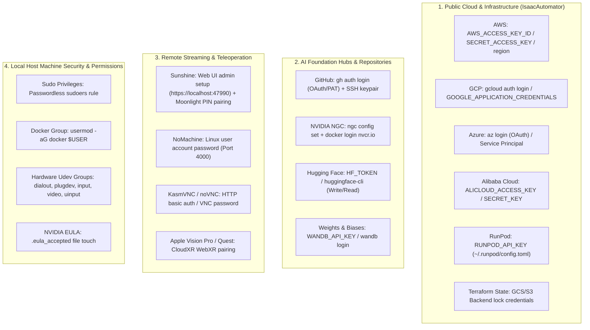
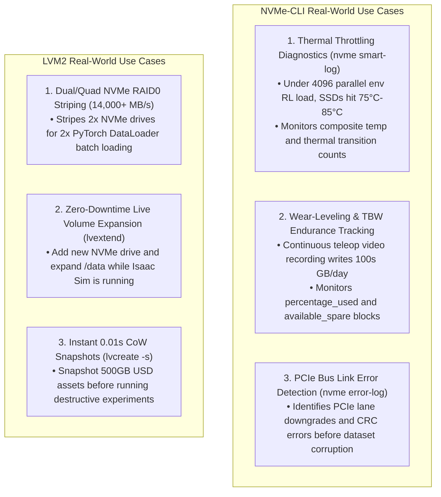
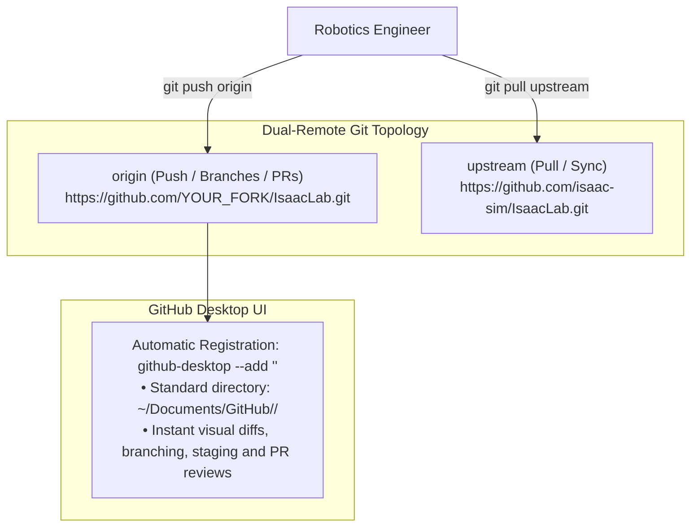

# Universal Isaac & Physical AI Installer Project Plan (`isaac-install-plan.md`)

## 1. Project Mission & Bare-Metal Fallback Purpose

The **Universal Isaac Installer (`isaac-installer`)** is the **zero-infrastructure, bare-metal provisioner** for robotics, Physical AI, and simulation engineers. When cloud deployers (AWS, GCP, Azure, Alibaba) or hosted container platforms (RunPod, Lambda Labs) are unavailable, cost-prohibitive, or prevented by data governance, this tool provisions a **freshly booted physical workstation running Ubuntu 22.04 LTS** into a state-of-the-art Physical AI, robotics teleoperation, and Isaac simulation station.

### Target Environment & Hardware Scope:
- **Hardware Architecture**: Bare-metal physical workstations or cluster servers (e.g. **NVIDIA Blackwell RTX PRO 6000 / RTX 5090 / GB200**, Ada Lovelace RTX 4090 / L40S / RTX 6000 Ada, and Ampere RTX 3090 / A100).
- **Multi-GPU & Heterogeneous Setups**: Multi-GPU topology support (GPU 0 pinned for Vulkan viewport rendering; secondary GPUs allocated for parallel Reinforcement Learning simulation rollouts).
- **Multi-NVMe High-Speed Storage**: Deep hardware probing for multiple PCIe Gen4/Gen5 NVMe SSDs and LVM2 volume groups.
- **Base OS**: Fresh or pre-existing installation of Ubuntu 22.04 LTS (Jammy Jellyfish).
- **Display Mode**: Native physical monitor (`DISPLAY=:0`) or headless server.
- **Target Stack**: NVIDIA Drivers (Blackwell $\ge 570$, Ada $\ge 535$), Vulkan ICD, Docker CE + `nvidia-ctk`, Visual Studio Code, GitHub Desktop, Google Chrome / Chromium (WebXR/WebGPU), Discord, Hugging Face LeRobot (`[all,dataset_viz]`), `lerobot-dataset-viz` (Rerun.io & Foxglove), Teleoperation Peripherals (Apple Vision Pro, Meta Quest 3, Manus VR Gloves, 3D SpaceMouse, ALOHA/SO-100 1ms latency timer, Intel RealSense), NVIDIA Isaac Sim 5.1.0, Isaac Lab, and IsaacLab-Arena.

---

## 2. Concrete Project Structure

The `isaac-installer` is structured as a modular, idempotent CLI repository:

```text
isaac-installer/
├── bin/
│   └── isaac-installer            # Main CLI entrypoint (executable dispatcher)
├── config/
│   ├── default-profile.yaml       # Default interactive workstation preset
│   ├── minimal-headless.yaml      # Headless training / CI server preset
│   └── full-ecosystem.yaml        # Full stack preset (+ Physical AI, Teleop, Demos)
├── lib/
│   ├── core/
│   │   ├── logging.sh             # Modern UI, Unicode box cards, elapsed step timers
│   │   ├── detect.sh              # Hardware, Blackwell GPU, NVMe drives, LVM, Wayland/X11
│   │   ├── audit.sh               # Deep 20-component audit, version diff matrix & JSON export
│   │   ├── state.sh               # JSON state machine & reboot-resumption engine
│   │   ├── network.sh             # Network pre-flight & CDN latency benchmarking
│   │   ├── backup.sh              # Safety configuration snapshots & restore engine
│   │   ├── git_workspace.sh       # Smart repo discovery, fork wiring & GitHub Desktop registry
│   │   └── package_manager.sh     # Abstract apt/dnf/pacman package manager wrapper
│   ├── modules/
│   │   ├── driver.sh              # NVIDIA driver (Blackwell 570+ / Ada 535+), DKMS, nouveau blacklist
│   │   ├── display.sh             # X11 enforcement, GDM Wayland toggle, virtual EDID (headless)
│   │   ├── system_prereqs.sh      # Vulkan runtime, GCC 11/G++ 11 alternatives, CMake, Git LFS
│   │   ├── conda.sh               # Miniforge / uv Python environment isolation
│   │   ├── dev_tools.sh           # Docker CE, nvidia-ctk, nvme-cli, lvm2, VS Code, Chrome, Discord
│   │   ├── physical_ai.sh         # Hugging Face CLI (hf), LeRobot, lerobot-dataset-viz, FFmpeg
│   │   ├── hardware_teleop.sh     # XR Headsets, Manus gloves, SpaceMouse, 1ms FTDI udev rules
│   │   ├── isaacsim.sh            # Standalone ZIP engine extraction, multi-version registry, EULA
│   │   ├── isaaclab.sh            # Isaac Lab core, fork upstream wiring & PyTorch verification
│   │   ├── isaaclab_arena.sh      # Arena multi-agent benchmark suite with depth-1 submodules
│   │   ├── auth.sh                # Unified OAuth, API key, Cloud Hubs & SSH key generator
│   │   ├── streaming.sh           # Hardware streaming (NoMachine, Sunshine NVENC) [Opt-in]
│   │   ├── demos.sh               # Desktop shortcuts (.desktop) and RL launchers (G1, Go2, Franka)
│   │   └── ecosystem.sh           # Isaac-GR00T, ROS 2 Humble bridge packages
│   └── templates/
│       ├── xorg.conf.template     # Dummy display template for headless servers
│       ├── vdisplay.edid          # 1080p60 EDID binary for headless GPU rendering
│       ├── udev-rules/            # Hardware device udev rules
│       │   ├── 99-ftdi-latency.rules   # 1ms latency timer for ALOHA / SO-100 arms
│       │   ├── 99-manus-gloves.rules   # Manus VR haptic gloves
│       │   ├── 99-spacenav.rules       # 3Dconnexion SpaceMouse
│       │   └── 99-realsense.rules      # Intel RealSense depth cameras
│       └── desktop-shortcuts/     # Desktop launcher templates (.desktop.template)
└── README.md                      # Complete human operator manual and quickstart
```

---

## 3. Comprehensive Master Authentication, OAuth & Permissions Matrix

This matrix maps **every single software component** across `isaac-installer` and `IsaacAutomator` that requires authentication, user action, OAuth, API keys, licensing, or local host permissions:



### Detailed Provider Matrix:

| Category | Component / Service | Required Credentials / Token | Interactive Flow (Browser/TUI) | Automated / Headless Flow |
| :--- | :--- | :--- | :--- | :--- |
| **Code & Repos** | **GitHub** | OAuth Token / PAT / SSH Key | `gh auth login -w` (8-char device code) | Reads `$GITHUB_TOKEN` / `$GH_TOKEN`, runs `gh auth setup-git`, uses `~/.ssh/id_ed25519`. |
| **Foundation Hub** | **Hugging Face Hub** | User Access Token (Read/Write) | `huggingface-cli login` | Reads `$HF_TOKEN` and writes to `~/.cache/huggingface/token`. |
| **Container Cloud**| **NVIDIA NGC (`nvcr.io`)** | NGC API Key (`$oauthtoken`) | `ngc config set` prompt | `echo "$NGC_API_KEY" \| docker login nvcr.io -u '$oauthtoken' --password-stdin`. |
| **RL Tracking** | **Weights & Biases** | WandB API Key | `wandb login` | Reads `$WANDB_API_KEY` and populates `~/.netrc`. |
| **Cloud Deployer** | **Google Cloud (GCP)** | ADC OAuth / Service Account | `gcloud auth application-default login` | Reads `$GOOGLE_APPLICATION_CREDENTIALS` and `$CLOUDSDK_CORE_PROJECT`. |
| **Cloud Deployer** | **AWS** | Access Key & Secret Key | `aws configure` | Reads `$AWS_ACCESS_KEY_ID`, `$AWS_SECRET_ACCESS_KEY`, `$AWS_DEFAULT_REGION`. |
| **Cloud Deployer** | **Azure** | Azure Subscription / SP | `az login` | Reads `$AZURE_CLIENT_ID`, `$AZURE_CLIENT_SECRET`, `$AZURE_TENANT_ID`. |
| **Cloud Deployer** | **Alibaba Cloud** | Access Key & Secret Key | `aliyun configure` | Reads `$ALICLOUD_ACCESS_KEY`, `$ALICLOUD_SECRET_KEY`, `$ALICLOUD_REGION`. |
| **Cloud Deployer** | **RunPod** | RunPod API Key | CLI prompt | Reads `$RUNPOD_API_KEY` stored in `~/.runpod/config.toml`. |
| **Remote 3D** | **Sunshine Streaming** | Admin User / Password / PIN | Opens `https://localhost:47990` + Moonlight PIN | Auto-generates local admin credentials. |
| **Remote 3D** | **NoMachine** | Linux User Password | OS authentication dialog on port 4000 | Checks that `$TARGET_USER` has a password configured. |
| **Host Security** | **Docker Group** | User group membership | Automatic | Adds user via `usermod -aG docker $TARGET_USER`. |
| **Host Security** | **Robotics Serial (USB)**| Group `dialout`, `tty` | Automatic | Grants access to Dynamixel, ALOHA & SO-100 leader-follower arms. |
| **Host Security** | **Peripherals (`plugdev`)**| Group `plugdev`, `input`, `video`, `uinput` | Automatic | Grants access to SpaceMouse, RealSense, Manus VR gloves. |
| **Licensing** | **Omniverse EULA** | EULA Acceptance | Automatic | Touches `~/IsaacSim/.eula_accepted`. |

---

## 4. Bare-Metal High-Speed Storage Subsystem (NVMe-CLI & LVM2)

Physical AI and Isaac Sim workstations generate massive I/O load (multi-camera 60fps teleop datasets, USD geometry caches, and parallel RL replay buffers).



### Integrated Storage Tools:
- **`nvme-cli`**: Hardware telemetry, SMART logs, namespace management, secure sanitize.
- **`lvm2`**: Physical volume (`pvcreate`), Volume group (`vgcreate`), and Logical volume (`lvcreate`) automation.
- **`smartmontools` (`smartctl`)**: S.M.A.R.T. disk reliability daemon.
- **`fio`**: High-performance asynchronous NVMe read/write IOPS benchmark.
- **`iotop`**: Live process-level disk I/O throughput monitoring.

---

## 5. Developer Fork Workflows & GitHub Desktop Integration

Robotics developers frequently maintain personal or organizational forks of `IsaacLab`, `IsaacLab-Arena`, and `lerobot`.



### CLI Workspace & Fork Flags:
- `--workspace-dir <path>`: Base folder for all repositories (Default: `~/Documents/GitHub`).
- `--isaaclab-repo <slug>`: Personal fork for Isaac Lab (e.g. `BoredEngineer/IsaacLab`).
- `--arena-repo <slug>`: Personal fork for IsaacLab-Arena (e.g. `BoredEngineer/IsaacLab-Arena`).
- `--lerobot-repo <slug>`: Personal fork for LeRobot (e.g. `BoredEngineer/lerobot`).

---

## 6. Multi-Version Coexistence & Atomic Symlink Switching (`sim`)

To support side-by-side installations of Isaac Sim versions (4.2.0, 4.5.0, 5.1.0) and custom source builds (custom PhysX plugins, specialized sensor ray-tracers):

### POSIX Atomic `rename()` Symlink Staging:
```bash
# 1. Create staging symlink
ln -s "/path/to/custom-isaacsim" "${lab_dir}/_isaac_sim.tmp.$$"

# 2. Atomic kernel rename (never absent for even a single microsecond)
mv -Tf "${lab_dir}/_isaac_sim.tmp.$$" "${lab_dir}/_isaac_sim"

# 3. GPU Acceleration Smoke Test & Automated Rollback Guard
./isaaclab.sh -p -c "import torch; assert torch.cuda.is_available()"
```

### Subcommands:
```bash
./bin/isaac-installer sim list      # Discover all installed Isaac Sim versions on host
./bin/isaac-installer sim switch    # Interactively switch active engine linked to Isaac Lab
```

---

## 7. IsaacLab-Arena Multi-Agent Benchmark Architecture

`IsaacLab-Arena` layers on top of `IsaacLab` and `IsaacSim` in a 3-tier structure:

$$\text{IsaacSim (Engine)} \xleftarrow{\text{Atomic Symlink}} \text{IsaacLab (Core)} \xleftarrow{\text{Editable pip -e}} \text{IsaacLab-Arena (Multi-Agent Benchmarks)}$$

1. **Depth-1 Shallow Submodules**: Fetches `rsl_rl`, `Arena-Assets`, and `skrl` with `--depth 1` (reduces size from 12GB to <800MB).
2. **Editable Inter-Package Registration**: Uses `pip install -e` so local edits in `~/Documents/GitHub/BoredEngineer/IsaacLab-Arena` are immediately active in simulation.
3. **Multi-GPU Viewport & Physics Splitting**: Pins GPU 0 for Omniverse rendering while distributing parallel environment instances across secondary GPUs.
4. **Hugging Face LeRobot Policy Bridge**: Ingests trained imitation learning policies (`ACT`, `Diffusion`) directly into Arena gym environments for automated success-rate benchmarking.

---

## 8. Pre-Flight Validation, Conflict Detection & Idempotency

### Pre-Flight Audit (`plan`)
Runs a non-destructive 20-component diff comparison comparing host states vs target states:
```bash
./bin/isaac-installer plan
./bin/isaac-installer plan --json
```

### 13-Subsystem Verification Suite (`test`)
Runs an end-to-end verification covering:
1. NVIDIA Driver & GPU Topology
2. Display Server (X11 Compliance)
3. GCC 11 & Vulkan Dev Headers
4. Git & Git Large File Storage (Git LFS)
5. Docker CE & NVIDIA GPU Passthrough
6. Developer Applications (VS Code, Chrome, Discord, GitHub Desktop)
7. Cloud & Ecosystem CLIs (`gh`, `aws`, `gcloud`, `hf`)
8. NVMe Management & LVM2 Storage Stack
9. Hugging Face CLI & LeRobot Dataset Visualizer
10. Hardware Teleop (1ms FTDI rule, SpaceMouse, Manus)
11. NVIDIA Isaac Sim Standalone Engine
12. Isaac Lab PyTorch CUDA Linkage
13. Desktop Shortcuts & RL Demos

---

## 9. Implementation Roadmap & Status

- [x] **Core CLI & Unicode UI Engine** (`bin/isaac-installer`, `lib/core/logging.sh`)
- [x] **Deep Hardware, NVMe & Multi-GPU Discovery** (`lib/core/detect.sh`)
- [x] **20-Component Pre-Flight Audit Matrix** (`lib/core/audit.sh`)
- [x] **Network CDN Latency Pre-Flight Benchmarking** (`lib/core/network.sh`)
- [x] **Configuration Safety Snapshots & Rollback** (`lib/core/backup.sh`)
- [x] **Unified Authentication & Cloud Hub Manager** (`lib/modules/auth.sh`)
- [x] **High-Speed Storage Stack (`nvme-cli`, `lvm2`, `fio`)** (`lib/modules/dev_tools.sh`)
- [x] **Smart Repo Discovery, Fork Wiring & GitHub Desktop** (`lib/core/git_workspace.sh`)
- [x] **Hugging Face LeRobot & `lerobot-dataset-viz`** (`lib/modules/physical_ai.sh`)
- [x] **Hardware Teleop Peripherals & 1ms Low-Latency Serial** (`lib/modules/hardware_teleop.sh`)
- [x] **Multi-Version Isaac Sim Detection & Atomic Symlink Switcher** (`lib/modules/isaacsim.sh`)
- [x] **Isaac Lab & IsaacLab-Arena Multi-Agent Linking** (`lib/modules/isaaclab.sh`, `lib/modules/isaaclab_arena.sh`)
- [x] **13-Subsystem End-to-End Verification Suite** (`cmd_test`)
- [ ] **Multi-Agent Skills Registration** (`.agents/skills/isaac-baremetal-installer/SKILL.md`)
