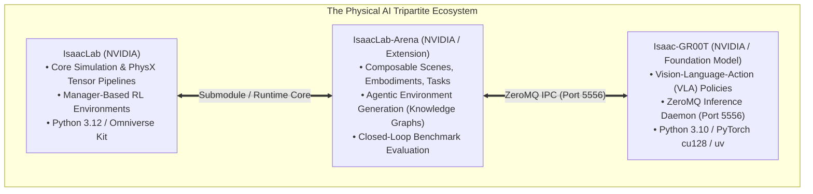
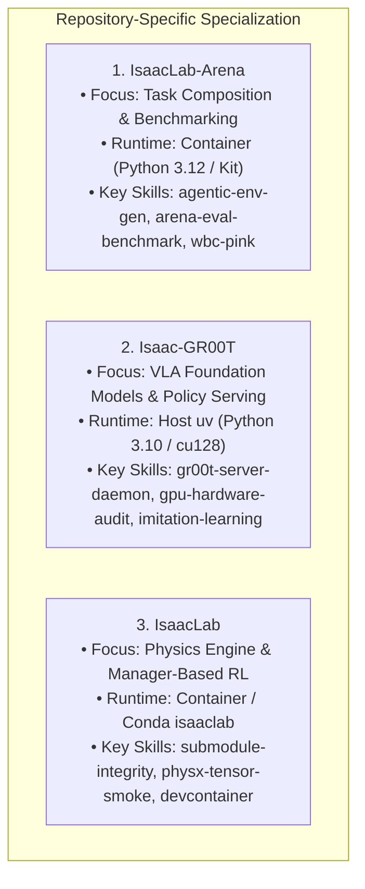
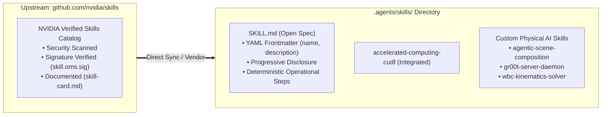

# Physical AI & Robotics Agent Framework: Universal Template Specification

A standardized, multi-repository architectural specification for configuring autonomous agent systems (`.agents/`), session memory, Model Context Protocol (MCP) servers, and optimized Devcontainers across the NVIDIA Physical AI ecosystem: **`IsaacLab-Arena`**, **`Isaac-GR00T`**, and **`IsaacLab`**.

---

## 1. Executive Overview: The Tripartite Physical AI Ecosystem

Physical AI is an inherently complex, distributed system operating across heterogeneous Python runtimes, C++ dynamic solvers, GPU architectures, and inter-process communication (IPC) protocols. 

Generic AI coding assistants fail when treating robotics repositories like standard web or data science codebases. This specification provides an authoritative, reusable blueprint across three interconnected repositories:



---

## 2. Universal `.agents/` Directory Topology

Every repository in the Physical AI stack must maintain a standardized `.agents/` intelligence directory:

```text
<repository_root>/
├── AGENTS.md                                # Master agent instructions & operational rules
├── .agents/
│   ├── skills/                              # Specialized actionable agent skills (SKILL.md)
│   │   ├── session-memory/                  # 25-char UUID session logging & indexation
│   │   ├── submodule-integrity/             # Clean detached HEAD sync & HTTPS endpoint verification
│   │   ├── gpu-hardware-audit/              # Blackwell sm_120, PyTorch cu128, and C-extension ABI audits
│   │   ├── zeromq-policy-bridge/            # Port 5556 lifecycle, modality schema handshake
│   │   ├── agentic-scene-composition/       # Grounded Markdown task_spec.md to env_graph_spec.yaml
│   │   ├── wbc-kinematics-solver/           # Pinocchio/Pink QP solver vs GPU direct joint control
│   │   └── imitation-learning-pipeline/     # Demo replay, MimicGen, LeRobot conversion, distributed fine-tuning
│   ├── memory/                              # Permanent architectural checkpoint history
│   │   ├── INDEX.md                         # Master chronological index of session logs
│   │   └── sessions/                        # YYYYMMDD_HHMMSS_<short_uuid>.md log files
│   └── references/                          # Ground-truth manifests, USD hierarchies, task templates
│       ├── docs/                            # Deep architectural runbooks & debugging notes
│       ├── manifests/                       # Frozen pip freeze, environment variables, WBC solver paths
│       └── templates/                       # Reusable task_spec.md and env_graph_spec.yaml templates
└── .devcontainer/                           # High-performance Docker container configuration
    ├── devcontainer.json
    └── Dockerfile
```

---

## 3. Core Universal Skills Specification

### Skill 1: `session-memory`
* **Purpose**: Preserves architectural continuity, telemetry logs, and hardware configurations across sessions.
* **Protocol**:
  - File naming: `YYYYMMDD_HHMMSS_<short_uuid>.md` (e.g., `20260825_201419_a1b2c3d4.md`) in `.agents/memory/sessions/`.
  - Master Index: Append every checkpoint row to `.agents/memory/INDEX.md`.

### Skill 2: `submodule-integrity`
* **Purpose**: Resolves submodule cache pollution and detached HEAD desynchronization.
* **Procedures**:
  - Clear corrupted cache: `rm -rf .git/modules/submodules`.
  - Force HTTPS endpoints in `.gitmodules` (avoids SSH credential prompt hangs in automated agents).
  - Verify clean detached HEAD status with `git submodule status`.

### Skill 3: `gpu-hardware-audit`
* **Purpose**: Detects GPU microarchitecture capabilities and ensures exact PyTorch CUDA toolchain alignment.
* **Procedures**:
  - Detects hardware compute capability (e.g., NVIDIA Blackwell `sm_120` on RTX PRO 6000 / RTX 50-series).
  - Verifies PyTorch fatbin binaries contain native `sm_120` or `sm_100` SASS machine code via `torch.cuda.get_arch_list()`.
  - Audits C++ ABI compatibility across sensitive extensions (`flash_attn`, `triton`, `deepspeed`, `transformers`).

### Skill 4: `zeromq-policy-bridge`
* **Purpose**: Manages low-latency inter-process communication between Simulation Clients and Foundation Model Servers.
* **Procedures**:
  - Strictly binds to port **`5556`** (preventing collisions with VS Code internal language servers on port 5555).
  - Performs JSON schema handshake (`modality.json`) to align camera observation keys (`ego_view` for G1 vs. `exterior_image_1_left` / `wrist_image_left` for DROID).

### Skill 5: `agentic-scene-composition`
* **Purpose**: Compiles natural language prompts and Grounded Markdown specifications (`task_spec.md`) into declarative scene graphs (`env_graph_spec.yaml`).
* **Procedures**:
  - Enforces `default_ground_plane` at $z=0.0$ ($\mu=1.0$) as a mandatory invariant.
  - Verifies bounding box placements against robot kinematic reachability envelopes ($\mathcal{W}_{\text{reach}}$).
  - Executes 5-tier validation protocol (Tier 1 Schema $\to$ Tier 4 Zero-Action Gravity Settle $\to$ Tier 5 Closed-Loop GR00T Rollout).

### Skill 6: `wbc-kinematics-solver`
* **Purpose**: Diagnoses whole-body control stability, inverse kinematics, and concurrency bounds.
* **Procedures**:
  - Enforces `--num_envs 1` for single-threaded CPU Pinocchio/Pink QP solvers (`g1_wbc_pink`).
  - Routes parallelized multi-environment evaluation ($N > 1$) to GPU-vectorized joint controllers (`g1_wbc_joint`).

### Skill 7: `imitation-learning-pipeline`
* **Purpose**: Automates data collection, augmentation, format conversion, and multi-GPU training.
* **Procedures**:
  - Replays seed HDF5 trajectories.
  - Orchestrates parallelized MimicGen data augmentation.
  - Converts datasets to LeRobot format (`convert_hdf5_to_lerobot.py`).
  - Launches multi-GPU distributed fine-tuning via `torch.distributed.run`.

---

## 4. Repository-Specific Adaptation Matrix



### 1. `IsaacLab-Arena` Adaptation Guide
* **Runtime**: Docker Devcontainer (`isaaclab_arena:latest` / Python 3.12 / CUDA 12.8).
* **Primary Responsibilities**:
  - Composing Scenes, Embodiments, and Tasks via `ArenaEnvBuilder`.
  - Executing closed-loop evaluation rollouts with `policy_runner.py`.
  - Compiling grounded Markdown task specifications (`task_spec.md`) into `env_graph_spec.yaml`.
* **Critical Rule**: Always pair evaluation runs with the matching policy server modality (G1 `ego_view` vs. DROID stereo views).

### 2. `Isaac-GR00T` Adaptation Guide
* **Runtime**: Host Virtual Environment (`uv` / Python 3.10 / CUDA 12.8).
* **Primary Responsibilities**:
  - Hosting the ZeroMQ policy inference daemon (`run_gr00t_server.py`) on port `5556`.
  - Multi-GPU distributed policy fine-tuning (`launch_finetune.py` on 8x GPUs).
  - Enforcing explicit PyTorch `cu128` index routing in `pyproject.toml`:
    ```toml
    [[tool.uv.index]]
    name = "pytorch-cu128"
    url = "https://download.pytorch.org/whl/cu128"
    explicit = true

    [tool.uv.sources]
    torch = [{ index = "pytorch-cu128" }]
    torchvision = [{ index = "pytorch-cu128" }]
    ```
* **Critical Rule**: For non-Hopper / Blackwell architectures, pass `GR00T_DIT_SDPA_MODE=math` and `TORCH_SDPA_USE_FLASH=0` until CUTLASS CuTe DSL (PR #609) is fully merged.

### 3. `IsaacLab` Adaptation Guide
* **Runtime**: Official NVIDIA Isaac Sim Container (`nvcr.io/nvidia/isaac-sim:4.5.0` or native Conda).
* **Primary Responsibilities**:
  - Core PhysX 5 physics simulation and GPU tensor pipelines.
  - Base robot asset definitions (URDF/USD converters) and manager-based MDP environments.
  - Rendering sensors (RGB, Depth, Point Clouds) and camera extrinsics calibration.
* **Critical Rule**: Ensure all submodules track stable, immutable upstream tags (e.g. `v2.0.0` or `release/0.3.0`).

---

## 5. Universal Devcontainer & Docker Architecture

To eliminate graphic display failures, permission mismatches, and data loss across all Physical AI repositories (`IsaacLab-Arena`, `Isaac-GR00T`, `IsaacLab`), deploy this production-grade Devcontainer and Dockerfile stack.

---

### 5.1 Production `.devcontainer/devcontainer.json`

```json
{
  "name": "Physical AI Robotics Development Container",
  "build": {
    "dockerfile": "Dockerfile",
    "context": ".."
  },
  "runArgs": [
    "--gpus=all",
    "--network=host",
    "--ipc=host",
    "--privileged",
    "--ulimit", "memlock=-1",
    "--ulimit", "stack=67108864",
    "-e", "DISPLAY=${localEnv:DISPLAY}",
    "-e", "NVIDIA_VISIBLE_DEVICES=all",
    "-e", "NVIDIA_DRIVER_CAPABILITIES=all",
    "-e", "MPLCONFIGDIR=/tmp/matplotlib",
    "-e", "VK_ICD_FILENAMES=/usr/share/vulkan/icd.d/nvidia_icd.json",
    "-v", "/tmp/.X11-unix:/tmp/.X11-unix:rw",
    "-v", "${localEnv:HOME}/datasets:/datasets:rw",
    "-v", "${localEnv:HOME}/models:/models:rw",
    "-v", "${localEnv:HOME}/eval:/eval:rw"
  ],
  "containerEnv": {
    "DATASET_DIR": "/datasets/isaaclab_arena/locomanipulation_tutorial",
    "MODELS_DIR": "/models/isaaclab_arena/locomanipulation_tutorial",
    "EVAL_DIR": "/eval/isaaclab_arena/locomanipulation_tutorial",
    "MPLCONFIGDIR": "/tmp/matplotlib",
    "PYTHONPATH": "/workspaces/isaaclab_arena:/workspaces/isaaclab_arena/source:/workspaces/isaaclab_arena/submodules/IsaacLab/source/isaaclab:${containerEnv:PYTHONPATH}"
  },
  "customizations": {
    "vscode": {
      "extensions": [
        "ms-python.python",
        "ms-python.vscode-pylance",
        "ms-toolsai.jupyter",
        "ms-vscode.cpptools",
        "tamasfe.even-better-toml",
        "redhat.vscode-yaml",
        "eamodio.gitlens",
        "yzhang.markdown-all-in-one"
      ],
      "settings": {
        "python.defaultInterpreterPath": "/isaac-sim/python.sh",
        "python.analysis.extraPaths": [
          "/workspaces/isaaclab_arena",
          "/workspaces/isaaclab_arena/source",
          "/workspaces/isaaclab_arena/submodules/IsaacLab/source/isaaclab"
        ],
        "python.analysis.indexing": true,
        "python.analysis.typeCheckingMode": "basic",
        "terminal.integrated.defaultProfile.linux": "bash"
      }
    }
  },
  "initializeCommand": "mkdir -p ${localEnv:HOME}/datasets ${localEnv:HOME}/models ${localEnv:HOME}/eval",
  "postCreateCommand": "mkdir -p /tmp/matplotlib && chmod -R 777 /tmp/matplotlib",
  "postStartCommand": "echo 'Physical AI Container Ready. GPU Check:' && nvidia-smi --query-gpu=name,driver_version,memory.total --format=csv,noheader"
}
```

---

### 5.2 Production `.devcontainer/Dockerfile`

```dockerfile
# syntax=docker/dockerfile:1.4
ARG BASE_IMAGE=nvcr.io/nvidia/isaac-sim:4.5.0
FROM ${BASE_IMAGE}

LABEL maintainer="boredengineering"
LABEL description="Optimized Physical AI & IsaacLab-Arena Development Container with WBC, Pinocchio, and ZeroMQ"

# Environment Variables
ENV DEBIAN_FRONTEND=noninteractive \
    LANG=C.UTF-8 \
    LC_ALL=C.UTF-8 \
    NVIDIA_VISIBLE_DEVICES=all \
    NVIDIA_DRIVER_CAPABILITIES=all \
    MPLCONFIGDIR=/tmp/matplotlib \
    PYTHONUNBUFFERED=1

# Layer 1: Install Core System Dependencies & Vulkan / X11 / OpenGL Runtime
RUN apt-get update && apt-get install -y --no-install-recommends \
    build-essential \
    cmake \
    git \
    git-lfs \
    curl \
    wget \
    rsync \
    tmux \
    htop \
    nano \
    sudo \
    ffmpeg \
    libsm6 \
    libxext6 \
    libxrender-dev \
    libgl1-mesa-glx \
    libgl1-mesa-dri \
    libglu1-mesa-dev \
    libvulkan1 \
    libvulkan-dev \
    vulkan-tools \
    mesa-vulkan-drivers \
    x11-xserver-utils \
    libxrandr2 \
    libxcursor1 \
    libxinerama1 \
    libxi6 \
    && rm -rf /var/lib/apt/lists/*

# Layer 2: Install Whole-Body Control (WBC) Kinematics & Robotics Python Stack
# Using Isaac Sim internal Python binary (/isaac-sim/python.sh or standard pip)
RUN /isaac-sim/python.sh -m pip install --no-cache-dir --upgrade pip setuptools wheel && \
    /isaac-sim/python.sh -m pip install --no-cache-dir \
        cmeel \
        pin-pink==3.1.0 \
        qpsolvers[daqp,proxsuite] \
        pyzmq \
        msgpack \
        protobuf \
        h5py \
        opencv-python-headless \
        matplotlib \
        pandas \
        scipy \
        tensorboard \
        tabulate \
        gymnasium \
        lerobot

# Layer 3: Create Common Mount Points & Matplotlib Cache
RUN mkdir -p /datasets /models /eval /tmp/matplotlib /workspaces && \
    chmod -R 777 /datasets /models /eval /tmp/matplotlib /workspaces

# Layer 4: Configure Vulkan ICD Environment
RUN mkdir -p /etc/vulkan/icd.d && \
    echo '{"file_format_version": "1.0.0", "ICD": {"library_path": "libGLX_nvidia.so.0", "api_version": "1.3"}}' > /etc/vulkan/icd.d/nvidia_icd.json

WORKDIR /workspaces

CMD ["bash"]
```

---

### 5.3 Docker Compose Multi-Service & Mock Testing Profiles

`docker-compose.yml` and `docker-compose.test.yml` are **not** automatically generated by Terraform. They are deliberate architectural tools for two distinct robotics workflows:

#### 1. Multi-Service Physical AI Runtime (`docker-compose.yml`)
Physical AI operates across decoupled microservices. Docker Compose unifies the simulation client, the foundation model inference daemon, and the remote streaming desktop into a single command:

```yaml
version: "3.8"

services:
  # Service 1: Isaac Lab Simulation Engine (Client)
  isaaclab-arena:
    build:
      context: .
      dockerfile: .devcontainer/Dockerfile
    runtime: nvidia
    network_mode: host
    ipc: host
    privileged: true
    environment:
      - DISPLAY=${DISPLAY}
      - NVIDIA_VISIBLE_DEVICES=all
      - MPLCONFIGDIR=/tmp/matplotlib
    volumes:
      - /tmp/.X11-unix:/tmp/.X11-unix:rw
      - ~/datasets:/datasets:rw
      - ~/models:/models:rw
      - ~/eval:/eval:rw
    command: python isaaclab_arena/evaluation/policy_runner.py --viz kit --remote_port 5556

  # Service 2: Isaac-GR00T Foundation Policy Server (Daemon)
  gr00t-daemon:
    build:
      context: ../Isaac-GR00T
      dockerfile: docker/Dockerfile
    runtime: nvidia
    network_mode: host
    ipc: host
    environment:
      - CUDA_VISIBLE_DEVICES=0
    volumes:
      - ~/models:/models:ro
    command: uv run python gr00t/eval/run_gr00t_server.py --model-path /models/checkpoint-20000 --port 5556
```

#### 2. Zero-Cost Offline Mock Cloud Testing (`docker-compose.test.yml`)
For CI/CD pipelines (e.g. GitHub Actions) or offline development where agents test dataset uploads, bucket synchronization, or Terraform provisioning without incurring cloud bills:

```yaml
version: "3.8"

services:
  # Main App / Agent Container
  app:
    build:
      context: ..
      dockerfile: .devcontainer/Dockerfile
    volumes:
      - ..:/app:cached
      - ${HOME}/.aws:/root/.aws:cached
    environment:
      # Intercepts S3/GCS API calls and routes to local mock daemon
      - AWS_ENDPOINT_URL=http://localstack:4566
    depends_on:
      - localstack

  # Offline Mock AWS / S3 Sidecar Daemon
  localstack:
    image: localstack/localstack:latest
    ports:
      - "4566:4566"
    environment:
      - SERVICES=ec2,s3,iam,sts
```

---

## 6. Master `AGENTS.md` Template for Robotics

Place this template at the root of every robotics repository:

```markdown
# Physical AI Agent Operating Instructions <!-- omit in toc -->

- [1. Decoupled Dual-Runtime Architecture Rule](#1-decoupled-dual-runtime-architecture-rule)
- [2. Port & IPC Safety Protocol](#2-port--ipc-safety-protocol)
- [3. Whole-Body Control (WBC) Concurrency Invariants](#3-whole-body-control-wbc-concurrency-invariants)
- [4. GPU Microarchitecture & Blackwell Execution](#4-gpu-microarchitecture--blackwell-execution)
- [5. Grounded Markdown Scene Specification Protocol](#5-grounded-markdown-scene-specification-protocol)
- [6. Session Memory Protocol](#6-session-memory-protocol)

---

### 1. Decoupled Dual-Runtime Architecture Rule
- **Simulation Engine**: Executes inside the Docker container (Python 3.12 / CUDA 12.8 / Omniverse Kit).
- **Foundation Policy Daemon**: Executes on the host in Python 3.10 via `uv` over ZeroMQ IPC.
- **NEVER** attempt to combine Isaac Sim and GR00T foundation training into a single monolithic Python environment.

### 2. Port & IPC Safety Protocol
- All GR00T ZeroMQ communication must strictly use port **`5556`** (preventing VS Code internal process collisions on port 5555).
- Always verify modality contracts: G1 humanoid models require `ego_view` and `NEW_EMBODIMENT`; DROID models require `OXE_DROID` and stereo camera views.

### 3. Whole-Body Control (WBC) Concurrency Invariants
- `g1_wbc_pink` uses a single-threaded CPU Pinocchio QP solver. **Strictly enforce `--num_envs 1`**.
- For parallel multi-environment rollouts ($N > 1$), strictly use `g1_wbc_joint`.

### 4. GPU Microarchitecture & Blackwell Execution
- Host Python 3.10 environments must pull PyTorch `cu128` wheels via `[tool.uv.index]` in `pyproject.toml` to ensure native `sm_120` execution on NVIDIA RTX PRO 6000 / RTX 50-series GPUs.

### 5. Grounded Markdown Scene Specification Protocol
- Never rely on raw zero-shot natural language prompts for metric scene composition.
- Always supply structured Markdown task specifications (`task_spec.md`) specifying `default_ground_plane`, metric heights ($z$), and kinematic reachability boundaries ($\mathcal{W}_{\text{reach}}$).

### 6. Session Memory Protocol
- Log all milestones, model iterations, and architectural discoveries in `.agents/memory/sessions/` using 25-character timestamped UUID files (`YYYYMMDD_HHMMSS_<short_uuid>.md`) and update `.agents/memory/INDEX.md`.
```

---

## 7. Active Model Context Protocol (MCP) Server Suite

The following MCP servers are actively registered in the `IsaacAutomator` physical AI framework and provide tools for autonomous agent operation:

| MCP Server | Server Type | Core Capabilities & Robotics Applications |
| :--- | :--- | :--- |
| **`ansible`** | Lazy | **Bare-Metal & Cluster Automation**: Idempotent workstation provisioning, execution environment compilation (`ade_setup_environment`), role execution, and system linting. |
| **`gcp-cloud`** | Lazy | **Cloud Compute & Multi-GPU Orchestration**: Provisioning cloud GPU training nodes (L4, A100, H100), VPC networking, GCS dataset bucket synchronization via `run_gcloud_command`. |
| **`playwright`** | Lazy | **Visual & Web Automation**: Browser navigation, headless DOM rendering, extracting online Hugging Face model cards, reading live NVIDIA docs, and inspecting WebRTC/noVNC stream endpoints. |
| **`terraform`** | Lazy | **Multi-Cloud Infrastructure as Code (IaC)**: Automated deployment and lifecycle management of GPU Isaac Workstations across AWS, GCP, Azure, and Alibaba Cloud. |

---

## 8. Active Skills Inventory in `IsaacAutomator`

The following specialized skills are maintained within `.agents/skills/` and provide end-to-end capabilities across the physical AI lifecycle:

```mermaid
flowchart LR
    subgraph Provisioning ["1. Infrastructure & Setup"]
        S_BM["isaac-baremetal-installer\n(Probing, Drivers, Conda, Linking)"]
        S_DEP["deploy-workstation\n(Cloud GPU VM Provisioning)"]
    end

    subgraph Operations ["2. Workstation Operations"]
        S_CONN["connect-workstation\n(noVNC, KasmVNC, NoMachine, DCV, SSH)"]
        S_DEMO["run-demos\n(Pre-configured desktop shortcuts)"]
        S_LIFE["manage-lifecycle\n(start, stop, repair, destroy)"]
        S_DATA["transfer-data\n(HDF5/LeRobot & model sync)"]
        S_TRBL["troubleshoot\n(Vulkan, display, CUDA diagnostics)"]
    end

    subgraph Intelligence ["3. Agent Intelligence & Acceleration"]
        S_MEM["session-memory\n(25-char UUID checkpointing)"]
        S_CUDF["accelerated-computing-cudf\n(GPU DataFrame acceleration)"]
        S_AGY["antigravity-guide & customizations\n(Agent architecture & MCP orchestration)"]
    end

    Provisioning --> Operations --> Intelligence
```



### Complete Skills Reference Matrix:

| Skill Identifier | Location | Operational Domain & Capabilities |
| :--- | :--- | :--- |
| **`isaac-baremetal-installer`** | [`.agents/skills/isaac-baremetal-installer/SKILL.md`](file:///workspaces/IsaacAutomator/.agents/skills/isaac-baremetal-installer/SKILL.md) | **Bare-Metal Workstation Orchestrator**: Discovers GPU hardware (Blackwell, Ada, Hopper), installs NVIDIA drivers, provisions Conda environments, audits dynamic C++ solvers, and links Isaac Sim, Isaac Lab, Arena, and GR00T. |
| **`deploy-workstation`** | [`.agents/skills/isaac-automator/deploy-workstation/SKILL.md`](file:///workspaces/IsaacAutomator/.agents/skills/isaac-automator/deploy-workstation/SKILL.md) | **Cloud Workstation Deployer**: Deploys fresh cloud GPU instances non-interactively across AWS, GCP, Azure, and Alibaba Cloud with pre-baked Isaac Sim. |
| **`connect-workstation`** | [`.agents/skills/isaac-automator/connect-workstation/SKILL.md`](file:///workspaces/IsaacAutomator/.agents/skills/isaac-automator/connect-workstation/SKILL.md) | **Display & Streaming Connector**: Establishes remote GUI desktop streaming over noVNC, KasmVNC, NoMachine (live 3D Vulkan viewport), NICE DCV, xrdp, or SSH. |
| **`manage-lifecycle`** | [`.agents/skills/isaac-automator/manage-lifecycle/SKILL.md`](file:///workspaces/IsaacAutomator/.agents/skills/isaac-automator/manage-lifecycle/SKILL.md) | **Cost & Instance Lifecycle Manager**: Controls status, stop, start, repair, and destroy lifecycle commands to eliminate compute costs. |
| **`run-demos`** | [`.agents/skills/isaac-automator/run-demos/SKILL.md`](file:///workspaces/IsaacAutomator/.agents/skills/isaac-automator/run-demos/SKILL.md) | **Demo Launcher**: Launches out-of-the-box Isaac Sim, Isaac Lab, and Arena benchmarks directly from terminal or desktop shortcuts. |
| **`transfer-data`** | [`.agents/skills/isaac-automator/transfer-data/SKILL.md`](file:///workspaces/IsaacAutomator/.agents/skills/isaac-automator/transfer-data/SKILL.md) | **Bidirectional Asset Sync**: Synchronizes datasets, fine-tuned model checkpoints (`checkpoint-20000`), and evaluation logs between local machines and cloud nodes. |
| **`troubleshoot`** | [`.agents/skills/isaac-automator/troubleshoot/SKILL.md`](file:///workspaces/IsaacAutomator/.agents/skills/isaac-automator/troubleshoot/SKILL.md) | **System Diagnostic Engine**: Diagnoses common physical AI failure modes: X11/display server crashes, Vulkan physical device missing, ZeroMQ port blocks, and missing kernel image errors. |
| **`accelerated-computing-cudf`**| [`.agents/skills/accelerated-computing-cudf/SKILL.md`](file:///workspaces/IsaacAutomator/.agents/skills/accelerated-computing-cudf/SKILL.md) | **Data Acceleration**: Official NVIDIA-authored guidance for GPU DataFrame ETL, dataset pre-processing, and multi-GPU trajectory parsing via cuDF. |
| **`session-memory`** | [`.agents/skills/isaac-automator/session-memory/SKILL.md`](file:///workspaces/IsaacAutomator/.agents/skills/isaac-automator/session-memory/SKILL.md) | **Checkpoint Logger**: Manages, searches, and logs immutable 25-character timestamped UUID session checkpoints in `.agents/memory/`. |
| **`antigravity-guide`** | `builtin/skills/antigravity_guide/SKILL.md` | **Agent Orchestrator Guide**: Full reference for Antigravity subagents, slash commands, background tasks, and MCP sidecars. |
| **`agy-customizations`** | `builtin/skills/agy-customizations/SKILL.md` | **Customization Engine**: Guide for defining new skills, rules, hooks, subagents, and MCP servers. |

---

## 9. NVIDIA Skills Catalog (`nvidia/skills`) Integration & Compliance

The `.agents/skills/` directory structure in this framework is **100% compliant with the official open Agent Skills specification** maintained by NVIDIA at **[`github.com/nvidia/skills`](https://github.com/nvidia/skills)**.



### 1. Key Principles of the NVIDIA Skills Standard

1. **Portable `SKILL.md` File**: Located at the root of each skill folder, beginning with standard YAML frontmatter:
   ```yaml
   ---
   name: accelerated-computing-cudf
   description: Official NVIDIA-authored guidance for NVIDIA cuDF GPU DataFrames, pandas acceleration, dask-cuDF, ETL, joins, groupby, CSV/Parquet I/O, nullable semantics, and multi-GPU DataFrame workloads.
   ---
   ```
2. **Progressive Disclosure**: Agents only parse the lightweight `name` and `description` frontmatter at startup. The full body of `SKILL.md` is loaded on-demand only when a task matches the skill's domain, preserving context window budget.
3. **Enterprise Authenticity**: Upstream NVIDIA skills feature detached signatures (`skill.oms.sig`) and skill cards (`skill-card.md`) declaring security verification, maintainers, and runtime dependencies.

---

### 2. Recommended Upstream Skills for Physical AI Repositories

The following official skills from `github.com/nvidia/skills` are recommended for integration across **`IsaacLab-Arena`**, **`Isaac-GR00T`**, and **`IsaacLab`**:

| NVIDIA Upstream Skill | Upstream Path | Primary Physical AI Application |
| :--- | :--- | :--- |
| **`accelerated-computing-cudf`** *(Active)* | `skills/accelerated-computing-cudf` | GPU-accelerated HDF5 trajectory data loading, pre-processing, and LeRobot dataset conversion. |
| **`nvidia-warp-developer`** | `skills/nvidia-warp-developer` | Custom CUDA kernel authoring and differentiable physics computation via NVIDIA Warp. |
| **`omniverse-usd-authoring`** | `skills/omniverse-usd-authoring` | Programmatic USD stage composition, physics collision schemas, and asset reference rigging. |
| **`cuda-c-cpp-profiling`** | `skills/cuda-c-cpp-profiling` | Nsight Systems & Nsight Compute profiling for custom CUDA kernels and Blackwell SM utilization. |
| **`tensorrt-llm`** | `skills/tensorrt-llm` | High-throughput TensorRT engine compilation for VLA vision backbones and diffusion policy heads. |

---

### 3. How to Sync Upstream Skills into Your Repository

To vendor or update an official NVIDIA skill directly into `.agents/skills/`:

```bash
# Clone official repository to temporary workspace
git clone --depth 1 https://github.com/nvidia/skills.git /tmp/nvidia_skills

# Copy target skill into local .agents/skills/
cp -r /tmp/nvidia_skills/skills/accelerated-computing-cudf .agents/skills/

# Verify SKILL.md structure
head -n 10 .agents/skills/accelerated-computing-cudf/SKILL.md

# Clean up
rm -rf /tmp/nvidia_skills
```


