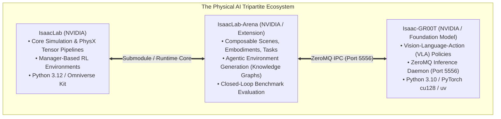
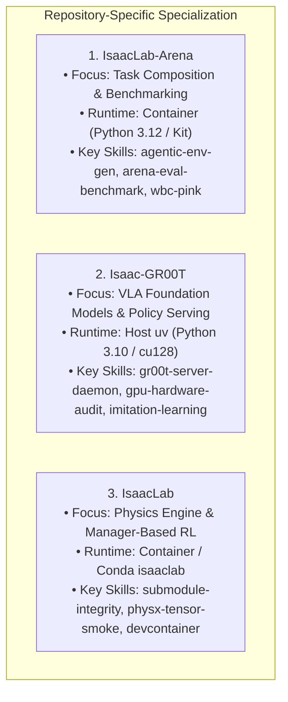
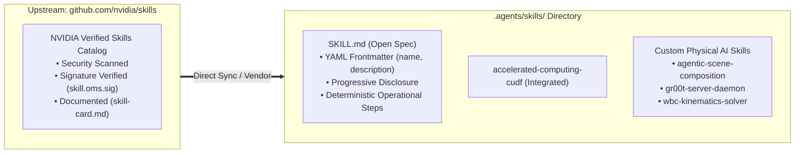

# Physical AI & Robotics Agent Framework: Universal Template Specification

A standardized, multi-repository architectural specification for configuring autonomous agent systems (`.agents/`), session memory, Model Context Protocol (MCP) servers, and optimized Devcontainers across the NVIDIA Physical AI ecosystem: **`IsaacLab-Arena`**, **`Isaac-GR00T`**, and **`IsaacLab`**.

---

## 1. Executive Overview: The Tripartite Physical AI Ecosystem

Physical AI is an inherently complex, distributed system operating across heterogeneous Python runtimes, C++ dynamic solvers, GPU architectures, and inter-process communication (IPC) protocols. 

Generic AI coding assistants fail when treating robotics repositories like standard web or data science codebases. This specification provides an authoritative, reusable blueprint across three interconnected repositories:



---

## 2. Universal `.agents/` Directory Topology

Every repository in the Physical AI stack must maintain a standardized `.agents/` intelligence directory:

```text
<repository_root>/
├── AGENTS.md                                # Master agent instructions & operational invariants
├── .agents/
│   ├── skills/                              # Specialized Skills Catalog (Open SKILL.md Standard)
│   │   ├── isaac-automator/                 # Cloud Workstation & Lifecycle Operations
│   │   │   ├── deploy-workstation/          # Non-interactive cloud provisioning (AWS, GCP, Azure, Alibaba)
│   │   │   ├── connect-workstation/         # noVNC (2D) vs NoMachine/DCV (3D Vulkan) vs SSH
│   │   │   ├── manage-lifecycle/            # ./stop, ./start, ./destroy --yes, ./cycle-vm
│   │   │   ├── run-demos/                   # Pre-configured demo shortcuts (quadruped-locomotion)
│   │   │   ├── transfer-data/               # Bidirectional sync (./upload, ./download) & autorun.sh
│   │   │   ├── troubleshoot/                # Vulkan blank viewports, TTY errors, CIDR security fixes
│   │   │   └── session-memory/              # 25-char UUID checkpointing & INDEX.md sync
│   │   ├── isaac-installer/                 # Full Physical Bare-Metal Workstation Provisioner
│   │   │   ├── SKILL.md                     # Master doctor, profile, and submodule playbook
│   │   │   ├── scripts/check_hardware.py    # Hardware & Blackwell sm_120 probe
│   │   │   ├── references/profile_spec.yaml # Declarative minimal/standard/full profile schema
│   │   │   └── examples/                    # 01_baremetal_bootstrap.md
│   │   └── accelerated-computing-cudf/      # Official NVIDIA cuDF data acceleration (from nvidia/skills)
│   ├── memory/                              # Permanent architectural checkpoint history
│   │   ├── INDEX.md                         # Master chronological index of session logs
│   │   └── sessions/                        # YYYYMMDD_HHMMSS_<short_uuid>.md log files
│   └── references/                          # Ground-truth documentation & task templates
│       ├── docs/                            # Deep architectural runbooks & debugging notes
│       │   ├── env_generation_notes.md      # Mathematical Scene Graphs & Grounded Markdown
│       │   ├── physical-ai_agents.md        # Master agent & devcontainer specification
│       │   └── debugging_arena_gr00t.md     # Blackwell sm_120, PyTorch cu128, and ZMQ contracts
│       └── templates/                       # Reusable task_spec.md and env_graph_spec.yaml templates
└── .devcontainer/                           # High-performance Docker container configuration
    ├── devcontainer.json                    # VS Code DevContainer config (features, mounts, extensions)
    ├── Dockerfile                           # Multi-layer image (Playwright, Vulkan, Cloud CLIs, uv, R-base)
    ├── docker-compose.yml                   # Multi-service runtime (Simulation + Policy Daemon + Desktop)
    └── docker-compose.test.yml              # Offline CI mock cloud testing (LocalStack AWS mock)
```

---

## 3. The Lean Agent Philosophy: Single Essential Skill (`session-memory`)

### Why Over-Engineering Custom Skills is an Anti-Pattern
Attempting to create rigid, automated custom skills for every robotics task (e.g. C++ QP solvers, kernel workarounds, submodule syncs, or distributed training loops) is brittle and counterproductive:
1. **Upstream Drift**: Fixed agent skills quickly drift out of sync with upstream NVIDIA code updates.
2. **Context Window Waste & False Constraints**: Overly opinionated skills restrict the agent's reasoning and can induce hallucinations or rigid failure loops.
3. **The Proper Separation of Concerns**:
   - **`AGENTS.md`**: Enforces strict, non-negotiable **Operational Invariants** (e.g., Port `5556`, `--num_envs 1` for PINK WBC, dual-runtime boundary).
   - **`.agents/references/docs/`**: Stores comprehensive **Domain Knowledge & Runbooks** (e.g., Blackwell SASS fixes, Scene Graph mathematical formalism, grounded Markdown templates).
   - **`.agents/memory/`**: Maintains persistent **Architectural Continuity** across chat sessions.

### The Single Foundational Skill: `session-memory`
* **Purpose**: Preserves hard-earned engineering solutions, hardware telemetry, and architectural decisions across transient chat resets without polluting context.
* **Protocol**:
  - File naming: `YYYYMMDD_HHMMSS_<short_uuid>.md` (e.g., `20260825_201419_a1b2c3d4.md`) in `.agents/memory/sessions/`.
  - Master Index: Append every checkpoint row to `.agents/memory/INDEX.md`.
* **Optional Upstream Skills**: Official vendor skills from [`github.com/nvidia/skills`](https://github.com/nvidia/skills) (such as `accelerated-computing-cudf`) can be pulled on-demand for specific acceleration tasks.

---

## 4. Repository-Specific Adaptation Matrix



### 1. `IsaacLab-Arena` Adaptation Guide
* **Runtime**: Docker Devcontainer (`isaaclab_arena:latest` / Python 3.12 / CUDA 12.8).
* **Primary Responsibilities**:
  - Composing Scenes, Embodiments, and Tasks via `ArenaEnvBuilder`.
  - Executing closed-loop evaluation rollouts with `policy_runner.py`.
  - Compiling grounded Markdown task specifications (`task_spec.md`) into `env_graph_spec.yaml`.
* **Critical Rule**: Always pair evaluation runs with the matching policy server modality (G1 `ego_view` vs. DROID stereo views).

### 2. `Isaac-GR00T` Adaptation Guide
* **Runtime**: Host Virtual Environment (`uv` / Python 3.10 / CUDA 12.8).
* **Primary Responsibilities**:
  - Hosting the ZeroMQ policy inference daemon (`run_gr00t_server.py`) on port `5556`.
  - Multi-GPU distributed policy fine-tuning (`launch_finetune.py` on 8x GPUs).
  - Enforcing explicit PyTorch `cu128` index routing in `pyproject.toml`:
    ```toml
    [[tool.uv.index]]
    name = "pytorch-cu128"
    url = "https://download.pytorch.org/whl/cu128"
    explicit = true

    [tool.uv.sources]
    torch = [{ index = "pytorch-cu128" }]
    torchvision = [{ index = "pytorch-cu128" }]
    ```
* **Critical Rule**: For non-Hopper / Blackwell architectures, pass `GR00T_DIT_SDPA_MODE=math` and `TORCH_SDPA_USE_FLASH=0` until CUTLASS CuTe DSL (PR #609) is fully merged.

### 3. `IsaacLab` Adaptation Guide
* **Runtime**: Official NVIDIA Isaac Sim Container (`nvcr.io/nvidia/isaac-sim:4.5.0` or native Conda).
* **Primary Responsibilities**:
  - Core PhysX 5 physics simulation and GPU tensor pipelines.
  - Base robot asset definitions (URDF/USD converters) and manager-based MDP environments.
  - Rendering sensors (RGB, Depth, Point Clouds) and camera extrinsics calibration.
* **Critical Rule**: Ensure all submodules track stable, immutable upstream tags (e.g. `v2.0.0` or `release/0.3.0`).

---

## 5. Universal Devcontainer & Docker Architecture

To eliminate graphic display failures, permission mismatches, and data loss across all Physical AI repositories (`IsaacLab-Arena`, `Isaac-GR00T`, `IsaacLab`), deploy this production-grade Devcontainer and Dockerfile stack.

---

### 5.1 Production `.devcontainer/devcontainer.json`

```json
{
  "name": "Physical AI Full-Stack Robotics & Cloud Development Container",
  "build": {
    "dockerfile": "Dockerfile",
    "context": ".."
  },
  "runArgs": [
    "--gpus=all",
    "--network=host",
    "--ipc=host",
    "--privileged",
    "--ulimit", "memlock=-1",
    "--ulimit", "stack=67108864",
    "-e", "DISPLAY=${localEnv:DISPLAY}",
    "-e", "NVIDIA_VISIBLE_DEVICES=all",
    "-e", "NVIDIA_DRIVER_CAPABILITIES=all",
    "-e", "MPLCONFIGDIR=/tmp/matplotlib",
    "-e", "TF_DATA_DIR=/opt/tf-data",
    "-e", "ANSIBLE_FORCE_COLOR=true",
    "-e", "VK_ICD_FILENAMES=/usr/share/vulkan/icd.d/nvidia_icd.json",
    "-v", "/tmp/.X11-unix:/tmp/.X11-unix:rw",
    "-v", "${localEnv:HOME}/datasets:/datasets:rw",
    "-v", "${localEnv:HOME}/models:/models:rw",
    "-v", "${localEnv:HOME}/eval:/eval:rw",
    "-v", "${localEnv:HOME}/.aws:/root/.aws:rw",
    "-v", "${localEnv:HOME}/.config/gcloud:/root/.config/gcloud:rw",
    "-v", "${localEnv:HOME}/.azure:/root/.azure:rw"
  ],
  "containerEnv": {
    "DATASET_DIR": "/datasets/isaaclab_arena/locomanipulation_tutorial",
    "MODELS_DIR": "/models/isaaclab_arena/locomanipulation_tutorial",
    "EVAL_DIR": "/eval/isaaclab_arena/locomanipulation_tutorial",
    "MPLCONFIGDIR": "/tmp/matplotlib",
    "PYTHONPATH": "/workspaces/isaaclab_arena:/workspaces/isaaclab_arena/source:/workspaces/isaaclab_arena/submodules/IsaacLab/source/isaaclab:${containerEnv:PYTHONPATH}"
  },
  "features": {
    "ghcr.io/devcontainers/features/node:1": {
      "version": "lts"
    },
    "ghcr.io/devcontainers/features/github-cli:1": {}
  },
  "customizations": {
    "vscode": {
      "extensions": [
        "ms-python.python",
        "ms-python.vscode-pylance",
        "ms-toolsai.jupyter",
        "ms-vscode.cpptools",
        "tamasfe.even-better-toml",
        "redhat.vscode-yaml",
        "eamodio.gitlens",
        "yzhang.markdown-all-in-one",
        "GitHub.copilot",
        "GitHub.copilot-chat",
        "hashicorp.terraform",
        "redhat.ansible",
        "REditorSupport.r"
      ],
      "settings": {
        "python.defaultInterpreterPath": "/isaac-sim/python.sh",
        "python.analysis.extraPaths": [
          "/workspaces/isaaclab_arena",
          "/workspaces/isaaclab_arena/source",
          "/workspaces/isaaclab_arena/submodules/IsaacLab/source/isaaclab"
        ],
        "python.analysis.indexing": true,
        "python.analysis.typeCheckingMode": "basic",
        "terminal.integrated.defaultProfile.linux": "bash"
      }
    }
  },
  "initializeCommand": "mkdir -p ${localEnv:HOME}/datasets ${localEnv:HOME}/models ${localEnv:HOME}/eval ${localEnv:HOME}/.aws ${localEnv:HOME}/.config/gcloud ${localEnv:HOME}/.azure",
  "postCreateCommand": "mkdir -p /tmp/matplotlib /opt/tf-data && chmod -R 777 /tmp/matplotlib /opt/tf-data",
  "postStartCommand": "echo 'Physical AI & Cloud Stack Ready. GPU Check:' && nvidia-smi --query-gpu=name,driver_version,memory.total --format=csv,noheader"
}
```

---

### 5.2 Production `.devcontainer/Dockerfile` (All-in-One Full Stack)

```dockerfile
# syntax=docker/dockerfile:1.4
ARG BASE_IMAGE=mcr.microsoft.com/playwright:v1.58.2-jammy
FROM ${BASE_IMAGE}

LABEL maintainer="boredengineering"
LABEL description="Full-Stack Physical AI, Cloud IaC, Playwright, uv, R-base & Robotics Development Container"

# Copy fast Rust-based Python package manager (uv)
COPY --from=ghcr.io/astral-sh/uv:latest /uv /uvx /bin/

# Environment Variables
ENV DEBIAN_FRONTEND=noninteractive \
    LANG=C.UTF-8 \
    LC_ALL=C.UTF-8 \
    NVIDIA_VISIBLE_DEVICES=all \
    NVIDIA_DRIVER_CAPABILITIES=all \
    MPLCONFIGDIR=/tmp/matplotlib \
    TF_DATA_DIR=/opt/tf-data \
    ANSIBLE_FORCE_COLOR=true \
    PYTHONUNBUFFERED=1

# Layer 1: Core System Dependencies, Vulkan, X11, OpenGL, and R CRAN (r-base)
RUN apt-get update && apt-get install -y --no-install-recommends \
    software-properties-common \
    apt-transport-https \
    ca-certificates \
    gnupg \
    gpg \
    lsb-release \
    build-essential \
    cmake \
    git \
    git-lfs \
    curl \
    wget \
    unzip \
    rsync \
    jq \
    tmux \
    htop \
    nano \
    sudo \
    ffmpeg \
    python3-pip \
    python3-dev \
    libsm6 \
    libxext6 \
    libxrender-dev \
    libgl1-mesa-glx \
    libgl1-mesa-dri \
    libglu1-mesa-dev \
    libvulkan1 \
    libvulkan-dev \
    vulkan-tools \
    mesa-vulkan-drivers \
    x11-xserver-utils \
    libxrandr2 \
    libxcursor1 \
    libxinerama1 \
    libxi6 \
    r-base \
    r-base-dev \
    && rm -rf /var/lib/apt/lists/*

# Layer 2: Cloud Providers & Infrastructure as Code (IaC) Stack
# 2.1 HashiCorp Terraform & Packer
RUN wget -O- https://apt.releases.hashicorp.com/gpg | gpg --dearmor | tee /usr/share/keyrings/hashicorp-archive-keyring.gpg > /dev/null && \
    echo "deb [arch=$(dpkg --print-architecture) signed-by=/usr/share/keyrings/hashicorp-archive-keyring.gpg] https://apt.releases.hashicorp.com $(lsb_release -cs) main" | tee /etc/apt/sources.list.d/hashicorp.list && \
    apt-get update && apt-get install -y --no-install-recommends terraform packer && \
    rm -rf /var/lib/apt/lists/*

# 2.2 Google Cloud SDK (gcloud CLI)
RUN echo "deb [signed-by=/usr/share/keyrings/cloud.google.gpg] https://packages.cloud.google.com/apt cloud-sdk main" | tee -a /etc/apt/sources.list.d/google-cloud-sdk.list && \
    curl -fsSL https://packages.cloud.google.com/apt/doc/apt-key.gpg | gpg --dearmor -o /usr/share/keyrings/cloud.google.gpg && \
    apt-get update && apt-get install -y --no-install-recommends google-cloud-cli && \
    rm -rf /var/lib/apt/lists/*

# 2.3 Azure CLI
RUN curl -sL https://aka.ms/InstallAzureCLIDeb | bash && \
    rm -rf /var/lib/apt/lists/*

# 2.4 AWS CLI v2
RUN cd /tmp && \
    case "$(dpkg --print-architecture)" in \
      amd64) curl -sS "https://awscli.amazonaws.com/awscli-exe-linux-x86_64.zip" -o "awscliv2.zip" ;; \
      arm64) curl -sS "https://awscli.amazonaws.com/awscli-exe-linux-aarch64.zip" -o "awscliv2.zip" ;; \
    esac && \
    unzip awscliv2.zip && \
    ./aws/install && \
    rm -rf /tmp/aws*

# 2.5 Alibaba Cloud CLI (aliyun)
RUN curl -fsSL https://raw.githubusercontent.com/aliyun/aliyun-cli/HEAD/install.sh | bash || true

# Layer 3: Ansible & Whole-Body Control (WBC) / Robotics Python Stack
RUN pip3 install --no-cache-dir --upgrade pip setuptools wheel && \
    pip3 install --no-cache-dir \
        ansible \
        cmeel \
        pin-pink==3.1.0 \
        qpsolvers[daqp,proxsuite] \
        pyzmq \
        msgpack \
        protobuf \
        h5py \
        opencv-python-headless \
        matplotlib \
        pandas \
        scipy \
        tensorboard \
        tabulate \
        gymnasium \
        lerobot \
        click \
        randomname \
        pwgen \
        debugpy && \
    ansible-galaxy collection install community.docker

# Layer 4: Common Mount Points, Cache & Vulkan ICD Environment
RUN mkdir -p /datasets /models /eval /tmp/matplotlib /opt/tf-data /workspaces && \
    chmod -R 777 /datasets /models /eval /tmp/matplotlib /opt/tf-data /workspaces && \
    mkdir -p /etc/vulkan/icd.d && \
    echo '{"file_format_version": "1.0.0", "ICD": {"library_path": "libGLX_nvidia.so.0", "api_version": "1.3"}}' > /etc/vulkan/icd.d/nvidia_icd.json

WORKDIR /workspaces

CMD ["bash"]
```

---

### 5.3 Docker Compose Multi-Service & Mock Testing Profiles

`docker-compose.yml` and `docker-compose.test.yml` are **not** automatically generated by Terraform. They are deliberate architectural tools for two distinct robotics workflows:

#### 1. Multi-Service Physical AI Runtime (`docker-compose.yml`)
Physical AI operates across decoupled microservices. Docker Compose unifies the simulation client, the foundation model inference daemon, and the remote streaming desktop into a single command:

```yaml
version: "3.8"

services:
  # Service 1: Isaac Lab Simulation Engine (Client)
  isaaclab-arena:
    build:
      context: .
      dockerfile: .devcontainer/Dockerfile
    runtime: nvidia
    network_mode: host
    ipc: host
    privileged: true
    environment:
      - DISPLAY=${DISPLAY}
      - NVIDIA_VISIBLE_DEVICES=all
      - MPLCONFIGDIR=/tmp/matplotlib
    volumes:
      - /tmp/.X11-unix:/tmp/.X11-unix:rw
      - ~/datasets:/datasets:rw
      - ~/models:/models:rw
      - ~/eval:/eval:rw
    command: python isaaclab_arena/evaluation/policy_runner.py --viz kit --remote_port 5556

  # Service 2: Isaac-GR00T Foundation Policy Server (Daemon)
  gr00t-daemon:
    build:
      context: ../Isaac-GR00T
      dockerfile: docker/Dockerfile
    runtime: nvidia
    network_mode: host
    ipc: host
    environment:
      - CUDA_VISIBLE_DEVICES=0
    volumes:
      - ~/models:/models:ro
    command: uv run python gr00t/eval/run_gr00t_server.py --model-path /models/checkpoint-20000 --port 5556
```

#### 2. Zero-Cost Offline Mock Cloud Testing (`docker-compose.test.yml`)
For CI/CD pipelines (e.g. GitHub Actions) or offline development where agents test dataset uploads, bucket synchronization, or Terraform provisioning without incurring cloud bills:

```yaml
version: "3.8"

services:
  # Main App / Agent Container
  app:
    build:
      context: ..
      dockerfile: .devcontainer/Dockerfile
    volumes:
      - ..:/app:cached
      - ${HOME}/.aws:/root/.aws:cached
    environment:
      # Intercepts S3/GCS API calls and routes to local mock daemon
      - AWS_ENDPOINT_URL=http://localstack:4566
    depends_on:
      - localstack

  # Offline Mock AWS / S3 Sidecar Daemon
  localstack:
    image: localstack/localstack:latest
    ports:
      - "4566:4566"
    environment:
      - SERVICES=ec2,s3,iam,sts
```

---

## 6. Master `AGENTS.md` Template for Robotics

Place this template at the root of every robotics repository:

```markdown
# Physical AI Agent Operating Instructions <!-- omit in toc -->

- [1. Decoupled Dual-Runtime Architecture Rule](#1-decoupled-dual-runtime-architecture-rule)
- [2. Port & IPC Safety Protocol](#2-port--ipc-safety-protocol)
- [3. Whole-Body Control (WBC) Concurrency Invariants](#3-whole-body-control-wbc-concurrency-invariants)
- [4. GPU Microarchitecture & Blackwell Execution](#4-gpu-microarchitecture--blackwell-execution)
- [5. Grounded Markdown Scene Specification Protocol](#5-grounded-markdown-scene-specification-protocol)
- [6. Session Memory Protocol](#6-session-memory-protocol)

---

### 1. Decoupled Dual-Runtime Architecture Rule
- **Simulation Engine**: Executes inside the Docker container (Python 3.12 / CUDA 12.8 / Omniverse Kit).
- **Foundation Policy Daemon**: Executes on the host in Python 3.10 via `uv` over ZeroMQ IPC.
- **NEVER** attempt to combine Isaac Sim and GR00T foundation training into a single monolithic Python environment.

### 2. Port & IPC Safety Protocol
- All GR00T ZeroMQ communication must strictly use port **`5556`** (preventing VS Code internal process collisions on port 5555).
- Always verify modality contracts: G1 humanoid models require `ego_view` and `NEW_EMBODIMENT`; DROID models require `OXE_DROID` and stereo camera views.

### 3. Whole-Body Control (WBC) Concurrency Invariants
- `g1_wbc_pink` uses a single-threaded CPU Pinocchio QP solver. **Strictly enforce `--num_envs 1`**.
- For parallel multi-environment rollouts ($N > 1$), strictly use `g1_wbc_joint`.

### 4. GPU Microarchitecture & Blackwell Execution
- Host Python 3.10 environments must pull PyTorch `cu128` wheels via `[tool.uv.index]` in `pyproject.toml` to ensure native `sm_120` execution on NVIDIA RTX PRO 6000 / RTX 50-series GPUs.

### 5. Grounded Markdown Scene Specification Protocol
- Never rely on raw zero-shot natural language prompts for metric scene composition.
- Always supply structured Markdown task specifications (`task_spec.md`) specifying `default_ground_plane`, metric heights ($z$), and kinematic reachability boundaries ($\mathcal{W}_{\text{reach}}$).

### 6. Session Memory Protocol
- Log all milestones, model iterations, and architectural discoveries in `.agents/memory/sessions/` using 25-character timestamped UUID files (`YYYYMMDD_HHMMSS_<short_uuid>.md`) and update `.agents/memory/INDEX.md`.
```

---

## 7. Active Model Context Protocol (MCP) Server Suite

The following MCP servers are actively registered in the `IsaacAutomator` physical AI framework and provide tools for autonomous agent operation:

| MCP Server | Server Type | Core Capabilities & Robotics Applications |
| :--- | :--- | :--- |
| **`ansible`** | Lazy | **Bare-Metal & Cluster Automation**: Idempotent workstation provisioning, execution environment compilation (`ade_setup_environment`), role execution, and system linting. |
| **`gcp-cloud`** | Lazy | **Cloud Compute & Multi-GPU Orchestration**: Provisioning cloud GPU training nodes (L4, A100, H100), VPC networking, GCS dataset bucket synchronization via `run_gcloud_command`. |
| **`playwright`** | Lazy | **Visual & Web Automation**: Browser navigation, headless DOM rendering, extracting online Hugging Face model cards, reading live NVIDIA docs, and inspecting WebRTC/noVNC stream endpoints. |
| **`terraform`** | Lazy | **Multi-Cloud Infrastructure as Code (IaC)**: Automated deployment and lifecycle management of GPU Isaac Workstations across AWS, GCP, Azure, and Alibaba Cloud. |

---

## 8. Active Skills Inventory & `isaac-automator` Suite

The following specialized skills are maintained within `.agents/skills/` and provide end-to-end capabilities across the physical AI lifecycle:

```mermaid
flowchart LR
    subgraph Suite ["The isaac-automator Skill Suite (.agents/skills/isaac-automator/)"]
        S_DEP["deploy-workstation\n• Multi-cloud GPU VM deploy\n• AWS, GCP, Azure, Alibaba"]
        S_CONN["connect-workstation\n• noVNC (2D) vs NoMachine (3D Vulkan)\n• NICE DCV, xrdp, Moonlight, SSH"]
        S_LIFE["manage-lifecycle\n• ./stop, ./start, ./destroy --yes\n• ./cycle-vm (GCP 7-day reset)"]
        S_DEMO["run-demos\n• Desktop shortcuts & headless runs\n• quadruped-locomotion (RSL-RL)"]
        S_DATA["transfer-data\n• ./upload, ./download\n• uploads/autorun.sh on boot"]
        S_TRBL["troubleshoot\n• Vulkan viewport & TTY fixes\n• Security group CIDR drift"]
        S_MEM["session-memory\n• 25-char UUID checkpointing\n• INDEX.md synchronization"]
    end

    subgraph External ["Auxiliary Skills"]
        S_BM["isaac-baremetal-installer\n(Bare-Metal Hardware & Conda Linking)"]
        S_CUDF["accelerated-computing-cudf\n(GPU DataFrame ETL from nvidia/skills)"]
    end

    Suite --- External
```



---

### 8.1 Complete Skills Reference Matrix

| Skill Identifier | Location | Operational Domain & Key Procedures |
| :--- | :--- | :--- |
| **`deploy-workstation`** | [`.agents/skills/isaac-automator/deploy-workstation/SKILL.md`](file:///workspaces/IsaacAutomator/.agents/skills/isaac-automator/deploy-workstation/SKILL.md) | **Cloud Workstation Deployer**: Non-interactive multi-cloud GPU provisioning. Key options: `--deployment-name`, `--ingress-cidrs myip`, `--from-image` (10–15m) vs `--not-from-image` (45–60m), `--existing replace`. |
| **`connect-workstation`** | [`.agents/skills/isaac-automator/connect-workstation/SKILL.md`](file:///workspaces/IsaacAutomator/.agents/skills/isaac-automator/connect-workstation/SKILL.md) | **Display & Streaming Connector**: Establishes remote connections. **3D Viewport Rule**: noVNC (`./novnc`) renders 2D desktop; NoMachine / NICE DCV / Moonlight renders live 3D Vulkan viewport; SSH (`./ssh`) for headless control. |
| **`manage-lifecycle`** | [`.agents/skills/isaac-automator/manage-lifecycle/SKILL.md`](file:///workspaces/IsaacAutomator/.agents/skills/isaac-automator/manage-lifecycle/SKILL.md) | **Cost & Instance Lifecycle Manager**: `./stop` (pauses compute billing, keeps disk/IP), `./start` (resumes same IP), `./destroy --yes` (stops 100% of billing), and `./cycle-vm` (resets GCP 7-day Flex-start limit). |
| **`run-demos`** | [`.agents/skills/isaac-automator/run-demos/SKILL.md`](file:///workspaces/IsaacAutomator/.agents/skills/isaac-automator/run-demos/SKILL.md) | **Demo Launcher**: Launches ready-to-run Isaac Sim / Isaac Lab examples (e.g. `quadruped-locomotion` with ANYmal-D and RSL-RL) interactively or headlessly via `DISPLAY=:0 demo.sh`. |
| **`transfer-data`** | [`.agents/skills/isaac-automator/transfer-data/SKILL.md`](file:///workspaces/IsaacAutomator/.agents/skills/isaac-automator/transfer-data/SKILL.md) | **Bidirectional Asset Sync**: `./upload <name>` (local `uploads/` $\to$ remote `~/uploads`), `./download <name>` (remote `~/results` $\to$ local `results/`), and `uploads/autorun.sh` execution upon boot. |
| **`troubleshoot`** | [`.agents/skills/isaac-automator/troubleshoot/SKILL.md`](file:///workspaces/IsaacAutomator/.agents/skills/isaac-automator/troubleshoot/SKILL.md) | **System Diagnostic Engine**: Diagnoses blank Vulkan viewports over noVNC, non-interactive TTY hangs, stale driver mismatches (`./repair`), and security group IP drift. |
| **`isaac-installer`** | [`.agents/skills/isaac-installer/SKILL.md`](file:///workspaces/IsaacAutomator/.agents/skills/isaac-installer/SKILL.md) | **Bare-Metal Workstation Orchestrator**: Probes hardware (`doctor --json`), provisions declarative YAML profiles (`minimal`/`standard`/`full`), manages dual-remote Git topologies, bridges submodules (0% Git dirt), manages ZeroMQ port 5556 policy daemon, and runs 15-subsystem tests. |
| **`accelerated-computing-cudf`**| [`.agents/skills/accelerated-computing-cudf/SKILL.md`](file:///workspaces/IsaacAutomator/.agents/skills/accelerated-computing-cudf/SKILL.md) | **Data Acceleration**: Official NVIDIA-authored guidance from `nvidia/skills` for GPU DataFrame ETL, trajectory parsing, and dataset pre-processing via cuDF. |
| **`antigravity-guide`** | `builtin/skills/antigravity_guide/SKILL.md` | **Agent Orchestrator Guide**: Full reference for Antigravity subagents, slash commands, background tasks, and MCP sidecars. |
| **`agy-customizations`** | `builtin/skills/agy-customizations/SKILL.md` | **Customization Engine**: Guide for defining new skills, rules, hooks, subagents, and MCP servers. |

---

### 8.2 Operational Invariants for `isaac-automator` Operators

1. **Non-Interactive Execution**: Always pass `--existing replace` (or `repair`/`modify`) and all required flags on the command line; never use `ask` in automated agent workflows.
2. **3D Viewport Over Remote Desktop**: Never diagnose a blank viewport in noVNC as a simulation failure—Omniverse Kit renders to a Vulkan surface. Use NoMachine or headless video capture (`--video --enable_cameras`).
3. **Strict Cleanup**: Always run `./destroy <name> --yes` when work is finished to prevent ongoing storage charges.


---

## 9. NVIDIA Skills Catalog (`nvidia/skills`) Integration & Compliance

The `.agents/skills/` directory structure in this framework is **100% compliant with the official open Agent Skills specification** maintained by NVIDIA at **[`github.com/nvidia/skills`](https://github.com/nvidia/skills)**.



### 1. Key Principles of the NVIDIA Skills Standard

1. **Portable `SKILL.md` File**: Located at the root of each skill folder, beginning with standard YAML frontmatter:
   ```yaml
   ---
   name: accelerated-computing-cudf
   description: Official NVIDIA-authored guidance for NVIDIA cuDF GPU DataFrames, pandas acceleration, dask-cuDF, ETL, joins, groupby, CSV/Parquet I/O, nullable semantics, and multi-GPU DataFrame workloads.
   ---
   ```
2. **Progressive Disclosure**: Agents only parse the lightweight `name` and `description` frontmatter at startup. The full body of `SKILL.md` is loaded on-demand only when a task matches the skill's domain, preserving context window budget.
3. **Enterprise Authenticity**: Upstream NVIDIA skills feature detached signatures (`skill.oms.sig`) and skill cards (`skill-card.md`) declaring security verification, maintainers, and runtime dependencies.

---

### 2. Recommended Upstream Skills for Physical AI Repositories

The following official skills from `github.com/nvidia/skills` are recommended for integration across **`IsaacLab-Arena`**, **`Isaac-GR00T`**, and **`IsaacLab`**:

| NVIDIA Upstream Skill | Upstream Path | Primary Physical AI Application |
| :--- | :--- | :--- |
| **`accelerated-computing-cudf`** *(Active)* | `skills/accelerated-computing-cudf` | GPU-accelerated HDF5 trajectory data loading, pre-processing, and LeRobot dataset conversion. |
| **`nvidia-warp-developer`** | `skills/nvidia-warp-developer` | Custom CUDA kernel authoring and differentiable physics computation via NVIDIA Warp. |
| **`omniverse-usd-authoring`** | `skills/omniverse-usd-authoring` | Programmatic USD stage composition, physics collision schemas, and asset reference rigging. |
| **`cuda-c-cpp-profiling`** | `skills/cuda-c-cpp-profiling` | Nsight Systems & Nsight Compute profiling for custom CUDA kernels and Blackwell SM utilization. |
| **`tensorrt-llm`** | `skills/tensorrt-llm` | High-throughput TensorRT engine compilation for VLA vision backbones and diffusion policy heads. |

---

### 3. How to Sync Upstream Skills into Your Repository

To vendor or update an official NVIDIA skill directly into `.agents/skills/`:

```bash
# Clone official repository to temporary workspace
git clone --depth 1 https://github.com/nvidia/skills.git /tmp/nvidia_skills

# Copy target skill into local .agents/skills/
cp -r /tmp/nvidia_skills/skills/accelerated-computing-cudf .agents/skills/

# Verify SKILL.md structure
head -n 10 .agents/skills/accelerated-computing-cudf/SKILL.md

# Clean up
rm -rf /tmp/nvidia_skills
```


