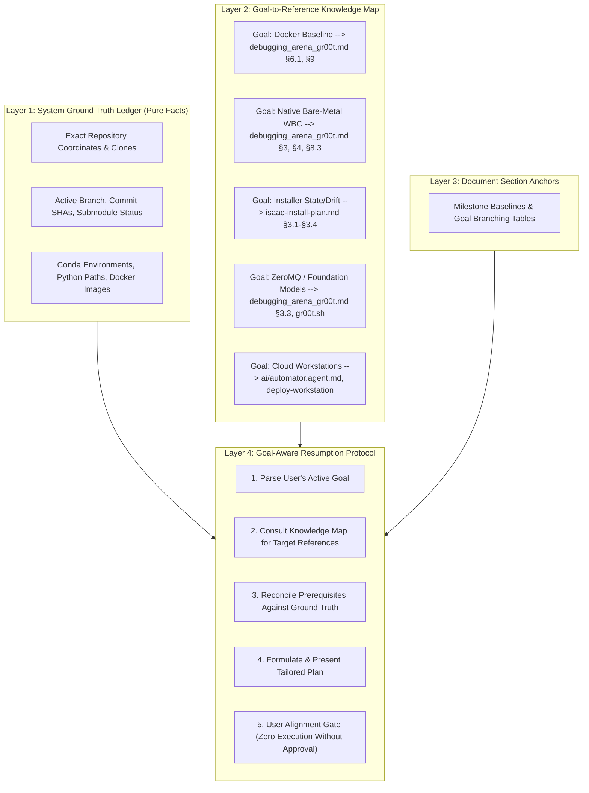

# Session Continuity & Handover Architecture: Debugging, Analysis & Framework Design <!-- omit in toc -->

- [1. Problem Statement & Incident Post-Mortem](#1-problem-statement--incident-post-mortem)
  - [1.1 The "Case-by-Case" Discontinuity Problem](#11-the-case-by-case-discontinuity-problem)
  - [1.2 Incident Post-Mortem (Session `29142ebf-0dfe-41a0-a781-7bc1d0b333da`)](#12-incident-post-mortem-session-29142ebf-0dfe-41a0-a781-7bc1d0b333da)
- [2. Why Linear / Static Handover Models Fail](#2-why-linear--static-handover-models-fail)
  - [2.1 The Goal-Diversity Conflict](#21-the-goal-diversity-conflict)
  - [2.2 The Separation of State vs. Intent](#22-the-separation-of-state-vs-intent)
- [3. The Goal-Adaptive Continuity Framework](#3-the-goal-adaptive-continuity-framework)
  - [3.1 Architecture Overview](#31-architecture-overview)
  - [3.2 Layer 1: System Ground Truth Ledger (Factual State)](#32-layer-1-system-ground-truth-ledger-factual-state)
  - [3.3 Layer 2: Goal-to-Reference Knowledge Map (Dynamic Routing)](#33-layer-2-goal-to-reference-knowledge-map-dynamic-routing)
  - [3.4 Layer 3: Section-Level Continuity Anchors](#34-layer-3-section-level-continuity-anchors)
  - [3.5 Layer 4: The 5-Step Goal-Aware Resumption Protocol](#35-layer-4-the-5-step-goal-aware-resumption-protocol)
- [4. Implementation Blueprint & Templates](#4-implementation-blueprint--templates)
  - [4.1 Document Section Continuity Anchor Template](#41-document-section-continuity-anchor-template)
  - [4.2 Session Memory Checkpoint Handoff Template](#42-session-memory-checkpoint-handoff-template)
  - [4.3 Resumption Skill Enforcement Specification](#43-resumption-skill-enforcement-specification)

---

## 1. Problem Statement & Incident Post-Mortem

### 1.1 The "Case-by-Case" Discontinuity Problem

In autonomous and semi-autonomous AI agent workflows, transitions across LLM sessions suffer from **context erosion, environment disorientation, and premature action bias**:

1. **Environmental Disorientation**: Fresh agent sessions do not inherently know exact machine coordinates (e.g., whether clones live in `~/Documents/GitHub/boredengineering/IsaacLab-Arena`, `/home/tarfy/...`, or `/workspaces/...`). Agents spend dozens of tool calls executing exploratory filesystem probes, risking duplicate checkouts or mislocated commands.
2. **Superficial Context Loading**: When prompted to resume past sessions, agents often perform shallow lookups (reading only the top-level 1-line description in `INDEX.md` or a 30-line summary log), skipping deep architectural documents and technical post-mortems (such as `debugging_arena_gr00t.md` or `isaac-install-plan.md`).
3. **Premature Action Bias & Skipped Planning**: Agents interpret test instructions or context bullets as immediate command-line execution triggers rather than context to be synthesized. They launch long-running builds, execute ad-hoc scripts, and modify working trees without presenting a plan or obtaining user alignment.

---

### 1.2 Incident Post-Mortem (Session `29142ebf-0dfe-41a0-a781-7bc1d0b333da`)

#### The Prompt:
```text
"Please check .agents/memory/INDEX.md and resume session c9d0e1f2.

Context:
1. We resolved the IsaacLab-Arena submodule sync (submodules/IsaacLab and submodules/Isaac-GR00T are cleanly checked out).
2. We are following the Docker-First Baseline Track in debugging_arena_gr00t.md (Section 9) before converting to native bare-metal.
3. Let's test ./docker/run_docker.sh -g, verify the container build, run baseline inference, and extract container manifests."
```

#### What Went Wrong:
1. **Shallow Reading**: The agent read the preceding 31-line session note (`20260823_181100_b8c9d0e1.md`) but **failed to open or read** Section 9 of `debugging_arena_gr00t.md` or `isaac-install-plan.md`.
2. **Missing Plan Gate**: Instead of synthesizing the background and delivering a structured execution plan for review, it immediately searched the filesystem, cloned repositories, modified `.gitmodules` and `docker/run_docker.sh`, and triggered a heavy 46-stage Docker container build (`task-208`) in the background.
3. **Repetition of Documented Antipatterns**: Sections 7.1 and 7.2 of `debugging_arena_gr00t.md` explicitly document why ad-hoc trial-and-error executions (Attempt 1) and runner creep (Attempt 2) failed. Skipping the master document led the agent to repeat the exact same trial-and-error behaviors.

---

## 2. Why Linear / Static Handover Models Fail

### 2.1 The Goal-Diversity Conflict

A naive solution to session continuity is adding a rigid, static "Mandatory Next Step" or "Fixed Pre-Read List" to every session checkpoint. **This fails because real-world development is case-by-case and non-linear.**

When a user resumes a session, their goal varies dynamically:
* **Scenario A (Validation)**: Verify Docker baseline inference without touching host Python.
* **Scenario B (Native Conversion)**: Implement C++ WBC Pinocchio solvers inside native Conda.
* **Scenario C (Tooling/Refactor)**: Refactor `isaac-installer` state tracking and dual-remote git sync.
* **Scenario D (Infrastructure)**: Deploy multi-GPU GCP/AWS cloud instances with Terraform.

A static list of "Mandatory Pre-Reads" forces irrelevant context onto unrelated tasks, while omitting the specific architectural nuances required for the active goal.

### 2.2 The Separation of State vs. Intent

To resolve this, the architecture must strictly decouple:
1. **System Ground Truth (What Is)**: Pure, indisputable facts about the host filesystem, repository commits, submodules, installed environments, and cached weights.
2. **Goal Context (What To Do)**: Dynamic routing that maps the user's active goal to the exact architectural analyses and execution plans designed for that domain.

---

## 3. The Goal-Adaptive Continuity Framework

### 3.1 Architecture Overview



---

### 3.2 Layer 1: System Ground Truth Ledger (Factual State)

Every session log and handoff artifact must maintain a machine-accurate record of the physical system state:

| Component | Invariant / Parameter | Verified Ground Truth Value |
| :--- | :--- | :--- |
| **Workspace Root** | Current Working Directory | `/workspaces/IsaacAutomator` |
| **Arena Repository** | Physical Path & Branch | `/root/Documents/GitHub/boredengineering/IsaacLab-Arena` (`release/0.3.0-prerelease`) |
| **Submodules** | `submodules/IsaacLab` | Clean detached HEAD @ `ffff603eafc6b74264a5261cc0183d6a65390d78` |
| **Submodules** | `submodules/Isaac-GR00T` | Clean detached HEAD @ `e29d8fc50b0e4745120ae3fb72447986fe638aa6` |
| **Python Runtimes** | Conda Environment | `isaaclab` (Python 3.12, Isaac Sim 6.0 compatible) |
| **Python Runtimes** | UV Environment | `Isaac-GR00T` (Python 3.10 virtualenv) |
| **Docker State** | Build Daemon Status | Idle, no background build tasks active |

---

### 3.3 Layer 2: Goal-to-Reference Knowledge Map (Dynamic Routing)

When an agent receives an instruction, it queries this routing map based on the user's stated goal:

| Workstream / Goal | Primary Architecture Reference | Key Modules & Code Files | Invariant Requirements |
| :--- | :--- | :--- | :--- |
| **1. Docker-First Baseline** | [`debugging_arena_gr00t.md#section-9`](file:///workspaces/IsaacAutomator/.agents/references/docs/debugging_arena_gr00t.md#L616)<br>[`debugging_arena_gr00t.md#section-61`](file:///workspaces/IsaacAutomator/.agents/references/docs/debugging_arena_gr00t.md#L360) | `IsaacLab-Arena/docker/run_docker.sh`<br>`isaaclab_arena.sh:ensure_docker_submodules` | Clean submodules checked out in-tree; Docker daemon running. |
| **2. Native Bare-Metal Conversion** | [`debugging_arena_gr00t.md#section-4`](file:///workspaces/IsaacAutomator/.agents/references/docs/debugging_arena_gr00t.md#L214)<br>[`debugging_arena_gr00t.md#section-83`](file:///workspaces/IsaacAutomator/.agents/references/docs/debugging_arena_gr00t.md#L575) | `activate.d/00_isaaclab_env.sh`<br>`source/isaaclab_arena_gr00t`<br>`source/isaaclab_arena_g1` | Conda `isaaclab` active; C++ Pinocchio/Pink wheels built; Vulkan ICD set. |
| **3. Installer State & Drift Engine** | [`isaac-install-plan.md#section-3`](file:///workspaces/IsaacAutomator/.agents/references/isaac-install-plan.md) | `lib/core/state.sh`<br>`lib/core/git_workspace.sh` | Dual-remote fork topology; `.state.json` ledger synchronizer. |
| **4. ZeroMQ Model Serving & VLA** | [`debugging_arena_gr00t.md#section-33`](file:///workspaces/IsaacAutomator/.agents/references/docs/debugging_arena_gr00t.md#L171)<br>[`debugging_arena_gr00t.md#section-83`](file:///workspaces/IsaacAutomator/.agents/references/docs/debugging_arena_gr00t.md#L575) | `Isaac-GR00T/gr00t/eval/run_gr00t_server.py`<br>`gr00t.sh:server` | Port 5555 open; `Cosmos-Reason2-2B` + `GR00T-N1.7-3B` weights cached. |
| **5. Cloud Workstation Lifecycle** | [`ai/automator.agent.md`](file:///workspaces/IsaacAutomator/ai/automator.agent.md)<br>[`.agents/skills/isaac-automator/`](file:///workspaces/IsaacAutomator/.agents/skills/isaac-automator/) | `src/terraform/`<br>`src/ansible/` | Cloud credentials exported (`AWS_ACCESS_KEY_ID`, `gcloud auth`). |

---

### 3.4 Layer 3: Section-Level Continuity Anchors

Every major technical section in master documents ends with a standardized **Continuity Anchor** that records:
1. **Verified Milestone Baseline**: Exactly what is working and tested at the end of that section.
2. **Branching Goal Options**: What tracks can be pursued next, and which documents govern them.
3. **Execution Guardrails**: Boundaries that must not be crossed without prior alignment.

---

### 3.5 Layer 4: The 5-Step Goal-Aware Resumption Protocol

Any agent tasked with resuming work or starting a new session must execute this sequence:

```text
┌──────────────────────────────────────────────────────────────────────────┐
│                 5-STEP GOAL-AWARE RESUMPTION PROTOCOL                    │
└──────────────────────────────────────────────────────────────────────────┘
                                   │
   [1. Parse Goal]  ───────────────► Extract specific intent from user prompt
                                   │
   [2. Consult Map] ───────────────► Load only the specific section(s) in
                                     debugging_arena_gr00t.md / install plan
                                   │
   [3. Check State] ───────────────► Inspect Ground Truth Ledger non-mutatively
                                     (Confirm paths, branches, submodules)
                                   │
   [4. Formulate Plan] ────────────► Draft explicit, phased execution plan
                                     (Commands, expected outputs, timeouts)
                                   │
   [5. Align & Halt] ──────────────► PRESENT PLAN TO USER AND WAIT.
                                     ZERO COMMAND EXECUTION BEFORE APPROVAL.
```

---

## 4. Implementation Blueprint & Templates

### 4.1 Document Section Continuity Anchor Template

```markdown
---
### ⚓ Section [N] Baseline & Goal Routing

* **Verified Baseline State:**
  - Component: `<path>` @ `<branch/commit>`
  - Status: `<100% verified / clean / pending>`

| If the Next Goal is... | Consult Architecture Reference | Key Files & Preconditions |
| :--- | :--- | :--- |
| **Goal Option A** | `doc_name.md#section-X` | `path/to/script` (requires prerequisite Y) |
| **Goal Option B** | `doc_name.md#section-Y` | `path/to/module` (requires prerequisite Z) |

* **Execution Guardrail:** Agent must present a plan and obtain user confirmation before running scripts or builds.
---
```

---

### 4.2 Session Memory Checkpoint Handoff Template

```markdown
## 4. Resumption Ground Truth & Goal Map

### A. Physical Environment Ground Truth
* **Workspace**: `/workspaces/IsaacAutomator`
* **Target Repositories**:
  - `IsaacLab-Arena`: `/root/Documents/GitHub/boredengineering/IsaacLab-Arena` (`release/0.3.0-prerelease`)
  - Submodules: Clean at `ffff603ea` (IsaacLab) and `e29d8fc` (GR00T).
* **Active Runtimes**: Conda `isaaclab` (Py3.12), UV `Isaac-GR00T` (Py3.10).

### B. Goal-Driven Next Steps Matrix
* If proceeding with **Docker Baseline** -> See `debugging_arena_gr00t.md` Section 9.
* If proceeding with **Native Bare-Metal** -> See `debugging_arena_gr00t.md` Section 4 & 8.3.
* If proceeding with **Installer State Logic** -> See `isaac-install-plan.md` Section 3.

### C. Resumption Execution Directives
1. Ingest the specific section mapped to the chosen goal.
2. Verify environment without modifying files or running builds.
3. Formulate and present the execution plan to the user.
4. Wait for explicit user approval before executing commands.
```

---

### 4.3 Resumption Skill Enforcement Specification

Update `.agents/skills/isaac-automator/session-memory/SKILL.md` to mandate:
1. Resuming agents must never execute mutating commands (builds, git checkouts, package installs) during their first turn.
2. The initial response must strictly synthesize context, check the Ground Truth Ledger, and present a structured plan corresponding to the user's active goal.
3. Execution proceeds only after explicit user confirmation (or interactive alignment via `/plan` / `/grill-me`).
