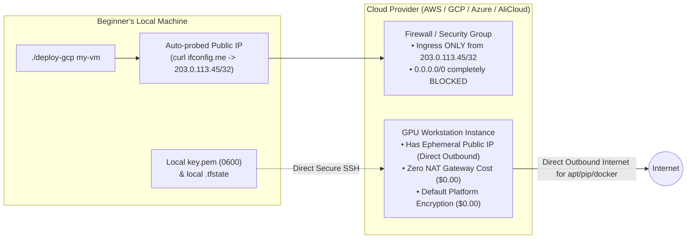
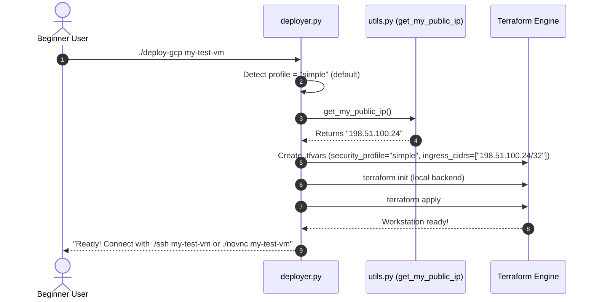

# Isaac Automator - Beginner-Friendly "Simple Mode" Security & User Choice Implementation Plan
**Frictionless, Zero-Cost Cloud Workstation Deployments for Beginners, Students, and Solo Researchers with User-Driven Security Selection**

---

## 1. Executive Summary & Design Goals

The primary audience of Isaac Automator includes robotics researchers, students, hobbyists, and non-expert engineers who want to test Isaac Sim, train a reinforcement learning policy in Isaac Lab, or run foundation model demos on a GPU workstation. 

### Why Beginners Need "Simple Mode"
- **Zero Financial Surprise**: Beginners must not be surprised by $30–$140/month background charges for Cloud NAT Gateways, paid KMS keys, or enterprise Bastions.
- **Zero Permission Roadblocks**: Beginners often use personal accounts, university sandboxes, or pre-configured developer accounts where they lack Organization Admin or KMS IAM permissions.
- **Zero Cognitive Overhead**: Beginners should not need to understand CIDR blocks, IAM roles, KMS key rotation, or remote state locking to launch a GPU VM.
- **Inherent Safety**: Even in Simple Mode, the tool must protect beginners from common security blunders (such as leaving SSH open to the whole world `0.0.0.0/0`).

### Core Design Principles
1. **User Choice**: Every user gets to choose their profile (interactive prompt for humans, simple flag for CLI/scripts).
2. **Simple by Default**: If no security flag is specified, the system defaults to **Simple Mode** ($0.00 added cost, fastest setup).
3. **Safe by Design**: Automatically locks firewall rules to the user's current public IP (`my_ip/32`), providing 99% of the security benefits of a private network without the cost and complexity of a NAT Gateway.

---

## 2. The User Choice Architecture (How the User Chooses)

Isaac Automator provides three seamless ways for users to choose their deployment profile:

```mermaid
flowchart TD
    User([User Invokes Deployment]) --> CheckInput{How was command run?}

    CheckInput -->|Interactive Terminal| Wizard[Interactive Security Wizard\nPrompts 1, 2, or 3 with default = 1]
    CheckInput -->|CLI Flag Passed| Flag[Explicit Flag:\n--profile=simple | team | enterprise]
    CheckInput -->|Non-Interactive / Script| Default[Zero-Touch Default:\nAutomatically selects 'Simple Mode']

    Wizard --> ModeSelect{Selected Profile}
    Flag --> ModeSelect
    Default --> ModeSelect

    ModeSelect -->|1. Simple (Default)| P_Simple["Simple Mode:\n• $0.00 Added Cost\n• Local State & Ephemeral SSH Key\n• Auto /32 Caller IP Firewall Lock\n• Free Built-In Cloud Encryption"]
    ModeSelect -->|2. Team| P_Team["Team Mode:\n• <$0.10 Added Cost\n• Cloud Remote State Bucket (S3/GCS/Blob)\n• Native State Locking for Multi-User"]
    ModeSelect -->|3. Enterprise| P_Enterprise["Enterprise Mode:\n• Cloud KMS CMEK Keys\n• Cloud Secret Manager\n• Zero-Trust Private Network (IAP/SSM)"]
```

### 2.1 Choice Path A: The Zero-Touch Default (Convention over Configuration)
When an operator runs the standard deploy command without any security flags:
```bash
./deploy-gcp my-workstation
./deploy-aws my-workstation
./deploy-azure my-workstation
./deploy-alicloud my-workstation
```
The deployer **automatically selects Simple Mode**. It requires zero questions, zero configuration, and finishes in under 2 minutes.

### 2.2 Choice Path B: The Interactive Selection Prompt
When running in an interactive terminal without pre-set flags, or when passing `--prompt`:
```text
* Deployment Profile Selection:
  [1] Simple (Recommended: $0 added cost, local state, auto-locked to your IP)
  [2] Team (Adds cloud remote state for team/multi-agent sharing)
  [3] Enterprise (KMS CMEK, Secret Manager, zero-trust private access)

Select profile [1/2/3] (default: 1): 
```
Pressing **Enter** immediately selects `Simple`.

### 2.3 Choice Path C: Explicit CLI Flags
For scripting, automation, or power users:
```bash
# Explicit Simple Mode (Beginner friendly)
./deploy-gcp my-workstation --profile simple

# Or granular shortcuts
./deploy-aws my-workstation --simple

# Enterprise Mode when needed
./deploy-gcp my-workstation --profile enterprise
```

### 2.4 Choice Path D: Global User Configuration (`~/.isaacautomator/config.yaml`)
Users can set a persistent preference so they never get prompted:
```yaml
# ~/.isaacautomator/config.yaml
default_profile: simple
auto_ip_lockdown: true
```

---

## 3. Simple Mode Technical Architecture



### 3.1 What Simple Mode Does:
1. **Zero Added Dollar Cost ($0.00)**:
   - Does **not** provision Cloud NAT ($32/month saved).
   - Does **not** create Customer-Managed KMS keys ($1–$3/month saved).
   - Does **not** create Cloud Secret Manager resources ($0.40/secret/month saved).
   - Does **not** provision paid Bastion hosts ($140/month saved).
2. **Zero Setup & Minimal Cloud Permissions**:
   - Uses standard personal cloud credentials (`gcloud auth login`, `aws configure`, `az login`, `aliyun configure`).
   - Requires only base Compute Engine and Network creation rights. No Organization Admin or KMS Admin roles required.
3. **Smart Ingress Protection (Auto-IP Lockdown)**:
   - Beginners often make the mistake of leaving port 22 or remote desktop ports open to `0.0.0.0/0` (the entire internet), exposing them to bots and port scans.
   - In Simple Mode, Isaac Automator automatically queries `curl -s ifconfig.me` and generates firewall rules restricted strictly to `<caller_public_ip>/32`. Only the beginner's computer can reach the workstation!
4. **Free Platform Encryption at Rest**:
   - Relies on free, built-in cloud encryption (AWS SSE-S3 AES-256, Google-managed disk encryption, Azure Storage SSE). Zero configuration, zero cost, 100% compliant with basic encryption requirements.
5. **Direct Outbound Internet (No NAT Cost)**:
   - Gives the VM an external public IP so it can download Ubuntu packages, NVIDIA drivers, Isaac Lab dependencies, and Docker images directly without paying for a NAT Gateway.
   - Because the firewall blocks all internet inbound traffic except the caller's IP, the VM is completely shielded from inbound attacks.
6. **Local State & Credential Storage**:
   - Writes state to `./state/<name>/.tfstate` and key to `./state/<name>/key.pem` with strict `0600` POSIX permissions.

---

## 4. Side-by-Side Comparison: Simple Mode vs Enterprise Mode

| Dimension | Simple Mode (Beginner Default) | Enterprise Mode (Hardened) |
| :--- | :--- | :--- |
| **User Persona** | Students, researchers, developers testing Isaac Sim | Enterprises, defense, regulated industries |
| **Command** | `./deploy-<cloud> <name>` | `./deploy-<cloud> <name> --profile enterprise` |
| **Additional Infrastructure Cost** | **$0.00 / month** | **$35.00 – $180.00+ / month** |
| **Cloud IAM Privileges Needed** | Standard developer permissions | Project IAM Admin, KMS Admin, Secret Manager Admin |
| **State Storage** | Local `./state/<name>/.tfstate` | Hardened GCS/S3 bucket with versioning & locking |
| **Encryption at Rest** | Free platform default (Google-managed / SSE-S3) | Customer-Managed Encryption Keys (CMEK / CMK) |
| **Secrets Handling** | Local `key.pem` (0600) & environment variables | Cloud Secret Manager (GCP, AWS, Azure, AliCloud) |
| **Inbound Security** | Dynamic `/32` caller IP whitelist (auto-detected) | Cloud IAP / AWS SSM Session Manager / Azure Bastion |
| **Outbound Internet Path** | Direct via ephemeral public IP (Free) | Cloud NAT Gateway / Private Endpoints (Paid) |
| **Hardware Integrity** | Standard instance configuration | Shielded VM / AWS Nitro / Azure Trusted Launch |
| **Deployment Time** | **~2 minutes** | **~5–8 minutes** (due to KMS and NAT propagation) |

---

## 5. File-by-File Implementation Plan



### 5.1 Step 1: Update `src/python/deployer.py` with User Choice Logic

Add interactive prompt and default profile resolution:

```python
    def resolve_security_profile(self):
        """
        Resolves security profile with beginner-friendly defaults and interactive choice
        """
        profile = self.params.get("profile") or self.params.get("security_profile")

        if not profile:
            # If running in interactive terminal and existing is "ask", ask the user
            if sys.stdin.isatty() and self.params.get("existing") == "ask":
                click.echo(colorize_info("\n* Security & Deployment Profile:"))
                click.echo("  [1] Simple     - $0 added cost, local state, auto-locked to your IP (Recommended for beginners)")
                click.echo("  [2] Team       - Adds cloud remote state for multi-user / agent sync")
                click.echo("  [3] Enterprise - Cloud KMS, Secret Manager, zero-trust private access\n")
                choice = click.prompt(
                    colorize_prompt("Select profile [1/2/3]"),
                    type=click.Choice(["1", "2", "3"]),
                    default="1",
                    show_choices=False,
                )
                mapping = {"1": "simple", "2": "team", "3": "enterprise"}
                profile = mapping[choice]
            else:
                # Non-interactive or agent execution: default to simple
                profile = "simple"

        self.params["security_profile"] = profile
        if self.params["debug"]:
            click.echo(colorize_info(f"* Selected security profile: '{profile}'"))
```

### 5.2 Step 2: Ingress Protection in `src/python/deployer.py`

Ensure that in Simple Mode, `ingress_cidrs` always defaults to the caller's auto-detected `/32` IP:

```python
    # Inside create_tfvars:
    if self.params.get("security_profile") == "simple":
        # Beginners should never have 0.0.0.0/0 open.
        # If user didn't explicitly pass ingress_cidrs, lock to caller IP
        if not self.params.get("ingress_cidrs") or self.params["ingress_cidrs"] in ("", "auto", "myip"):
            my_ip = get_my_public_ip(verbose=debug)
            tfvars["ingress_cidrs"] = [f"{my_ip}/32"]
            click.echo(colorize_info(f"* Simple Mode: Firewall locked strictly to your IP ({my_ip}/32)."))
```

### 5.3 Step 3: Terraform Conditional Guardrails (`src/terraform/*/`)

In all four cloud Terraform directories (`src/terraform/{gcp,aws,azure,alicloud}/`):
- All complex resources (Key Rings, Secret Manager, NAT Routers, Bastions) are wrapped with:
  ```hcl
  count = var.security_profile == "enterprise" ? 1 : 0
  ```
- In Simple Mode (`var.security_profile == "simple"`), Terraform generates **zero extra resources**. It provisions only the VPC subnet, the security group with the `/32` rule, and the GPU VM.

---

## 6. Beginner User Experience Runbook

### Scenario 1: The Absolute Beginner (Zero Flags)
```bash
./deploy-gcp my-first-sim
```
**Output**:
```text
* Selected security profile: 'simple' ($0 added cost)
* Automatically detected your public IP: 198.51.100.24
* Firewall locked strictly to your IP (198.51.100.24/32)
* Provisioning NVIDIA L4 GPU Workstation...
* Workstation created in 1m 45s!
* To connect:
  ./novnc my-first-sim     (Desktop UI in your browser)
  ./ssh my-first-sim       (SSH terminal)
* To stop billing:
  ./stop my-first-sim      (Pause VM)
  ./destroy my-first-sim   (Delete when finished)
```

### Scenario 2: The Interactive Choice
```bash
./deploy-aws my-sim --prompt
```
**Output**:
```text
* Security & Deployment Profile:
  [1] Simple     - $0 added cost, local state, auto-locked to your IP (Recommended for beginners)
  [2] Team       - Adds cloud remote state for multi-user / agent sync
  [3] Enterprise - Cloud KMS, Secret Manager, zero-trust private access

Select profile [1/2/3] (default: 1): 1
* Simple profile selected. Proceeding...
```

---

## 7. Verification & Safety Checks

| Verification Item | Command / Check | Expected Simple Mode Result |
| :--- | :--- | :--- |
| **No Background Paid Services** | `gcloud compute routers list`<br>`aws ec2 describe-nat-gateways` | Output is empty. Zero NAT Gateways or Routers created. |
| **No KMS Charges** | `gcloud kms keyrings list`<br>`aws kms list-keys` | No custom keys created for deployment. |
| **Inbound Port Safety** | `nmap -Pn -p 22 <vm-ip>` from an external IP | Port is reported `filtered` or `closed` from any IP other than the user's `/32`. |
| **Outbound Connectivity** | In VM: `curl -I https://pypi.org` | HTTP 200 OK directly via public IP (no NAT needed). |
| **Agent Script Parity** | `docker run ... ./deploy-aws test --existing replace` | Completes non-interactively without hanging on prompts. |
