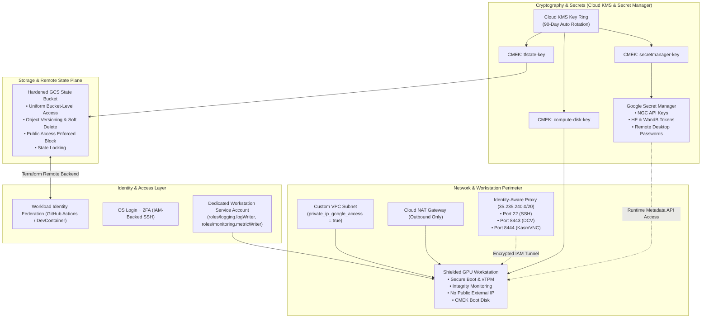
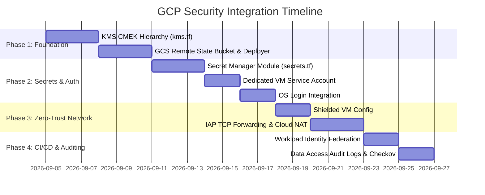

# Google Cloud Platform (GCP) Security Architecture & Hardening Specification
**Isaac Automator: Cloud Workstation Security, Cryptography, Secrets, and State Management**

## Registry scope update (2026-09-09)

Optional private container distribution is tracked in
[artifact-registry-plan.md](../plans/artifact-registry-plan.md) and
[artifact-registry-guide.md](../docs/artifact-registry-guide.md). Keep repository
ownership in separate shared Terraform state, grant reader access at repository
scope to the actual VM identity, and separate publishing privileges. Metadata-issued
short-lived Docker credentials are not stored in profiles, Terraform variables or
image layers. Registry IAM privacy is not a network perimeter; Private Google Access,
DNS/routing and any VPC Service Controls policies require independent validation.
This addition is not evidence that every historical security target below is implemented.

---

## 1. Executive Summary & Current Threat Surface Audit

This specification defines the security architecture and hardening roadmap for the Isaac Automator GCP codebase.

Isaac Automator deploys high-performance GPU workstations (NVIDIA L4, T4, A100) running Isaac Sim, Isaac Lab, and physical AI workloads. An audit of the existing GCP codebase (`src/terraform/gcp/`, `src/python/deployer.py`, and `src/terraform/gcp/ovkit/`) reveals critical security gaps that must be remediated for enterprise, multi-tenant, and regulated environments:

### Gap Analysis & Threat Model

| Subsystem | Existing Implementation | Security Vulnerability / Threat Vector | Target Security Posture |
| :--- | :--- | :--- | :--- |
| **Terraform State** | Local backend (`backend "local" {}`), writes to `./state/<name>/.tfstate` | **High**: Plaintext state on local developer laptop; no distributed concurrency locking; risk of state loss or drift across agents/machines. | **GCS Remote Backend** with CMEK encryption, object versioning, native locking, and 7-day soft-delete protection. |
| **Secrets & Keys** | RSA key generated via `tls_private_key.ssh_key` outputted to `.tfstate` and written to local `key.pem`; tokens passed in CLI/env | **Critical**: Private keys and tokens stored in plaintext in local filesystem and state JSON; credentials orphaned on local disks. | **Google Secret Manager** with CMEK encryption, automatic versioning, IAM `secretAccessor` scoping, and runtime retrieval. |
| **Encryption (KMS)** | Default Google-managed encryption keys for disks and GCS buckets | **Moderate/High**: Fails compliance (CIS GCP Benchmark, SOC2, FedRAMP, ISO 27001) requiring Customer-Managed Encryption Keys (CMEK) and key rotation. | **Cloud KMS** with dedicated Key Rings, 90-day automatic rotation, and CMEK applied to Boot Disks, Storage Buckets, and Secrets. |
| **Compute Identity** | Default Compute Engine Service Account (`...-compute@developer.gserviceaccount.com`) with `devstorage.read_write` | **High**: Default SA carries excessive privileges (`Editor` role); `devstorage.read_write` grants access to all project buckets. | **Dedicated Workstation Service Account** following Principle of Least Privilege (PoLP) with strictly scoped roles. |
| **Network & Ingress** | Static Public IP; firewall ports 22, 5900, 6080, 8443, 8444 open to `ingress_cidrs` | **High**: Potential exposure of remote desktop and SSH ports to public internet (`0.0.0.0/0`); vulnerable to port scans and brute force. | **Identity-Aware Proxy (IAP) TCP Forwarding**; private-only instances (no external IP); Cloud NAT for outbound traffic. |
| **Compute Integrity** | Standard instance config; no Secure Boot or vTPM | **Moderate**: Bootkits, firmware tampering, and hypervisor-level rootkit vulnerabilities. | **Shielded VM** (`enable_secure_boot = true`, `enable_vtpm = true`, `enable_integrity_monitoring = true`). |
| **Access Control** | SSH key injected via instance metadata (`ssh-keys`) | **Moderate**: Stale keys remain in metadata; lacks centralized revocation, audit trails, and multi-factor authentication. | **OS Login with 2FA** (`enable-oslogin = TRUE`, `block-project-ssh-keys = TRUE`). |

---

## 2. Architecture Overview: Defense-in-Depth



---

## 3. Pillar 1: Cloud KMS & Customer-Managed Encryption Keys (CMEK)

### 3.1 Key Rings and Cryptographic Hierarchy

To isolate cryptographic blast radiuses and enforce separation of duties, keys are segregated by resource type within a regional Key Ring:

1. **`tfstate-key`**: Encrypts the GCS Terraform remote state bucket and application state bundles.
2. **`compute-disk-key`**: Encrypts the Compute Engine workstation boot disk and any attached scratch/NVMe SSD volumes.
3. **`secretmanager-key`**: Encrypts all Secret Manager secret payloads using user-managed replication.
4. **`backups-key`**: Encrypts datasets, simulation recordings, and model weights pushed to GCS.

### 3.2 Key Lifecycle & Safeguards
- **Rotation Period**: `7776000s` (90 days), conforming to CIS GCP Benchmark Control 1.10.
- **Destruction Safeguard**: `lifecycle { prevent_destroy = true }` to prevent accidental data loss.
- **Service Agent Grants**: Cloud KMS requires that GCP's internal service agents be explicitly granted the `roles/cloudkms.cryptoKeyEncrypterDecrypter` role prior to resource creation.

### 3.3 Terraform Implementation: `src/terraform/gcp/kms.tf`

```hcl
# ==============================================================================
# Cloud Key Management Service (KMS) - CMEK Hierarchy
# ==============================================================================

resource "google_project_service" "kms" {
  project            = var.project
  service            = "cloudkms.googleapis.com"
  disable_on_destroy = false
}

data "google_project" "current" {
  project_id = var.project
}

# Regional KMS Key Ring
resource "google_kms_key_ring" "workstation_keyring" {
  name       = "${var.prefix}-${var.deployment_name}-keyring"
  location   = local.region
  project    = var.project
  depends_on = [google_project_service.kms]
}

# 1. CryptoKey for Compute Engine Boot & Data Disks
resource "google_kms_crypto_key" "compute_disk_key" {
  name            = "compute-disk-key"
  key_ring        = google_kms_key_ring.workstation_keyring.id
  rotation_period = "7776000s" # 90 days

  lifecycle {
    prevent_destroy = true
  }
}

# 2. CryptoKey for Cloud Storage (Terraform State & Backups)
resource "google_kms_crypto_key" "storage_key" {
  name            = "storage-key"
  key_ring        = google_kms_key_ring.workstation_keyring.id
  rotation_period = "7776000s"

  lifecycle {
    prevent_destroy = true
  }
}

# 3. CryptoKey for Secret Manager Secrets
resource "google_kms_crypto_key" "secrets_key" {
  name            = "secrets-key"
  key_ring        = google_kms_key_ring.workstation_keyring.id
  rotation_period = "7776000s"

  lifecycle {
    prevent_destroy = true
  }
}

# ------------------------------------------------------------------------------
# Service Agent IAM Grants (Required for CMEK)
# ------------------------------------------------------------------------------

# A. Compute Engine Service Agent
resource "google_kms_crypto_key_iam_member" "compute_cmek" {
  crypto_key_id = google_kms_crypto_key.compute_disk_key.id
  role          = "roles/cloudkms.cryptoKeyEncrypterDecrypter"
  member        = "serviceAccount:service-${data.google_project.current.number}@compute-system.iam.gserviceaccount.com"
}

# B. Cloud Storage Service Agent
data "google_storage_project_service_account" "gcs_account" {
  project = var.project
}

resource "google_kms_crypto_key_iam_member" "storage_cmek" {
  crypto_key_id = google_kms_crypto_key.storage_key.id
  role          = "roles/cloudkms.cryptoKeyEncrypterDecrypter"
  member        = "serviceAccount:${data.google_storage_project_service_account.gcs_account.email_address}"
}

# C. Secret Manager Service Agent
resource "google_kms_crypto_key_iam_member" "secretmanager_cmek" {
  crypto_key_id = google_kms_crypto_key.secrets_key.id
  role          = "roles/cloudkms.cryptoKeyEncrypterDecrypter"
  member        = "serviceAccount:service-${data.google_project.current.number}@gcp-sa-secretmanager.iam.gserviceaccount.com"
}
```

---

## 4. Pillar 2: Secrets Management with Google Secret Manager

### 4.1 Secrets Taxonomy & Elimination of Plaintext

Hardcoding secrets in Terraform state or local files is eliminated. All sensitive credentials are delegated to Google Secret Manager:

| Secret Identifier | Purpose | Injection Mechanism | Accessor Policy |
| :--- | :--- | :--- | :--- |
| `isaac-ngc-api-key` | NVIDIA Omniverse & Container Registry authentication | Injected at runtime via startup hook / bash | Workstation Service Account (`secretAccessor`) |
| `isaac-hf-token` | Hugging Face model checkpoints (e.g. Isaac-GR00T / Cosmos) | Injected into `~/.cache/huggingface/token` | Workstation Service Account (`secretAccessor`) |
| `isaac-wandb-api-key` | Experiment tracking & reinforcement learning logging | Exported to `WANDB_API_KEY` environment | Workstation Service Account (`secretAccessor`) |
| `isaac-desktop-password` | VNC, KasmVNC, or NoMachine session password | Consumed by display manager at launch | Workstation Service Account (`secretAccessor`) |
| `isaac-ssh-private-key` | Fallback SSH access for non-OS Login environments | Dynamically pulled via CLI `./ssh` wrapper | Operator / Deployer Identity |

### 4.2 Terraform Implementation: `src/terraform/gcp/secrets.tf`

```hcl
# ==============================================================================
# Google Secret Manager - CMEK Encrypted
# ==============================================================================

resource "google_project_service" "secretmanager" {
  project            = var.project
  service            = "secretmanager.googleapis.com"
  disable_on_destroy = false
}

# 1. NGC API Key Secret
resource "google_secret_manager_secret" "ngc_api_key" {
  secret_id = "${var.prefix}-${var.deployment_name}-ngc-api-key"
  project   = var.project

  replication {
    user_managed {
      replicas {
        location = local.region
        customer_managed_encryption {
          kms_key_name = google_kms_crypto_key.secrets_key.id
        }
      }
    }
  }

  labels = {
    deployment = var.deployment_name
    managed_by = "isaac-automator"
  }

  depends_on = [
    google_kms_crypto_key_iam_member.secretmanager_cmek,
    google_project_service.secretmanager
  ]
}

# Optional secret version if provided via variable
resource "google_secret_manager_secret_version" "ngc_api_key_val" {
  count       = var.ngc_api_key != "" ? 1 : 0
  secret      = google_secret_manager_secret.ngc_api_key.id
  secret_data = var.ngc_api_key
}

# 2. Hugging Face Token Secret
resource "google_secret_manager_secret" "hf_token" {
  secret_id = "${var.prefix}-${var.deployment_name}-hf-token"
  project   = var.project

  replication {
    user_managed {
      replicas {
        location = local.region
        customer_managed_encryption {
          kms_key_name = google_kms_crypto_key.secrets_key.id
        }
      }
    }
  }

  depends_on = [
    google_kms_crypto_key_iam_member.secretmanager_cmek,
    google_project_service.secretmanager
  ]
}

# 3. Grant Workstation Service Account Access to Secrets
resource "google_secret_manager_secret_iam_member" "workstation_ngc_access" {
  secret_id = google_secret_manager_secret.ngc_api_key.secret_id
  role      = "roles/secretmanager.secretAccessor"
  member    = "serviceAccount:${google_service_account.workstation_sa.email}"
}

resource "google_secret_manager_secret_iam_member" "workstation_hf_access" {
  secret_id = google_secret_manager_secret.hf_token.secret_id
  role      = "roles/secretmanager.secretAccessor"
  member    = "serviceAccount:${google_service_account.workstation_sa.email}"
}
```

### 4.3 Workstation Runtime Secret Retrieval (Zero-Bake Method)

Instead of baking credentials into the image or passing them in cleartext user-data, the workstation startup script fetches secrets directly at runtime using the instance's service account identity:

```bash
#!/usr/bin/env bash
set -euo pipefail

# 1. Fetch GCP Metadata OAuth2 access token
TOKEN=$(curl -s -H "Metadata-Flavor: Google" \
  "http://metadata.google.internal/computeMetadata/v1/instance/service-accounts/default/token" \
  | jq -r .access_token)

# 2. Function to retrieve secret payload via REST API
fetch_secret() {
  local secret_id="$1"
  local project_id="$2"
  curl -s -H "Authorization: Bearer ${TOKEN}" \
    "https://secretmanager.googleapis.com/v1/projects/${project_id}/secrets/${secret_id}/versions/latest:access" \
    | jq -r .payload.data | base64 --decode
}

# 3. Retrieve NGC API Key and configure Docker / NGC CLI
PROJECT_ID=$(curl -s -H "Metadata-Flavor: Google" "http://metadata.google.internal/computeMetadata/v1/project/project-id")
NGC_KEY=$(fetch_secret "${DEPLOYMENT_NAME}-ngc-api-key" "${PROJECT_ID}")

if [ -n "${NGC_KEY}" ]; then
  echo "${NGC_KEY}" | docker login nvcr.io -u '$oauthtoken' --password-stdin
fi
```

---

## 5. Pillar 3: Cloud Terraform State Architecture (GCS Remote Backend)

### 5.1 Hardened GCS State Bucket Specification

The GCS remote backend replaces the fragile `backend "local" {}`. The state bucket is provisioned with defense-in-depth settings:

- **Uniform Bucket-Level Access**: Enabled (disables legacy ACLs).
- **Object Versioning**: Enabled (protects against state corruption, accidental overwrites, and race conditions).
- **Public Access Prevention**: `enforced` (prevents any bucket or object from ever being public).
- **CMEK Encryption**: Backed by `google_kms_crypto_key.storage_key`.
- **Soft Delete Policy**: Retains deleted objects for 7 days to guarantee recovery from ransomware or accidental deletion.
- **Lifecycle Rule**: Retains the last 10 versions and transitions stale objects to noncurrent cleanup after 90 days.

### 5.2 Terraform Bootstrap Module: `src/terraform/bootstrap/gcp/main.tf`

```hcl
terraform {
  required_version = ">= 1.3.5"
  required_providers {
    google = {
      source  = "hashicorp/google"
      version = ">= 4.57.0"
    }
  }
}

variable "project" { type = string }
variable "region" { type = string, default = "us-central1" }
variable "state_bucket_name" { type = string, default = "" }

locals {
  bucket_name = var.state_bucket_name != "" ? var.state_bucket_name : "isaacautomator-state-${var.project}-${var.region}"
}

# 1. State Storage Bucket
resource "google_storage_bucket" "state_bucket" {
  name                        = local.bucket_name
  project                     = var.project
  location                    = var.region
  force_destroy               = false
  uniform_bucket_level_access = true
  public_access_prevention    = "enforced"

  versioning {
    enabled = true
  }

  soft_delete_policy {
    retention_duration_seconds = 604800 # 7 days
  }

  encryption {
    default_kms_key_name = google_kms_crypto_key.storage_key.id
  }

  lifecycle_rule {
    action {
      type = "Delete"
    }
    condition {
      num_newer_versions         = 10
      days_since_noncurrent_time = 90
    }
  }

  depends_on = [google_kms_crypto_key_iam_member.storage_cmek]
}

# 2. Terraform Deployer CI/CD Service Account
resource "google_service_account" "terraform_sa" {
  account_id   = "isaac-terraform-deployer"
  display_name = "Isaac Automator Terraform State Deployer"
  project      = var.project
}

# Scoped Object Admin on the State Bucket
resource "google_storage_bucket_iam_member" "terraform_state_access" {
  bucket = google_storage_bucket.state_bucket.name
  role   = "roles/storage.objectAdmin"
  member = "serviceAccount:${google_service_account.terraform_sa.email}"
}

output "state_bucket_name" { value = google_storage_bucket.state_bucket.name }
output "state_bucket_url"  { value = google_storage_bucket.state_bucket.url }
```

### 5.3 Dynamic Backend Initialization in `src/python/deployer.py`

In `src/python/deployer.py`, `initialize_terraform()` dynamically checks for remote backend configuration:

```python
def initialize_terraform(self, cwd: str):
    """
    Dynamically initializes Terraform supporting local fallback or hardened GCS remote backend
    """
    debug = self.params["debug"]
    deployment_name = self.params["deployment_name"]
    state_bucket = self.params.get("state_bucket") or os.environ.get("ISAAC_STATE_BUCKET")

    if not state_bucket:
        # Fallback for offline/local development
        tfstate_file = Path(f"{self.config['state_dir']}/{deployment_name}/.tfstate").absolute()
        backend_args = f'-backend-config="path={tfstate_file}"'
    else:
        # Remote GCS backend with state locking
        bucket = state_bucket.replace("gs://", "").rstrip("/")
        prefix = f"isaacautomator/v1/deployments/{deployment_name}/terraform"
        backend_args = (
            f'-backend-config="bucket={bucket}" '
            f'-backend-config="prefix={prefix}"'
        )

    cmd = f"terraform init -upgrade -no-color -input=false -reconfigure {backend_args}"
    shell_command(
        f"{cmd} {' > /dev/null' if not debug else ''}",
        verbose=debug,
        cwd=cwd,
    )
```

---

## 6. Pillar 4: Ideal Security Enhancements ("What Else Would Be Ideal")

Beyond KMS, Secret Manager, and GCS Remote State, our extensive industry research and CIS GCP Benchmark analysis identify five essential security pillars for the Isaac Automator GCP stack:

### 6.1 Zero-Trust Networking & Identity-Aware Proxy (IAP) TCP Forwarding

Currently, Compute instances receive public IP addresses and open firewall ports directly to `var.ingress_cidrs`.
**The Ideal Architecture**:
1. **Eliminate Public IPs on Compute Instances**: Set `network_interface` without an `access_config` block. This removes the VM from public internet scans entirely and saves IPv4 address costs.
2. **IAP TCP Forwarding**:
   - Add a firewall rule permitting ingress from Google's IAP CIDR: `35.235.240.0/20` on ports `22` (SSH), `8443` (NICE DCV), and `8444` (KasmVNC).
   - Operators connect through encrypted tunnels authenticated via Google IAM:
     ```bash
     gcloud compute ssh <vm_name> --tunnel-through-iap --zone=<zone>
     ```
   - For web remote desktops (noVNC / KasmVNC), run an IAP local proxy:
     ```bash
     gcloud compute start-iap-tunnel <vm_name> 8444 --local-host-port=localhost:8444 --zone=<zone>
     ```
3. **Private Google Access (PGA) & Cloud NAT**:
   - Enable `private_ip_google_access = true` on the subnet so private VMs communicate directly with GCS, Secret Manager, and Cloud KMS over Google's internal network.
   - Attach a **Cloud NAT Gateway** to allow outbound internet access (for `apt-get`, `pip`, and Docker image downloads) without exposing any inbound ports.

```hcl
# In src/terraform/gcp/ovkit/security.tf:
resource "google_compute_firewall" "allow_iap" {
  name    = "${var.prefix}-fwrules-iap-ingress"
  network = google_compute_network.default.self_link

  direction     = "INGRESS"
  source_ranges = ["35.235.240.0/20"] # Official Google IAP CIDR

  allow {
    protocol = "tcp"
    ports    = ["22", "8443", "8444", "6080"]
  }
}
```

---

### 6.2 Compute Engine & Hardware Integrity Hardening (Shielded VM)

To prevent rootkits, bootkits, and unauthorized hypervisor-level code execution:

1. **Shielded VM Configuration**:
   - `enable_secure_boot = true`: Ensures only cryptographically signed drivers (including official NVIDIA signed kernel modules) can be loaded.
   - `enable_vtpm = true`: Virtual Trusted Platform Module for measured boot and credential sealing.
   - `enable_integrity_monitoring = true`: Compares runtime boot measurements against a baseline; alerts via Cloud Logging if a mismatch is detected.
2. **CMEK Boot Disk**:
   - Encrypt the boot disk directly with `google_kms_crypto_key.compute_disk_key.id`.

```hcl
# In src/terraform/gcp/ovkit/main.tf:
resource "google_compute_instance" "default" {
  # ...
  boot_disk {
    auto_delete       = true
    kms_key_self_link = var.kms_compute_disk_key_link

    initialize_params {
      image = var.from_image ? data.google_compute_image.prebuilt[0].self_link : local.boot_image
      size  = local.boot_disk_size
      type  = var.boot_disk_type
    }
  }

  shielded_instance_config {
    enable_secure_boot          = true
    enable_vtpm                 = true
    enable_integrity_monitoring = true
  }

  metadata = {
    enable-oslogin               = "TRUE"
    block-project-ssh-keys      = "TRUE"
    disable-legacy-endpoints    = "TRUE"
  }
}
```

---

### 6.3 Centralized Access: OS Login with 2FA

Replacing static `ssh-keys` in instance metadata with Google Cloud OS Login:
1. **Centralized Identity**: Access is tied directly to IAM identities (`roles/compute.osLogin` or `roles/compute.osAdminLogin`).
2. **Two-Factor Authentication (2FA)**: Enforces corporate 2FA / security keys (FIDO2) on every SSH session.
3. **Automatic Cleanup**: When an engineer leaves the organization, revoking IAM access immediately terminates SSH access across all active workstations.
4. **Metadata Protection**: `block-project-ssh-keys = "TRUE"` prevents developers or bad actors from injecting backdoors via project-wide metadata.

---

### 6.4 Identity Modernization: Dedicated Service Accounts & Workload Identity Federation

1. **Dedicated Workstation Service Account (Principle of Least Privilege)**:
   Never run Compute Engine instances with the default Compute SA or the legacy `Editor` role.
   Create `isaac-workstation-sa` with only:
   - `roles/logging.logWriter`: Streaming systemd and Isaac Sim application logs.
   - `roles/monitoring.metricWriter`: Streaming GPU utilization and host telemetry.
   - `roles/secretmanager.secretAccessor`: Scoped strictly to the specific workstation secrets.
   - `roles/storage.objectViewer`: Scoped strictly to the dataset/model bucket.
2. **Workload Identity Federation (WIF) for CI/CD & DevContainers**:
   - Eliminate long-lived JSON service account keys in GitHub Actions or DevContainers.
   - Use short-lived OIDC tokens exchanged via `google-github-actions/auth` against a dedicated Workload Identity Pool.

---

### 6.5 Auditing, Governance & Static Analysis

1. **Cloud Audit Logs (Data Access)**:
   - Enable Data Access audit logs in the GCP Project for `cloudkms.googleapis.com`, `secretmanager.googleapis.com`, and `storage.googleapis.com`.
   - Every decryption event and secret access is logged to Cloud Logging with actor identity, timestamp, and client IP.
2. **IaC Security Scanning**:
   - Integrate `trivy config` and `checkov` into the DevContainer pre-commit hooks to block pull requests containing unencrypted disks, public buckets, or open 0.0.0.0/0 ingress rules.

---

## 7. Phased Implementation Roadmap



- **Phase 1: Cryptography & Remote State (Immediate Priority)**
  - Deploy `src/terraform/gcp/kms.tf` with Key Rings for disks, state, and secrets.
  - Deploy `src/terraform/bootstrap/gcp/main.tf` for the hardened GCS state bucket.
  - Update `src/python/deployer.py` to support dynamic `-backend-config` for GCS state storage.
- **Phase 2: Secrets Management & Identity Scoping**
  - Implement `src/terraform/gcp/secrets.tf` with CMEK encryption for NGC, HF, and desktop tokens.
  - Provision dedicated `google_service_account.workstation_sa` replacing default Compute SA.
  - Enable OS Login and eliminate plaintext private keys in `.tfstate`.
- **Phase 3: Hardware Integrity & Network Hardening**
  - Enable `shielded_instance_config` (Secure Boot, vTPM, integrity monitoring).
  - Add IAP firewall rules for port 22, 8443, 8444; provision Cloud NAT and private-only subnet option.
- **Phase 4: CI/CD Keyless Auth & Compliance Auditing**
  - Implement Workload Identity Federation (WIF) for GitHub Actions and DevContainers.
  - Enable GCP Data Access Audit Logs for KMS, Secret Manager, and Storage.
