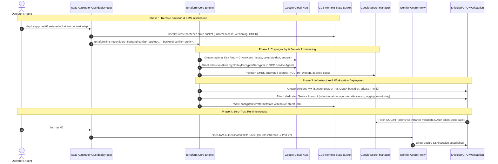

# Isaac Automator - GCP Security Hardening & Remote State Implementation Plan

A comprehensive, step-by-step engineering plan to integrate enterprise-grade security across the Isaac Automator GCP codebase.

This plan details the implementation of:
1. **Cloud KMS (CMEK)**: Customer-Managed Encryption Keys for disks, state buckets, and secrets.
2. **Google Secret Manager**: Zero-plaintext secret injection and runtime metadata retrieval.
3. **Hardened GCS Remote State**: Production Terraform backend with distributed locking, object versioning, and soft-delete recovery.
4. **Zero-Trust Network & IAP**: Private instances (no external IPs), Cloud IAP TCP forwarding, Private Google Access, and Cloud NAT.
5. **Shielded VM & OS Login**: Secure Boot, vTPM, integrity monitoring, and IAM-managed SSH with mandatory 2FA.
6. **Dedicated Service Accounts**: Least-privilege IAM replacing default Compute Engine service accounts.

---

## 1. System Architecture & Component Interactions



---

### 1.2 The Dynamic, Non-Hardcoded Infrastructure Principle

**Core Invariant: Zero Mandatory Overhead, Zero Forced Cost.**

Most robotics researchers, hobbyists, and solo engineers do not need—and cannot justify—the financial or operational overhead of enterprise cloud infrastructure (e.g. Cloud NAT alone costs ~$32.40/month baseline, and regional KMS key rings add per-key fees). Therefore:

1. **Strictly Feature-Flagged IaC**:
   - Every single enterprise resource (`google_compute_router`, `google_compute_router_nat`, `google_kms_key_ring`, `google_kms_crypto_key`, `google_secret_manager_secret`, `google_service_account`) uses conditional counts:
     ```hcl
     count = var.enable_<feature> ? 1 : 0
     ```
   - When flags are disabled (the default), **zero extra resources are provisioned**. The monthly added infrastructure cost is strictly **$0.00**.
2. **Zero Hardcoded Paths or Topology**:
   - All network subnets, KMS key links, bucket names, and authentication modes are dynamically evaluated based on user choice.
   - Deploying in default simple mode does not require Cloud KMS, Org Admin privileges, or Cloud NAT.

---

### 1.3 Pre-Configured Presets & Custom Saved Configurations

To support both simplicity and advanced tailoring, the architecture provides 3 pre-configured presets plus a **Special Custom Configurator**:

| Tier / Profile | Added Monthly Cost | Network Perimeter | Storage & State | Encryption | Auth & Identity |
| :--- | :--- | :--- | :--- | :--- | :--- |
| **`simple`** *(Default)* | **$0.00 / mo** | Ephemeral Public IP auto-restricted to caller's `/32` | Local `.tfstate` in `./state/<name>/` | Cloud-default Google-managed | OS-level metadata RSA key |
| **`team`** | **<$0.10 / mo** | Ephemeral Public IP (/32 lock or team CIDR) | Hardened GCS Remote State with native object locking | Cloud-default Google-managed | Scoped Service Account + Metadata key |
| **`enterprise`** | **~$35 - $180 / mo** | Zero Public IP (IAP TCP Forwarding + Cloud NAT) | Hardened GCS Remote State | Cloud KMS CMEK (90-day auto-rotation) | OS Login with 2FA + Shielded VM |
| **`custom`** *(User-Defined)* | **Dynamic ($0 - $180+)** | **User-Selected** (Public /32 vs IAP-only) | **User-Selected** (Local vs GCS Remote Bucket) | **User-Selected** (Google vs KMS CMEK) | **User-Selected** (OS Login vs Metadata key) |

#### Persistent Custom Profiles
Custom configurations can be given a custom name (e.g. `robotics-lab-iap`, `cybernetic-studio`) and persisted as declarative YAML files in `configs/profiles/<profile_name>.yaml` (or `~/.isaacautomator/profiles/`). 

Both the **CLI** (`./deploy-gcp <name> --profile configs/profiles/my-profile.yaml`) and the **`isaac9s` Cockpit** can read, validate, save, and launch from these custom profile specs dynamically.

---

## 2. File-by-File Implementation Plan

| File Path | Action | Description |
| :--- | :--- | :--- |
| `configs/profiles/` | **Create** | Directory for persistent declarative YAML profile definitions (both pre-configured and user-saved custom profiles). |
| `src/terraform/gcp/kms.tf` | **Create** | Regional KMS Key Ring, 3 CryptoKeys (compute-disk, storage, secrets), and service agent IAM bindings (conditional on `var.enable_cmek`). |
| `src/terraform/gcp/secrets.tf` | **Create** | CMEK-encrypted Secret Manager resources for NGC, HF, WandB, and desktop tokens (conditional on `var.enable_secrets`). |
| `src/terraform/bootstrap/gcp/main.tf` | **Create** | Standalone bootstrap module to provision the hardened GCS state bucket and KMS keys. |
| `src/terraform/gcp/variables.tf` | **Modify** | Add toggles: `enable_cmek`, `enable_iap_only`, `enable_oslogin`, `enable_secrets`, `state_bucket`, and secret variables. |
| `src/terraform/gcp/main.tf` | **Modify** | Parameterize backend, instantiate KMS and secrets modules, pass security variables to `ovkit`. |
| `src/terraform/gcp/outputs.tf` | **Modify** | Replace plaintext `output "ssh_key"` with Secret Manager secret URI or OS Login status. |
| `src/terraform/gcp/ovkit/variables.tf` | **Modify** | Accept KMS key links, service account email, and IAP/private networking flags. |
| `src/terraform/gcp/ovkit/main.tf` | **Modify** | Implement CMEK boot disk, Shielded VM config, dedicated SA, and OS Login metadata based on feature flags. |
| `src/terraform/gcp/ovkit/security.tf` | **Modify** | Add IAP firewall rule (`35.235.240.0/20`), Private Google Access subnet, and optional Cloud Router + Cloud NAT. |
| `src/python/config.py` | **Modify** | Add profile resolver: supports built-in presets (`simple`, `team`, `enterprise`) or custom YAML files from `configs/profiles/`. |
| `src/python/deployer.py` | **Modify** | Add dynamic GCS backend configuration, state bucket auto-provisioning, and IAP SSH tunnel handling. |
| `deploy-gcp` | **Modify** | Add Click CLI arguments for `--state-bucket`, `--cmek`, `--iap`, `--profile`, and custom YAML loading. |
| `src/python/gcp.py` | **Modify** | Add IAP tunneling helpers and OS Login SSH execution wrappers. |
| `src/tui/screens/profiles.py` | **Modify** | Custom Profile Builder in `isaac9s`: interactive toggle form, live dynamic cost estimator, Save to YAML, and Load Profile. |
| `src/tui/screens/deploy_modal.py` | **Modify** | Wire dynamic profiles and custom profile selection directly into the deployment modal. |

---

## 3. Detailed Code Modifications

### 3.1 Step 1: Create Cloud KMS Module (`src/terraform/gcp/kms.tf`)

Create `src/terraform/gcp/kms.tf` to define the cryptographic foundation:

```hcl
# ==============================================================================
# Cloud Key Management Service (KMS) - Customer-Managed Encryption Keys (CMEK)
# ==============================================================================

resource "google_project_service" "kms" {
  count              = var.enable_cmek ? 1 : 0
  project            = var.project
  service            = "cloudkms.googleapis.com"
  disable_on_destroy = false
}

data "google_project" "current" {
  project_id = var.project
}

# Regional KMS Key Ring
resource "google_kms_key_ring" "workstation_keyring" {
  count      = var.enable_cmek ? 1 : 0
  name       = "${var.prefix}-${var.deployment_name}-keyring"
  location   = local.region
  project    = var.project
  depends_on = [google_project_service.kms]
}

# 1. CryptoKey for Compute Engine Boot & Persistent Disks
resource "google_kms_crypto_key" "compute_disk_key" {
  count           = var.enable_cmek ? 1 : 0
  name            = "compute-disk-key"
  key_ring        = google_kms_key_ring.workstation_keyring[0].id
  rotation_period = "7776000s" # 90 days

  lifecycle {
    prevent_destroy = true
  }
}

# 2. CryptoKey for Cloud Storage (Terraform State & Backups)
resource "google_kms_crypto_key" "storage_key" {
  count           = var.enable_cmek ? 1 : 0
  name            = "storage-key"
  key_ring        = google_kms_key_ring.workstation_keyring[0].id
  rotation_period = "7776000s"

  lifecycle {
    prevent_destroy = true
  }
}

# 3. CryptoKey for Secret Manager Secrets
resource "google_kms_crypto_key" "secrets_key" {
  count           = var.enable_cmek ? 1 : 0
  name            = "secrets-key"
  key_ring        = google_kms_key_ring.workstation_keyring[0].id
  rotation_period = "7776000s"

  lifecycle {
    prevent_destroy = true
  }
}

# ------------------------------------------------------------------------------
# Service Agent IAM Grants (Required for CMEK Decryption)
# ------------------------------------------------------------------------------

# A. Compute Engine Service Agent
resource "google_kms_crypto_key_iam_member" "compute_cmek" {
  count         = var.enable_cmek ? 1 : 0
  crypto_key_id = google_kms_crypto_key.compute_disk_key[0].id
  role          = "roles/cloudkms.cryptoKeyEncrypterDecrypter"
  member        = "serviceAccount:service-${data.google_project.current.number}@compute-system.iam.gserviceaccount.com"
}

# B. Cloud Storage Service Agent
data "google_storage_project_service_account" "gcs_account" {
  project = var.project
}

resource "google_kms_crypto_key_iam_member" "storage_cmek" {
  count         = var.enable_cmek ? 1 : 0
  crypto_key_id = google_kms_crypto_key.storage_key[0].id
  role          = "roles/cloudkms.cryptoKeyEncrypterDecrypter"
  member        = "serviceAccount:${data.google_storage_project_service_account.gcs_account.email_address}"
}

# C. Secret Manager Service Agent
resource "google_kms_crypto_key_iam_member" "secretmanager_cmek" {
  count         = var.enable_cmek ? 1 : 0
  crypto_key_id = google_kms_crypto_key.secrets_key[0].id
  role          = "roles/cloudkms.cryptoKeyEncrypterDecrypter"
  member        = "serviceAccount:service-${data.google_project.current.number}@gcp-sa-secretmanager.iam.gserviceaccount.com"
}
```

---

### 3.2 Step 2: Create Secret Manager Module (`src/terraform/gcp/secrets.tf`)

Create `src/terraform/gcp/secrets.tf` to manage credentials securely:

```hcl
# ==============================================================================
# Google Secret Manager - Customer-Managed Encryption
# ==============================================================================

resource "google_project_service" "secretmanager" {
  project            = var.project
  service            = "secretmanager.googleapis.com"
  disable_on_destroy = false
}

# Helper local for secret replication policy
locals {
  use_cmek = var.enable_cmek && length(google_kms_crypto_key.secrets_key) > 0
}

# 1. NGC API Key
resource "google_secret_manager_secret" "ngc_api_key" {
  secret_id = "${var.prefix}-${var.deployment_name}-ngc-api-key"
  project   = var.project

  dynamic "replication" {
    for_each = local.use_cmek ? [1] : []
    content {
      user_managed {
        replicas {
          location = local.region
          customer_managed_encryption {
            kms_key_name = google_kms_crypto_key.secrets_key[0].id
          }
        }
      }
    }
  }

  dynamic "replication" {
    for_each = local.use_cmek ? [] : [1]
    content {
      automatic = true
    }
  }

  labels = {
    deployment = var.deployment_name
    managed_by = "isaac-automator"
  }

  depends_on = [
    google_kms_crypto_key_iam_member.secretmanager_cmek,
    google_project_service.secretmanager
  ]
}

resource "google_secret_manager_secret_version" "ngc_api_key_val" {
  count       = var.ngc_api_key != "" ? 1 : 0
  secret      = google_secret_manager_secret.ngc_api_key.id
  secret_data = var.ngc_api_key
}

# 2. Hugging Face Token
resource "google_secret_manager_secret" "hf_token" {
  secret_id = "${var.prefix}-${var.deployment_name}-hf-token"
  project   = var.project

  dynamic "replication" {
    for_each = local.use_cmek ? [1] : []
    content {
      user_managed {
        replicas {
          location = local.region
          customer_managed_encryption {
            kms_key_name = google_kms_crypto_key.secrets_key[0].id
          }
        }
      }
    }
  }

  dynamic "replication" {
    for_each = local.use_cmek ? [] : [1]
    content {
      automatic = true
    }
  }

  labels = {
    deployment = var.deployment_name
    managed_by = "isaac-automator"
  }

  depends_on = [
    google_kms_crypto_key_iam_member.secretmanager_cmek,
    google_project_service.secretmanager
  ]
}

resource "google_secret_manager_secret_version" "hf_token_val" {
  count       = var.hf_token != "" ? 1 : 0
  secret      = google_secret_manager_secret.hf_token.id
  secret_data = var.hf_token
}

# 3. Workstation Service Account IAM Access to Secrets
resource "google_secret_manager_secret_iam_member" "workstation_ngc_access" {
  secret_id = google_secret_manager_secret.ngc_api_key.secret_id
  role      = "roles/secretmanager.secretAccessor"
  member    = "serviceAccount:${module.isaac_workstation[0].service_account_email}"
}

resource "google_secret_manager_secret_iam_member" "workstation_hf_access" {
  secret_id = google_secret_manager_secret.hf_token.secret_id
  role      = "roles/secretmanager.secretAccessor"
  member    = "serviceAccount:${module.isaac_workstation[0].service_account_email}"
}
```

---

### 3.3 Step 3: Hardened Bootstrap State Module (`src/terraform/bootstrap/gcp/main.tf`)

Create `src/terraform/bootstrap/gcp/main.tf` for one-time or automated provisioning of the GCS remote state bucket:

```hcl
terraform {
  required_version = ">= 1.3.5"
  required_providers {
    google = {
      source  = "hashicorp/google"
      version = ">= 4.57.0"
    }
  }
}

variable "project" { type = string }
variable "region" { type = string, default = "us-central1" }
variable "state_bucket_name" { type = string, default = "" }
variable "kms_key_name" { type = string, default = "" }

locals {
  name = var.state_bucket_name != "" ? var.state_bucket_name : "isaacautomator-state-${var.project}-${var.region}"
}

# Production-Hardened State Bucket
resource "google_storage_bucket" "state_bucket" {
  name                        = local.name
  project                     = var.project
  location                    = var.region
  force_destroy               = false
  uniform_bucket_level_access = true
  public_access_prevention    = "enforced"

  versioning {
    enabled = true
  }

  soft_delete_policy {
    retention_duration_seconds = 604800 # 7-day retention against ransomware
  }

  dynamic "encryption" {
    for_each = var.kms_key_name != "" ? [1] : []
    content {
      default_kms_key_name = var.kms_key_name
    }
  }

  lifecycle_rule {
    action {
      type = "Delete"
    }
    condition {
      num_newer_versions         = 10
      days_since_noncurrent_time = 90
    }
  }
}

output "state_bucket_name" { value = google_storage_bucket.state_bucket.name }
output "state_bucket_url"  { value = google_storage_bucket.state_bucket.url }
```

---

### 3.4 Step 4: Workstation Instance & Compute Hardening (`src/terraform/gcp/ovkit/main.tf`)

Update `src/terraform/gcp/ovkit/main.tf` to introduce:
1. Dedicated Workstation Service Account.
2. Shielded VM configuration.
3. CMEK Boot Disk attachment.
4. OS Login metadata enforcement.

```hcl
# Dedicated Workstation Service Account (Principle of Least Privilege)
resource "google_service_account" "workstation_sa" {
  account_id   = "${var.prefix}-sa"
  display_name = "Isaac Workstation Instance Service Account"
}

resource "google_project_iam_member" "logging" {
  project = var.project
  role    = "roles/logging.logWriter"
  member  = "serviceAccount:${google_service_account.workstation_sa.email}"
}

resource "google_project_iam_member" "monitoring" {
  project = var.project
  role    = "roles/monitoring.metricWriter"
  member  = "serviceAccount:${google_service_account.workstation_sa.email}"
}

# Update google_compute_instance:
resource "google_compute_instance" "default" {
  name         = "${var.prefix}-vm"
  machine_type = var.instance_type
  # ...

  # CMEK Encrypted Boot Disk
  boot_disk {
    auto_delete       = true
    kms_key_self_link = var.kms_compute_disk_key_link

    initialize_params {
      image = var.from_image ? data.google_compute_image.prebuilt[0].self_link : local.boot_image
      size  = local.boot_disk_size
      type  = var.boot_disk_type
    }
  }

  # Hardware Root-of-Trust & Integrity Verification
  shielded_instance_config {
    enable_secure_boot          = true
    enable_vtpm                 = true
    enable_integrity_monitoring = true
  }

  # Security Metadata & OS Login
  metadata = merge(
    {
      enable-oslogin            = var.enable_oslogin ? "TRUE" : "FALSE"
      block-project-ssh-keys   = var.enable_oslogin ? "TRUE" : "FALSE"
      disable-legacy-endpoints = "TRUE"
    },
    var.enable_oslogin ? {} : {
      ssh-keys = "${local.os_username}:${var.public_key_openssh}"
    }
  )

  # Network Interface: Omits access_config when enable_iap_only is true
  network_interface {
    network    = google_compute_network.default.self_link
    subnetwork = google_compute_subnetwork.default.self_link

    dynamic "access_config" {
      for_each = var.enable_iap_only ? [] : [1]
      content {
        nat_ip = google_compute_address.static_ip[0].address
      }
    }
  }

  # Attach Dedicated SA with minimal OAuth scopes
  service_account {
    email  = google_service_account.workstation_sa.email
    scopes = ["cloud-platform"]
  }
}
```

---

### 3.5 Step 5: Zero-Trust Networking & IAP Firewall (`src/terraform/gcp/ovkit/security.tf`)

Update `src/terraform/gcp/ovkit/security.tf`:
1. Custom subnet with `private_ip_google_access = true`.
2. Cloud Router & Cloud NAT for private instances.
3. IAP TCP Forwarding firewall rule (`35.235.240.0/20`).

```hcl
# Dedicated Subnetwork with Private Google Access
resource "google_compute_subnetwork" "default" {
  name                     = "${var.prefix}-subnet"
  ip_cidr_range            = "10.10.0.0/24"
  region                   = var.region
  network                  = google_compute_network.default.id
  private_ip_google_access = true
}

# Cloud Router & NAT (Outbound access for private instances)
resource "google_compute_router" "router" {
  count   = var.enable_iap_only ? 1 : 0
  name    = "${var.prefix}-router"
  region  = var.region
  network = google_compute_network.default.id
}

resource "google_compute_router_nat" "nat" {
  count                              = var.enable_iap_only ? 1 : 0
  name                               = "${var.prefix}-nat"
  router                             = google_compute_router.router[0].name
  region                             = var.region
  nat_ip_allocate_option             = "AUTO_ONLY"
  source_subnetwork_ip_ranges_to_nat = "ALL_SUBNETWORKS_ALL_IP_RANGES"
}

# Identity-Aware Proxy (IAP) TCP Forwarding Ingress Rule
resource "google_compute_firewall" "iap_ingress" {
  name    = "${var.prefix}-fwrules-iap-ingress"
  network = google_compute_network.default.self_link

  direction     = "INGRESS"
  source_ranges = ["35.235.240.0/20"] # Official Google IAP CIDR Block

  allow {
    protocol = "tcp"
    ports    = ["22", "8443", "8444", "6080", "4000"]
  }
}
```

---

### 3.6 Step 6: Dynamic Backend Initialization in `src/python/deployer.py`

Modify `initialize_terraform()` in `src/python/deployer.py` to dynamically wire GCS remote backends and handle auto-creation:

```python
    def initialize_terraform(self, cwd: str):
        """
        Dynamically initializes Terraform with local state fallback or GCS remote backend
        """
        debug = self.params.get("debug", False)
        deployment_name = self.params["deployment_name"]
        cloud = self.params.get("cloud", "gcp")
        state_bucket = self.params.get("state_bucket") or os.environ.get("ISAAC_STATE_BUCKET")

        if not state_bucket:
            # Local backend fallback
            tfstate_file = Path(
                f"{self.config['state_dir']}/{deployment_name}/.tfstate"
            ).absolute()
            backend_args = f'-backend-config="path={tfstate_file}"'
        else:
            bucket = state_bucket.replace("gs://", "").rstrip("/")
            prefix = f"isaacautomator/v1/deployments/{deployment_name}/terraform"

            # Auto-provision state bucket if requested
            if bucket == "auto":
                project = self.params.get("project")
                region = self.params.get("region", "us-central1")
                bucket = f"isaacautomator-state-{project}-{region}"
                self._ensure_gcs_state_bucket(bucket, project, region)

            backend_args = (
                f'-backend-config="bucket={bucket}" '
                f'-backend-config="prefix={prefix}"'
            )

        shell_command(
            f"terraform init -upgrade -no-color -input=false -reconfigure {backend_args} {' > /dev/null' if not debug else ''}",
            verbose=debug,
            cwd=cwd,
        )
```

---

### 3.7 Step 7: Custom Profile Schema & Persistence Engine (`configs/profiles/*.yaml`)

To ensure that infrastructure remains **100% dynamic** and never hardcoded, `IsaacAutomator` introduces a declarative profile schema. Users can define custom profiles or save configurations built inside `isaac9s`.

Stored in `configs/profiles/<profile_name>.yaml` (or user directory `~/.isaacautomator/profiles/`):

```yaml
# ==============================================================================
# Isaac Automator - Declarative Workstation Profile Specification
# ==============================================================================
schema_version: "v1alpha1"
profile_name: "cybernetic-studio"
description: "Collaborative team profile with remote GCS state and IAP zero-trust without KMS overhead"
cloud: "gcp"

security:
  tier: "custom" # "simple" | "team" | "enterprise" | "custom"
  
  # Network & Ingress Perimeter
  network:
    iap_only: true              # True = Zero public IP (IAP-only access)
    cloud_nat: true             # Required if iap_only is true for outbound package traffic
    ingress_cidrs: []           # Empty when iap_only is true, or ["auto"] for /32 lock
  
  # Storage & State Locking
  storage:
    state_backend: "gcs"        # "local" | "gcs"
    state_bucket: "auto"        # "auto" or custom bucket name "gs://my-bucket"
    state_locking: true
    soft_delete_days: 7
  
  # Cryptographic Engine
  cryptography:
    encryption_type: "google_managed" # "google_managed" | "kms_cmek"
    kms_keyring_name: ""        # Only evaluated when encryption_type == "kms_cmek"
    rotation_days: 90
  
  # Compute & Hardware Integrity
  compute:
    shielded_vm: true           # Secure Boot, vTPM, and Runtime Integrity Monitoring
    os_login: true              # Central IAM authentication with mandatory 2FA
    service_account_type: "dedicated" # "dedicated" (PoLP) | "default"
  
  # Credentials & Secrets Handling
  secrets:
    engine: "secret_manager"    # "secret_manager" | "env_vars"

workstation:
  gpu_model: "g2-standard-8"
  demos: ["franka-manipulation"]
  remote_desktop: "standard"
```

#### CLI Loading & Validation
The CLI dynamically resolves `--profile`:
```bash
# Using a built-in preset:
./deploy-gcp box01 --profile simple

# Using a saved custom profile by name:
./deploy-gcp box01 --profile cybernetic-studio

# Using an explicit YAML path:
./deploy-gcp box01 --profile configs/profiles/my-special-rig.yaml
```

---

### 3.8 Step 8: `isaac9s` Dynamic Configurator & Real-Time Cost Calculator

In `isaac9s`, the **Profiles Screen** (`p` / `:profile`) and **Deploy Modal** (`n` / `:deploy`) are enhanced with an interactive custom builder:

```text
╭─ isaac9s » Declarative Profile & Dynamic Security Builder ───────────────────────────────────────────╮
│ Active Workstation Context: test03-gcp  |  Config Engine: Dynamic Feature-Flagged                     │
╰───────────────────────────────────────────────────────────────────────────────────────────────────────╯
  PRESET MODES:
    (•) Simple Mode ($0.00/mo)       - Dynamic /32 IP lock, local state, Google-managed encryption
    ( ) Team Mode (<$0.10/mo)        - Remote GCS state locking, shared asset bucket
    ( ) Enterprise Mode ($35-180/mo) - Private VM, IAP tunnel, Cloud NAT, KMS CMEK, Shielded VM
    ( ) Custom Mode (Interactive)    - Tailor every subsystem individually and save to YAML

  CUSTOM SUBSYSTEM TOGGLES:
    [X] Zero Public IP (IAP TCP Forwarding)                [Added Cost: $0.00 / mo]
    [X] Cloud NAT Gateway (Required for Private Outbound)  [Added Cost: +$32.40 / mo]
    [X] Remote GCS State Storage with Native Locking       [Added Cost: +$0.05 / mo]
    [ ] Customer-Managed Encryption Keys (Cloud KMS CMEK)  [Added Cost: +$1.80 / mo]
    [X] Shielded VM (Secure Boot, vTPM, Integrity Mon)     [Added Cost: $0.00 / mo]
    [X] OS Login with Mandatory 2FA                        [Added Cost: $0.00 / mo]
    [X] Google Secret Manager (Zero-Bake Credentials)      [Added Cost: +$0.06 / mo]

  DYNAMIC ESTIMATED OVERHEAD:  +$32.51 / month  (Cloud NAT + GCS + GSM)

  PROFILE NAME: [ cybernetic-studio                 ]
  ─────────────────────────────────────────────────────────────────────────────────────────────────────
  [s] Save Custom Profile to YAML    [l] Load Saved Profile    [a] Apply to Deploy Context    [Esc] Back
```

- **Live Reactive Calculation**: As checkboxes are toggled, Textual's reactive properties recalculate the exact cloud cost delta in real time.
- **Persistence**: Pressing `[s]` serializes the configuration to `configs/profiles/<profile_name>.yaml`.
- **Automatic Discovery**: Any `.yaml` file added to `configs/profiles/` immediately appears in the profile selection dropdown across both `isaac9s` and the CLI.

---

## 4. Verification, Testing & Validation Runbook

### 4.1 Pre-Flight Check
Ensure necessary Google Cloud APIs are activated:
```bash
gcloud services enable \
  compute.googleapis.com \
  cloudkms.googleapis.com \
  secretmanager.googleapis.com \
  storage.googleapis.com \
  iap.googleapis.com
```

### 4.2 Step-by-Step Validation Matrix

| Test Case | Execution Command | Success Criteria |
| :--- | :--- | :--- |
| **1. KMS Key Ring & CMEK Creation** | `terraform apply -target=google_kms_key_ring.workstation_keyring` | Key ring created in target region; 3 crypto keys present with 90-day rotation. |
| **2. GCS State Bucket Hardening** | `gcloud storage buckets describe gs://<state-bucket>` | `uniformBucketLevelAccess.enabled = true`, `versioning.enabled = true`, `publicAccessPrevention = enforced`. |
| **3. Secret Manager Retrieval** | `gcloud secrets versions access latest --secret=<name>-ngc-api-key` | Successfully retrieves decrypted payload using KMS key. |
| **4. Shielded VM & CMEK Disk** | `gcloud compute instances describe <vm> --format="yaml(shieldedInstanceConfig, bootDisk)"` | `enableSecureBoot: true`, `enableVtpm: true`, `kmsKeyServiceAccount` populated. |
| **5. Private IP & IAP SSH Tunnel** | `./ssh <vm> --iap` | SSH connection connects through `35.235.240.0/20` tunnel; zero public IP assigned to VM. |
| **6. GCS State Concurrency Lock** | Run concurrent `terraform plan` on two terminal sessions | Second process halts with state lock error until first process completes. |

---

## 5. Rollout Timeline & Phasing

- **Sprint 1 (Days 1–3)**: Deploy `kms.tf` and `bootstrap/gcp/main.tf`; update `deployer.py` with GCS backend support.
- **Sprint 2 (Days 4–6)**: Implement `secrets.tf` and runtime metadata extraction; remove plaintext outputs from `.tfstate`.
- **Sprint 3 (Days 7–9)**: Implement Shielded VM, OS Login with 2FA, and dedicated Workstation Service Account.
- **Sprint 4 (Days 10–12)**: Implement Zero-Trust IAP TCP forwarding, private subnets, and Cloud NAT; validate end-to-end.
