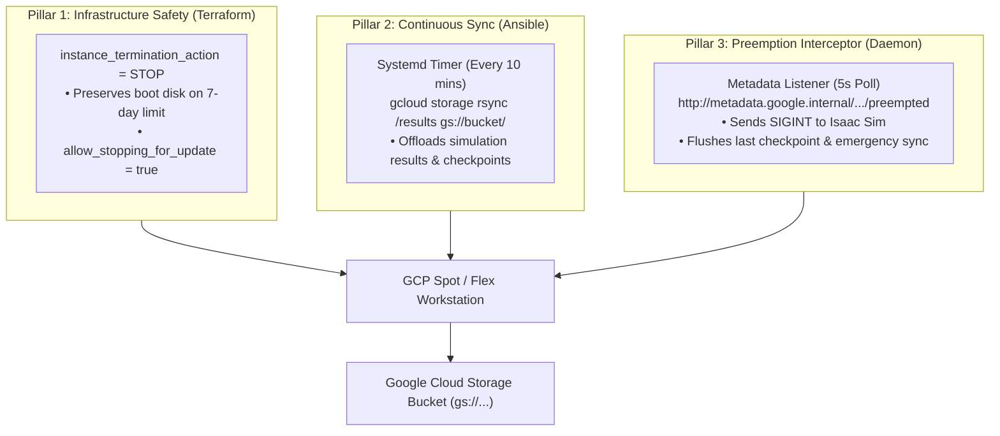

# Isaac Automator - Flex-start Integration & Spot Resilience Plan

A comprehensive architectural plan for deploying and managing GCP Flex-start (Dynamic Workload Scheduler) and Spot GPU instances with automated lifecycle cycling, preemption detection, and off-instance state resilience.

---

## 1. Terraform Variables Update

Modify `src/terraform/gcp/variables.tf` and `src/terraform/gcp/ovkit/variables.tf` to introduce the optional flag.

```hcl
variable "use_flex_start" {
  description = "Deploy using GCP Flex-start (Dynamic Workload Scheduler) to improve capacity availability"
  type        = bool
  default     = false
}
```

---

## 2. Terraform Main Configuration Update

Modify the `google_compute_instance` resource in `src/terraform/gcp/ovkit/main.tf` using dynamic blocks to conditionally apply the Flex-start scheduling configuration:

```hcl
  dynamic "scheduling" {
    for_each = var.use_flex_start ? [1] : []
    content {
      provisioning_model          = "FLEX_START"
      instance_termination_action = "STOP"
      automatic_restart           = false
      on_host_maintenance         = "TERMINATE" # Mandatory for GPUs

      max_run_duration {
        seconds = 604800 # 7 days max allowed duration
      }
    }
  }

  dynamic "scheduling" {
    for_each = var.use_flex_start ? [] : [1]
    content {
      provisioning_model  = "STANDARD"
      on_host_maintenance = "TERMINATE" # Mandatory for GPUs
    }
  }
```

---

## 3. CLI Wrapper Update

Update `deploy-gcp` to accept the `--flex-start / --no-flex-start` Click flag and inject it into `.tfvars.json`:

```python
# Add option definition to DeployGCPCommand
self.params.insert(
    self.param_index("ingress_cidrs"),
    click.core.Option(
        ("--flex-start/--no-flex-start",),
        default=False,
        show_default=True,
        help="Deploy using GCP Flex-start (Dynamic Workload Scheduler).",
    ),
)

# Pass into self.create_tfvars(...)
"use_flex_start": self.params.get("flex_start", False),
```

---

## 4. Flex-start VM Cycling Utility (`cycle-vm`)

The `cycle-vm` tool inspects instance uptime using GCP `lastStartTimestamp` and automatically recycles the instance before reaching the 7-day hard limit:

```python
# Uptime evaluation and cycle trigger in cycle-vm
uptime_seconds = gcp_get_instance_uptime_seconds(instance_name, zone=zone, project=project)
max_age_seconds = max_age_hours * 3600 # Default 156 hours (6.5 days)

if uptime_seconds >= max_age_seconds:
    click.echo("* VM uptime has exceeded threshold. Initiating cycle...")
    gcp_stop_instance(instance_name, zone=zone, project=project)
    time.sleep(settle_delay)
    gcp_start_instance(instance_name, zone=zone, project=project)
```

---

## 5. Spot Preemption & State Resilience Strategy

Because Spot/Preemptible instances can be stopped or deleted when cloud capacity shifts, the architecture must guarantee zero data loss.

### 5.1 Industry Strategy Comparison

| Strategy | Architecture | Pros | Cons / Trade-offs | Recommendation |
| :--- | :--- | :--- | :--- | :--- |
| **Periodic GCS Object Sync** | Background timer syncing `/home/ubuntu/results` to Google Cloud Storage (`gs://...`). | • Decoupled from VM & Zone.<br>• Resumable from *any* replacement VM in any region.<br>• Lowest cost storage ($0.020/GB/mo). | Requires background cron/timer. | **Primary State Backbone** (Industry Gold Standard) |
| **30-Second Preemption Interceptor** | Daemon polling `http://metadata.google.internal/computeMetadata/v1/instance/preempted`. | • Traps preemption signal.<br>• Safely stops Isaac Sim and runs emergency flush. | 30 seconds is brief; cannot transfer massive multi-gigabyte models alone. | **Mandatory Safety Net** (Pairs with periodic sync) |
| **`instance_termination_action = STOP`** | Configured in Terraform scheduling block. | • Preserves boot disk & static IP upon 7-day timer expiration. | Disk still incurs stopped storage cost; does not protect against zone failures. | **Current Baseline** (Implemented) |
| **Decoupled Persistent Data Disk** | Secondary `google_compute_disk` mounted to `/data`. | • Fast local block I/O. | **Zonal Lock-in**: Cannot attach a `us-central1-a` disk to a new VM in `us-central1-b`. | Secondary (For massive datasets) |
| **Scheduled GCP Disk Snapshots** | Automated `google_compute_resource_policy` snapshot schedule. | • Managed by GCP control plane. | Minimum interval is 1 hour; cannot capture live in-memory buffers. | Disaster Recovery only |

---

### 5.2 The 3-Pillar Resilience Architecture



---

## 6. Implementation Strategy & Roadmap

### Phase 1: Cloud Storage Backup Role (Ansible)
* **Goal**: Provide automated continuous backup of checkpoints and outputs.
* **Implementation**:
  * Create `src/ansible/roles/isaac-workstation/tasks/gcs-sync.yml`.
  * Configure systemd timer: `isaac-backup.timer` (executes `gcloud storage rsync /home/ubuntu/results gs://{{ gcs_backup_bucket }}/{{ deployment_name }}/results/` every 10 minutes).
  * Add automatic pull upon boot if `--restore` flag is enabled.

### Phase 2: Metadata Preemption Interceptor Daemon (Ansible + Python)
* **Goal**: Handle the 30-second preemption warning gracefully.
* **Implementation**:
  * Install `isaac-preempt-listener.service` via Ansible.
  * Python daemon queries:
    ```bash
    curl -s -H "Metadata-Flavor: Google" http://metadata.google.internal/computeMetadata/v1/instance/preempted
    ```
  * When `TRUE` is detected:
    1. Sends `SIGINT` to Isaac Sim / Python training process to trigger model serialization.
    2. Runs `gcloud storage rsync /home/ubuntu/results gs://... --delete-unmatched-destination-objects`.
    3. Logs timestamp and preemption reason.

### Phase 3: Terraform GCS Bucket & IAM Setup (Terraform)
* **Goal**: Automate bucket provisioning and service account permissions.
* **Implementation**:
  * In `src/terraform/gcp/main.tf`, conditionally provision `google_storage_bucket.backup_store` (if `var.enable_gcs_backup` is true).
  * Assign `roles/storage.objectUser` to the Compute Engine default service account.

### Phase 4: CLI Integration (`./deploy-gcp` & `./restore-gcp`)
* **Goal**: Expose unified flags to the operator.
* **Implementation**:
  * Add `--backup-bucket <bucket_name>` and `--auto-restore` to `./deploy-gcp`.
  * Create `./restore-gcp <deployment_name>` to synchronize from GCS on demand.

---

## 7. Usage Examples

### Deploy with Flex-start & GCS Backup
```bash
./deploy-gcp \
  --deployment-name gcp-flex-ws \
  --zone us-central1-a \
  --project my-gcp-project \
  --instance-type g2-standard-8 \
  --isaac-workstation-gpu-count 1 \
  --flex-start \
  --existing replace
```

### Inspect Uptime & Cycle
```bash
# Check uptime without stopping
./cycle-vm gcp-flex-ws --check-only

# Automated cycle (if uptime >= 6.5 days)
./cycle-vm gcp-flex-ws
```
