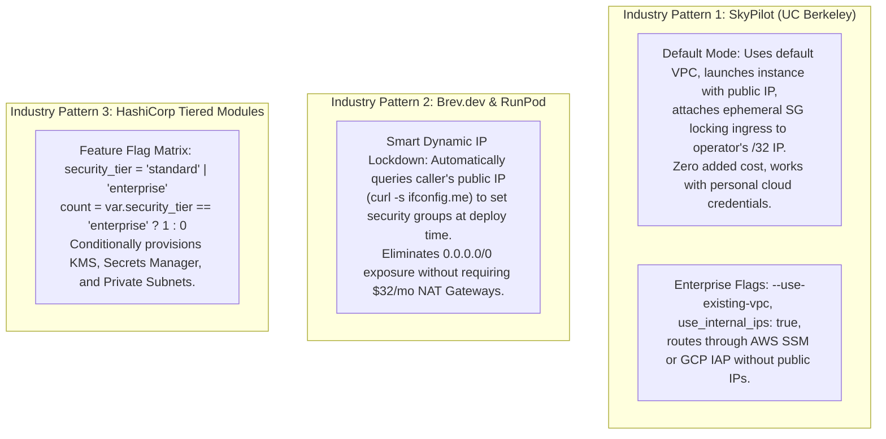
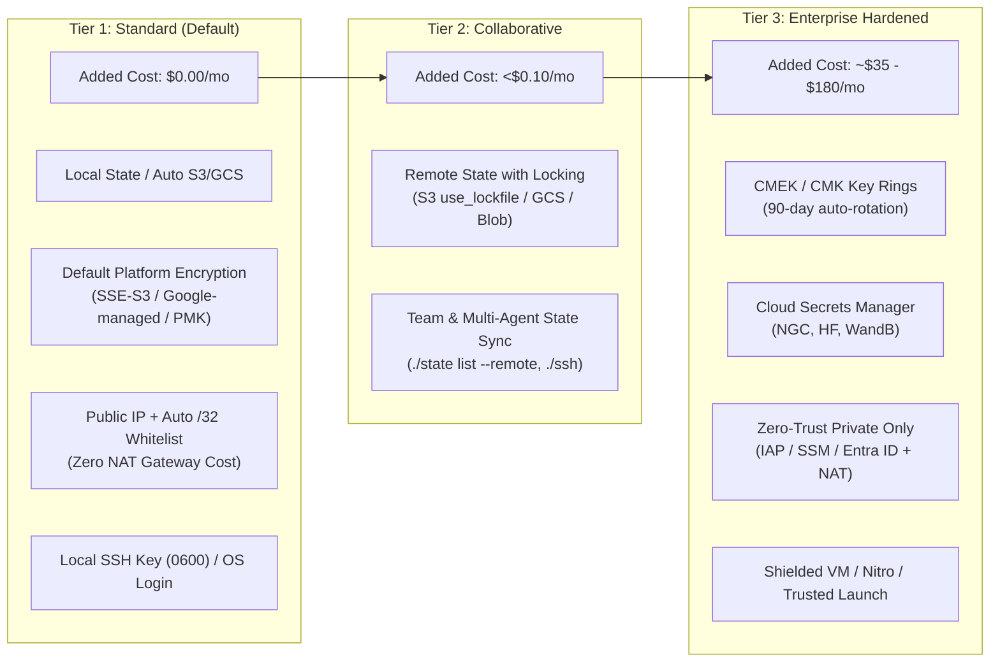
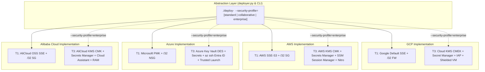
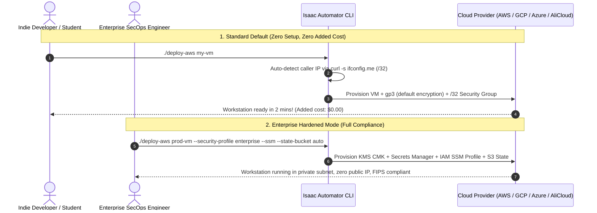
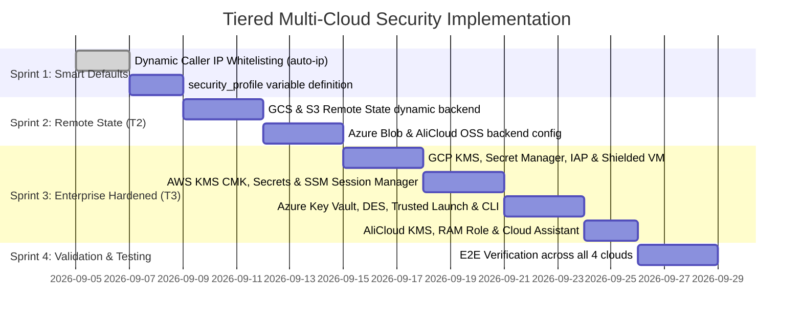

# Multi-Cloud Tiered Security & Workstation Hardening Plan
**Progressive Disclosure Architecture for Non-Expert Developers, Academic Researchers, and Enterprise Teams Across AWS, GCP, Azure, and Alibaba Cloud**

---

## 1. Executive Summary & Core Design Philosophy

Isaac Automator deploys high-performance GPU workstations (NVIDIA L4, T4, A100, RTX 4090) for Isaac Sim, Isaac Lab, and robotics workloads across four public cloud providers: **AWS, GCP, Microsoft Azure, and Alibaba Cloud**.

### The Core Problem: The Anti-Pattern of Forced Complexity
Forcing enterprise-grade security controls (Customer-Managed KMS keys, Cloud NAT gateways, private subnets, organizational IAM policies, and Cloud Secret Managers) by default is a severe anti-pattern for Isaac Automator's primary audience:
1. **Unacceptable Idle Dollar Costs**: 
   - A GCP Cloud NAT gateway costs ~$32.00/month.
   - An AWS NAT Gateway costs ~$32.40/month + data processing.
   - An Azure NAT Gateway is ~$32.85/month; standard Azure Bastion is ~$140.00/month.
   - Dedicated KMS keys incur per-key monthly fees ($1.00/key/month) across state, disk, and secret keys.
   - *Impact*: A student or independent researcher spinning up a workstation for 3 hours of RL training would incur persistent background charges that exceed the GPU compute cost!
2. **Permission Blockers & Organization Lockout**:
   - Smaller users, academic researchers, and developers in corporate sandbox accounts do not have Organization Admin or Project IAM Admin roles required to create Key Rings, configure Service Agent bindings, or create Cloud Routers.
3. **Friction and Fragility**:
   - Requiring pre-existing state buckets, KMS keys, and specialized client plugins causes initial deployments to fail for non-expert users.

### The Solution: "Zero-Friction Default, Progressive Enterprise Hardening"
Following the architecture of leading modern developer tools (such as **UC Berkeley SkyPilot**, **Brev.dev**, and **HashiCorp Well-Architected Blueprints**), Isaac Automator adopts a **Tiered Security Architecture**:
- **Tier 1 (Standard - Default)**: Zero added dollar cost, zero setup friction, instantaneous single-command deploy (`./deploy-<cloud> <name>`), utilizing built-in platform encryption and automatic client IP whitelisting (`my_ip/32`).
- **Tier 2 (Collaborative - Opt-In)**: Low-cost remote state synchronization (S3, GCS, Azure Blob, AliCloud OSS) for multi-agent and team collaboration.
- **Tier 3 (Hardened / Enterprise - Opt-In)**: Full regulatory compliance (CMEK, Cloud Secrets Manager, Zero-Trust IAP/SSM/Bastion, Shielded VMs, and Workload Identity Federation).

---

## 2. Research: How Other Cloud & Robotics Solutions Solve This

Industry research reveals three proven patterns for balancing non-expert developer experience with enterprise compliance:



### Key Architectural Discovery: The Zero-Cost Private Ingress Pattern
A common misconception is that keeping a VM private requires removing its public IP and purchasing a Cloud NAT Gateway ($32+/month). 
**The Zero-Cost Alternative**:
- The VM is assigned an ephemeral public IP, allowing outbound internet access for package installations (`apt-get`, `uv pip`, Docker) **for $0.00 in NAT fees**.
- The ingress firewall completely blocks `0.0.0.0/0` and permits incoming traffic **only** from:
  - The operator's specific public IP (`<operator_ip>/32`), OR
  - Google Cloud IAP CIDR (`35.235.240.0/20`), OR
  - AWS SSM Session Manager (via IAM instance profile).
- **Result**: Zero public attack surface, 100% protected ingress, and **$0.00 added network infrastructure cost**.

---

## 3. The Three-Tier Security Architecture



| Security Dimension | Tier 1: Standard (Default) | Tier 2: Collaborative (Opt-In) | Tier 3: Enterprise Hardened (Opt-In) |
| :--- | :--- | :--- | :--- |
| **Target User** | Individual researchers, students, hobbyists, quick testing. | Small engineering teams, multi-agent automated pipelines. | Regulated defense/enterprise, SOC2, FedRAMP, ISO 27001. |
| **Added Monthly Cost** | **$0.00** | **~$0.05** (Storage bucket operations) | **~$35 – $180+** (KMS, Cloud NAT, Bastion, Secrets) |
| **Terraform State** | Local `./state/<name>/.tfstate` | Cloud bucket (S3, GCS, Azure Blob, OSS) with native locking | Cloud bucket with CMEK, 7-day soft delete, and strict IAM |
| **Data Encryption** | Free cloud-default encryption at rest | Free cloud-default encryption at rest | Customer-Managed Encryption Keys (KMS CMEK / CMK) |
| **Secrets & Keys** | Local `state/<name>/key.pem` (0600) & `.env` | Remote state bundle with SHA256 verification | Cloud Secret Manager (GCP, AWS, Azure Key Vault, AliCloud) |
| **Inbound Security** | Dynamic operator `/32` whitelist (`auto-ip`) | Dynamic operator `/32` whitelist (`auto-ip`) | Zero Public IP; Cloud IAP / AWS SSM / Azure Bastion / Cloud NAT |
| **Hardware Integrity**| Standard GPU instance configuration | Standard GPU instance configuration | Shielded VM (Secure Boot, vTPM) / Nitro Enclaves / Trusted Launch |
| **Identity & IAM** | Standard user credentials (ADC, AWS profile) | Standard user credentials | Dedicated least-privilege service account & WIF (OIDC) |

---

## 4. Multi-Cloud Equivalence Matrix across All Four Providers

Isaac Automator provides consistent abstractions across **GCP, AWS, Azure, and Alibaba Cloud**:



### Detailed Provider Comparison

| Capability | Google Cloud (GCP) | Amazon Web Services (AWS) | Microsoft Azure | Alibaba Cloud (AliCloud) |
| :--- | :--- | :--- | :--- | :--- |
| **Standard Encryption (T1)** | Google-managed encryption at rest | AWS SSE-S3 (`AES256`) | Azure Platform-Managed Keys (PMK) | Alibaba Cloud OSS/ECS standard encryption |
| **CMEK / CMK (T3)** | Cloud KMS Key Rings & CryptoKeys | AWS KMS Customer Managed Keys (CMK) | Azure Key Vault + Disk Encryption Sets | Alibaba Cloud KMS CMKs |
| **Secrets Management (T3)**| Google Secret Manager | AWS Secrets Manager (or SSM Parameter Store) | Azure Key Vault Secrets | Alibaba Cloud KMS Secrets Manager |
| **Remote State Backend (T2)**| `backend "gcs"` with native precondition lock | `backend "s3"` with `use_lockfile = true` (TF 1.6+) | `backend "azurerm"` with blob versioning | `backend "oss"` with bucket versioning |
| **Zero-Trust Access (T3)** | Identity-Aware Proxy (`35.235.240.0/20`) | AWS Systems Manager (SSM) Session Manager | `az ssh vm` (Entra ID) / Bastion Dev SKU | Cloud Assistant / Alibaba Bastion |
| **Hardware Root of Trust** | Shielded VM (Secure Boot, vTPM, Integrity) | Nitro Enclaves / UEFI Secure Boot | Trusted Launch (Secure Boot, vTPM) | Security Center / UEFI Secure Boot |
| **Instance Identity** | Dedicated Service Account (PoLP) | IAM Instance Profile (`AmazonSSMManagedInstanceCore`) | User-Assigned Managed Identity | RAM Role for ECS |

---

## 5. Terraform Code Implementation Across Clouds

To keep the codebase modular, all enterprise resources use `count = var.security_profile == "enterprise" ? 1 : 0` or feature toggles.

### 5.1 Common Variable Definition across All Clouds
Add to `src/terraform/<cloud>/variables.tf`:

```hcl
variable "security_profile" {
  description = "Security profile: 'standard' (zero extra cost, public IP locked to deployer /32), 'collaborative' (adds remote state), or 'enterprise' (KMS CMEK, secrets manager, zero-trust private access)"
  type        = string
  default     = "standard"
  validation {
    condition     = contains(["standard", "collaborative", "enterprise"], var.security_profile)
    error_message = "security_profile must be 'standard', 'collaborative', or 'enterprise'."
  }
}

variable "auto_ingress_ip" {
  description = "Automatically detected public IP of the deployer to restrict ingress (e.g. 203.0.113.45/32). If empty, falls back to ingress_cidrs."
  type        = string
  default     = ""
}
```

---

### 5.2 Google Cloud Platform (GCP) Implementation

#### A. Conditional KMS & Secrets (`src/terraform/gcp/kms_and_secrets.tf`)
```hcl
locals {
  is_enterprise = var.security_profile == "enterprise"
}

# KMS Key Ring - Only provisioned in Enterprise tier
resource "google_kms_key_ring" "keyring" {
  count    = local.is_enterprise ? 1 : 0
  name     = "${var.prefix}-${var.deployment_name}-keyring"
  location = local.region
  project  = var.project
}

resource "google_kms_crypto_key" "disk_key" {
  count           = local.is_enterprise ? 1 : 0
  name            = "compute-disk-key"
  key_ring        = google_kms_key_ring.keyring[0].id
  rotation_period = "7776000s"
}

# Secret Manager - Only provisioned in Enterprise tier
resource "google_secret_manager_secret" "ngc_key" {
  count     = local.is_enterprise && var.ngc_api_key != "" ? 1 : 0
  secret_id = "${var.prefix}-${var.deployment_name}-ngc-key"
  replication {
    user_managed {
      replicas {
        location = local.region
        customer_managed_encryption {
          kms_key_name = google_kms_crypto_key.disk_key[0].id
        }
      }
    }
  }
}
```

#### B. Workstation Compute & Security Configuration (`src/terraform/gcp/ovkit/main.tf`)
```hcl
locals {
  is_enterprise = var.security_profile == "enterprise"
  # Smart Ingress: Use auto_ingress_ip if supplied, else var.ingress_cidrs
  allowed_cidrs = var.auto_ingress_ip != "" ? [var.auto_ingress_ip] : var.ingress_cidrs
}

resource "google_compute_instance" "default" {
  name         = "${var.prefix}-vm"
  machine_type = var.instance_type

  boot_disk {
    auto_delete = true
    # CMEK only in enterprise tier; standard tier uses Google default encryption
    kms_key_self_link = local.is_enterprise ? var.kms_disk_key_link : null

    initialize_params {
      image = var.from_image ? data.google_compute_image.prebuilt[0].self_link : local.boot_image
      size  = local.boot_disk_size
      type  = var.boot_disk_type
    }
  }

  # Shielded VM enabled conditionally
  shielded_instance_config {
    enable_secure_boot          = local.is_enterprise
    enable_vtpm                 = local.is_enterprise
    enable_integrity_monitoring = local.is_enterprise
  }

  network_interface {
    network = google_compute_network.default.self_link
    # Standard tier: Ephemeral public IP (free outbound internet, no NAT Gateway)
    # Enterprise tier without public IP: Omit access_config and use Cloud NAT + IAP
    dynamic "access_config" {
      for_each = (!local.is_enterprise || !var.private_only) ? [1] : []
      content {
        nat_ip = google_compute_address.static_ip.address
      }
    }
  }
}
```

---

### 5.3 Amazon Web Services (AWS) Implementation

#### A. Conditional KMS & SSM Instance Profile (`src/terraform/aws/enterprise.tf`)
```hcl
locals {
  is_enterprise = var.security_profile == "enterprise"
}

# AWS KMS Customer Managed Key (CMK)
resource "aws_kms_key" "ebs_key" {
  count                   = local.is_enterprise ? 1 : 0
  description             = "KMS Key for Isaac Workstation EBS encryption"
  deletion_window_in_days = 7
  enable_key_rotation     = true
}

# IAM Role for AWS Systems Manager (SSM) Session Manager
resource "aws_iam_role" "ssm_role" {
  count = local.is_enterprise ? 1 : 0
  name  = "${var.prefix}-ssm-role"

  assume_role_policy = jsonencode({
    Version = "2012-10-17"
    Statement = [{
      Action    = "sts:AssumeRole"
      Effect    = "Allow"
      Principal = { Service = "ec2.amazonaws.com" }
    }]
  })
}

resource "aws_iam_role_policy_attachment" "ssm_policy" {
  count      = local.is_enterprise ? 1 : 0
  role       = aws_iam_role.ssm_role[0].name
  policy_arn = "arn:aws:iam::aws:policy/AmazonSSMManagedInstanceCore"
}

resource "aws_iam_instance_profile" "ssm_profile" {
  count = local.is_enterprise ? 1 : 0
  name  = "${var.prefix}-ssm-profile"
  role  = aws_iam_role.ssm_role[0].name
}
```

#### B. Workstation EC2 & Security Group (`src/terraform/aws/isaac-workstation/main.tf`)
```hcl
locals {
  is_enterprise = var.security_profile == "enterprise"
  allowed_cidrs = var.auto_ingress_ip != "" ? [var.auto_ingress_ip] : var.ingress_cidrs
}

resource "aws_instance" "instance" {
  ami           = var.ami_id != "" ? var.ami_id : data.aws_ami.ami.id
  instance_type = var.instance_type
  key_name      = var.keypair_id
  subnet_id     = aws_subnet.subnet.id

  # Attach SSM profile in Enterprise mode; null in Standard mode
  iam_instance_profile = local.is_enterprise ? aws_iam_instance_profile.ssm_profile[0].name : null

  root_block_device {
    volume_type           = "gp3"
    volume_size           = "256"
    delete_on_termination = true
    # Standard: Default AWS SSE-S3 encryption ($0 cost). Enterprise: KMS CMK
    encrypted             = true
    kms_key_id           = local.is_enterprise ? aws_kms_key.ebs_key[0].arn : null
  }
}
```

---

### 5.4 Microsoft Azure Implementation

#### A. Trusted Launch & Key Vault (`src/terraform/azure/enterprise.tf`)
```hcl
locals {
  is_enterprise = var.security_profile == "enterprise"
}

# Key Vault - Only in Enterprise tier
resource "azurerm_key_vault" "kv" {
  count               = local.is_enterprise ? 1 : 0
  name                = "${var.prefix}-kv"
  location            = var.rg.location
  resource_group_name = var.rg.name
  tenant_id           = data.azurerm_client_config.current.tenant_id
  sku_name            = "standard"
}
```

#### B. Azure Linux VM Configuration (`src/terraform/azure/isaac-workstation/main.tf`)
```hcl
locals {
  is_enterprise = var.security_profile == "enterprise"
  allowed_cidrs = var.auto_ingress_ip != "" ? [var.auto_ingress_ip] : var.ingress_cidrs
}

resource "azurerm_linux_virtual_machine" "vm" {
  name                = "${var.prefix}.vm"
  location            = var.rg.location
  resource_group_name = var.rg.name
  size                = var.vm_type

  # Trusted Launch (Secure Boot + vTPM) conditionally enabled
  secure_boot_enabled = local.is_enterprise
  vtpm_enabled        = local.is_enterprise

  os_disk {
    caching              = "ReadWrite"
    storage_account_type = "Premium_LRS"
    disk_size_gb         = 256
    # Standard tier uses Azure platform-managed keys (free)
    # Enterprise tier references Disk Encryption Set (DES)
    disk_encryption_set_id = local.is_enterprise ? var.disk_encryption_set_id : null
  }
}
```

---

### 5.5 Alibaba Cloud (AliCloud) Implementation

#### A. Conditional Security Configuration (`src/terraform/alicloud/ovkit/main.tf`)
```hcl
locals {
  is_enterprise = var.security_profile == "enterprise"
  allowed_cidrs = var.auto_ingress_ip != "" ? [var.auto_ingress_ip] : ["0.0.0.0/0"]
}

resource "alicloud_instance" "instance" {
  instance_name   = "${var.prefix}-vm"
  image_id        = var.image_id
  instance_type   = var.instance_type
  security_groups = [alicloud_security_group.sg.id]
  vswitch_id      = alicloud_vswitch.vswitch.id

  # RAM Role attached in enterprise tier for Cloud Assistant keyless management
  role_name = local.is_enterprise ? alicloud_ram_role.ecs_role[0].name : null

  system_disk_category = "cloud_essd"
  system_disk_size     = 256
  # KMS key ID specified only in enterprise tier
  kms_key_id          = local.is_enterprise ? alicloud_kms_key.key[0].id : null
}
```

---

## 6. Operator Experience & CLI Workflows

The developer interface provides clean, intuitive defaults while revealing enterprise switches when needed:



### 6.1 Standard Tier Workflow (Default for Everyone)
```bash
# Deploys on any cloud with zero extra cost and zero complex setup:
./deploy-gcp test01
./deploy-aws test02
./deploy-azure test03
./deploy-alicloud test04
```
*Under the hood*:
- Uses standard local state in `./state/<name>/`.
- Auto-detects the caller's public IP (`auto-ip`) and restricts inbound firewall rules to `<caller_ip>/32`, preventing `0.0.0.0/0` exposure.
- Uses cloud-default platform encryption at rest ($0.00 KMS cost).
- Assigns an ephemeral public IP so software downloads work without a Cloud NAT Gateway ($0.00 NAT cost).

### 6.2 Collaborative Tier Workflow (Teams & CI/CD)
```bash
# Deploys with automatic cloud remote state backend:
./deploy-gcp team-vm --security-profile collaborative --state-bucket auto
./deploy-aws team-vm --security-profile collaborative --state-bucket s3://my-team-state/
```
*Under the hood*:
- Provisions or configures an S3 / GCS / Azure Blob / OSS state backend with native concurrency locking and object versioning.
- Allows team members on other machines to run `./ssh team-vm` or `./destroy team-vm` directly.

### 6.3 Enterprise Hardened Workflow (Compliance & Production)
```bash
# Deploys with full enterprise defense-in-depth:
./deploy-gcp prod-vm --security-profile enterprise --iap --state-bucket auto
./deploy-aws prod-vm --security-profile enterprise --ssm --state-bucket auto
./deploy-azure prod-vm --security-profile enterprise --entra-id
```
*Under the hood*:
- Creates KMS Customer-Managed Encryption Keys (CMEK / CMK) with 90-day/annual rotation.
- Deploys Google Secret Manager / AWS Secrets Manager / Azure Key Vault.
- Configures Shielded VM / AWS Nitro / Azure Trusted Launch.
- Omits public external IPs and enables Cloud IAP TCP tunneling or AWS SSM Session Manager.

---

## 7. Rollout & Phased Implementation Plan



- **Phase 1: Smart Defaults & Zero-Cost Security (Immediate)**
  - Implement `auto-ip` in CLI deploy wrappers (`deploy-gcp`, `deploy-aws`, `deploy-azure`, `deploy-alicloud`) to automatically query the operator's public IP (`curl -s ifconfig.me`/32) and inject it into firewall rules. This immediately eliminates dangerous `0.0.0.0/0` exposure for all existing users at **zero dollar cost**.
  - Add `security_profile = "standard"` default variable to all Terraform modules.
- **Phase 2: Collaborative Tier (Remote State Storage)**
  - Update `src/python/deployer.py` to support dynamic `-backend-config` for GCS, S3, Azure Blob, and AliCloud OSS when `--security-profile=collaborative` or `--state-bucket` is provided.
- **Phase 3: Enterprise Tier for All 4 Clouds**
  - Implement conditional modules for GCP (Cloud KMS, Secret Manager, Shielded VM, IAP).
  - Implement conditional modules for AWS (AWS KMS CMK, Secrets Manager, SSM Session Manager, Nitro).
  - Implement conditional modules for Azure (Key Vault, DES, Trusted Launch, Entra ID / Bastion Dev SKU).
  - Implement conditional modules for Alibaba Cloud (KMS CMK, RAM Role, Cloud Assistant).
- **Phase 4: Multi-Cloud Automated Testing & Validation**
  - Verify that standard deployments continue to spin up with zero additional resource costs.
  - Verify that enterprise deployments pass CIS benchmarks across all four cloud providers.
