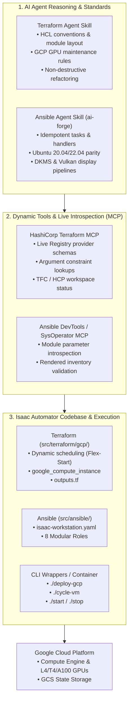
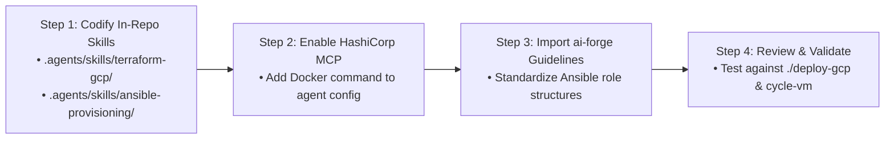

# Terraform & Ansible for GCP: MCP Servers and Agent Skills Evaluation Study

A comprehensive architectural exploration, candidate comparison, and decision framework for integrating **Model Context Protocol (MCP) servers** and **Agent Skills** into **Isaac Automator**'s Terraform and Ansible automation pipelines.

---

## 1. Executive Summary & Problem Statement

**Isaac Automator** automates the provisioning, lifecycle, and configuration of high-performance GPU workstations across public clouds (GCP, AWS, Azure, Alibaba Cloud) for NVIDIA Omniverse, Isaac Sim, and Isaac Lab.

The automation architecture consists of three interconnected layers:
1. **Infrastructure Provisioning (Terraform)**: Manages cloud VMs, networking, GPU accelerators, and dynamic scheduling ([`src/terraform/gcp/`](file:///workspaces/IsaacAutomator/src/terraform/gcp/)).
2. **Software & Driver Configuration (Ansible)**: Installs NVIDIA drivers, X11/Vulkan display environments, remote desktop services (noVNC / NoMachine), and robotics simulation frameworks ([`src/ansible/`](file:///workspaces/IsaacAutomator/src/ansible/)).
3. **Golden Image Baking (Packer)**: Builds pre-baked images using the same Ansible roles ([`src/packer/gcp/`](file:///workspaces/IsaacAutomator/src/packer/gcp/)).

---

## 2. Full Candidate Landscape: What is Available?

### 2.1 Terraform Candidates

| Solution | Type | Source / Maintainer | Primary Capability | Relevance to Isaac Automator |
| :--- | :--- | :--- | :--- | :--- |
| **`hashicorp/terraform-mcp-server`** | MCP Server | Official (HashiCorp) | Real-time schema validation from Terraform Registry (`google`, `aws`, `azurerm`, `alicloud`); HCP Terraform workspace interaction. | **High**: Eliminates trial-and-error syntax errors when writing GCP VM/accelerator blocks. |
| **`severity1/terraform-cloud-mcp`** | MCP Server | Community (severity1) | Interacts with Terraform Cloud API to manage remote workspaces and run histories. | **Low**: Isaac Automator defaults to local state files (`state/`) or direct GCS backends. |
| **`omattsson/terragrunt-mcp-server`** | MCP Server | Community (omattsson) | Terragrunt orchestration, dependency DAGs, and DRY configuration management. | **Low**: The project uses pure Terraform modules without Terragrunt. |
| **`antonbabenko/terraform-skill`** | Agent Skill | Community (Anton Babenko) | Standardized HCL module conventions, testing patterns, and state migration rules. | **High**: Provides solid foundation for module authoring across our 4 supported clouds. |
| **`hashicorp/agent-skills`** | Agent Skill | Official (HashiCorp) | Provider development, Terraform Stacks, and Sentinel/OPA policy writing. | **Medium**: Useful for advanced policy and packaging. |
| **In-Repo Custom Skill (`terraform-gcp`)** | Agent Skill | In-House | Custom playbooks for GCP GPU instances, dynamic Flex-Start scheduling, and `./deploy-gcp` CLI flags. | **Critical**: Captures repository-specific operational patterns. |

---

### 2.2 Ansible Candidates

| Solution | Type | Source / Maintainer | Primary Capability | Relevance to Isaac Automator |
| :--- | :--- | :--- | :--- | :--- |
| **`ansible-community/ai-forge`** | Agent Skill | Official (Ansible Community) | Curated skills (`ansible-role`, `ansible-content-development`, `ansible-collection-standards`) following Red Hat CoP guidelines. | **Critical**: Direct alignment with our 8 roles in [`src/ansible/roles/`](file:///workspaces/IsaacAutomator/src/ansible/roles/). |
| **Ansible DevTools (ADT) MCP** | MCP Server | Red Hat (VS Code Extension) | Playbook validation, syntax checking, and local execution environment tools. | **Medium-High**: Ideal for local development and validation inside IDEs. |
| **`ansible/aap-mcp-server`** | MCP Server | Official (Ansible/Red Hat) | Integration with Ansible Automation Platform (AAP) API for enterprise job templates. | **Low**: Overkill for standalone CLI/Docker execution in Isaac Automator. |
| **`tarnover/mcp-sysoperator`** | MCP Server | Community (tarnover) | Combined execution MCP supporting both Terraform and Ansible runner commands. | **Medium**: Can automate running `ansible-playbook` within an agent conversation. |
| **`ansible-collections/ansible.mcp`** | Ansible Collection | Ansible Community | Collection allowing Ansible playbooks to call MCP servers during execution. | **Low-Medium**: Novel, but reverses the control flow (playbook calling MCP rather than agent calling Ansible). |
| **In-Repo Custom Skill (`ansible-workstation`)** | Agent Skill | In-House | NVIDIA driver installation, Vulkan ICD headers, TurboVNC/NoMachine, Omniverse cache directories. | **Critical**: Specialized robotics/graphics simulation provisioning knowledge. |

---

## 3. GCP-Specific Deep Dive: Technical Nuances

To make an informed decision on what rules and tools to enforce, we must consider GCP-specific Terraform & Ansible constraints:

### 3.1 Compute Engine & GPU Scheduling Nuances
1. **Maintenance Policy**:
   * Any GCP VM with attached GPUs (`guest_accelerator`) **must** set `on_host_maintenance = "TERMINATE"`. Setting `MIGRATE` causes immediate Terraform API errors.
2. **Flex-Start (Dynamic Workload Scheduler)**:
   * To prevent GPU allocation rejections in high-demand regions, GCP supports `provisioning_model = "FLEX_START"`.
   * **Constraint**: Flex-Start instances enforce a 7-day maximum lifespan (`max_run_duration { seconds = 604800 }`) and require `automatic_restart = false`.
   * **Project Implementation**: Handled conditionally via dynamic blocks in [`src/terraform/gcp/ovkit/main.tf`](file:///workspaces/IsaacAutomator/src/terraform/gcp/ovkit/main.tf) and cycled via `./cycle-vm`.
3. **Safe In-Place Upgrades**:
   * Changing instance sizes (e.g. `g2-standard-8` to `g2-standard-16`) must not destroy attached boot disks. Setting `allow_stopping_for_update = true` allows seamless resizing.

### 3.2 Dynamic Ansible Inventory Handoff
* Terraform produces workstation IPs and connection details in [`outputs.tf`](file:///workspaces/IsaacAutomator/src/terraform/gcp/outputs.tf).
* The `./deploy-gcp` CLI injects these outputs into [`src/ansible/inventory.template`](file:///workspaces/IsaacAutomator/src/ansible/inventory.template) before running `ansible-playbook`.
* **Agent Rule**: Any new variable or port exposed in Terraform must have a corresponding entry in `inventory.template` and `isaac-workstation.yaml`.

---

## 4. Comprehensive Evaluation Matrix

| Evaluation Criteria | Option A: Native In-Repo Skills Only | Option B: Hybrid (HashiCorp MCP + ai-forge Skills) | Option C: Enterprise Suite (Terraform MCP + AAP MCP + Lola) |
| :--- | :--- | :--- | :--- |
| **External Dependencies** | **None** (Markdown files in repo) | **Minimal** (1 lightweight Docker MCP container) | **High** (Multiple daemons, Lola CLI, AAP / AWX API) |
| **Setup Complexity** | ⭐⭐⭐⭐⭐ (Instant, zero install) | ⭐⭐⭐⭐☆ (Single `docker run` or config snippet) | ⭐⭐☆☆☆ (Complex setup, token management) |
| **Real-Time Schema Validation** | ⭐⭐☆☆☆ (Relies on model memory) | ⭐⭐⭐⭐⭐ (Live registry lookup for all 4 clouds) | ⭐⭐⭐⭐⭐ (Full API & schema introspection) |
| **Ansible Role Quality & CoP** | ⭐⭐⭐⭐☆ (In-house guidelines) | ⭐⭐⭐⭐⭐ (Standardized `ai-forge` + in-house rules) | ⭐⭐⭐⭐⭐ (Full AAP validation) |
| **Security / Credential Exposure** | ⭐⭐⭐⭐⭐ (Zero credentials exposed) | ⭐⭐⭐⭐☆ (Standard env vars passed to Docker) | ⭐⭐⭐☆☆ (Requires API tokens for remote platforms) |
| **Maintenance Burden** | ⭐⭐⭐⭐⭐ (Maintained with git code) | ⭐⭐⭐⭐☆ (Upstream container updates automatically) | ⭐⭐☆☆☆ (High maintenance) |
| **Parity with AWS/Azure/AliCloud** | ⭐⭐⭐⭐☆ (Manual synchronization) | ⭐⭐⭐⭐⭐ (MCP resolves all 4 cloud providers) | ⭐⭐⭐⭐☆ |

---

## 5. Architectural Options & Decision Paths

### Option 1: Lean & Native (Pure In-Repo Skills)
* **What it is**: All rules, GCP GPU patterns, Ansible role conventions, and Terraform validation steps are codified directly in `.agents/skills/` within this repository.
* **Pros**:
  * Completely self-contained; zero network dependencies or running daemon processes.
  * 100% reproducible for any agent working in this repo.
* **Cons**:
  * Agent relies on training data for obscure Terraform provider arguments or newly released GCP machine types.

### Option 2: Hybrid Best-of-Breed (Recommended)
* **What it is**:
  1. Use **`hashicorp/terraform-mcp-server`** (running via Docker) to provide real-time schema and argument lookups for `hashicorp/google`, `hashicorp/aws`, `hashicorp/azurerm`, and `aliyun/alicloud`.
  2. Adopt **`ansible-community/ai-forge`** role scaffolding standards combined with custom Isaac Automator skills for graphics/robotics pipelines.
* **Pros**:
  * Perfect balance: Real-time schema accuracy without heavy infrastructure overhead.
  * Prevents hallucinated cloud arguments while maintaining strict idempotency across Ansible roles.
* **Cons**:
  * Requires Docker to run the MCP server.

### Option 3: Full Enterprise Orchestration
* **What it is**: Centralized AWX/AAP MCP servers, Terraform Cloud MCP, and Lola package manager.
* **Pros**:
  * Enterprise fleet management across distributed teams.
* **Cons**:
  * Significant overkill for Isaac Automator's current CLI and single-workstation provisioning architecture.

---

## 6. Concrete Recommendations & Next Steps

### Proposed Action Plan:
1. **Decision**: Adopt **Option 2 (Hybrid Best-of-Breed)**.
2. **Immediate Implementation Steps**:
   * Scaffold `.agents/skills/terraform-gcp/SKILL.md` with GCP GPU, Flex-Start, and state safety rules.
   * Scaffold `.agents/skills/ansible-provisioning/SKILL.md` incorporating `ai-forge` CoP standards and NVIDIA/Vulkan requirements.
   * Add the `hashicorp/terraform-mcp-server` definition to the agent's MCP configuration for instant schema introspection.

---

## 7. Associated Repository Files

* **GCP Flex-Start Integration Plan**: [`isaac_automator_flex_start_plan.md`](file:///workspaces/IsaacAutomator/.agents/references/gcp-plans/isaac_automator_flex_start_plan.md)
* **GCP Terraform Root**: [`src/terraform/gcp/main.tf`](file:///workspaces/IsaacAutomator/src/terraform/gcp/main.tf)
* **GCP Instance Submodule**: [`src/terraform/gcp/ovkit/main.tf`](file:///workspaces/IsaacAutomator/src/terraform/gcp/ovkit/main.tf)
* **Ansible Master Playbook**: [`src/ansible/isaac-workstation.yaml`](file:///workspaces/IsaacAutomator/src/ansible/isaac-workstation.yaml)
* **Ansible Inventory Template**: [`src/ansible/inventory.template`](file:///workspaces/IsaacAutomator/src/ansible/inventory.template)
* **NVIDIA Driver Role**: [`src/ansible/roles/nvidia-driver/`](file:///workspaces/IsaacAutomator/src/ansible/roles/nvidia-driver/)
* **Remote Desktop Role**: [`src/ansible/roles/remote-desktop/`](file:///workspaces/IsaacAutomator/src/ansible/roles/remote-desktop/)
