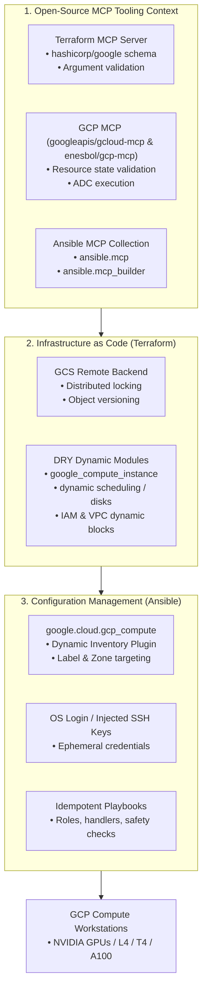

# GCP Open-Source Automation Stack: Terraform, Ansible & MCP Engineering Specification

A reference architecture and operational specification for deploying open-source, vendor-agnostic Infrastructure as Code (IaC) and Configuration Management on Google Cloud Platform (GCP) using **Model Context Protocol (MCP)**, **Terraform**, and **Ansible**.

---

## 1. Core Architectural Directives

To guarantee zero vendor lock-in and reproducible automation, this pipeline exclusively utilizes free, open-source tools and community-supported ecosystems:



---

## 2. MCP Server Configuration & Ecosystem Setup

Create or configure `.mcp.json` / agent settings to attach the required open-source MCP servers:

```json
{
  "mcpServers": {
    "terraform": {
      "command": "docker",
      "args": [
        "run",
        "-i",
        "--rm",
        "hashicorp/terraform-mcp-server"
      ]
    },
    "gcp-cloud": {
      "command": "npx",
      "args": [
        "-y",
        "@enesbol/gcp-mcp"
      ],
      "env": {
        "GOOGLE_APPLICATION_CREDENTIALS": "${HOME}/.config/gcloud/application_default_credentials.json"
      }
    },
    "gcloud-mcp": {
      "command": "docker",
      "args": [
        "run",
        "-i",
        "--rm",
        "-v", "${HOME}/.config/gcloud:/root/.config/gcloud:ro",
        "ghcr.io/googleapis/gcloud-mcp:latest"
      ]
    }
  }
}
```

### Ansible MCP Integration: `ansible.mcp` & `ansible.mcp_builder`
* **`ansible.mcp` Collection**: Used inside playbooks to execute MCP tool calls during task execution without external SaaS platforms.
* **`ansible.mcp_builder` Collection**: Deploys and packages MCP servers directly inside containerized Ansible Execution Environments (EEs).

```yaml
# Example task using ansible.mcp collection
- name: Query GCP resource schema via MCP
  ansible.mcp.call_tool:
    server_name: gcp-cloud
    tool_name: validate_instance_config
    arguments:
      project_id: "{{ gcp_project }}"
      zone: "{{ gcp_zone }}"
      machine_type: "{{ machine_type }}"
```

---

## 3. Terraform Provisioning Standards (GCP)

### 3.1 Remote State Management (Google Cloud Storage)
All deployments must use a dedicated GCS backend with versioning enabled to support collaborative, distributed state locking:

```hcl
terraform {
  required_version = ">= 1.5.0"
  backend "gcs" {
    bucket = "isaac-automator-tfstate-prod"
    prefix = "terraform/state/gcp-workstations"
  }
  required_providers {
    google = {
      source  = "hashicorp/google"
      version = ">= 5.0.0"
    }
  }
}
```

### 3.2 DRY Module Design with Dynamic Blocks
Compute instances, scheduling policies (Flex-Start vs. Standard), attached disks, and IAM bindings must be declared using dynamic blocks:

```hcl
# main.tf - Reusable Compute Instance declaration
resource "google_compute_instance" "workstation" {
  name                      = var.instance_name
  machine_type              = var.machine_type
  zone                      = var.zone
  allow_stopping_for_update = true

  # Dynamic Scheduling Block (Supports Standard, Flex-Start, Spot)
  dynamic "scheduling" {
    for_each = [var.scheduling_config]
    content {
      provisioning_model          = scheduling.value.provisioning_model # STANDARD or FLEX_START
      instance_termination_action = scheduling.value.termination_action # STOP or DELETE
      automatic_restart           = scheduling.value.automatic_restart
      on_host_maintenance         = scheduling.value.gpu_enabled ? "TERMINATE" : "MIGRATE"

      dynamic "max_run_duration" {
        for_each = scheduling.value.max_run_duration_seconds != null ? [scheduling.value.max_run_duration_seconds] : []
        content {
          seconds = max_run_duration.value
        }
      }
    }
  }

  # Dynamic Guest Accelerator (NVIDIA GPUs)
  dynamic "guest_accelerator" {
    for_each = var.gpu_count > 0 ? [1] : []
    content {
      type  = var.gpu_type
      count = var.gpu_count
    }
  }

  boot_disk {
    auto_delete = true
    initialize_params {
      image = var.boot_image
      size  = var.boot_disk_size_gb
      type  = var.boot_disk_type
    }
  }

  # Dynamic Attached Disks
  dynamic "attached_disk" {
    for_each = var.extra_disks
    content {
      source      = attached_disk.value.disk_id
      device_name = attached_disk.value.name
      mode        = lookup(attached_disk.value, "mode", "READ_WRITE")
    }
  }

  network_interface {
    network    = var.network_name
    subnetwork = var.subnetwork_name

    dynamic "access_config" {
      for_each = var.enable_public_ip ? [1] : []
      content {
        nat_ip = var.static_ip_address
      }
    }
  }

  labels = merge(var.custom_labels, {
    environment = var.environment
    role        = "isaac-workstation"
    managed_by  = "terraform"
  })

  metadata = {
    enable-oslogin = var.enable_oslogin ? "TRUE" : "FALSE"
    ssh-keys       = var.enable_oslogin ? null : "${var.os_username}:${var.ssh_public_key}"
  }
}
```

---

## 4. Ansible Configuration Management Standards

### 4.1 Dynamic Inventory Targeting (`google.cloud.gcp_compute`)
No static IP addresses. Target workstations dynamically using GCP labels, zones, and status.

Create `inventory/gcp_compute.yaml`:
```yaml
plugin: google.cloud.gcp_compute
projects:
  - "{{ lookup('env', 'GCP_PROJECT') }}"
zones:
  - "us-central1-a"
  - "us-central1-b"
  - "europe-west4-a"
auth_kind: application
filters:
  - status = RUNNING
  - labels.managed_by = terraform
keyed_groups:
  - prefix: gcp_role
    key: labels.role
  - prefix: gcp_zone
    key: zone
hostnames:
  - name
compose:
  ansible_host: networkInterfaces[0].accessConfigs[0].natIP
```

### 4.2 Secure Access & OS Login
* Connect via **GCP OS Login** (recommended) or temporary Terraform-injected SSH keys.
* Configure `ansible.cfg`:
```ini
[defaults]
inventory = ./inventory/gcp_compute.yaml
host_key_checking = False
timeout = 30
interpreter_python = auto_silent

[inventory]
enable_plugins = google.cloud.gcp_compute, host_list, yaml, ini

[ssh_connection]
pipelining = True
ssh_args = -o ControlMaster=auto -o ControlPersist=60s -o StrictHostKeyChecking=no -o UserKnownHostsFile=/dev/null
```

### 4.3 Idempotent Playbook Structure
All tasks must guarantee zero unintended drift and safe re-execution:

```yaml
---
# isaac-workstation-gcp.yaml
- name: Configure GCP GPU Isaac Workstation
  hosts: gcp_role_isaac_workstation
  become: true
  gather_facts: true

  tasks:
    - name: Verify NVIDIA GPU presence via PCI bus
      ansible.builtin.command: lspci -d 10de:
      register: lspci_nvidia
      changed_when: false
      failed_when: false

    - name: Ensure NVIDIA display drivers are installed
      ansible.builtin.apt:
        name:
          - "nvidia-driver-535"
          - "nvidia-utils-535"
          - "nvidia-dkms-535"
        state: present
        update_cache: true
      when: lspci_nvidia.rc == 0
      notify: Restart Display Manager

    - name: Ensure Vulkan development libraries and ICD are present
      ansible.builtin.apt:
        name:
          - "libvulkan1"
          - "vulkan-tools"
          - "libvulkan-dev"
        state: present

  handlers:
    - name: Restart Display Manager
      ansible.builtin.systemd:
        name: lightdm
        state: restarted
        enabled: true
      failed_when: false
```

---

## 5. Summary of Enforced Directives

| Domain | Standard / Tool | Purpose |
| :--- | :--- | :--- |
| **MCP** | `hashicorp/terraform-mcp-server` | Live provider schema lookups for `hashicorp/google`. |
| **MCP** | `googleapis/gcloud-mcp` & `@enesbol/gcp-mcp` | GCP resource validation & ADC command execution. |
| **MCP** | `ansible.mcp` & `ansible.mcp_builder` | Execution Environment MCP building and playbook tool calls. |
| **Terraform** | `backend "gcs"` | Remote, distributed state locking in GCS. |
| **Terraform** | Dynamic Blocks (`scheduling`, `guest_accelerator`) | DRY, flexible compute definitions across Standard/Flex-Start. |
| **Ansible** | `google.cloud.gcp_compute` | Dynamic inventory targeting via GCP labels and metadata. |
| **Ansible** | OS Login / Ephemeral SSH | Secure authentication without static credential exposure. |
