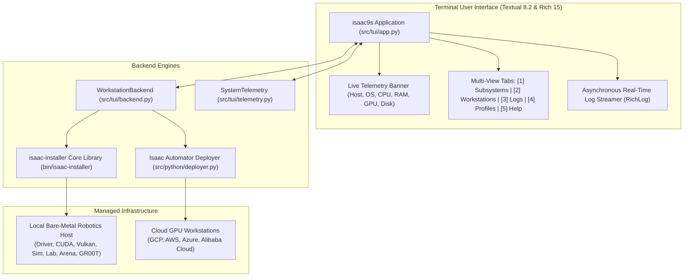

# isaac9s - The k9s-Style Terminal User Interface for Isaac Automator & Isaac Installer
**Interactive, Keyboard-Driven Terminal Cockpit for Physical AI Workstations, Cloud VMs, and Robotics Frameworks**

---

## 1. Executive Summary & Design Concept

Inspired by **`k9s`** (the gold-standard terminal cockpit for Kubernetes clusters), **`isaac9s`** provides a powerful, keyboard-driven, interactive Terminal User Interface (TUI) for managing:
1. **Physical Bare-Metal Robotics Workstations** provisioned via [`isaac-installer`](file:///workspaces/IsaacAutomator/.agents/skills/isaac-installer/SKILL.md).
2. **Cloud GPU Workstations** deployed via `IsaacAutomator` across AWS, GCP, Azure, and Alibaba Cloud.
3. **Physical AI Subsystems**: NVIDIA Driver, CUDA, Vulkan ICD, Conda, Isaac Sim, Isaac Lab, IsaacLab-Arena, and Isaac-GR00T.

### Why a k9s-Style TUI Transforms the Beginner & Expert Experience
- **For Beginners**: Eliminates the cognitive burden of memorizing complex bash subcommands (`isaac-installer doctor`, `isaac-installer repair`, `isaac-installer gr00t server`, `./deploy-gcp ...`). Beginners simply launch `./isaac9s`, see their system health with color-coded badges, and navigate with single keystrokes.
- **For Experts**: Provides real-time observability, live hardware telemetry (CPU, RAM, GPU VRAM, temperatures), streaming execution logs, and one-key drift self-healing.

---

## 2. Architecture & Component Blueprint



---

## 3. Core Dashboard Views & Features

### 3.1 Live System Telemetry Banner (Header)
Located permanently at the top of the terminal, updating every 2 seconds:
```text
Host: robotics-rig | OS: Ubuntu 22.04 LTS | CPU: 12% (32 cores) | RAM: 21.0G / 91.4G (23%) | Disk: 41% | GPU: RTX 4090 (42°C, 15%)
```

### 3.2 View 1: Physical AI Subsystems & Health Auditor (`[1]`)
Displays an interactive table of the 14 Physical AI subsystems:
- **NVIDIA Driver & Kernel Modules**
- **CUDA Runtime & Toolkit**
- **Vulkan ICD Display Bridge**
- **Conda Runtime (`isaaclab` named env)**
- **UV Fast Package Acceleration Engine**
- **Isaac Sim Engine (6.0.1 / 5.1.0)**
- **Isaac Lab (v3.0.0-beta2)**
- **IsaacLab-Arena (v0.3.0)**
- **Isaac-GR00T Foundation Model Stack (N1.7 VLA)**
- **Pinocchio / Pink Whole-Body Control (WBC)**
- **ZeroMQ Policy IPC Bridge**
- **Remote Desktop Providers (noVNC / KasmVNC / DCV)**
- **Dual-Remote Fork Topology & State Ledger**
- **Security Profile (Simple / Team / Enterprise)**

**Subsystem Status Badges**:
- `[PASS]` (Green): Fully provisioned, verified, and operational.
- `[WARN]` (Yellow): Functional with fallbacks (e.g. software rendering or missing optional tools).
- `[FAIL]` (Red): Broken dependency, segfault detected, or missing required kernel driver.
- `[PENDING]` (Cyan): Not yet installed or cloned.

### 3.3 View 2: Cloud Workstations & Deployments (`[2]`)
Lists active deployments across GCP, AWS, Azure, and Local Bare-Metal:
- Columns: `Workstation Name`, `Cloud Provider`, `Status`, `GPU Model`, `IP Address`, `Security Profile`.
- Actions:
  - `[s]`: Start instance.
  - `[x]`: Stop instance (pause billing).
  - `[c]`: Launch connection (SSH / noVNC).
  - `[d]`: Destroy instance.

### 3.4 View 3: Live Action Execution & Log Streamer (`[3]`)
A dedicated terminal pane that captures and streams `stdout` and `stderr` asynchronously when executing operations like:
- `isaac-installer doctor`
- `isaac-installer repair`
- `isaac-installer install`
- `isaac-installer gr00t infer`
- Cloud workstation Terraform apply / destroy commands.

### 3.5 View 4: Security Profiles & Declarative Presets (`[4]`)
Provides visual descriptions and configuration switches for:
- **Tier 1: Simple Mode** ($0.00 added cost, dynamic `/32` IP whitelisting, local state).
- **Tier 2: Team Mode** (<$0.10 added cost, cloud remote state synchronization).
- **Tier 3: Enterprise Mode** (CMEK KMS encryption, Secret Manager, IAP/SSM zero-trust private access).

---

## 4. Keyboard Shortcuts (k9s Keybindings)

| Key | Action | Description |
| :--- | :--- | :--- |
| `1` | Subsystems View | Inspect 14 Physical AI subsystems and health status |
| `2` | Workstations View | View and manage cloud/bare-metal workstations |
| `3` | Logs & Terminal | Stream live execution output |
| `4` | Profiles View | Inspect Simple vs Team vs Enterprise configurations |
| `p` | Probe / Doctor | Run hardware probing and diagnostic checks |
| `h` | Heal State Drift | Run automated self-healing drift engine |
| `a` | Pre-Flight Audit | Run conflict traversal and dependency audit |
| `s` | Start Workstation | Power on highlighted cloud workstation |
| `x` | Stop Workstation | Stop highlighted cloud workstation to pause billing |
| `?` | Help | Open shortcuts and operational guide |
| `q` | Quit | Exit `isaac9s` |

---

## 5. Implementation Files & Code Hierarchy

| File | Status | Description |
| :--- | :--- | :--- |
| `isaac9s` | **Created & Tested** | Top-level executable script launching the TUI cockpit. |
| `src/tui/__init__.py` | **Created** | Python module entry point. |
| `src/tui/app.py` | **Created & Tested** | Full Textual application with tabbed layouts, buttons, and async runners. |
| `src/tui/backend.py` | **Created & Tested** | Subsystem inspection engine and deployment state parser. |
| `src/tui/telemetry.py` | **Created & Tested** | Hardware telemetry sampler (CPU, RAM, GPU via `nvidia-smi`, Disk). |
| `isaac9s-tui-plan.md` | **Created** | This master architecture and reference specification. |

---

## 6. How to Run `isaac9s`

To launch the interactive terminal GUI:
```bash
./isaac9s
```
Or via Python:
```bash
python3 -m src.tui.app
```
