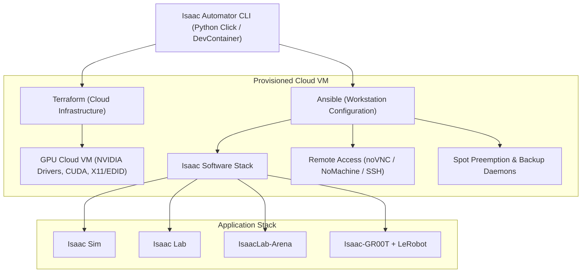

# Isaac Automator Technical Notes & Reference Guide

Comprehensive reference guide for **Isaac Automator** architecture, installed component versions (Isaac Sim, Isaac Lab, IsaacLab-Arena, Isaac-GR00T), dynamic version resolution mechanisms, GCP Spot/Flex-start resilience, and remote graphics rendering.

---

## 1. Executive Summary & Architecture Overview

**Isaac Automator** is an automated cloud workstation provisioning framework that deploys ready-to-use GPU instances equipped with NVIDIA Omniverse and Physical AI / Robotics toolkits onto public clouds (AWS, GCP, Azure, and Alibaba Cloud).



---

## 2. Component Versions & Installation Specifications

Isaac Automator configures four core simulation, learning, and robotics policy frameworks. The table below details the default version resolution, repository sources, target directories, and installation pipelines.

| Component | Default Mode | Repository Source | Active Resolved Ref / Default | Environment & Target Directory | Installation & Build Workflow |
| :--- | :--- | :--- | :--- | :--- | :--- |
| **Isaac Sim** | `latest` (dynamic) | [`isaac-sim/IsaacSim`](https://github.com/isaac-sim/IsaacSim.git) | **`v6.0.1`** *(tags up to v6.0.1)* | `/home/ubuntu/IsaacSim-source`<br>Symlinked to `~/IsaacSim` | Cloned with depth 1, pulls Git LFS assets, accepts EULA (`.eula_accepted`), compiles via `./build.sh --release`, executes `./post_install.sh`, pins active GPU (`--/renderer/activeGpu=0`). |
| **Isaac Lab** | `latest` (dynamic) | [`isaac-sim/IsaacLab`](https://github.com/isaac-sim/IsaacLab.git) | **`release/3.0.0-beta2`** *(stable: `v2.3.2`)* | `/home/ubuntu/IsaacLab` | Cloned with depth 1, creates symlink `_isaac_sim -> ~/IsaacSim`, executes `./isaaclab.sh --install` inside target environment. |
| **IsaacLab-Arena** | `latest` (dynamic) | [`isaac-sim/IsaacLab-Arena`](https://github.com/isaac-sim/IsaacLab-Arena.git) | **`release/0.3.0-prerelease`** *(fallback: `release/0.1.1`)* | `/home/ubuntu/IsaacLab-Arena` | Cloned recursively with submodules (`--recurse-submodules`), installs editable extension package via `pip install -e .` into active Conda/Python environment. |
| **Isaac-GR00T** | Scripted Stage 8 (Optional) | [`NVIDIA/Isaac-GR00T`](https://github.com/NVIDIA/Isaac-GR00T.git) | **`main`** *(remote tags `n1.7-release`)* | `/home/ubuntu/Isaac-GR00T`<br>Conda: `gr00t` (Python 3.10) | Configures dedicated `gr00t` Conda environment, installs FFmpeg & system video libraries, clones and checks out Hugging Face **LeRobot (`v0.4.3`)**, installs Isaac-GR00T in editable mode (`pip install -e . --no-build-isolation`). |

---

## 3. Dynamic Version Resolution Algorithm

Isaac Automator dynamically queries the upstream git repositories at deployment time if `--isaacsim`, `--isaaclab`, or `--isaaclab-arena` are set to `latest` (the default setting in `src/python/config.py`).

### How `DeployCommand._resolve_latest_ref` Works:
1. **Remote Inspection**: Runs `git ls-remote --tags --heads <repo_url>` against the target repository.
2. **Candidate Extraction**: Parses all tags (`refs/tags/*`) and release branches (`refs/heads/release/*`).
3. **Semantic Parsing (`_version_key`)**:
   - Extracts semantic version tuples `(major, minor, patch)`.
   - Ranks release stability: stable releases (`1`) vs prereleases (`0`, e.g., `alpha`, `beta`, `rc`, `prerelease`).
   - Tie-breaking: On an identical version number, a `release/*` branch is chosen over a tag.
4. **Explicit Overrides**: Operators can bypass auto-detection by passing explicit git refs or skipping installation:
   ```bash
   # Pin specific versions
   ./deploy-gcp --deployment-name robot-lab --isaacsim v6.0.1 --isaaclab v2.3.2 --isaaclab-arena release/0.2.1

   # Skip specific components
   ./deploy-gcp --deployment-name test-sim --isaacsim latest --isaaclab no --isaaclab-arena no
   ```

---

## 4. GCP Cloud & Preemption Resilience Pipeline

Isaac Automator includes enterprise-grade resilience features for Google Cloud Platform (GCP) Spot and Flex-start instances:

### A. GCP Flex-start (Dynamic Workload Scheduler)
- **Terraform Integration**: Sets `provisioning_model = "FLEX_START"`, `instance_termination_action = "STOP"`, and `max_run_duration { seconds = 604800 }` (7 days) in `src/terraform/gcp/ovkit/main.tf`.
- **GPU Maintenance Compliance**: Maintains `on_host_maintenance = "TERMINATE"` required by GCP for attached guest accelerators.
- **VM Cycling (`./cycle-vm`)**: Automated CLI utility that inspects VM uptime (`lastStartTimestamp`) and safely reboots/cycles instances before reaching the 7-day hard termination boundary.

### B. 30-Second Preemption Watchdog Daemon
- **Listener Script**: `preempt-listener.py` runs as a systemd service (`isaac-preempt-listener.service`) continuously polling `http://metadata.google.internal/computeMetadata/v1/instance/preempted`.
- **Graceful Workload Interruption**: Sends `SIGINT` to Python and Isaac Sim processes to allow state serialization and checkpoint dumping.
- **Instant Cloud Flush**: Flushes checkpoint artifacts and working datasets to Google Cloud Storage via `gcloud storage rsync`.

### C. Continuous Backup & Fast Recovery
- **10-Minute Backup Timer**: `isaac-backup.timer` triggers periodic background syncing to `--backup-bucket`.
- **Keyless Cloud Access**: Configured with `devstorage.read_write` IAM scopes on compute instances.
- **Fast Restore Tool (`./restore-gcp`)**: Downloads and restores checkpoints upon new VM provisioning (`--auto-restore`).

---

## 5. Remote Desktop & 3D Viewport Architecture

| Protocol / Tool | Transport / Port | Target Use Case | Technical Behavior & Notes |
| :--- | :--- | :--- | :--- |
| **noVNC (Web GUI)** | HTTP/WebSocket<br>`8080` / `5900` | Browser-based desktop management, shell, IDE | Renders XFCE desktop via `x11vnc` and dummy X11 virtual display (`vdisplay.edid`). **Note:** Omniverse Kit renders directly to Vulkan swapchains which software VNC typically does not capture. |
| **NoMachine / DCV** | NX / UDP / TCP<br>`4000` / `8443` | Interactive 3D Simulation & Viewport | Captures hardware-accelerated Vulkan/OpenGL buffers directly from the GPU for full-rate interactive 3D rendering. |
| **SSH Direct Shell** | TCP<br>`22` | Headless execution, batch training, port tunneling | Native command line access via `./ssh <name>` using generated SSH key pairs. |

---

## 6. Built-in Demos & Shortcuts

Workstations configured with `--demos` create desktop shortcuts that can be launched immediately:

1. **Franka Arm Manipulation (`franka-manipulation.desktop`)**:
   - Trains a Franka Emika Panda robotic arm to reach 3D spatial targets using RSL-RL inside Isaac Lab.
2. **Humanoid Locomotion (`humanoid-locomotion.desktop`)**:
   - Trains a Unitree G1 humanoid robot to walk and balance on varied terrain using RSL-RL.
3. **Quadruped Locomotion (`quadruped-locomotion.desktop`)**:
   - Trains an ANYmal-D quadruped robot in locomotion and obstacle traversal.
