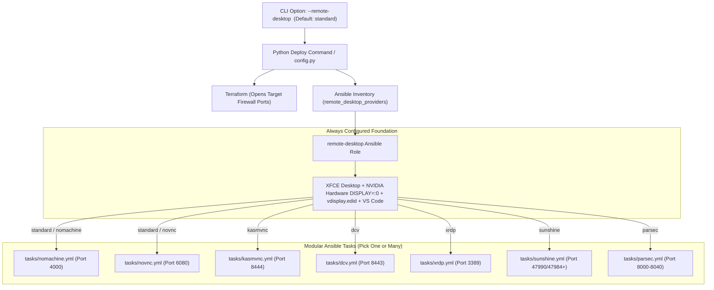

# Remote Desktop & Interactive 3D Streaming Expansion Plan

Master engineering blueprint, developer research findings, and complexity analysis for integrating **KasmVNC**, **NICE DCV (Amazon DCV)**, **Parsec**, **xrdp (Native RDP)**, and **Sunshine + Moonlight** into **Isaac Automator**.

---

## 1. Executive Summary & Design Principles

Currently, Isaac Automator ships with **noVNC** (HTML5 web desktop on port `6080`) and **NoMachine** (NX protocol on port `4000`). While effective, different teams and cloud deployment targets have distinct remote streaming requirements:

* **AWS EC2 Users**: Want **NICE DCV** for zero-cost, enterprise-grade GPU streaming.
* **Web / Browser Users**: Want **KasmVNC** for native in-browser clipboard synchronization (`Ctrl+V` via Async Web Clipboard API) and WebRTC video acceleration without desktop client installs.
* **Windows / Enterprise Desktops**: Want standard **xrdp** to connect directly via Microsoft Remote Desktop without installing 3rd-party clients.
* **Ultra-Low Latency 3D / Robotics Teleoperation**: Want **Sunshine + Moonlight** (open-source NVENC streaming) or **Parsec** for 60/120 FPS high-refresh rate viewport rendering with minimal input lag.

### Core Architectural Principle: Standard Baseline Preserved, Zero Added Complexity


---

## 2. The Core Technical Challenge: Isaac Sim & Vulkan Rendering

Omniverse Kit and Isaac Sim do not use standard X11 2D rendering or classic OpenGL rasterization—they render directly to **NVIDIA GPU hardware Vulkan swapchains**.

### The Pitfall:
Most standard remote desktop solutions (such as default `xorgxrdp`, standalone `Xvnc`, or isolated virtual X servers) create a **virtual display** backed by software rendering (Mesa LLVMpipe). When Isaac Sim launches in a software-rendered session, **Vulkan device enumeration fails and Omniverse Kit segfaults or crashes immediately**.

### The Universal Mitigation:
Every remote desktop provider added to Isaac Automator must attach directly to the **primary hardware-accelerated GPU display (`DISPLAY=:0`)** configured by Isaac Automator via `xorg.conf` and `vdisplay.edid`.

---

## 3. Multi-Dimensional Complexity & Trade-Off Matrix

Each solution is evaluated across 6 technical dimensions (Scale: 1 = Easiest / Lowest Overhead, 5 = Most Complex / Highest Overhead):

| Remote Solution | 1. Package & Ansible Provisioning | 2. GPU & Vulkan 3D Capture | 3. Network & Port Footprint | 4. Auth & Pairing Automation | 5. Client Friction (User Experience) | 6. Long-Term Maintenance | Overall Complexity Score | Implementation Feasibility Rank |
| :--- | :---: | :---: | :---: | :---: | :---: | :---: | :---: | :---: |
| **noVNC** *(Baseline)* | 1 | 1 *(2D only, no Vulkan)* | 1 *(TCP 6080)* | 1 *(vnc_password)* | 1 *(Browser)* | 1 *(Zero dependencies)* | **1.0 / 5** | Baseline Standard |
| **NoMachine** *(Baseline)* | 2 | 2 *(Direct NX frame grab)* | 1 *(TCP/UDP 4000)* | 1 *(SSH key / PAM)* | 2 *(Install NX Client)* | 2 *(Upstream .deb updates)* | **1.7 / 5** | Baseline Standard |
| **KasmVNC** | 2 | 3 *(WebRTC + VirtualGL)* | 1 *(TCP 8444)* | 2 *(Auto self-signed TLS)* | 1 *(Browser + Native Paste)*| 2 *(Official deb releases)* | **1.8 / 5** | **Tier 1 (High ROI)** |
| **xrdp (Native RDP)** | 1 | 3 *(Attach :0 via x11vnc)* | 1 *(TCP 3389)* | 1 *(System PAM password)* | 1 *(Built-in OS client)* | 1 *(Ubuntu official repos)* | **1.3 / 5** | **Tier 1 (High ROI)** |
| **NICE DCV (on AWS)** | 2 | 1 *(Native NVENC & AWS hooks)*| 1 *(TCP/UDP 8443)* | 1 *(System PAM password)* | 1 *(Browser or Client)* | 1 *(AWS managed repo)* | **1.2 / 5** | **Tier 1 (High ROI on AWS)** |
| **NICE DCV (on GCP/Azure)**| 3 | 1 *(Native NVENC)* | 1 *(TCP/UDP 8443)* | 4 *(Demo license expiry)* | 1 *(Browser or Client)* | 4 *(Licensing server needed)*| **2.8 / 5** | **Tier 3 (Cloud-Gated)** |
| **Sunshine + Moonlight** | 3 | 2 *(NVENC/NVFBC via KMS)* | 3 *(Multi-port range)* | 3 *(Web UI PIN pairing)* | 2 *(Moonlight client)* | 3 *(setcap + kernel deps)* | **2.7 / 5** | **Tier 2 (Specialized 3D)** |
| **Parsec** | 3 | 2 *(Direct NVENC)* | 3 *(UDP 8000-8040 + STUN)* | 5 *(Cloud account/API token)*| 2 *(Parsec client)* | 4 *(Cloud broker dependency)*| **3.2 / 5** | **Tier 3 (Auth-Heavy)** |

---

## 4. Deep-Dive Developer Research & Real-World Gotchas

---

### Option 1: KasmVNC (Modern Web-Native Desktop)
* **Complexity Level**: **Low-Medium (1.8 / 5)**
* **Primary Advantage**: Replaces legacy noVNC with modern WebRTC streaming, dynamic resolution scaling, and **native in-browser clipboard synchronization (Async Web Clipboard API)** over HTTPS without any client software installation.

#### Real-World Gotchas & Mitigations:
1. **Virtual X Server vs Physical GPU Conflict**:
   - *Problem*: By default, `kasmvncserver` initiates its own virtual X11 display (e.g. `:1`). Closed-source NVIDIA drivers lack DRI3 support for virtual framebuffers, causing Isaac Sim to fail.
   - *Mitigation*: We configure KasmVNC in **screen-scraper / mirror mode attached to `DISPLAY=:0`** or bridge it with VirtualGL/DRI device mapping (`/dev/dri/card0`, `/dev/dri/renderD128`).
2. **Self-Signed SSL Browser Warnings**:
   - *Problem*: Modern browsers require HTTPS for the Async Clipboard API (`navigator.clipboard.readText()`). Self-signed certs generate a "Your connection is not private" warning on first visit.
   - *Mitigation*: Automatically generate a clean 2048-bit RSA self-signed certificate during provisioning and document that operators must click "Advanced -> Proceed".
3. **Hardware Acceleration Tuning**:
   - *Mitigation*: Set `hw3d: true` in `/home/ubuntu/.vnc/kasmvnc.yaml` to ensure GPU-accelerated WebRTC encoding.

---

### Option 2: xrdp (Native Microsoft Remote Desktop)
* **Complexity Level**: **Very Low (1.3 / 5)**
* **Primary Advantage**: 100% native client support on every Windows PC, plus free official apps for macOS, iOS, and Android.

#### Real-World Gotchas & Mitigations:
1. **Software LLVMpipe Rasterization**:
   - *Problem*: Standard `xorgxrdp` creates an independent X session that uses CPU software rendering (Mesa LLVMpipe), breaking Vulkan.
   - *Mitigation*: **Console Mirroring via `x11vnc`**. We configure `/etc/xrdp/xrdp.ini` with a `[vnc-any]` backend targeting `localhost:5900` (`DISPLAY=:0`). This guarantees direct access to the NVIDIA GPU hardware session and avoids duplicate user session collisions.
2. **Polkit Color Management Popups**:
   - *Problem*: Logging into Ubuntu XFCE over RDP frequently triggers *"Authentication required to create a color managed device"* prompts.
   - *Mitigation*: Deploy an Ansible Polkit rule in `/etc/polkit-1/localauthority/50-local.d/45-allow-colord.pkla` to silently authorize color management.

---

### Option 3: NICE DCV (Amazon DCV)
* **Complexity Level**: **Low on AWS (1.2 / 5)** | **High on GCP/Azure (2.8 / 5)**
* **Primary Advantage**: Enterprise gold standard for CAD, VFX, and robotics simulation. Native hardware-accelerated NVENC streaming, native copy-paste, file transfer, multi-monitor, and dual client access (Web browser + Native App).

#### Real-World Gotchas & Mitigations:
1. **Cloud Licensing Verification**:
   - *Problem*: DCV is only free on AWS EC2 (auto-verified via `http://169.254.169.254/latest/meta-data/`). On GCP/Azure, sessions expire after a 30-day demo period.
   - *Mitigation*: Automatically enable NICE DCV when `cloud == "aws"`; display an explicit notice regarding licensing if requested on GCP/Azure.
2. **`dcv-gl` Hardware Verification**:
   - *Mitigation*: Ansible automatically runs `dcvgladmin enable` and configures `dcvserver.service` to bind directly to `DISPLAY=:0`.
3. **Display Power-Saving / DPMS Sleep**:
   - *Problem*: If X11 screensaver/DPMS activates, DCV streams a blank screen.
   - *Mitigation*: Ansible explicitly disables DPMS in X11 (`xset -dpms; xset s off`).

---

### Option 4: Sunshine + Moonlight (Open-Source NVENC Streaming)
* **Complexity Level**: **Medium (2.7 / 5)**
* **Primary Advantage**: 100% open source (GPLv3), royalty-free, sub-10ms ultra-low latency, 60/120 FPS high-refresh rate streaming. Ideal for real-time teleoperation and interactive visual physics tuning.

#### Real-World Gotchas & Mitigations:
1. **Interactive 4-Digit PIN Pairing**:
   - *Problem*: Sunshine uses a secure Web UI on port `47990` (`https://<ip>:47990`). First-time connection requires entering a 4-digit PIN generated by the Moonlight client into the Sunshine Web UI.
   - *Mitigation*: Output step-by-step pairing instructions in `info.txt` and terminal deployment summaries.
2. **Multi-Port Firewall Footprint**:
   - *Problem*: Requires TCP `47984`, `47989`, `47990`, `48010` and UDP `47990`, `47998-48000`.
   - *Mitigation*: Terraform security groups automatically open the full required port range restricted to `var.ingress_cidrs`.
3. **Linux Kernel Capabilities & Input Permissions**:
   - *Mitigation*: Ansible applies `setcap cap_sys_admin+ep /usr/bin/sunshine` and adds the workstation user to the `input` and `video` groups.

---

### Option 5: Parsec (Low-Latency Cloud Streaming)
* **Complexity Level**: **High (3.2 / 5)**
* **Primary Advantage**: Widely recognized ultra-smooth 60 FPS remote desktop streaming over volatile internet connections.

#### Real-World Gotchas & Mitigations:
1. **Headless Cloud Authentication Bottleneck**:
   - *Problem*: Parsec requires account authentication through its centralized cloud broker; it cannot be configured headlessly without an account auth token or a **Parsec for Teams Server Key**.
   - *Mitigation*: Support an optional `--parsec-key <token>` CLI parameter. If omitted, Parsec remains in standby for manual SSH login (`parsecd peer_id=...`).
2. **Commercial Licensing Restrictions**:
   - *Mitigation*: Document that Parsec is free for individual personal use, but commercial organization usage requires a Parsec for Teams subscription.

---

## 5. Standard Default & Coexistence Architecture

### Coexistence on Port and Display Layers
Installing extra options (e.g. KasmVNC or xrdp) **does not break or conflict with noVNC or NoMachine**:
1. **No Port Collisions**:
   * noVNC: `http://<ip>:6080/vnc.html?host=<ip>&port=6080`
   * NoMachine: `<ip>:4000`
   * KasmVNC: `https://<ip>:8444`
   * NICE DCV: `https://<ip>:8443`
   * xrdp: `<ip>:3389`
   * Sunshine: `https://<ip>:47990`
2. **Shared GPU Display (`DISPLAY=:0`)**:
   Multiple scrapers/listeners (`x11vnc`, `nxserver`, `kasmvnc`, `sunshine`) attach to the same hardware X11 buffer concurrently without interference.

---

## 6. Strategic Implementation Roadmap & ROI Analysis

```mermaid
quadrantChart
    title Remote Desktop Provider ROI vs Implementation Complexity
    x-axis Low Technical Complexity --> High Technical Complexity
    y-axis Low Operator Value / Performance --> High Operator Value / Performance
    quadrant-1 High Value, High Complexity (Evaluate Carefully)
    quadrant-2 High Value, Low Complexity (Immediate High ROI)
    quadrant-3 Low Value, Low Complexity (Baseline)
    quadrant-4 Low Value, High Complexity (Avoid)
    "noVNC": [0.1, 0.3]
    "NoMachine": [0.35, 0.75]
    "KasmVNC": [0.36, 0.85]
    "NICE DCV (AWS)": [0.25, 0.95]
    "xrdp": [0.22, 0.7]
    "Sunshine + Moonlight": [0.65, 0.92]
    "NICE DCV (GCP/Azure)": [0.72, 0.6]
    "Parsec": [0.85, 0.8]
```

### Phased Execution:

* **Phase 1: Immediate High ROI / Low Complexity**
  * **KasmVNC**: Modern browser experience with native copy-paste on port `8444`.
  * **xrdp (Console Mirror)**: Zero-client-install Windows / Mac RDP on port `3389`.
  * **NICE DCV (AWS EC2)**: Enterprise streaming auto-enabled on AWS.
* **Phase 2: Ultra-Performance 3D (Specialized Robotics)**
  * **Sunshine + Moonlight**: 120 FPS high-refresh teleoperation on ports `47984-48010`.
* **Phase 3: Optional Cloud-Brokered**
  * **Parsec**: Add support for operators with existing Parsec Team server keys.

---

## 7. Concrete Code & File-by-File Blueprint

### A. CLI Interface (`src/python/deploy_command.py` & `config.py`)
```python
# In src/python/config.py
c["default_remote_desktop"] = "standard"  # Expands to ["nomachine", "novnc"]

c["remote_desktop_providers"] = {
    "nomachine": "NoMachine NX server for hardware-accelerated 3D (Port 4000).",
    "novnc": "HTML5 browser desktop via websockify + x11vnc (Port 6080).",
    "kasmvnc": "Modern WebRTC browser desktop with native clipboard support (Port 8444).",
    "dcv": "NICE DCV enterprise GPU streaming server (Port 8443).",
    "xrdp": "Microsoft Remote Desktop (RDP) console mirror (Port 3389).",
    "sunshine": "Sunshine NVENC game/3D streaming server for Moonlight (Port 47984-48010, 47990).",
    "parsec": "Parsec ultra-low latency interactive streaming daemon (Port 8000-8040).",
}
```

### B. Modular Ansible Role Layout (`src/ansible/roles/remote-desktop/`)
```text
src/ansible/roles/remote-desktop/
├── defaults/
│   └── main.yml                   # remote_desktop: "standard"
├── tasks/
│   ├── main.yml                   # Dispatches conditionally to provider tasks
│   ├── desktop.yml                # Base XFCE / Ubuntu desktop setup
│   ├── virtual-display.yml        # xorg.conf & vdisplay.edid
│   ├── busid.yml                  # Dynamic GPU Bus ID injection
│   ├── utils.yml                  # System utilities
│   ├── vscode.yml                 # Visual Studio Code
│   ├── vnc.yml                    # x11vnc server on port 5900
│   ├── nomachine.yml              # [Standard] NoMachine NX server
│   ├── novnc.yml                  # [Standard] noVNC HTML5 server
│   ├── kasmvnc.yml                # [Optional] KasmVNC server + self-signed TLS
│   ├── dcv.yml                    # [Optional] AWS NICE DCV server + auto session
│   ├── xrdp.yml                   # [Optional] xrdp + x11vnc console mirror + Polkit fix
│   ├── sunshine.yml               # [Optional] Sunshine server + uinput permissions
│   └── parsec.yml                 # [Optional] Parsec host daemon
└── templates/
    ├── info.txt.j2                # Dynamic connection summary
    ├── kasmvnc.yaml.j2            # KasmVNC configuration
    ├── dcv.conf.j2                # NICE DCV configuration
    ├── sunshine.conf.j2           # Sunshine configuration
    └── xrdp.ini.j2                # xrdp console mirror configuration
```

### C. Terraform Cloud Security Ingress (`src/terraform/*/security.tf`)
Consolidate ingress firewall rules to dynamically open ports for enabled providers (`8444`, `8443`, `3389`, `47984-48010`, `8000-8040`) scoped to `var.ingress_cidrs`.
