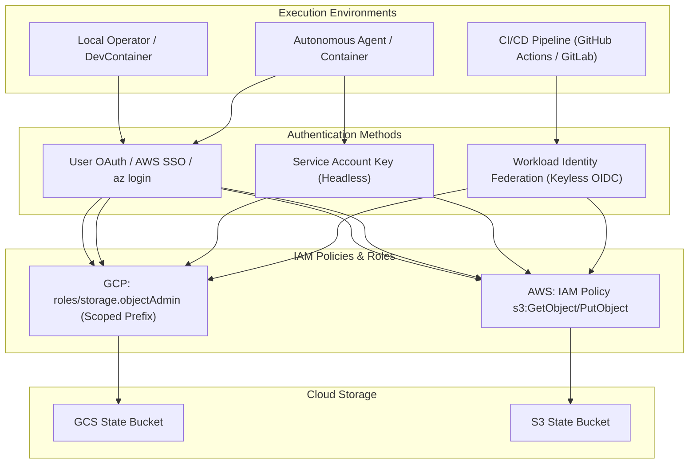
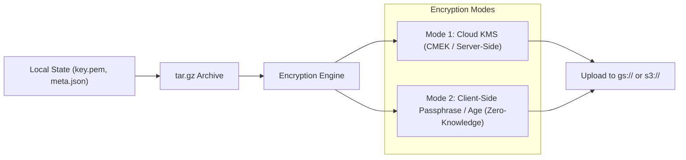
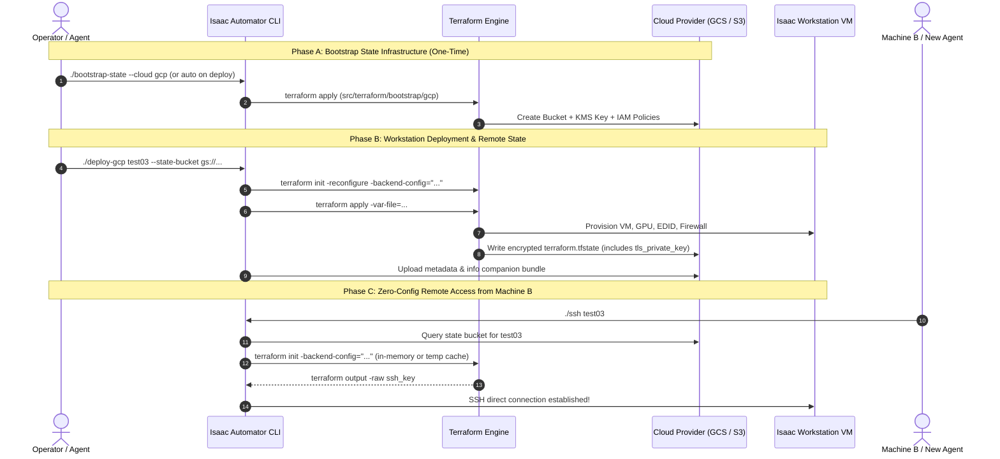

# Remote State Management & Cloud Synchronization Plan (v2.0)

## 1. Executive Summary & Problem Statement

Currently, Isaac Automator is tightly coupled to the local workstation where a deployment was initially created. All state files—including SSH private keys (`key.pem`), cloud provider configurations (`meta.json`), connection details (`info.txt`), generated Ansible inventories, and Terraform state files (`terraform.tfstate`)—are written strictly to the local filesystem (`./state/<name>/` and `/opt/tf-data/<name>/`).

### Key Pain Points:
1. **Machine Lock-In**: Workstations deployed from Machine A cannot be managed, connected to, stopped, or destroyed from Machine B, a new DevContainer, or a CI/CD agent without manually copying private keys and state files.
2. **Data Loss Risk**: If a local environment is deleted, rebuilt, or the laptop fails, access credentials (`key.pem`) and Terraform tracking are permanently lost, leaving orphaned, billing cloud infrastructure.
3. **Collaboration & Multi-Agent Barriers**: Multiple engineers or autonomous AI agents cannot easily share, inspect, or manage team workstations collaboratively.

---

## 2. Analysis of Existing Workstation State

| State Artifact | Current Location | Lifecycle / Purpose | Sensitivity | Target Remote Handling |
| :--- | :--- | :--- | :--- | :--- |
| **`terraform.tfstate`** | `/opt/tf-data/<name>/` (or `./state/<name>/`) | Cloud resource mappings (VM IDs, IPs, VPCs, firewall rules) | **High** | Native Terraform Remote Backend (`gcs` / `s3` / `azurerm` / `oss`) |
| **`key.pem` / `key.pub`** | `./state/<name>/key.pem` | Ephemeral SSH RSA/Ed25519 key generated per VM | **Critical** | Inherent in remote `terraform.tfstate` + State Bundle (`bundle.tar.gz`) |
| **`meta.json`** | `./state/<name>/meta.json` | Deployment params, cloud region, passwords, created timestamps | **High** | Encrypted in State Bundle |
| **`info.txt`** | `./state/<name>/info.txt` | Human-readable connection guide | Low | Packaged in State Bundle |
| **`ansible/inventory`** | `./state/<name>/ansible/inventory` | Generated inventory for playbooks | Low | Dynamically regenerated or pulled from bundle |

---

## 3. Remote Storage Architecture (GCS, S3, Azure Blob, AliCloud OSS)

```text
gs://<state-bucket>/ (or s3://<state-bucket>/)
└── isaacautomator/
    ├── v1/                                  <-- Schema versioning
    │   └── deployments/
    │       ├── test03/
    │       │   ├── terraform/
    │       │   │   └── default.tfstate      <-- Managed directly by Terraform remote backend
    │       │   ├── bundle.tar.gz            <-- Encrypted archive: meta.json, key.pem, key.pub, info.txt
    │       │   ├── bundle.sha256            <-- Integrity checksum
    │       │   └── lock.json                <-- Application-level CLI concurrency lock
    │       └── renan-test/
    │           ├── terraform/default.tfstate
    │           └── bundle.tar.gz
```

### 3.1 Bucket Provisioning Models

Isaac Automator supports two distinct bucket management models:

1. **Auto-Provisioned Bucket (Zero-Config Default)**:
   - If `--state-bucket` is passed as `auto` (or enabled in config), Isaac Automator dynamically creates and configures a dedicated regional bucket:
     - **GCP**: `gs://isaacautomator-state-<project_id>-<region>/`
     - **AWS**: `s3://isaacautomator-state-<account_id>-<region>/`
   - Automatically applies required bucket features (Versioning, Encryption, Public Access Block).
2. **Bring Your Own Bucket (BYOB / Enterprise)**:
   - Operators pass an existing bucket URI:
     `./deploy-gcp test03 --state-bucket gs://my-company-infra-state/`
   - Isaac Automator namespaces all objects under `isaacautomator/deployments/<name>/`.

---

### 3.2 Provider-Specific Storage & Terraform Backend Mechanics

#### A. Google Cloud Storage (GCS)
* **Bucket Settings**:
  * **Location**: Colocated in the deployment region (e.g. `us-central1`) or multi-region (`us`).
  * **Uniform Bucket-Level Access**: `Enabled` (disables legacy ACLs for unified IAM).
  * **Object Versioning**: `Enabled` (ensures state recovery in case of accidental overwrite).
  * **Default KMS Encryption**: Google-managed or Customer-Managed Encryption Key (CMEK).
* **Terraform Remote Backend Block**:
  ```hcl
  terraform {
    backend "gcs" {
      bucket = "isaacautomator-state-cybernetic-renan-us-central1"
      prefix = "isaacautomator/v1/deployments/test03/terraform"
    }
  }
  ```
  * *Concurrency Locking*: GCS natively supports object-level locking and generation precondition checks.

---

#### B. Amazon Web Services (AWS S3)
* **Bucket Settings**:
  * **Location**: Matches target deployment region (e.g. `us-east-1`, `us-west-2`).
  * **Block Public Access**: All 4 settings set to `True`.
  * **Versioning**: `Enabled`.
  * **Default Encryption**: `SSE-S3` (`AES256`) or `SSE-KMS` (`aws:kms`).
* **Terraform Remote Backend Block**:
  * **Modern Terraform (v1.6+)**: Uses S3 native conditional writes (`use_lockfile = true`), eliminating the need for a separate DynamoDB table!
  ```hcl
  terraform {
    backend "s3" {
      bucket       = "isaacautomator-state-123456789012-us-east-1"
      key          = "isaacautomator/v1/deployments/test03/terraform/terraform.tfstate"
      region       = "us-east-1"
      encrypt      = true
      use_lockfile = true
    }
  }
  ```
  * **Legacy Terraform (<v1.6)**: Optionally points to DynamoDB table `isaacautomator-state-locks` (`dynamodb_table = "..."`).

---

#### C. Microsoft Azure (Blob Storage)
* **Backend Configuration**:
  ```hcl
  terraform {
    backend "azurerm" {
      resource_group_name  = "isaacautomator-state-rg"
      storage_account_name = "isaacstatestorage"
      container_name       = "tfstate"
      key                  = "isaacautomator/v1/deployments/test03/terraform.tfstate"
    }
  }
  ```

---

#### D. Alibaba Cloud (OSS)
* **Backend Configuration**:
  ```hcl
  terraform {
    backend "oss" {
      bucket = "isaacautomator-state-hangzhou"
      prefix = "isaacautomator/v1/deployments/test03/terraform"
      region = "cn-hangzhou"
    }
  }
  ```

---

## 4. IAM & Authentication Architecture

Different runtime environments require different IAM authentication strategies:



---

### 4.1 IAM Personas & Credential Flow

#### Persona 1: Local Developer / Operator (DevContainer & CLI)
* **GCP**: Uses Google Application Default Credentials (ADC) generated via `gcloud auth application-default login` or user token.
* **AWS**: Uses AWS SSO or credential profiles (`~/.aws/credentials`).
* **Azure / AliCloud**: Uses `az login` / `aliyun configure`.
* **Behavior**: Isaac Automator automatically inherits the active cloud session without requiring static secrets.

#### Persona 2: Autonomous Agents & Headless Containers (Codespaces / Docker)
* Credentials passed through standard environment variables (`GOOGLE_APPLICATION_CREDENTIALS`, `AWS_ACCESS_KEY_ID`/`AWS_SECRET_ACCESS_KEY`, `ARM_CLIENT_SECRET`).
* Scoped to the least-privilege permissions listed below.

#### Persona 3: CI/CD Pipelines (Keyless Workload Identity Federation)
* For GitHub Actions or GitLab CI, authenticate via short-lived OIDC tokens:
  * **GCP**: `google-github-actions/auth` with Workload Identity Pool.
  * **AWS**: `aws-actions/configure-aws-credentials` with IAM Role ARN and GitHub OIDC subject validation.
* **Benefit**: Zero long-lived secret keys stored in CI repository secrets.

---

### 4.2 Least-Privilege IAM Policy Definitions

#### GCP Least-Privilege IAM Role / Condition
To restrict an operator or service account to *only* Isaac Automator state files within a bucket:

```yaml
# IAM Binding with CEL Condition
title: "IsaacAutomator State Access Only"
description: "Allow full object management only within the isaacautomator/ prefix"
expression: >
  resource.name.startsWith("projects/_/buckets/my-state-bucket/objects/isaacautomator/")
role: "roles/storage.objectAdmin"
```

#### AWS Scoped IAM Policy
```json
{
  "Version": "2012-10-17",
  "Statement": [
    {
      "Sid": "ListBucketPrefix",
      "Effect": "Allow",
      "Action": ["s3:ListBucket"],
      "Resource": "arn:aws:s3:::my-isaac-state-bucket",
      "Condition": {
        "StringLike": {
          "s3:prefix": ["isaacautomator/*"]
        }
      }
    },
    {
      "Sid": "ObjectReadWriteDelete",
      "Effect": "Allow",
      "Action": [
        "s3:GetObject",
        "s3:PutObject",
        "s3:DeleteObject"
      ],
      "Resource": "arn:aws:s3:::my-isaac-state-bucket/isaacautomator/*"
    }
  ]
}
```

---

### 4.3 Multi-Tenant & Cross-Account Access Delegation

For organizations with multiple developer accounts or shared infrastructure:

```text
Organization Central Account (Account A):
└── gs://corp-isaac-state-bucket/
    ├── teams/robotics-alpha/deployments/
    ├── teams/perception-beta/deployments/
    └── users/renan/deployments/
```

* **Bucket Policy Delegation**: Central state bucket grants IAM access to role ARNs across satellite accounts.
* **Namespace Partitioning**: Isaac Automator supports `--state-prefix teams/robotics-alpha/` to isolate team states within a shared corporate bucket.

---

## 5. Secret Encryption & Key Management

To guarantee security of the private key (`key.pem`) and passwords in `meta.json`:



### Encryption Modes:
1. **Mode 1: Cloud-Native KMS Encryption (Default)**:
   - The bundle is encrypted using Cloud KMS (AWS KMS or GCP CMEK) during upload.
   - Access to decrypt is controlled strictly by IAM permissions on the KMS key (`roles/cloudkms.cryptoKeyDecrypter` / `kms:Decrypt`).
2. **Mode 2: Client-Side Passphrase Encryption (Zero-Knowledge Option)**:
   - For high-security environments where cloud admins must not have access to private keys:
   - The operator supplies `--state-passphrase` (or `ISAAC_STATE_PASSPHRASE` env).
   - Bundle is encrypted locally via AES-256-GCM before uploading.
   - Even if the bucket is exposed, keys cannot be decrypted without the passphrase.

---

## 6. Concurrency Locking & Lease Management

To prevent two machines or agents from running conflicting operations on the same deployment simultaneously:

### 6.1 Terraform-Level Locking
* **GCS**: Native object lock.
* **S3**: `use_lockfile = true` (or DynamoDB table).

### 6.2 Application-Level CLI Locking (`lock.json`)
Before executing lifecycle commands (`./deploy`, `./start`, `./stop`, `./destroy`, `./cycle-vm`), Isaac Automator writes a temporary lock file:

```json
{
  "deployment_name": "test03",
  "locked_by": "renan@laptop-macbook",
  "command": "./stop test03",
  "pid": 4120,
  "timestamp": "2026-08-18T22:30:00Z",
  "ttl_seconds": 600
}
```

* **Heartbeat & TTL**: If an agent crash or power loss occurs, locks automatically expire after 10 minutes (`ttl_seconds`), preventing permanent deadlocks.
* **Override Flag**: `--force-unlock` allows operators to clear stale locks manually.

---

## 7. Operator Experience & CLI Workflows

### Scenario A: Deploy on Laptop A
```sh
# Deploy with state bucket configured
./deploy-gcp test03 --state-bucket gs://cybernetic-renan-automator-state/
```
*Creates VM, initializes remote Terraform backend, packs `key.pem` and `meta.json`, and uploads bundle to GCS.*

---

### Scenario B: Connect or Manage from Machine B / Clean Codespace
```sh
# Clone repo on new computer
git clone https://github.com/boredengineering/IsaacAutomator.git
cd IsaacAutomator && ./build

# List all deployments in the state bucket
./list --remote

# Connect instantly (Isaac Automator detects missing local state and auto-pulls it from GCS)
./ssh test03
./novnc test03

# Cycle, stop, or destroy from Machine B
./cycle-vm test03
./destroy test03 --yes
```

---

### Scenario C: Explicit State Management CLI (`./state`)
```sh
# List all active deployment states stored in cloud bucket
./state list

# Pull a deployment's state files down to local machine
./state pull test03

# Push local state modifications back to cloud bucket
./state push test03

# Inspect remote metadata without downloading key
./state inspect test03

# Unlock a stale lock
./state unlock test03
```

---

## 8. Terraform-Native Execution Architecture

This section details how Terraform itself provisions the remote state infrastructure and how the Isaac Automator Python orchestration layer executes Terraform operations across different machines.



---

### 8.1 The State Bootstrap Terraform Module (`src/terraform/bootstrap/`)

To guarantee security, versioning, and compliance, Isaac Automator includes a dedicated Terraform bootstrap module for provisioning cloud state storage.

#### A. GCP State Bootstrap (`src/terraform/bootstrap/gcp/main.tf`)
```hcl
terraform {
  required_version = ">= 1.3.5"
  required_providers {
    google = {
      source  = "hashicorp/google"
      version = ">= 4.57.0"
    }
  }
}

variable "project" { type = string }
variable "region" { type = string, default = "us-central1" }
variable "bucket_name" { type = string, default = "" }

locals {
  name = var.bucket_name != "" ? var.bucket_name : "isaacautomator-state-${var.project}-${var.region}"
}

# 1. State Bucket with Best-Practice Protections
resource "google_storage_bucket" "state_bucket" {
  name                        = local.name
  project                     = var.project
  location                    = var.region
  force_destroy               = false
  uniform_bucket_level_access = true

  versioning {
    enabled = true
  }

  lifecycle_rule {
    action {
      type = "Delete"
    }
    condition {
      num_newer_versions = 10
      days_since_noncurrent_time = 90
    }
  }
}

# 2. Dedicated State Service Account (Optional for Headless/CI)
resource "google_service_account" "state_sa" {
  account_id   = "isaacautomator-state-sa"
  display_name = "Isaac Automator Remote State Manager"
  project      = var.project
}

resource "google_storage_bucket_iam_member" "state_admin" {
  bucket = google_storage_bucket.state_bucket.name
  role   = "roles/storage.objectAdmin"
  member = "serviceAccount:${google_service_account.state_sa.email}"
}

output "state_bucket_name" { value = google_storage_bucket.state_bucket.name }
output "state_bucket_url"  { value = google_storage_bucket.state_bucket.url }
```

---

#### B. AWS State Bootstrap (`src/terraform/bootstrap/aws/main.tf`)
```hcl
terraform {
  required_version = ">= 1.6.0"
  required_providers {
    aws = {
      source  = "hashicorp/aws"
      version = ">= 5.0.0"
    }
  }
}

variable "region" { type = string, default = "us-east-1" }
variable "bucket_name" { type = string, default = "" }

data "aws_caller_identity" "current" {}

locals {
  name = var.bucket_name != "" ? var.bucket_name : "isaacautomator-state-${data.aws_caller_identity.current.account_id}-${var.region}"
}

resource "aws_s3_bucket" "state_bucket" {
  bucket        = local.name
  force_destroy = false
}

resource "aws_s3_bucket_versioning" "versioning" {
  bucket = aws_s3_bucket.state_bucket.id
  versioning_configuration {
    status = "Enabled"
  }
}

resource "aws_s3_bucket_server_side_encryption_configuration" "encryption" {
  bucket = aws_s3_bucket.state_bucket.id
  rule {
    apply_server_side_encryption_by_default {
      sse_algorithm = "AES256"
    }
  }
}

resource "aws_s3_bucket_public_access_block" "public_access" {
  bucket = aws_s3_bucket.state_bucket.id

  block_public_acls       = true
  block_public_policy     = true
  ignore_public_acls      = true
  restrict_public_buckets = true
}

output "state_bucket_name" { value = aws_s3_bucket.state_bucket.id }
output "state_bucket_arn"  { value = aws_s3_bucket.state_bucket.arn }
```

---

### 8.2 Dynamic Backend Initialization in `deployer.py`

In `src/python/deployer.py`, the `init_terraform` method is updated to dynamically configure the backend based on `--state-bucket`:

```python
def init_terraform(self, cwd: str):
    """
    Dynamically initializes Terraform for local or cloud remote backends
    """
    debug = self.params["debug"]
    deployment_name = self.params["deployment_name"]
    state_bucket = self.params.get("state_bucket")
    cloud = self.params.get("cloud", "gcp")

    if not state_bucket:
        # Backward-compatible local backend
        tfstate_file = Path(f"{self.config['state_dir']}/{deployment_name}/.tfstate").absolute()
        backend_args = f'-backend-config="path={tfstate_file}"'
    else:
        # Extract bucket name and strip protocol prefix
        bucket = state_bucket.replace("gs://", "").replace("s3://", "").rstrip("/")
        prefix = f"isaacautomator/v1/deployments/{deployment_name}/terraform"

        if cloud == "gcp":
            backend_args = (
                f'-backend-config="bucket={bucket}" '
                f'-backend-config="prefix={prefix}"'
            )
        elif cloud == "aws":
            region = self.params.get("region", "us-east-1")
            backend_args = (
                f'-backend-config="bucket={bucket}" '
                f'-backend-config="key={prefix}/terraform.tfstate" '
                f'-backend-config="region={region}" '
                f'-backend-config="use_lockfile=true"'
            )
        elif cloud == "azure":
            backend_args = (
                f'-backend-config="storage_account_name={bucket}" '
                f'-backend-config="container_name=tfstate" '
                f'-backend-config="key={prefix}/terraform.tfstate"'
            )

    cmd = f"terraform init -upgrade -no-color -input=false -reconfigure {backend_args}"
    shell_command(
        f"{cmd} {' > /dev/null' if not debug else ''}",
        verbose=debug,
        cwd=cwd,
    )
```

---

### 8.3 Zero-Downtime State Migration for Existing Machines

For existing workstations (like `test03` or `renan-test`), operators can seamlessly migrate their local `.tfstate` to the cloud backend with **zero infrastructure downtime**:

```sh
./state migrate test03 --state-bucket gs://cybernetic-renan-automator-state/
```

#### Under the Hood:
1. Isaac Automator runs Terraform's built-in state migration:
   ```bash
   terraform init \
     -migrate-state \
     -force-copy \
     -backend-config="bucket=cybernetic-renan-automator-state" \
     -backend-config="prefix=isaacautomator/v1/deployments/test03/terraform"
   ```
2. Copies local `key.pem`, `meta.json`, and `info.txt` to `gs://cybernetic-renan-automator-state/isaacautomator/v1/deployments/test03/bundle.tar.gz`.
3. Validates remote state integrity with `terraform refresh`.

---

### 8.4 Remote Key & Metadata Reconstruction via Terraform Outputs

Because `src/terraform/*/ovkit/main.tf` creates the SSH key pair as a `tls_private_key.ssh_key` resource, the private key is **inherently stored inside the remote Terraform state**.

When connecting from a new machine:
```python
def ensure_local_credentials(deployment_name: str, state_bucket: str):
    """
    If key.pem is missing locally, reconstructs it directly from Terraform remote output
    """
    key_path = Path(f"state/{deployment_name}/key.pem")
    if key_path.exists():
        return

    # 1. Initialize remote terraform backend
    init_remote_terraform(deployment_name, state_bucket)

    # 2. Extract private key from remote state
    raw_key = shell_command("terraform output -raw ssh_key", capture_output=True)

    # 3. Write key locally with 0600 permissions
    key_path.parent.mkdir(parents=True, exist_ok=True)
    key_path.write_text(raw_key)
    os.chmod(key_path, 0o600)
```

---

### 8.5 Terraform Remote Teardown Mechanics

When `./destroy <name> --yes` is invoked:
1. Isaac Automator initializes the remote backend for `<name>`.
2. Runs `terraform destroy -auto-approve -var-file=.tfvars` against cloud resources.
3. Once all cloud resources are destroyed, Isaac Automator purges the deployment's remote prefix from the bucket (`gs://<bucket>/isaacautomator/v1/deployments/<name>/`).
4. Removes local state directory `./state/<name>/`.

---

## 9. Phased Implementation Roadmap

- [ ] **Phase 1: State Bootstrap Terraform Modules (`src/terraform/bootstrap/`)**
  - Implement GCP (`bootstrap/gcp/main.tf`) and AWS (`bootstrap/aws/main.tf`) modules for zero-config bucket provisioning with versioning, SSE, and public access blocks.
- [ ] **Phase 2: Dynamic Terraform Backend in `deployer.py`**
  - Update `init_terraform()` in `src/python/deployer.py` to support dynamic `-backend-config` flags.
  - Implement zero-downtime state migration (`terraform init -migrate-state`).
- [ ] **Phase 3: State Sync & Lock Manager (`src/python/state_manager.py`)**
  - Implement bundle packaging, SHA256 checksums, and application lock leases (`lock.json`).
  - Implement automatic credential recovery from `terraform output -raw ssh_key`.
- [ ] **Phase 4: CLI Integration & Auto-Discovery Hook**
  - Add `--state-bucket` and `--state-passphrase` options to `deploy_command.py`.
  - Add `./state` command suite (`migrate`, `list`, `pull`, `push`, `inspect`, `unlock`).
  - Add auto-pull fallback hook into `./ssh`, `./novnc`, `./start`, `./stop`, `./destroy`, and `./cycle-vm`.
- [ ] **Phase 5: Testing & Documentation**
  - Multi-machine e2e test: Deploy from Machine A $\to$ Migrate $\to$ Connect/Stop/Destroy from Machine B.
  - Update `README.md`, Operator Skills, and DevContainer documentation.
