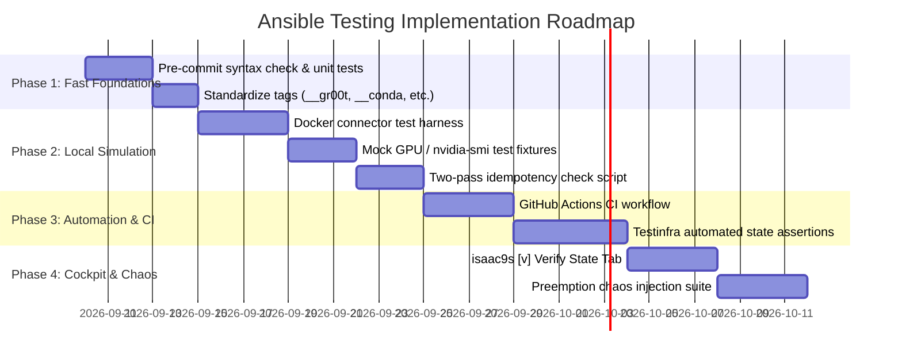

# Master Plan: Comprehensive Testing Framework for Cloud Ansible Engine

## Artifact Registry verification addition (2026-09-09)

Registry work is tracked in [artifact-registry-plan.md](artifact-registry-plan.md).
The offline suites `src/tests/artifact_registry.test.py`,
`src/tests/artifact_registry_ansible.test.py`, and
`src/tests/artifact_registry_terraform.test.py` cover profile handoff, keyless Docker
configuration and Terraform contracts. Run them through `PYTHONPATH=. sh
src/tests/run_all.sh`; run Terraform provider validation/mocked tests and Ansible
syntax checks separately as documented in the registry guide. No passing offline
suite establishes live IAM propagation, successful registry pulls, GPU compatibility
or end-to-end GR00T health. Never run the normal deployment CLI merely as an offline
test: even its dry-run path can authenticate, write state and contact cloud APIs.

Review-driven coverage also includes failed-init metadata preservation, same-cloud
repair without the original YAML, cross-cloud saved-state rejection, adversarial
Docker-directory swaps after dropping privilege, actual Ansible module wrapper
merges for temporary non-root homes, enabled GCP/from-image inventory, both GR00T
mode transitions and digest-change restart handlers. HTTP transport tests use
loopback-only metadata/proxy/redirect fixtures, never the real metadata service.

Follow-on provider coverage is tracked in
[optional-distribution-plan.md](optional-distribution-plan.md):
`distribution_profile.test.py`, `container_registry_ansible.test.py`,
`ecr_terraform.test.py`, and `huggingface_artifacts.test.py` add disabled-by-default
YAML selection, saved canonical settings, ECR IAM-only credentials, Docker Hub
auth/cache behavior and pinned model/dataset staging. `src/terraform/test_ecr.py`
validates source-only temporary stacks with mocked plan operations and backend
initialization disabled. Hugging Face tests use fake Hub clients and temporary
user homes, not real model downloads. See the follow-on ledger for current totals,
review fixes, tagged-rerun requirements and live-acceptance limitations.

- [Executive Summary & Session Context](#executive-summary--session-context)
- [1. Testing Architecture & Multi-Tier Strategy](#1-testing-architecture--multi-tier-strategy)
- [2. Tier-by-Tier Implementation Specifications](#2-tier-by-tier-implementation-specifications)
  - [Tier 1: Static Analysis, Syntax & Linting](#tier-1-static-analysis-syntax--linting)
  - [Tier 2: Unit Testing & Dynamic Inventory Generation](#tier-2-unit-testing--dynamic-inventory-generation)
  - [Tier 3: Local Ephemeral Docker Simulation (No Cloud Billing)](#tier-3-local-ephemeral-docker-simulation-no-cloud-billing)
  - [Tier 4: Two-Pass Idempotency Verification](#tier-4-two-pass-idempotency-verification)
  - [Tier 5: Speculative Dry-Run Orchestration (CLI Integration)](#tier-5-speculative-dry-run-orchestration-cli-integration)
  - [Tier 6: Targeted Cloud Execution & Tagged Re-Runs](#tier-6-targeted-cloud-execution--tagged-re-runs)
  - [Tier 7: Post-Provisioning Verification & Self-Healing Probes](#tier-7-post-provisioning-verification--self-healing-probes)
- [3. Advanced Proposals & Suggestions for Evaluation](#3-advanced-proposals--suggestions-for-evaluation)
  - [Proposal A: Testinfra / Goss System State Assertion Suite](#proposal-a-testinfra--goss-system-state-assertion-suite)
  - [Proposal B: Mock GPU & CUDA Stub Fixtures for Offline CI](#proposal-b-mock-gpu--cuda-stub-fixtures-for-offline-ci)
  - [Proposal C: Molecule Scenario Architecture](#proposal-c-molecule-scenario-architecture)
  - [Proposal D: CI/CD Matrix Pipeline (GitHub Actions)](#proposal-d-cicd-matrix-pipeline-github-actions)
  - [Proposal E: Tag Standardization & Audit Matrix](#proposal-e-tag-standardization--audit-matrix)
  - [Proposal F: Real-Time Diagnostic Telemetry in `isaac9s`](#proposal-f-real-time-diagnostic-telemetry-in-isaac9s)
  - [Proposal G: Preemption Chaos Injection Testing](#proposal-g-preemption-chaos-injection-testing)
- [4. Actionable Phased Implementation Roadmap](#4-actionable-phased-implementation-roadmap)

---

## Executive Summary & Session Context

Following the architectural decision to **natively replicate all `isaac-installer` capabilities directly into Ansible** rather than wrapping external shell scripts, the repository's Ansible engine was expanded to 13 cohesive roles:

1. **`roles/conda`**: Isolated Miniconda3 runtime, `/usr/local/bin/isaaclab-env` CLI shim, dynamic Vulkan ICD probing hook, and CP312 PYTHONPATH cleanup.
2. **`roles/auth`**: Linux hardware groups (`dialout`, `plugdev`, `input`, `video`, `docker`), `.gitconfig`, and Cloud Hub logins (Hugging Face CLI, NGC `nvcr.io`, Weights & Biases, GitHub CLI).
3. **`roles/hardware-teleop`**: 1ms FTDI serial latency udev rule (`99-ftdi-latency.rules`), SpaceMouse daemon (`spacenavd`), and Intel RealSense SDK.
4. **`roles/gr00t`**: NVIDIA Isaac-GR00T Foundation Model stack with dual-remote git topology, ZeroMQ systemd policy inference service (port 5555), model weights cache, and desktop shortcut.
5. **`roles/lerobot`**: Hugging Face LeRobot teleop stack, video codec development libraries, and dataset visualizer shim.
6. **`roles/state-ledger`**: Hardware/driver probing, persistent JSON ledger (`/home/{{ ansible_user }}/.isaac-state.json`), and `/usr/local/bin/isaac-verify-state` self-healing utility.
7. **Enhanced Existing Roles**:
   - `roles/system`: Added NVMe utilities (`nvme-cli`, `smartmontools`, `fio`, `iotop`), cloud tools (`git-lfs`, `jq`, `rsync`), and GitHub CLI (`gh`).
   - `roles/isaacsim-source`: Added `setup_conda_env.sh -> setup_python_env.sh` compatibility bridge.
   - `roles/isaaclab-source`: Added dual-remote git topology (`upstream` + `pushRemote = origin`) and conda-aware installation (`./isaaclab.sh --conda {{ conda_env_name }}`).
   - `roles/isaaclab-arena-source`: Completed installation pipeline with editable pip install (`isaaclab-env pip install -e .`), Pinocchio, Pink WBC, and CMEEL.
   - `roles/demos`: Added `arena-benchmark` and `arena-gr00t` demo launchers and shortcuts, registered in Python config.
   - `roles/isaac-workstation`: Wired complete dependency graph across all 13 roles and hooked self-healing into VM startup.

With this substantial expansion, **testing Ansible reliably, safely, and cost-effectively** is paramount. Because Isaac Automator provisions real, paid GPU cloud infrastructure (AWS, GCP, Azure, Alibaba Cloud), testing cannot rely solely on live cloud deployments.

This document establishes the **holistic Ansible testing architecture**, defining 7 progressive testing tiers and detailed evaluation proposals.

---

## 1. Testing Architecture & Multi-Tier Strategy

The testing framework employs a progressive disclosure pyramid: fast, zero-cost static tests run on every commit; local container simulations validate task logic without cloud resources; speculative dry-runs verify end-to-end orchestration; and targeted cloud runs validate physical AI GPU workloads.

```mermaid
flowchart TD
    subgraph Tier1["Tier 1: Static Checks ($0, <5 sec)"]
        T1A["ansible-playbook --syntax-check"]
        T1B["ansible-lint & yamllint"]
        T1C["Jinja2 Syntax & Macro Validation"]
    end

    subgraph Tier2["Tier 2: Unit Testing ($0, <10 sec)"]
        T2A["deployer.test.py (Inventory Rendering)"]
        T2B["deploy_command.test.py (Param Matrix)"]
        T2C["Profile Resolution Tests (Security & Hardware)"]
    end

    subgraph Tier3["Tier 3: Local Ephemeral Simulation ($0, ~1-2 min)"]
        T3A["Docker Connector (-c docker)"]
        T3B["Mock GPU / Fake nvidia-smi Fixtures"]
        T3C["Non-GPU Roles Validation (auth, conda, teleop, demos)"]
    end

    subgraph Tier4["Tier 4: Two-Pass Idempotency ($0, ~2 min)"]
        T4A["Pass 1: Apply Tasks"]
        T4B["Pass 2: Assert changed=0 & failed=0"]
    end

    subgraph Tier5["Tier 5: Speculative Dry-Run ($0, ~30 sec)"]
        T5A["./deploy-gcp --dry-run"]
        T5B["./deploy-aws --dry-run"]
        T5C["Terraform Speculative Plan + Resolved Inventory Check"]
    end

    subgraph Tier6["Tier 6: Surgical Cloud Re-Runs (Minimal Cost)"]
        T6A["--existing run_ansible (Zero VM Rebuild)"]
        T6B["Tagged Execution (--tags __gr00t, __demos, etc.)"]
        T6C["./start --quick (Startup Self-Healing Verification)"]
    end

    subgraph Tier7["Tier 7: Post-Provisioning Verification"]
        T7A["/usr/local/bin/isaac-verify-state Probe"]
        T7B["Symlinks, Conda Env, Vulkan ICD & State Ledger Audit"]
        T7C["ZeroMQ Policy Server IPC Health Check"]
    end

    Tier1 --> Tier2 --> Tier3 --> Tier4 --> Tier5 --> Tier6 --> Tier7
```



---

## 2. Tier-by-Tier Implementation Specifications

### Tier 1: Static Analysis, Syntax & Linting

#### 1. Playbook Syntax Check
Validates grammar, YAML syntax, task options, and Jinja2 tags across the entire 13-role dependency graph:

```bash
ANSIBLE_ROLES_PATH=src/ansible/roles ansible-playbook \
  --syntax-check src/ansible/isaac-workstation.yaml
```

*Invariants Verified:*
- All referenced roles exist in `roles/`.
- All handlers have matching `listen:` or name keys.
- Module parameter signatures match Ansible core modules.
- Jinja2 substitution syntax (`{{ ... }}`) is free of syntax errors.

#### 2. Ansible Linter Configuration (`.ansible-lint`)
To enforce coding standards without breaking on Isaac-specific patterns (e.g. running scripts outside collections or long build timeouts), establish a repository-level `.ansible-lint` config:

```yaml
# .ansible-lint
profile: production
exclude_paths:
  - .agents/
  - isaac-installer/
  - .state/
skip_list:
  - 'name[casing]'             # Allow flexible casing on technical role titles
  - 'risky-file-permissions'   # Allow 0755 shims
  - 'command-instead-of-shell' # Allow shell for pipes and redirections
```

---

### Tier 2: Unit Testing & Dynamic Inventory Generation

Ansible in Isaac Automator is driven by Python deployers (`GCPDeployer`, `AWSDeployer`, `AzureDeployer`). Unit tests must ensure that user flags and security profiles correctly translate into Ansible inventory variables.

#### Inventory Generation Assertions (`src/tests/deployer.test.py`)
Add unit test coverage verifying that:
1. `demos="arena-benchmark,arena-gr00t"` sets `isaaclab_arena_git_checkpoint` and enables required apps.
2. Security profiles (e.g. `studio-enterprise`) set correct SSH users, remote desktop providers, and custom variables.
3. Passwords and keys are never empty in generated `.inventory` files.
4. Boolean variables are formatted as `true`/`false` rather than Python `True`/`False` strings.

---

### Tier 3: Local Ephemeral Docker Simulation (No Cloud Billing)

Because physical GPU cloud instances cost money, developers need to test role logic, file templates, user permissions, and package management locally.

Using Ansible's native `docker` connector, roles can run inside an ephemeral Ubuntu 22.04 container on the developer's workstation:

```bash
# 1. Start clean Ubuntu 22.04 container
docker run -d --name test-workstation-node \
  -v /var/run/docker.sock:/var/run/docker.sock \
  ubuntu:22.04 sleep infinity

# 2. Bootstrap python and sudo inside container
docker exec test-workstation-node bash -c "apt-get update && apt-get install -y python3 sudo curl"

# 3. Execute target roles using docker connector
ANSIBLE_ROLES_PATH=src/ansible/roles ansible-playbook \
  -i "test-workstation-node," -c docker \
  src/ansible/isaac-workstation.yaml \
  -e "ansible_user=root" \
  -e "cloud=local" \
  -e "demos=arena-benchmark" \
  --tags "__demos_arena_benchmark" \
  -vv

# 4. Clean up container
docker rm -f test-workstation-node
```

---

### Tier 4: Two-Pass Idempotency Verification

A foundational principle of Ansible is **idempotency**: running a playbook a second time should result in `0 changed` and `0 failed`.

#### Two-Pass Test Protocol
1. **Pass 1 (Apply)**: Execute playbook against test node and capture output.
2. **Pass 2 (Verify)**: Re-execute the exact same command. Parse Ansible summary statistics:
   - `failed=0`
   - `unreachable=0`
   - `changed=0` (excluding explicit `always_run` or probe tasks)

Any task showing `changed` on Pass 2 indicates a missing `creates:`, flawed `when:` guard, or non-idempotent `shell` task.

---

### Tier 5: Speculative Dry-Run Orchestration (CLI Integration)

The CLI provides built-in speculative dry-run execution:

```bash
./deploy-gcp --profile studio-enterprise --dry-run
./deploy-aws --profile custom-developer --dry-run
```

*Execution Trace:*
1. Resolves all profile YAML settings and security invariants.
2. Synthesizes Terraform configuration and runs `terraform validate` and `terraform plan`.
3. Creates the target `.inventory` file.
4. Executes `ansible-playbook --syntax-check` against the resolved deployment parameters.
5. Emits detailed cost/resource preview without creating billable infrastructure.

---

### Tier 6: Targeted Cloud Execution & Tagged Re-Runs

When modifying or debugging a role on a running cloud workstation, avoid destroying and recreating the VM (which takes 20-40 minutes and burns compute):

#### 1. Non-Destructive Full Re-Run
```bash
./deploy-gcp --deployment-name <name> --existing run_ansible
```

#### 2. Surgical Tagged Execution
Use the generated `.inventory` in `.state/<deployment_name>/.inventory` to run only the role under development:

```bash
ANSIBLE_ROLES_PATH=src/ansible/roles ansible-playbook \
  -i .state/<deployment_name>/.inventory \
  src/ansible/isaac-workstation.yaml \
  --tags "__gr00t" \
  -vv
```

#### 3. Startup Self-Healing Verification
Test the startup self-healing hook without a full reboot:
```bash
./start <deployment_name> --quick
```

---

### Tier 7: Post-Provisioning Verification & Self-Healing Probes

Once Ansible finishes provisioning, the state must be verified on the target machine:

```bash
/usr/local/bin/isaac-verify-state
```

*Automated Invariant Checks:*
- **Symlinks**:
  - `/home/{{ ansible_user }}/IsaacSim` points to valid release directory.
  - `/home/{{ ansible_user }}/IsaacLab/_isaac_sim` points to Isaac Sim.
- **Runtime Environment**:
  - `/usr/local/bin/isaaclab-env` CLI exists and correctly launches Python in `isaaclab` Conda env.
- **3D Graphics & Vulkan**:
  - `activate.d/vulkan_icd.sh` detects NVIDIA ICD (`/usr/share/vulkan/icd.d/nvidia_icd.json`).
- **Hardware & Teleop**:
  - `/etc/udev/rules.d/99-ftdi-latency.rules` is present with `ATTR{latency_timer}="1"`.
- **Foundation Models**:
  - ZeroMQ inference server responsive on `tcp://127.0.0.1:5555`.
- **State Ledger**:
  - `/home/{{ ansible_user }}/.isaac-state.json` contains valid hardware versions and component commit hashes.

---

## 3. Advanced Proposals & Suggestions for Evaluation

To make testing world-class, the following proposals should be evaluated for implementation:

### Proposal A: Testinfra / Goss System State Assertion Suite

Instead of manual verification, adopt **`pytest-testinfra`** or **`goss`** to run automated unit-style assertions against the target machine:

```python
# tests/test_workstation_state.py
def test_ftdi_latency_rule(host):
    rule = host.file("/etc/udev/rules.d/99-ftdi-latency.rules")
    assert rule.exists
    assert rule.contains('ATTR{latency_timer}="1"')

def test_isaaclab_env_shim(host):
    shim = host.file("/usr/local/bin/isaaclab-env")
    assert shim.is_file
    assert shim.mode == 0o755

def test_gr00t_service(host):
    service = host.service("isaac-gr00t")
    assert service.is_enabled

def test_vulkan_manifest_detection(host):
    res = host.run("/usr/local/bin/isaaclab-env python -c 'import torch; print(torch.cuda.is_available())'")
    assert "True" in res.stdout
```

*Benefit*: Can run over SSH/IAP directly from CI or developer machine, providing clear green/red test reports.

---

### Proposal B: Mock GPU & CUDA Stub Fixtures for Offline CI

A major challenge in testing GPU automation in GitHub Actions or DevContainers is the lack of a physical NVIDIA GPU.

*Solution*: Deploy a lightweight mock fixture package:
- Stubbed `/usr/bin/nvidia-smi` script returning realistic GPU tables (NVIDIA L4 or RTX 4090).
- Stubbed `nvcc` returning CUDA 12.4 release info.
- Mock `nvidia_icd.json` manifest in `/usr/share/vulkan/icd.d/`.

*Benefit*: Enables 95% of GPU-dependent Ansible tasks (driver checks, CUDA paths, Vulkan manifest discovery, GR00T service configuration) to be tested in standard $0 cloud CI runners.

---

### Proposal C: Molecule Scenario Architecture

Evaluate adopting **Molecule** with `molecule-plugins[docker]` for formal role testing:

```text
src/ansible/roles/conda/molecule/
├── default/
│   ├── molecule.yml       # Docker driver config (Ubuntu 22.04 container)
│   ├── converge.yml       # Test playbook applying the role
│   ├── idempotence.yml    # Idempotency test pass
│   └── verify.yml         # Verification assertions
```

*Command*:
```bash
cd src/ansible/roles/conda && molecule test
```

---

### Proposal D: CI/CD Matrix Pipeline (GitHub Actions)

Establish `.github/workflows/ansible-test.yml` running on pull requests:

| Job | Trigger | What It Runs | Runtime |
| :--- | :--- | :--- | :--- |
| **Lint & Syntax** | Every PR commit | `ansible-lint`, `yamllint`, `ansible-playbook --syntax-check` | < 30 sec |
| **Deployer Unit Tests** | Every PR commit | `python3 src/tests/deployer.test.py` | < 15 sec |
| **Dry-Run Matrix** | PR to main | `./deploy-gcp --dry-run`, `./deploy-aws --dry-run` | < 1 min |
| **Docker Role Converge** | Nightly / Tag | Ephemeral Docker converge of `system`, `auth`, `conda`, `demos` | ~3 min |

---

### Proposal E: Tag Standardization & Audit Matrix

To maximize surgical control, enforce consistent tagging across all roles:

| Tag Pattern | Convention | Example |
| :--- | :--- | :--- |
| `__<role>` | Targets the entire role | `__gr00t`, `__conda`, `__auth`, `__lerobot` |
| `__demos_<name>` | Targets a specific demo | `__demos_arena_benchmark`, `__demos_humanoid_locomotion` |
| `skip_in_image` | Tasks only executed on live VM, omitted from Packer image | Uploading user keys, dynamic autorun script |
| `on_stop_start` | Tasks re-run when VM stops and restarts | Re-attaching NVMe, self-healing symlinks, starting services |
| `__autorun` | Boot sequence execution | Launching desktop UI, starting demo rollout |

*Action*: Implement an automated python test in `src/tests/` asserting that every role in `src/ansible/roles/` exposes its corresponding `__<role>` tag.

---

### Proposal F: Real-Time Diagnostic Telemetry in `isaac9s`

Integrate Ansible health checks directly into the `isaac9s` terminal cockpit:
- Add a new tab `[v] Verify State` to the workstation inspector.
- Trigger `/usr/local/bin/isaac-verify-state` over IAP/SSH asynchronously.
- Display visual badges:
  - `[OK] Isaac Sim Symlink`
  - `[OK] Conda isaaclab-env`
  - `[OK] Vulkan ICD`
  - `[OK] FTDI 1ms Latency`
  - `[OK] GR00T Service (5555)`

---

### Proposal G: Preemption Chaos Injection Testing

Isaac Automator features automated GCP Spot preemption resilience with continuous 10-minute GCS backups and a 30-second preemption watchdog daemon (`roles/isaac-workstation/tasks/resilience.yml`).

*Testing Proposal*:
- Create a test script simulating GCP preemption:
  ```bash
  # Send mock termination notice to local metadata listener
  curl -s http://127.0.0.1:8080/simulate-preemption || kill -SIGUSR1 $(pgrep -f preemption-listener)
  ```
- Assert that:
  1. The listener catches the signal within 2 seconds.
  2. GCS snapshot upload is initiated immediately.
  3. Pre-stop cleanup completes before shutdown.

---

## 4. Actionable Phased Implementation Roadmap



### Immediate Action Items
1. **Catalog**: Register `ansible-testing-plan.md` in `.agents/references/INDEX.md`.
2. **Standardize Role Tags**: Add explicit top-level tags (`__auth`, `__conda`, `__hardware_teleop`, `__gr00t`, `__lerobot`, `__state_ledger`) to make CLI targeting seamless.
3. **Local Docker Test Script**: Provide a simple helper `./test-ansible-local --role <name>` wrapping the Docker connector for zero-cost testing.
