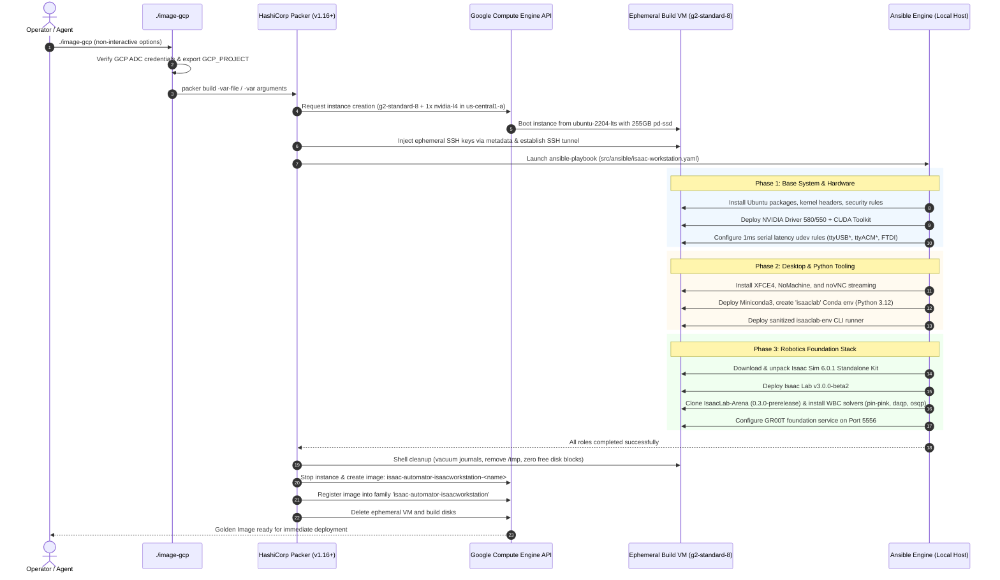

# Architectural Plan: Cloud Image Baking for Fast Robotics Workstation Deployment

**Document ID**: `cloud-image-baking-plan.md`  
**Target Subsystems**: HashiCorp Packer (`src/packer/gcp/`), Ansible Engine (`src/ansible/`), Google Compute Engine (GCE)  
**Target Architecture**: Google Cloud Platform (GCP) `us-central1`, `g2-standard-8` (1x NVIDIA L4 24GB, Ada `sm_89`)  
**Active Stack**: Isaac Sim 6.0.1, Isaac Lab v3 (`v3.0.0-beta2`), IsaacLab-Arena (`release/0.3.0-prerelease`), Whole-Body Control (WBC)  

---

## 1. Executive Summary & Strategic Rationale

In cloud-native robotics simulation, instance provisioning latency is the single largest operational bottleneck:
- **Dynamic Provisioning (`--not-from-image`)**: Every VM boot starts from raw Ubuntu 22.04 LTS and runs 45–60+ minutes of Ansible provisioning. It repeatedly downloads ~15 GB of Omniverse Kit binaries, builds PyTorch environments, compiles CUDA extensions, and clones Git repositories. This creates significant developer downtime, high network failure surface, and substantial accumulated compute costs during iterative testing.
- **Pre-Baked Golden Image (`--from-image`)**: HashiCorp Packer provisions an ephemeral GPU VM, runs Ansible once to configure the complete operating system and robotics toolchain, creates a compressed GCE custom machine image, and deletes the build VM. Subsequent workstation deployments launch directly from the pre-baked disk in **2 to 3 minutes**.

This document specifies the end-to-end architecture, configuration, cost profile, and verification procedures for building and managing pre-baked Isaac Workstation images on Google Cloud Platform.

---

## 2. Infrastructure Topology & Execution Flow



---

## 3. Host Environment & Cloud Quota Verification

The build environment on this machine has been verified and meets all prerequisites:

| Component | Verified Specification | Status |
| :--- | :--- | :--- |
| **Packer Binary** | HashiCorp Packer v1.16.0 installed at `/usr/local/bin/packer` | **Ready** |
| **Packer Plugins** | `hashicorp/googlecompute` (v1.2.7) & `hashicorp/ansible` (v1.1.6) installed | **Ready** |
| **GCP Identity** | Account `bored2engineer@gmail.com` via Application Default Credentials (ADC) | **Ready** |
| **GCP Project** | `cybernetic-renan` | **Active** |
| **GCP GPU Quota** | Region `us-central1`: **16.0 NVIDIA L4 GPUs** available, **0.0 currently in use** | **Available** |
| **GCP CPU Quota** | Region `us-central1`: Sufficient C2/N1/G2 compute capacity | **Available** |
| **Ansible Engine** | Local `ansible-playbook` 2.16+ using `/workspaces/IsaacAutomator/src/ansible/ansible.cfg` | **Ready** |

---

## 4. Packer & Ansible Configuration Specification

### 4.1 HCL Template Configuration (`src/packer/gcp/isaac-workstation.pkr.hcl`)
The template uses relative path resolution via `${path.root}` to ensure portability:

```hcl
packer {
  required_plugins {
    googlecompute = {
      source  = "github.com/hashicorp/googlecompute"
      version = "~> 1"
    }
    ansible = {
      source  = "github.com/hashicorp/ansible"
      version = "~> 1"
    }
  }
}

source "googlecompute" "isaac-workstation" {
  project_id          = var.gcp_project
  zone                = var.gcp_zone
  machine_type        = var.instance_type # g2-standard-8
  source_image_family = "ubuntu-2204-lts"
  source_image_project_id = ["ubuntu-os-cloud"]

  image_name        = local.expanded_image_name
  image_family      = "isaac-automator-isaacworkstation"
  image_description = "Isaac Automator workstation image (${var.version})"

  disk_size           = 255
  disk_type           = "pd-ssd"
  ssh_username        = "ubuntu"
  on_host_maintenance = "TERMINATE"

  accelerator_type  = "projects/${var.gcp_project}/zones/${var.gcp_zone}/acceleratorTypes/${var.gpu_type}"
  accelerator_count = var.gpu_count

  labels = {
    deployment = "gcp_image"
  }
}

build {
  sources = ["source.googlecompute.isaac-workstation"]

  provisioner "ansible" {
    use_proxy     = false
    groups        = ["isaac_workstation"]
    playbook_file = "${path.root}/../../ansible/isaac-workstation.yaml"
    ansible_env_vars = [
      "ANSIBLE_CONFIG=${path.root}/../../ansible/ansible.cfg"
    ]
    extra_arguments = [
      "--skip-tags", var.skip_tags,
      "--extra-vars", "cloud='gcp' deployment_name='gcp_image' isaacsim_git_checkpoint='${var.isaacsim}' isaaclab_git_checkpoint='${var.isaaclab}' isaaclab_arena_git_checkpoint='${var.isaaclab_arena}' vnc_password='${var.vnc_password}' system_user_password='${var.system_user_password}' in_china=${var.in_china} uploads_dir='/home/ubuntu/uploads' results_dir='/home/ubuntu/results' workspace_dir='/home/ubuntu/workspace'"
    ]
  }

  provisioner "shell" {
    inline = [
      "sudo rm -rf /tmp/* /var/tmp/*",
      "sudo journalctl --vacuum-size=10M",
      "sudo dd if=/dev/zero of=/EMPTY bs=1M || true",
      "sudo rm -f /EMPTY",
      "sync"
    ]
  }
}
```

### 4.2 Stack & Role Alignment in Ansible

| Role | Target Package / Ref | Key Adjustments in Image |
| :--- | :--- | :--- |
| **`nvidia-driver`** | Driver 580/550 + CUDA | Installed on temporary L4 VM; kernel modules validated. |
| **`remote-desktop`** | NoMachine + noVNC | Installed & pre-configured; passwords skipped via `skip_in_image`. |
| **`conda`** | Miniconda3 / Python 3.12 | Pre-creates `isaaclab` environment; deploys `isaaclab-env` CLI shim. |
| **`hardware-teleop`**| Low-latency serial rules | Deploys `/etc/udev/rules.d/99-ftdi-latency.rules` with `ftdi_sio`, `ttyUSB*`, and `ttyACM*` `latency_timer=1`. |
| **`isaacsim-source`**| Isaac Sim 6.0.1 | Downloaded & unpacked to `/home/ubuntu/IsaacSim`; Vulkan ICD linked. |
| **`isaaclab-source`**| Isaac Lab v3.0.0-beta2 | Cloned and installed in editable mode inside `isaaclab` Conda environment. |
| **`isaaclab-arena-source`** | Arena 0.3.0-prerelease | Cloned with submodules; installs editable monorepo + WBC solvers (`pin-pink`, `daqp`, `osqp`, `mujoco`). |
| **`gr00t`** | GR00T Foundation Model | Configured on port **5556** (protecting from VS Code tunnel conflicts). |

---

## 5. Execution Procedures

### Step 1: Pre-Flight Dry-Run Validation (Zero Cost)
Validate the Packer HCL syntax, GCP project authentication, and Ansible playbook structure without launching cloud infrastructure:

```bash
VERSION=v6.0.1 ./image-gcp --dry-run \
  --image-name test-image \
  --project cybernetic-renan \
  --zone us-central1-a \
  --instance-type g2-standard-8 \
  --gpu-type nvidia-l4 \
  --gpu-count 1 \
  --isaacsim v6.0.1 \
  --isaaclab v3.0.0-beta2 \
  --isaaclab-arena release/0.3.0-prerelease \
  --system-user-password "TemporaryValidationPass123!" \
  --existing overwrite
```

### Step 2: Live-Fire Image Baking Command
Execute the full image build. Run strictly non-interactively to prevent agent hangs:

```bash
VERSION=v6.0.1 ./image-gcp \
  --image-name isaac-workstation-601-l4 \
  --project cybernetic-renan \
  --zone us-central1-a \
  --instance-type g2-standard-8 \
  --gpu-type nvidia-l4 \
  --gpu-count 1 \
  --isaacsim v6.0.1 \
  --isaaclab v3.0.0-beta2 \
  --isaaclab-arena release/0.3.0-prerelease \
  --system-user-password "YourDeploymentUserPasswordHere" \
  --existing overwrite
```

### Step 3: Verify Image in GCP Catalog
Once Packer outputs `* Image build complete!`, verify the image exists in GCE:

```bash
gcloud compute images describe isaac-automator-isaacworkstation-isaac-workstation-601-l4 \
  --project=cybernetic-renan \
  --format="table(name,family,status,diskSizeGb)"
```

### Step 4: Rapid Workstation Deployment from Golden Image
Deploy a new workstation from the baked image in under 3 minutes:

```bash
./deploy-gcp isaac-prod-01 \
  --from-image \
  --project cybernetic-renan \
  --zone us-central1-a \
  --instance-type g2-standard-8 \
  --gpu-type nvidia-l4 \
  --ingress-cidrs myip \
  --existing replace
```

---

## 6. Financial Profile & Resource Safety

- **Hourly Rate**: GCE `g2-standard-8` with 1x NVIDIA L4 GPU costs approximately **$0.85/hour** in `us-central1`.
- **Total Build Cost**: A standard 50-minute image build consumes ~0.83 compute hours, costing **~$0.71 USD**.
- **Storage Cost**: Storing the custom compressed GCE image costs **~$0.05/GB/month** (for a ~30GB compressed image, approx. **$1.50/month**).
- **Cleanup Guarantee**: If the Packer build fails or succeeds, Packer automatically sends an API call to delete the ephemeral build VM and attached disks. No orphan compute instances remain running.

---

## 7. Troubleshooting & Failure Recovery

| Symptom | Probable Cause | Remediation |
| :--- | :--- | :--- |
| **`Permission denied (publickey)` during Ansible run** | GCE metadata propagation delay for Packer SSH key | Packer retries SSH automatically for up to 10 minutes. Check VPC firewall allows port 22. |
| **`Quota exceeded for NVIDIA_L4_GPUS`** | Project GPU quota reached in selected zone | Verified: `cybernetic-renan` has 16 L4 quota in `us-central1`. If zone capacity is constrained, switch `--zone us-central1-b` or `us-central1-c`. |
| **`Address already in use: 5555`** | Service port collision | GR00T role is reconfigured to port **5556** (or **5561**). |
| **`Disk full during Isaac Sim extraction`** | Insufficient root disk | Template allocates `disk_size = 255` GB `pd-ssd`. Isaac Sim extraction requires ~35 GB free. |
| **`image-gcp prompts for input and hangs`** | Omitted required CLI argument | Always pass `--existing overwrite`, `--system-user-password`, `--project`, `--zone`, and version flags. |
