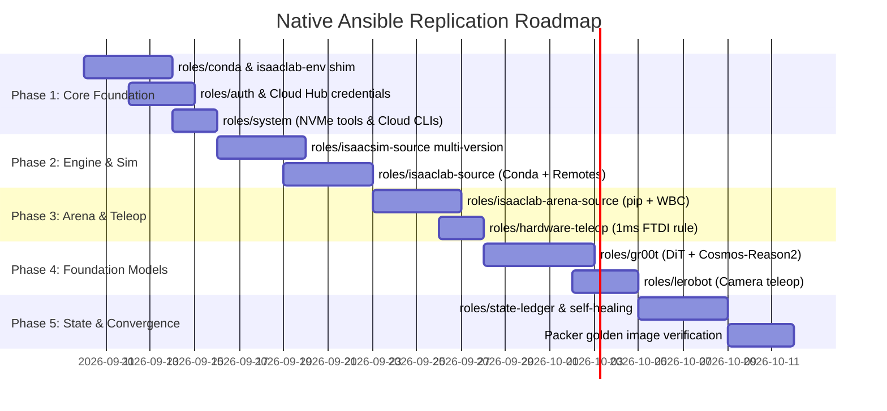

# Master Plan: Replicating Isaac Installer Capabilities into Native Cloud Ansible

This specification establishes the architectural plan to **natively replicate all capabilities of `isaac-installer` directly into Ansible** (`src/ansible/`).

Rather than wrapping or delegating to external bash scripts, this plan transforms Ansible into a first-class, cloud-native robotics orchestration engine, modernizing the existing playbooks to match and exceed the features of `isaac-installer` while exploiting Ansible's unique cloud superpowers.

---

## 1. Why Replicate into Native Ansible? (The Cloud Advantage)

While `isaac-installer` is an outstanding bash-based provisioner for physical bare-metal machines, **Ansible possesses structural advantages uniquely suited for public cloud environments**:

1. **Pre-Baked Cloud Images (Packer Integration)**:
   * Isaac Automator builds custom cloud images (`./image-gcp`, `./image-aws`) using HashiCorp Packer.
   * Ansible plays run natively inside Packer builds using tagged role execution (`tags: skip_in_image`, `tags: on_stop_start`).
   * By replicating `isaac-installer` into native Ansible roles, the entire Conda runtime, Isaac Sim binaries, and GR00T foundation model caches can be pre-baked into golden images, reducing VM provisioning time from **45+ minutes to under 3 minutes**.
2. **Agentless & Zero-Footprint Orchestration**:
   * Operates over standard SSH, **Google Cloud IAP TCP tunnels**, **AWS SSM Session Manager**, or **Azure Bastion** without requiring any pre-existing scripts, toolchains, or repositories to be checked out or maintained on the target VM.
3. **Declarative Idempotency & State Invariants**:
   * Ansible's state declarations (`state: present`, `state: link`, `stat`, `lineinfile`, `template`) prevent script regressions, catch partial failure states, and guarantee convergent state across repeated executions.
4. **Lifecycle Hooks & Lifecycle Tagging**:
   * Ansible's tagging system allows surgical lifecycle operations:
     * Fast boot updates (`./start --quick` invoking `-t __autorun`)
     * Re-attaching storage or updating dynamic bus IDs (`-t on_stop_start`)
     * Isolated component updates (e.g. `--tags __arena` or `--tags __gr00t`)
5. **Native Cloud Secret & Parameter Templating**:
   * Jinja2 templates (`.j2`) inject dynamic cloud credentials (GCP Secret Manager, AWS Secrets Manager, IAM tokens) and Terraform variables (`{{ isaac_workstation_gpu_count }}`, `{{ boot_disk_type }}`) cleanly without dangerous bash string interpolation.
6. **Robust Failure Handling & Reboot Handlers**:
   * Native `ansible.builtin.reboot` safely manages NVIDIA kernel module reloads and system restarts across driver installations, which bash scripts often struggle to orchestrate remotely over SSH.

---

## 2. Capability Mapping: `isaac-installer` Modules to Native Ansible Roles

The following table maps every major bash module from `isaac-installer/` to its corresponding target native Ansible role:

| `isaac-installer` Subsystem | Source Module | Target Ansible Role | Native Ansible Replication Design |
| :--- | :--- | :--- | :--- |
| **Hybrid Conda + UV Runtime** | `lib/modules/conda.sh` | **`roles/conda` (New)** | - Installs Miniconda3 into `/home/{{ ansible_user }}/miniconda3`.<br>- Declaratively provisions named `isaaclab` environment (Python 3.10/3.12).<br>- Installs `uv` for 10x accelerated package resolution.<br>- Deploys `/usr/local/bin/isaaclab-env` CLI runner via Jinja2 template.<br>- Injects dynamic Vulkan ICD probing hook (`activate.d/vulkan_icd.sh`).<br>- Injects deactivation hook preventing Omniverse Kit CP312 PYTHONPATH leakage. |
| **Sim Multi-Version Switcher** | `lib/modules/isaacsim.sh` | **`roles/isaacsim-source` (Enhanced)** | - Organizes builds under `/opt/nvidia/isaac-sim/releases/{{ isaacsim_version }}`.<br>- Manages atomic symlink to `/home/{{ ansible_user }}/IsaacSim`.<br>- Deploys `setup_conda_env.sh` compatibility bridge for Kit-Python discovery.<br>- Pins active GPU to index 0 in desktop launcher for Vulkan headless rendering. |
| **Isaac Lab & Dual Remotes** | `lib/modules/isaaclab.sh`<br>`lib/core/git_workspace.sh` | **`roles/isaaclab-source` (Enhanced)** | - Clones into `~/Documents/GitHub/{{ isaaclab_org }}/IsaacLab`.<br>- Configures Dual-Remote Git Topology (`origin` = fork, `upstream` = official).<br>- Injects pushRemote protection (`git config branch.main.pushRemote origin`).<br>- Installs into named Conda environment via `isaaclab-env` / `./isaaclab.sh --conda`.<br>- Registers repository directly into GitHub Desktop GUI sidebar. |
| **IsaacLab-Arena Benchmarks** | `lib/modules/isaaclab_arena.sh` | **`roles/isaaclab-arena-source` (Enhanced)** | - Replaces clone-only antipattern with full installation.<br>- Synchronizes submodules under clean detached HEAD.<br>- Executes `isaaclab-env pip install -e .` (editable pip install).<br>- Provisions CMEEL, Pinocchio, and Pink WBC robotics dependencies.<br>- Configures evaluation runners for benchmarks (e.g. LIBERO). |
| **Isaac-GR00T Foundation Stack** | `lib/modules/gr00t.sh` | **`roles/gr00t` (New)** | - Clones NVIDIA Isaac-GR00T repository into `~/Documents/GitHub/{{ gr00t_org }}/Isaac-GR00T`.<br>- Provisions Python environment with DiT 1.09B + Cosmos-Reason2-2B VLA dependencies.<br>- Pre-caches model weights to high-speed NVMe storage.<br>- Deploys systemd user service `isaac-gr00t.service` for ZeroMQ IPC serving on port 5555.<br>- Adds desktop shortcuts and mock inference test tasks. |
| **LeRobot Teleoperation Stack** | `lib/modules/ecosystem.sh` | **`roles/lerobot` (New)** | - Clones Hugging Face LeRobot repository.<br>- Installs camera teleop calibration and policy training stack.<br>- Adds desktop launcher for real-time visualization. |
| **Unified Cloud Hubs & Auth** | `lib/modules/auth.sh` | **`roles/auth` (New)** | - Adds user to hardware groups (`dialout`, `plugdev`, `input`, `video`, `docker`).<br>- Configures `~/.gitconfig` user identity (`user.name`, `user.email`).<br>- Injects credentials for Hugging Face, NGC, Weights & Biases, and GitHub CLI from Secret Manager or environment variables. |
| **Hardware & Teleop Invariants** | `lib/modules/hardware_teleop.sh` | **`roles/hardware-teleop` (New)** | - Installs `/etc/udev/rules.d/99-ftdi-latency.rules` setting FTDI latency to 1ms.<br>- Deploys 3Dconnexion SpaceMouse daemon (`spacenavd`) and udev rules.<br>- Installs Intel RealSense SDK 2.0 (`librealsense2`). |
| **State Ledger & Drift Healing** | `lib/core/state.sh`<br>`lib/core/audit.sh` | **`roles/state-ledger` (New)** | - Generates `/home/{{ ansible_user }}/.isaac-state.json` recording pinned commit hashes, Conda packages, symlink targets, and udev rules.<br>- Implements verification tasks (`tags: __verify`) detecting drift.<br>- Deploys automated self-healing task executed on VM boot (`tags: __autorun`, `tags: on_stop_start`). |
| **Storage & Dev Tools** | `lib/modules/dev_tools.sh` | **`roles/system` (Enhanced)** | - Installs NVMe management tools (`nvme-cli`, `smartmontools`, `fio`, `iotop`).<br>- Installs VS Code, Chromium, and GitHub Desktop GUI.<br>- Installs Cloud CLIs (AWS, GCP, Azure, Alibaba) and `uv`. |

---

## 3. Architecture of the Native Cloud Ansible Engine

The target design incorporates all physical AI layers directly into Ansible's modular structure:

```mermaid
flowchart TB
    subgraph Playbook["Ansible Playbook: isaac-workstation.yaml"]
        subgraph Stage1["Stage 1: Cloud VM & Infrastructure Foundation"]
            S1["roles/system\n(Kernel, Swap, NVMe tools, Cloud CLIs, Docker)"]
            S2["roles/nvidia-driver\n(Cloud Driver Repos, CUDA, ECC Toggle, Reboot Handler)"]
            S3["roles/remote-desktop\n(Xorg Dummy Display, Bus ID Remapping, DCV, NoMachine, KasmVNC)"]
            S4["roles/auth\n(Hardware Groups, Git Identity, Cloud Hub Tokens: HF/NGC/WandB)"]
        end

        subgraph Stage2["Stage 2: Python & Sim Runtime Foundation"]
            S5["roles/conda\n(Miniconda3, Named 'isaaclab' env, UV, isaaclab-env shim, Vulkan ICD hooks)"]
            S6["roles/isaacsim-source\n(Atomic Sim Switcher, Releases Layout, EULA, post_install, GPU 0 Pin)"]
        end

        subgraph Stage3["Stage 3: Robotics Frameworks & Dual-Remote Workspaces"]
            S7["roles/isaaclab-source\n(Dual-Remote Git Topology, ./isaaclab.sh --conda, GitHub Desktop Reg)"]
            S8["roles/isaaclab-arena-source\n(Clean Submodules, Editable pip install -e, CMEEL/Pinocchio WBC)"]
            S9["roles/hardware-teleop\n(1ms FTDI Serial Rule, SpaceMouse, RealSense)"]
        end

        subgraph Stage4["Stage 4: Physical AI Foundation Models & Teleop"]
            S10["roles/gr00t\n(NVIDIA Isaac-GR00T, DiT+Cosmos-Reason2, ZeroMQ Server, Weights Cache)"]
            S11["roles/lerobot\n(Hugging Face LeRobot, Camera Teleop, Policy Visualizer)"]
            S12["roles/demos\n(G1 Humanoid, Go2 Quadruped, Franka Manipulation, Arena Kit, GR00T)"]
        end

        subgraph Stage5["Stage 5: State Ledger, Resilience & Self-Healing"]
            S13["roles/state-ledger\n(.isaac-state.json, Verification Suite, Boot-Time Drift Self-Healing)"]
            S14["roles/isaac-workstation\n(Preemption Watchdog, 10m Cloud Backup Timer, Autorun Hooks)"]
        end
    end

    S1 --> S2 --> S3 --> S4
    S4 --> S5 --> S6
    S6 --> S7 --> S8 --> S9
    S9 --> S10 --> S11 --> S12
    S12 --> S13 --> S14
```



---

## 4. Detailed Specification of the 6 New Ansible Roles

### 4.1 Role 1: `roles/conda` (Runtime Environment & Isolation)
* **Directory**: `src/ansible/roles/conda/`
* **Tasks (`tasks/main.yml`)**:
  1. Download and install Miniconda3 into `/home/{{ ansible_user }}/miniconda3`.
  2. Configure Conda channels and auto-accept Terms of Service (`CONDA_PLUGINS_AUTO_ACCEPT_TOS=true`).
  3. Create named environment `isaaclab` with Python 3.10 (or 3.12 depending on Isaac Lab version).
  4. Install `uv` into the environment for ultra-fast pip installs.
  5. Deploy `/usr/local/bin/isaaclab-env` CLI shim:
     ```bash
     #!/usr/bin/env bash
     CONDA_BASE="/home/{{ ansible_user }}/miniconda3"
     source "${CONDA_BASE}/etc/profile.d/conda.sh"
     conda activate isaaclab
     exec "$@"
     ```
  6. Deploy activation hook `etc/conda/activate.d/vulkan_icd.sh` dynamically detecting the active NVIDIA Vulkan JSON manifest (`/usr/share/vulkan/icd.d/nvidia_icd.json` or `/etc/vulkan/icd.d/nvidia_icd.json`).
  7. Deploy deactivation hook `etc/conda/deactivate.d/cleanup_pythonpath.sh` ensuring Omniverse Kit's internal Python packages never pollute the host environment.

### 4.2 Role 2: `roles/auth` (Unified Cloud Hubs & Hardware Identity)
* **Directory**: `src/ansible/roles/auth/`
* **Tasks (`tasks/main.yml`)**:
  1. Ensure user is a member of hardware groups: `dialout`, `plugdev`, `input`, `video`, `docker`.
  2. Configure `~/.gitconfig` with `git_user_name` and `git_user_email`.
  3. If `huggingface_token` is defined, authenticate via `huggingface-cli login --token {{ huggingface_token }}`.
  4. If `ngc_api_key` is defined, log into NVIDIA container registry: `echo "{{ ngc_api_key }}" | docker login nvcr.io -u '$oauthtoken' --password-stdin`.
  5. If `wandb_api_key` is defined, execute `wandb login {{ wandb_api_key }}`.
  6. If `github_token` is defined, configure GitHub CLI: `echo "{{ github_token }}" | gh auth login --with-token`.

### 4.3 Role 3: `roles/gr00t` (NVIDIA Isaac-GR00T Foundation Model Stack)
* **Directory**: `src/ansible/roles/gr00t/`
* **Tasks (`tasks/main.yml`)**:
  1. Clone `Isaac-GR00T` repository into `~/Documents/GitHub/{{ gr00t_org | default('boredengineering') }}/Isaac-GR00T`.
  2. Configure dual remotes (`origin` for user fork, `upstream` for official NVIDIA repository).
  3. Install GR00T dependencies into the `isaaclab` Conda environment using `isaaclab-env pip install -e .`.
  4. Pre-cache model weights (DiT 1.09B + Cosmos-Reason2-2B) into `/home/{{ ansible_user }}/.cache/gr00t/`.
  5. Deploy systemd user service `isaac-gr00t.service` to run the ZeroMQ inference server on port 5555.
  6. Deploy desktop shortcut `Isaac-GR00T-Server.desktop`.

### 4.4 Role 4: `roles/lerobot` (Hugging Face LeRobot Ecosystem)
* **Directory**: `src/ansible/roles/lerobot/`
* **Tasks (`tasks/main.yml`)**:
  1. Clone `lerobot` into `~/Documents/GitHub/{{ lerobot_org | default('huggingface') }}/lerobot`.
  2. Install LeRobot in editable mode: `isaaclab-env pip install -e ".[feetech,realsense]"`.
  3. Deploy desktop launcher `LeRobot-Teleop.desktop`.

### 4.5 Role 5: `roles/hardware-teleop` (Robotics Teleop & Serial Invariants)
* **Directory**: `src/ansible/roles/hardware-teleop/`
* **Tasks (`tasks/main.yml`)**:
  1. Deploy `/etc/udev/rules.d/99-ftdi-latency.rules` setting FTDI serial latency timer to 1ms:
     ```udev
     ACTION=="add", SUBSYSTEM=="usb-serial", DRIVER=="ftdi_sio", ATTR{latency_timer}="1"
     ```
  2. Reload udev rules: `udevadm control --reload-rules && udevadm trigger`.
  3. Install 3Dconnexion SpaceMouse driver `spacenavd` and enable systemd service.
  4. Install Intel RealSense SDK packages (`librealsense2-dkms`, `librealsense2-utils`).

### 4.6 Role 6: `roles/state-ledger` (State Tracking & Startup Self-Healing)
* **Directory**: `src/ansible/roles/state-ledger/`
* **Tasks (`tasks/main.yml`)**:
  1. Gather software versions (NVIDIA driver, CUDA, Isaac Sim ref, Isaac Lab ref, Arena ref, GR00T ref).
  2. Generate `/home/{{ ansible_user }}/.isaac-state.json` recording installed state ledger.
  3. Deploy self-healing repair task into `roles/isaac-workstation/tasks/autorun.yml` (`tags: __autorun`, `tags: on_stop_start`):
     - Validates that symlinks `/home/{{ ansible_user }}/IsaacSim` and `_isaac_sim` are intact.
     - Validates that `isaaclab-env` binary exists and points to valid Conda environment.
     - Verifies Vulkan ICD manifest is discovered.
     - Automatically repairs broken links if detected.

---

## 5. Enhancements to Existing Ansible Roles

### 5.1 `roles/isaacsim-source`
* Replace hardcoded symlink with multi-version directory structure:
  - Install directory: `/opt/nvidia/isaac-sim/releases/{{ isaacsim_version }}`
  - Active symlink: `/home/{{ ansible_user }}/IsaacSim -> /opt/nvidia/isaac-sim/releases/{{ isaacsim_version }}`
* Create compatibility symlink `setup_conda_env.sh -> setup_python_env.sh` inside the release directory.
* Ensure desktop shortcut sets `--/renderer/activeGpu=0` for headless cloud GPU render safety.

### 5.2 `roles/isaaclab-source`
* Switch installation task from `./isaaclab.sh --install` to:
  ```yaml
  - name: Install Isaac Lab into named Conda environment
    shell: ./isaaclab.sh --conda isaaclab 2>&1 | tee /tmp/isaaclab-install.log
    args:
      chdir: "{{ isaaclab_dir }}"
    become_user: "{{ ansible_user }}"
  ```
* Wire Dual-Remote Git Topology:
  ```yaml
  - name: Configure upstream remote
    git_config:
      name: remote.upstream.url
      value: "https://github.com/isaac-sim/IsaacLab.git"
      repo: "{{ isaaclab_dir }}"
      scope: local

  - name: Set pushRemote protection
    git_config:
      name: branch.main.pushRemote
      value: "origin"
      repo: "{{ isaaclab_dir }}"
      scope: local
  ```

### 5.3 `roles/isaaclab-arena-source`
* Complete the installation pipeline:
  ```yaml
  - name: Install IsaacLab-Arena in editable mode
    shell: isaaclab-env pip install -e .
    args:
      chdir: "{{ isaaclab_arena_dir }}"
    become_user: "{{ ansible_user }}"

  - name: Install CMEEL & Pinocchio dependencies
    shell: isaaclab-env pip install cmeel pinocchio pink
    become_user: "{{ ansible_user }}"
  ```

### 5.4 `roles/demos`
* Add modern Physical AI desktop shortcut launchers:
  - `Humanoid-Locomotion-G1.desktop` (Unitree G1 with RSL-RL)
  - `Quadruped-Locomotion-Go2.desktop` (Unitree Go2)
  - `Franka-Manipulation.desktop`
  - `Arena-Benchmark-Kit.desktop`
  - `Isaac-GR00T-Server.desktop`
  - `LeRobot-Teleop.desktop`

---

## 6. Actionable 5-Phase Implementation Plan



### Phase 1: Core Foundation & Modern Runtime
1. Implement `roles/conda`: Miniconda3 install, `isaaclab` named env, `uv`, `isaaclab-env` CLI shim, Vulkan ICD hooks.
2. Implement `roles/auth`: Hardware groups, Git author setup, Cloud Hub tokens (HF, NGC, WandB).
3. Enhance `roles/system`: Add `nvme-cli`, `smartmontools`, `fio`, `iotop`, and Cloud CLIs.

### Phase 2: Sim Engine & Isaac Lab Modernization
1. Update `roles/isaacsim-source`: Add multi-version directory layout, atomic symlinks, and `setup_conda_env.sh` compatibility bridge.
2. Update `roles/isaaclab-source`: Install via `./isaaclab.sh --conda`, configure Dual-Remote Git Topology (`origin`/`upstream`), and register in GitHub Desktop.

### Phase 3: IsaacLab-Arena Pipeline & Teleoperation
1. Update `roles/isaaclab-arena-source`: Move beyond clone-only; implement `isaaclab-env pip install -e .` and Pinocchio/Pink WBC dependencies.
2. Implement `roles/hardware-teleop`: Install 1ms FTDI serial udev rule, SpaceMouse daemon (`spacenavd`), and RealSense SDK.

### Phase 4: Foundation Models & Physical AI
1. Implement `roles/gr00t`: Clone Isaac-GR00T, install dependencies, pre-cache model weights, deploy `isaac-gr00t.service` ZeroMQ server.
2. Implement `roles/lerobot`: Clone LeRobot, install teleop tools, create visualizer shortcut.
3. Update `roles/demos`: Add desktop shortcuts for G1 humanoid, Go2 quadruped, Arena Benchmark Kit, and GR00T.

### Phase 5: State Ledger, Golden Image Baking & Lifecycle Verification
1. Implement `roles/state-ledger`: Generate `.isaac-state.json`, add verification tags (`__verify`), and hook self-healing repair into `autorun.yml`.
2. Validate with Packer: Test `./image-gcp` and `./image-aws` to ensure pre-baked images contain the full modernized stack.
3. Run end-to-end dry-run and live deployment validation.

---

## 7. Verification Criteria & Success Metrics

1. **Runtime Isolation Test**:
   - `isaaclab-env python -c "import isaaclab; print(isaaclab.__file__)"` succeeds from the user shell without activating Conda manually.
   - Base Python (`/usr/bin/python3`) is free of Omniverse Kit `cp312` path pollution.
2. **Arena Benchmark Test**:
   - `isaaclab-env python -c "import isaaclab_arena; print(isaaclab_arena.__file__)"` resolves to the editable local checkout.
3. **Foundation Model Test**:
   - `systemctl --user status isaac-gr00t.service` is active (running) and listening on port 5555.
4. **Serial Latency Invariant**:
   - `cat /sys/bus/usb-serial/devices/*/latency_timer` returns `1` (or udev rule is active).
5. **Packer Bake Time & Deployment Speed**:
   - Full golden image bakes successfully via Packer.
   - Fresh workstation deploy using `--from-image` finishes in **< 3 minutes**.
6. **State Self-Healing Test**:
   - Simulating a deleted `~/IsaacSim` symlink is automatically reconciled and restored upon VM reboot or `./start --quick`.

