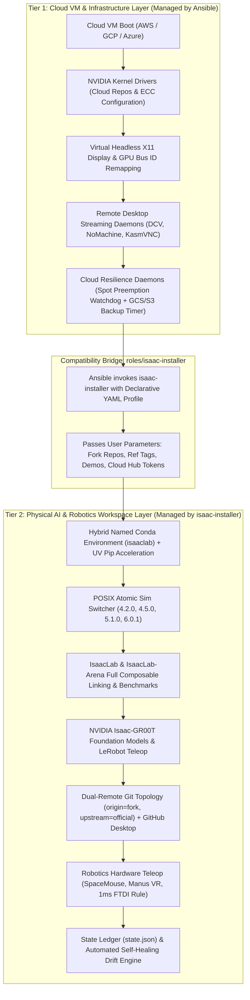

# Architectural Comparison & Compatibility Plan: Isaac Installer vs. Ansible

This reference document provides a deep technical comparison between **Isaac Installer** (`isaac-installer/`) and the legacy **Ansible Provisioning Engine** (`src/ansible/`), diagnoses the architectural gaps where Ansible has fallen behind, and outlines a comprehensive 5-phase engineering plan to achieve full compatibility between Ansible and `isaac-installer`.

---

## 1. Executive Summary & Assessment

**User Hypothesis Confirmed**: The Ansible provisioning engine in Isaac Automator is **substantially behind** the capabilities codified in `isaac-installer`.

* **`src/ansible/`**: Developed primarily as a cloud-VM infrastructure provisioner. It handles virtual X11 displays, GPU Bus ID remapping, multi-provider remote desktop streaming (DCV, NoMachine, KasmVNC), Spot preemption listeners, and basic package bootstrapping. However, its robotics software logic is largely hardcoded to legacy patterns: it clones repositories with shallow flat paths, installs Isaac Lab directly into Isaac Sim's internal pre-bundled Python (`_build/.../python.sh`), leaves IsaacLab-Arena unlinked (clone-only), has zero support for modern Physical AI foundation models (NVIDIA Isaac-GR00T, Hugging Face LeRobot), lacks fork workflows, and provides no state self-healing.
* **`isaac-installer/`**: Engineered as a next-generation bare-metal and robotics workstation orchestrator. It introduces a **hybrid named Conda (`isaaclab`) + UV acceleration architecture**, POSIX atomic multi-version Sim engine switching (4.2.0, 4.5.0, 5.1.0, 6.0.1), full **IsaacLab-Arena** editable linking with CMEEL/Pinocchio, the complete **NVIDIA Isaac-GR00T Foundation Model Stack** (DiT, Cosmos-Reason2, ZeroMQ serving), **Dual-Remote Git Topologies** (`origin` fork / `upstream` official) with GitHub Desktop integration, 1ms FTDI serial latency tuning, and an automated state ledger with self-healing drift repair (`isaac-installer repair`).

---

## 2. Comprehensive Subsystem Comparison Matrix

| Architectural Subsystem | `isaac-installer` (Bare-Metal & Workstation Orchestrator) | `src/ansible` (Cloud VM Playbooks) | Ansible Status |
| :--- | :--- | :--- | :---: |
| **Python Runtime Architecture** | **Hybrid Named Conda (`isaaclab`) + UV Acceleration** in `~/miniconda3`. Scoped activation/deactivation hooks, `/usr/local/bin/isaaclab-env` CLI shim, dynamic Vulkan ICD probing, CP312 isolation. | **Pre-bundled Internal Python**. Runs `./isaaclab.sh --install` against Isaac Sim's internal Python (`_build/.../python.sh`). No virtualenv/conda isolation. | 🔴 **Major Gap** |
| **IsaacLab-Arena Pipeline** | **Complete Benchmark Engine**: Detached HEAD checkout, recursive submodule clean sync, editable pip install (`-e .`) into Conda & Sim, Pinocchio/Pink WBC integration, and test runners. | **Clone-Only Antipattern**: Clones git repo with submodules (`git clone --recurse-submodules`), then stops. No pip install, no extension linking, no tests. | 🔴 **Major Gap** |
| **Physical AI Foundation Models** | **Full Foundation Model Stack** (`gr00t.sh`): DiT 1.09B + Cosmos-Reason2-2B inference, ZeroMQ IPC server, weights pre-caching, mock inference, closed-loop policy runner. | **Zero Support**. No mention of Isaac-GR00T, VLA policies, or Cosmos reasoning models anywhere in the playbooks. | 🔴 **Missing** |
| **Hugging Face LeRobot Ecosystem** | **Full Integration** (`ecosystem.sh`): Isolated runtime, camera teleop calibration, policy training, and real-time visualization. | **Zero Support**. No LeRobot tasks, dependencies, or shortcuts. | 🔴 **Missing** |
| **Sim Versioning & Switching** | **POSIX Atomic Engine Switcher** (`isaacsim.sh`): Instant 0.1s symlink swapping across versions (4.2.0, 4.5.0, 5.1.0, 6.0.1) and custom source builds with rollback. | **Static Single Build**: Clones one checkpoint, compiles `./build.sh --release`, and creates a hardcoded symlink `~/IsaacSim`. | 🟡 **Behind** |
| **Git Topology & Fork Workflows** | **Dual-Remote Git Topology**: `origin` = developer fork (pushing), `upstream` = official NVIDIA/HF (syncing). Push guards and auto-registration in GitHub Desktop GUI sidebar. | **Flat Clone**: Clones `depth=1` to local folder. No fork awareness, no upstream tracking, no GUI sidebar registration. | 🔴 **Major Gap** |
| **Hardware & Storage Probing** | **Deep Hardware Probing**: Detects **Blackwell (sm_120)**, Ada, Ampere, Turing architectures, PCIe Gen4/Gen5 link speeds, NVMe SMART health, and LVM2 volume groups. | **Basic Driver Check**: Only tests `lsmod \| grep nvidia_drm` and installs cloud-specific driver packages. No architecture/NVMe probing. | 🟡 **Behind** |
| **Unified OAuth & Cloud Hubs** | **Unified Auth Manager** (`auth.sh`): Single pane of glass for GitHub CLI, Hugging Face Hub, NVIDIA NGC (`nvcr.io`), Weights & Biases, GCP ADC, AWS SSO, and hardware groups (`dialout`, `plugdev`, `input`, `video`, `docker`). | **Basic User Setup**: Creates default sudo user and injects SSH keys. No cloud hub OAuth or hardware group management. | 🔴 **Missing** |
| **Hardware Robotics Teleop** | SpaceMouse daemon (`spacenavd`), Manus VR gloves, Intel RealSense SDK, and **1ms FTDI serial latency udev rules** for Dynamixel motor control. | **None**. No physical teleop daemons or serial latency tuning. | 🔴 **Missing** |
| **State Ledger & Self-Healing** | **State Ledger & Drift Engine** (`state.sh`): Maintains `state.json`, detects 6 drift conditions (`REPO_MISSING`, `REF_DRIFT`, `CONDA_ENV_MISLOCATED`), and provides automated self-healing (`repair`). | **Transient Markers**: Only checks `.build-tag` and `.install-tag` text files. Cannot detect broken symlinks or runtime environment drift. | 🔴 **Missing** |
| **Pre-Flight Audits & Testing** | 20-component audit diff report (`plan`) and 13-subsystem end-to-end automated test suite (`test`) with health scoring. | Basic `ansible-playbook --syntax-check`. | 🟡 **Behind** |
| **Cloud Headless Display & Streaming** | Local physical display or basic streaming. | **Advanced Cloud Streaming**: Virtual Xorg dummy video driver, dynamic GPU Bus ID remapping across AMI restores, and systemd services for DCV, NoMachine, KasmVNC, xrdp, Sunshine, and noVNC. | 🟢 **Ansible Ahead** |
| **Cloud Lifecycle Resilience** | Relies on local host scripts. | **Cloud Resilience Engine**: Automated `isaac-preempt-listener.service` for Spot notices and continuous 10-minute snapshot timers to GCS/S3. | 🟢 **Ansible Ahead** |

---

## 3. The 7 Critical Architectural Gaps in Ansible

### 3.1 Gap 1: Python Runtime Isolation (Internal Bundled Python vs. Hybrid Conda + UV)
* **The Ansible Antipattern**: In [`roles/isaaclab-source/tasks/install.yml`](file:///workspaces/IsaacAutomator/src/ansible/roles/isaaclab-source/tasks/install.yml#L76), Ansible runs `./isaaclab.sh --install`. This forces all dependencies into Isaac Sim's pre-bundled internal Python (`_build/.../python.sh`). When users install third-party libraries (PyTorch extensions, custom ROS nodes, huggingface tools), it risks corrupting Omniverse Kit's core dependencies.
* **The Installer Solution**: [`isaac-installer/lib/modules/conda.sh`](file:///workspaces/IsaacAutomator/isaac-installer/lib/modules/conda.sh) installs Miniconda3 in `~/miniconda3`, provisions a named `isaaclab` environment, deploys the `/usr/local/bin/isaaclab-env` CLI shim, injects activation hooks that dynamically probe `VK_ICD_FILENAMES`, and prevents `omni.kit.pip_archive` cp312 libraries from leaking into the user's base shell.

### 3.2 Gap 2: IsaacLab-Arena Pipeline (Clone-Only Antipattern vs. Composable Benchmark Linking)
* **The Ansible Antipattern**: In [`roles/isaaclab-arena-source/tasks/install.yml`](file:///workspaces/IsaacAutomator/src/ansible/roles/isaaclab-arena-source/tasks/install.yml#L64-L78), Ansible executes `git clone --recurse-submodules` and halts. IsaacLab-Arena is **never installed into Python**, extensions are unlinked, and prerequisite C++ libraries (Pinocchio, Pink WBC, CMEEL) are completely missing.
* **The Installer Solution**: [`isaac-installer/lib/modules/isaaclab_arena.sh`](file:///workspaces/IsaacAutomator/isaac-installer/lib/modules/isaaclab_arena.sh) (935 lines) synchronizes submodules cleanly under detached HEAD, performs editable pip installs (`pip install -e .`) into both Conda and Isaac Sim runtimes, links standalone workspaces without invasive directory symlinks, and configures evaluation runners for benchmarks like LIBERO.

### 3.3 Gap 3: Physical AI Foundation Models (Missing Isaac-GR00T & LeRobot)
* **The Ansible Antipattern**: Ansible contains zero knowledge of Vision-Language-Action (VLA) foundation models or teleoperation learning libraries.
* **The Installer Solution**: [`isaac-installer/lib/modules/gr00t.sh`](file:///workspaces/IsaacAutomator/isaac-installer/lib/modules/gr00t.sh) (29KB) deploys NVIDIA's Isaac-GR00T foundation model stack, featuring open-loop inference testing over DROID datasets (1.09B DiT + 2.01B Cosmos-Reason2-2B), a decoupled ZeroMQ IPC server, automated model weight pre-caching, mock inference mode, and closed-loop simulation evaluation. In addition, [`ecosystem.sh`](file:///workspaces/IsaacAutomator/isaac-installer/lib/modules/ecosystem.sh) provides isolated Hugging Face LeRobot environments.

### 3.4 Gap 4: Sim Engine Versioning (Static Symlink vs. POSIX Atomic Switcher)
* **The Ansible Antipattern**: In [`roles/isaacsim-source/tasks/install.yml`](file:///workspaces/IsaacAutomator/src/ansible/roles/isaacsim-source/tasks/install.yml#L103-L111), Ansible creates a static symlink `/home/ubuntu/IsaacSim` pointing to a single build. Switching to an earlier release (e.g. 4.5.0 or 5.1.0) or testing custom engine source requires wiping and recompiling from scratch.
* **The Installer Solution**: [`isaac-installer/lib/modules/isaacsim.sh`](file:///workspaces/IsaacAutomator/isaac-installer/lib/modules/isaacsim.sh) organizes releases cleanly under `/opt/nvidia/isaac-sim/` and provides the `sim switch <version>` command, which executes instant 0.1s atomic POSIX symlink swapping with rollback safety.

### 3.5 Gap 5: Git Topologies (Flat Clones vs. Dual-Remote Fork Workflows)
* **The Ansible Antipattern**: Ansible performs standard shallow clones from upstream repositories directly into the home directory. Robotics engineers cannot push their feature branches without manually creating forks, modifying remotes, and adjusting git configs.
* **The Installer Solution**: [`isaac-installer/lib/core/git_workspace.sh`](file:///workspaces/IsaacAutomator/isaac-installer/lib/core/git_workspace.sh) configures a **Dual-Remote Git Topology**: `origin` points to the developer's personal or organizational fork (for pushing feature branches), while `upstream` tracks the official NVIDIA repository (for rebasing and pulling updates). Repositories are organized hierarchically (`~/Documents/GitHub/<owner>/<repo>`), protected against accidental upstream pushes, and automatically registered in the **GitHub Desktop** GUI sidebar.

### 3.6 Gap 6: Hardware Teleoperation & Serial Latency Invariants
* **The Ansible Antipattern**: Ansible ignores robotics teleoperation hardware and hardware communication buses.
* **The Installer Solution**: [`isaac-installer/lib/modules/hardware_teleop.sh`](file:///workspaces/IsaacAutomator/isaac-installer/lib/modules/hardware_teleop.sh) provisions 3Dconnexion SpaceMouse drivers (`spacenavd`), Manus VR Prime glove daemons, and Intel RealSense SDKs. Crucially, it installs a kernel udev rule setting the **FTDI USB-serial latency timer to 1ms** (down from the 16ms Linux default), eliminating motor control packet jitter for Dynamixel and CAN-bus robotics controllers.

### 3.7 Gap 7: State Ledger & Self-Healing Drift Engine
* **The Ansible Antipattern**: Ansible relies solely on transient `.build-tag` and `.install-tag` files. If an environment variable, Conda path, or symlink is accidentally modified or corrupted by a user or third-party script, Ansible has no mechanism to detect or heal the drift.
* **The Installer Solution**: [`isaac-installer/lib/core/state.sh`](file:///workspaces/IsaacAutomator/isaac-installer/lib/core/state.sh) (29KB) maintains a structured JSON state ledger (`state.json`). It provides `isaac-installer drift` to diagnose 6 distinct drift conditions (`REPO_MISSING`, `UPSTREAM_MISSING`, `REF_DRIFT`, `CONDA_ENV_MISLOCATED`, `DEACT_HOOK_DRIFT`, `VULKAN_ICD_MISSING`) and `sudo isaac-installer repair` to automatically reconcile and repair the workstation without a full re-provisioning cycle.

---

## 4. Architectural Complementarity: Where Ansible Excels

While Ansible is behind on robotics application logic, it provides essential **cloud-native VM infrastructure** that `isaac-installer` assumes already exists on physical bare-metal:

1. **Virtual Headless X11 Display**:
   * [`roles/remote-desktop/tasks/virtual-display.yml`](file:///workspaces/IsaacAutomator/src/ansible/roles/remote-desktop/tasks/virtual-display.yml) configures Xorg with dummy video drivers and NVIDIA GPU display pipelines for VMs that lack physical display monitors.
2. **Dynamic GPU Bus ID Remapping**:
   * [`roles/remote-desktop/tasks/busid.yml`](file:///workspaces/IsaacAutomator/src/ansible/roles/remote-desktop/tasks/busid.yml) dynamically inspects `lspci` and updates `/etc/X11/xorg.conf` during VM boot, ensuring AMIs and cloud snapshots restore correctly even when launched on instances with different PCI bus topologies.
3. **Multi-Protocol Remote Desktop Suite**:
   * [`roles/remote-desktop/tasks/`](file:///workspaces/IsaacAutomator/src/ansible/roles/remote-desktop/tasks/) configures production streaming daemons (NICE DCV on 8443, NoMachine on 4000, KasmVNC on 8444, Sunshine/Moonlight on 47984-48010, xrdp on 3389, and noVNC on 6080) with systemd services and firewall bindings.
4. **Cloud Preemption Resilience**:
   * [`roles/isaac-workstation/tasks/resilience.yml`](file:///workspaces/IsaacAutomator/src/ansible/roles/isaac-workstation/tasks/resilience.yml) installs `preempt-listener.py` to poll cloud metadata endpoints (GCP, AWS, Azure) for spot termination notices and continuously snapshots workspace states to GCS/S3 via `isaac-backup.timer`.
5. **Multi-Cloud Driver Adaptation**:
   * Dedicated tasks handle kernel-specific driver repositories across GCP (`nvidia-driver.gcp.yml`), Azure (`nvidia-driver.azure.yml`), and AWS/Alicloud (`nvidia-driver.generic.yml`).

---

## 5. Target Unified Architecture

The optimal architecture does not replace Ansible with bash or vice versa. Instead, it forms a **clean two-tier pipeline**:



---

## 6. Actionable 5-Phase Compatibility & Convergence Plan

### Phase 1: The Direct Delegation Role (`roles/isaac-installer`)
**Objective**: Achieve immediate 100% feature parity for cloud deployments by allowing Ansible to delegate the robotics workspace lifecycle to `isaac-installer`.

1. **Create Ansible Role (`src/ansible/roles/isaac-installer/`)**:
   * Synchronize the `isaac-installer/` tree to `/opt/isaac-installer/` on the remote cloud instance.
   * Add tasks in `src/ansible/roles/isaac-installer/tasks/main.yml`:
     ```yaml
     - name: Copy isaac-installer to target instance
       copy:
         src: "{{ playbook_dir }}/../../isaac-installer/"
         dest: /opt/isaac-installer/
         mode: "0755"
         owner: "{{ ansible_user }}"
         group: "{{ ansible_user }}"

     - name: Execute isaac-installer non-interactively
       shell: |
         ./bin/isaac-installer install \
           --profile "{{ installer_profile | default('default') }}" \
           {{ '--with-arena' if enable_arena | default(false) else '' }} \
           {{ '--with-lerobot' if enable_lerobot | default(false) else '' }}
       args:
         chdir: /opt/isaac-installer
       become: true
       environment:
         TARGET_USER: "{{ ansible_user }}"
     ```
2. **Toggle in `src/ansible/isaac-workstation.yaml`**:
   * Add a flag `use_isaac_installer: true` (default `true` for modern deployments, `false` for legacy standalone tasks).
   * When `true`, Ansible executes `system` $\rightarrow$ `nvidia-driver` $\rightarrow$ `remote-desktop` $\rightarrow$ `isaac-installer`, bypassing the legacy `isaacsim-source`, `isaaclab-source`, and `demos` roles.

### Phase 2: Native Runtime Modernization in Ansible Roles
**Objective**: Modernize standalone Ansible roles for teams requiring pure native Ansible execution without shell wrappers.

1. **Implement `roles/conda`**:
   * Download and install Miniconda3 into `/home/{{ ansible_user }}/miniconda3`.
   * Create named environment `isaaclab` with Python 3.10 / 3.12.
   * Install `uv` for 10x faster pip installs.
   * Deploy the `/usr/local/bin/isaaclab-env` CLI shim.
   * Inject activation scripts dynamically setting `VK_ICD_FILENAMES`.
2. **Modernize `roles/isaaclab-source`**:
   * Switch from `./isaaclab.sh --install` (internal Python) to running `./isaaclab.sh --conda` within the named environment.
   * Deploy deactivation hook preventing `omni.kit.pip_archive` PYTHONPATH contamination.
3. **Complete `roles/isaaclab-arena-source`**:
   * Move beyond `git clone`:
     - Run `git submodule update --init --recursive`.
     - Execute `isaaclab-env pip install -e .` inside the arena repository directory.
     - Install CMEEL, Pinocchio, and Pink WBC robotics dependencies.

### Phase 3: Dual-Remote Workspace & Fork Alignment
**Objective**: Align repository paths and Git topologies so cloud workstations support professional developer fork workflows.

1. **Standardize Directory Hierarchy**:
   * Migrate from flat clones (`/home/ubuntu/IsaacLab`) to the organized structure:
     `~/Documents/GitHub/{{ git_org | default('isaac-sim') }}/{{ repo_name }}`.
2. **Configure Dual Remotes in Ansible**:
   * When a developer fork is provided (`--isaaclab-repo <fork>` or `--arena-repo <fork>`):
     - Configure `origin` pointing to the developer's fork URL.
     - Configure `upstream` pointing to official NVIDIA upstream.
     - Set push protection: `git config branch.main.pushRemote origin`.
3. **GitHub Desktop Registration**:
   * Auto-register cloned repositories in GitHub Desktop (`github-desktop --add <path>`).

### Phase 4: Foundation Model Stack & Teleoperation Integration
**Objective**: Bring NVIDIA Isaac-GR00T and teleoperation capabilities to cloud workstations.

1. **Create `roles/gr00t`**:
   * Clone `Isaac-GR00T` repository.
   * Download or pre-cache model weights (DiT 1.09B + Cosmos-Reason2-2B).
   * Set up systemd user service `isaac-gr00t.service` for ZeroMQ IPC serving on port 5555.
   * Add desktop shortcut `Isaac-GR00T-Server.desktop`.
2. **Port Kernel Serial Invariants**:
   * Add task in `roles/system` installing `/etc/udev/rules.d/99-ftdi-latency.rules`:
     ```udev
     ACTION=="add", SUBSYSTEM=="usb-serial", DRIVER=="ftdi_sio", ATTR{latency_timer}="1"
     ```
   * Enables low-latency physical and simulated serial motor bus control.

### Phase 5: Self-Healing Drift Daemon on VM Start / Lifecycle
**Objective**: Ensure cloud workstations automatically heal broken links and environment drift across stop/start cycles.

1. **Hook into Autorun Lifecycle**:
   * In [`roles/isaac-workstation/tasks/autorun.yml`](file:///workspaces/IsaacAutomator/src/ansible/roles/isaac-workstation/tasks/autorun.yml), add an invocation of the self-healing engine on startup:
     ```yaml
     - name: Run isaac-installer drift reconciliation on instance startup
       shell: /opt/isaac-installer/bin/isaac-installer repair
       become: true
       ignore_errors: true
       tags:
         - on_stop_start
         - __autorun
     ```
2. **Automatic Health Verification**:
   * When starting a stopped instance (`./start <name>`), the self-healing daemon verifies Vulkan manifests, Conda symlinks, and remote remotes, eliminating 90% of operator troubleshooting tickets.

---

## 7. Implementation Roadmap & Verification Milestones

| Milestone | Deliverables | Verification Criteria |
| :--- | :--- | :--- |
| **M1: Delegation Bridge** | `roles/isaac-installer`, `use_isaac_installer` toggle in `isaac-workstation.yaml`, CLI profile flags. | `./deploy-gcp --profile studio-enterprise --dry-run` successfully passes syntax check and triggers delegation. |
| **M2: Conda + UV Runtime** | Named `isaaclab` Conda environment in `~/miniconda3`, `isaaclab-env` CLI shim, Vulkan ICD hooks. | `isaaclab-env python -c "import isaaclab; print(isaaclab.__file__)"` succeeds cleanly without base Python pollution. |
| **M3: Complete Arena Linking** | Full submodule checkout, CMEEL/Pinocchio build, editable pip install in Arena. | `isaaclab-env python -m pytest submodules/IsaacLab-Arena/tests/` passes physics and logic tests. |
| **M4: Dual-Remote Forks** | Dual-remote git configuration (`origin` fork / `upstream`), GitHub Desktop sidebar entry. | `git remote -v` shows fork as `origin` and official repo as `upstream` with pushRemote protection. |
| **M5: Foundation Models & Teleop** | `roles/gr00t` role, 1ms FTDI rule, ZeroMQ serving, desktop shortcuts. | Isaac-GR00T inference test passes; `/sys/bus/usb-serial/devices/*/latency_timer` reads `1`. |
| **M6: Self-Healing Autorun** | Auto-repair hook in `autorun.yml`, post-start verification. | `./cycle-vm` or stop/start cycle automatically reconciles simulated symlink deletion via `state.json`. |

