# Architectural Master Plan: Replicating Isaac Installer Capabilities into Native Cloud Ansible

**Document ID**: `isaac-installer-ansible-compat.md`  
**Target Subsystems**: `src/ansible/` (Native Cloud Orchestration Engine) & `isaac-installer` Parity  
**Target Workspaces**: Isaac Sim 6.0.1, Isaac Lab v3 (`v3.0.0-beta2`), IsaacLab-Arena (`release/0.3.0-prerelease`), NVIDIA Isaac-GR00T (`dev/arena_v0.3.0-compat`), Neo4j 5.26  
**Target Hardware & Cloud Architectures**: Physical NVIDIA RTX PRO 6000 Blackwell (`sm_120`), Google Cloud Platform GCE L4 (`sm_89`), AWS G6 / Azure NVadsA10v5  
**Status**: **Implemented & Syntactically Verified** (14 Roles Unified)

---

## 1. Executive Summary & Strategic Rationale (The Cloud Advantage)

While [`isaac-installer`](file:///workspaces/IsaacAutomator/isaac-installer) serves as a standalone bash provisioner for physical bare-metal machines, **Ansible provides structural advantages uniquely required for elastic public cloud deployment and multi-cloud image lifecycle management**:

1. **Pre-Baked Cloud Images (HashiCorp Packer Integration)**:
   * Isaac Automator builds custom cloud images ([`./image-gcp`](file:///workspaces/IsaacAutomator/image-gcp), [`./image-aws`](file:///workspaces/IsaacAutomator/image-aws)) using HashiCorp Packer (`src/packer/`).
   * Ansible plays run natively inside Packer builds using tagged role execution (`tags: skip_in_image`, `tags: on_stop_start`).
   * By replicating all installer capabilities into native Ansible roles, the complete Conda runtime, Isaac Sim 6.0.1 binaries, Isaac Lab v3, Arena WBC solvers, and GR00T foundation model caches are pre-baked into golden images. This cuts workstation provisioning time from **45–60+ minutes to under 3 minutes**.
2. **Agentless & Zero-Footprint Orchestration**:
   * Operates over standard SSH, **Google Cloud IAP TCP tunnels**, **AWS SSM Session Manager**, or **Azure Bastion** without requiring any pre-existing scripts, toolchains, or repositories to be checked out or maintained on the target VM.
3. **Declarative Idempotency & State Invariants**:
   * Ansible's state declarations (`state: present`, `state: link`, `stat`, `lineinfile`, `template`) prevent script regressions, catch partial failure states, and guarantee convergent state across repeated executions.
4. **Surgical Lifecycle Hooks & Lifecyle Tagging**:
   * Fast boot updates ([`./start --quick`](file:///workspaces/IsaacAutomator/start) invoking `-t __autorun`).
   * Dynamic GPU bus ID remapping and persistent disk mounting (`-t on_stop_start`).
   * Component-isolated upgrades (`-t __arena`, `-t __gr00t`, `-t __neo4j`, `-t __verify`).
5. **Native Cloud Secret & Parameter Templating**:
   * Jinja2 templates (`.j2`) inject dynamic cloud credentials (GCP Secret Manager, AWS Secrets Manager, IAM tokens) and Terraform variables cleanly without dangerous bash string interpolation.
6. **Robust Failure Handling & Reboot Handlers**:
   * Native `ansible.builtin.reboot` safely manages NVIDIA kernel module reloads and system restarts across driver installations, which bash scripts often struggle to orchestrate remotely over SSH.
7. **Adaptive Architecture Parity**:
   * Seamlessly bridges bleeding-edge physical workstations (Blackwell `sm_120`, CUDA 13.x, `cu128` wheels) and mainstream cloud VMs (GCP L4 `sm_89`, AWS A10G `sm_86`, Hopper `sm_90`) through dynamic capability probing.

---

## 2. Capability Mapping: `isaac-installer` Modules to Native Ansible Roles

The following table maps every subsystem from [`isaac-installer/`](file:///workspaces/IsaacAutomator/isaac-installer) to its corresponding native Ansible role in [`src/ansible/roles/`](file:///workspaces/IsaacAutomator/src/ansible/roles/):

| `isaac-installer` Subsystem | Source Module | Target Ansible Role | Native Ansible Replication Design & Features |
| :--- | :--- | :--- | :--- |
| **Hybrid Conda + UV Runtime** | `lib/modules/conda.sh` | [**`roles/conda`**](file:///workspaces/IsaacAutomator/src/ansible/roles/conda) | - Installs Miniconda3 into `/home/{{ ansible_user }}/miniconda3`.<br>- Declaratively provisions named `isaaclab` environment (Python 3.12).<br>- Installs `uv` for ultra-fast package resolution.<br>- Dynamically queries `nvidia-smi` compute capability; resolves `torch==2.10.0+cu128` on Blackwell (`sm_120`) vs `cu124` on Ada/Hopper.<br>- Deploys properly escaped `/usr/local/bin/isaaclab-env` CLI runner with candidate search fallback.<br>- Injects dynamic Vulkan ICD probing hook (`activate.d/vulkan_icd.sh`).<br>- Injects deactivation hook (`deactivate.d/cleanup_pythonpath.sh`) preventing Omniverse Kit CP312 PYTHONPATH leakage. |
| **Sim Multi-Version Switcher** | `lib/modules/isaacsim.sh` | [**`roles/isaacsim-source`**](file:///workspaces/IsaacAutomator/src/ansible/roles/isaacsim-source) | - Organizes builds under `/opt/nvidia/isaac-sim/releases/{{ isaacsim_version }}` (default 6.0.1).<br>- Manages atomic symlink to `/home/{{ ansible_user }}/IsaacSim`.<br>- Deploys sanitized `setup_conda_env.sh` (stripping Kit stdlib from `PYTHONPATH`).<br>- Deploys 7-line `isaacsim_standalone.pth` to Conda site-packages.<br>- Pins active GPU to index 0 (`--/renderer/activeGpu=0`) for Vulkan cloud safety. |
| **Isaac Lab & Dual Remotes** | `lib/modules/isaaclab.sh`<br>`lib/core/git_workspace.sh` | [**`roles/isaaclab-source`**](file:///workspaces/IsaacAutomator/src/ansible/roles/isaaclab-source) | - Clones Isaac Lab v3 (`v3.0.0-beta2`) into `~/Documents/GitHub/{{ isaaclab_org }}/IsaacLab`.<br>- Configures Dual-Remote Git Topology (`origin` = fork, `upstream` = official `isaac-sim/IsaacLab`).<br>- Injects pushRemote protection (`git config branch.main.pushRemote origin`).<br>- Installs into named Conda environment via `isaaclab-env` / `./isaaclab.sh --conda isaaclab`. |
| **IsaacLab-Arena Benchmarks** | `lib/modules/isaaclab_arena.sh` | [**`roles/isaaclab-arena-source`**](file:///workspaces/IsaacAutomator/src/ansible/roles/isaaclab-arena-source) | - Clones `release/0.3.0-prerelease` (or `dev/arena_v0.3.0-compat`).<br>- Synchronizes nested submodules under clean detached HEAD / forked branches.<br>- Executes editable installs across 8 root packages (`isaaclab_arena`, `_gr00t`, `_g1`, etc.).<br>- Provisions Whole-Body Control (WBC) kinematics stack: `cmeel`, `pin-pink`, `libpinocchio`, `qpsolvers`, `daqp`, `osqp`, `mujoco`.<br>- Automated submodule disaster recovery. |
| **Isaac-GR00T Foundation Stack** | `lib/modules/gr00t.sh` | [**`roles/gr00t`**](file:///workspaces/IsaacAutomator/src/ansible/roles/gr00t) | - Clones `Isaac-GR00T` (`dev/arena_v0.3.0-compat` on commit `7b8f37e`).<br>- Dual-mode serving: **Native host process on Port 5556** vs **Containerized daemon on Port 5561** (`isaac-gr00t-container.service.j2`).<br>- Injects `uv sync` lockfile downgrade guard (`--no-install-package torch --no-install-package torchvision`).<br>- Pre-caches model weights under `/home/{{ ansible_user }}/models/isaaclab_arena`. |
| **Graph-RAG Knowledge Memory** | `lib/modules/neo4j.sh` | [**`roles/neo4j`**](file:///workspaces/IsaacAutomator/src/ansible/roles/neo4j) | - Deploys containerized Neo4j 5.26 Community (`neo4j:5.26-community`).<br>- Maps HTTP Browser on **Port 7475** (host 7474) and Bolt Protocol on **Port 7688** (host 7687).<br>- Mounts persistent volume `/home/{{ ansible_user }}/data/neo4j`.<br>- Deploys systemd user service `neo4j-arena.service.j2` with APOC plugins enabled. |
| **LeRobot Teleoperation Stack** | `lib/modules/ecosystem.sh` | [**`roles/lerobot`**](file:///workspaces/IsaacAutomator/src/ansible/roles/lerobot) | - Clones Hugging Face LeRobot repository.<br>- Installs editable package with camera teleop calibration (`.[feetech,realsense]`).<br>- Adds desktop launcher for real-time visualization. |
| **Unified Cloud Hubs & Auth** | `lib/modules/auth.sh` | [**`roles/auth`**](file:///workspaces/IsaacAutomator/src/ansible/roles/auth) | - Adds user to hardware groups (`dialout`, `plugdev`, `input`, `video`, `docker`).<br>- Configures `~/.gitconfig` user identity (`user.name`, `user.email`).<br>- Injects credentials for Hugging Face, NGC (`nvcr.io`), Weights & Biases, and GitHub CLI from Secret Manager or environment variables. |
| **Hardware & Teleop Invariants** | `lib/modules/hardware_teleop.sh` | [**`roles/hardware-teleop`**](file:///workspaces/IsaacAutomator/src/ansible/roles/hardware-teleop) | - Installs `/etc/udev/rules.d/99-ftdi-latency.rules` setting 1ms latency timer across `DRIVER=="ftdi_sio"`, `KERNEL=="ttyUSB*"`, and `KERNEL=="ttyACM*"`.<br>- Deploys 3Dconnexion SpaceMouse daemon (`spacenavd`).<br>- Installs Intel RealSense SDK 2.0 (`librealsense2`). |
| **State Ledger & Drift Healing** | `lib/core/state.sh`<br>`lib/core/audit.sh` | [**`roles/state-ledger`**](file:///workspaces/IsaacAutomator/src/ansible/roles/state-ledger) | - Generates `/home/{{ ansible_user }}/.isaac-state.json` recording driver, CUDA, active git refs, and udev rules.<br>- Implements verification tasks (`tags: __verify`) detecting drift.<br>- Deploys automated self-healing task executed on VM boot (`tags: __autorun`, `tags: on_stop_start`). |
| **Storage & Dev Tools** | `lib/modules/dev_tools.sh`<br>`system_prereqs.sh` | [**`roles/system`**](file:///workspaces/IsaacAutomator/src/ansible/roles/system) | - Installs NVMe management tools (`nvme-cli`, `smartmontools`, `fio`, `iotop`).<br>- Installs VS Code, Chromium, Node.js LTS, and GitHub Desktop GUI.<br>- Installs Cloud CLIs (AWS, GCP, Azure, Alibaba) and `uv`.<br>- Pre-emptively scaffolds host directories (`tasks/directories.yml`) with user ownership. |
| **Out-of-the-Box Demos** | `lib/modules/demos.sh` | [**`roles/demos`**](file:///workspaces/IsaacAutomator/src/ansible/roles/demos) | - Desktop shortcuts for Unitree G1 humanoid (single-thread Pinocchio WBC guard `--num_envs 1`), Unitree Go2 quadruped, Franka manipulation, Arena Benchmark Kit, and GR00T Policy Server.<br>- Harmonizes connection to Port 5556 (native) and Port 5561 (container). |
| **GPU Drivers & Kernel** | `lib/modules/system.sh` | [**`roles/nvidia-driver`**](file:///workspaces/IsaacAutomator/src/ansible/roles/nvidia-driver) | - Installs NVIDIA Data Center / Production drivers (580/550) and CUDA Toolkit.<br>- Dynamic compute capability probe sets `cuda_wheel_flavor` (`cu128` vs `cu124`).<br>- Configures ECC toggling and safe reboot handlers. |
| **Workstation Lifecycle** | `lib/core/` lifecycle | [**`roles/isaac-workstation`**](file:///workspaces/IsaacAutomator/src/ansible/roles/isaac-workstation) | - Orchestrates all 14 role dependencies in topological order.<br>- Deploys preemption watchdog, cloud backup timer, and autorun hooks. |

---

## 3. Architecture of the Native Cloud Ansible Engine

The 14 roles execute in 5 sequential stages, wired via [`roles/isaac-workstation/meta/main.yml`](file:///workspaces/IsaacAutomator/src/ansible/roles/isaac-workstation/meta/main.yml):

```mermaid
flowchart TB
    subgraph Playbook["Ansible Playbook: isaac-workstation.yaml"]
        subgraph Stage1["Stage 1: Base System, Hardware & Compute Architecture"]
            S1["roles/system\n(Kernel, NVMe tools, Node.js LTS, Docker, Scaffolding: tasks/directories.yml)"]
            S2["roles/auth\n(Hardware Groups: docker/dialout, Git Identity, Tokens: HF/NGC/WandB)"]
            S3["roles/nvidia-driver\n(Driver 580/550, Compute Cap Probe, Dynamic Wheel Flavor: cu128 / cu124)"]
            S4["roles/remote-desktop\n(Xorg Dummy Display, Dynamic Bus ID, NoMachine, noVNC, DCV)"]
        end

        subgraph Stage2["Stage 2: Python Runtime, Teleoperation & Sim Engine"]
            S5["roles/conda\n(Miniconda3, 'isaaclab' env, Dynamic PyTorch Wheel, Escaped isaaclab-env Shim)"]
            S6["roles/hardware-teleop\n(1ms Latency: ftdi_sio + ttyUSB* + ttyACM*, SpaceMouse, RealSense)"]
            S7["roles/isaacsim-source\n(Isaac Sim 6.0.1, Sanitized setup_conda_env.sh, 7-line isaacsim_standalone.pth, GPU 0 Pin)"]
        end

        subgraph Stage3["Stage 3: Robotics Frameworks & Benchmark Repositories"]
            S8["roles/isaaclab-source\n(Isaac Lab v3.0.0-beta2, Dual-Remote Topology, ./isaaclab.sh --conda)"]
            S9["roles/isaaclab-arena-source\n(Arena 0.3.0-prerelease, 8 Modular Packages, WBC Solvers: pin-pink, daqp, osqp, mujoco)"]
        end

        subgraph Stage4["Stage 4: Physical AI Foundation Models, Graph Memory & Demos"]
            S10["roles/neo4j\n(Neo4j 5.26 Graph-RAG Memory, Ports 7475/7688, Persistent ~/data/neo4j)"]
            S11["roles/gr00t\n(Isaac-GR00T dev, Lockfile Guard, Port 5556 Native / Port 5561 Container)"]
            S12["roles/lerobot\n(Hugging Face LeRobot, Camera Teleop, Policy Visualizer)"]
            S13["roles/demos\n(G1 Humanoid with WBC Single-Thread Guard, Go2, Franka, Arena Kit, GR00T)"]
        end

        subgraph Stage5["Stage 5: State Ledger, Resilience & Self-Healing"]
            S14["roles/state-ledger\n(.isaac-state.json, Verification Suite, Boot-Time Drift Self-Healing)"]
            S15["roles/isaac-workstation\n(Preemption Watchdog, Cloud Backup Timer, Autorun Hooks)"]
        end
    end

    S1 --> S2 --> S3 --> S4
    S4 --> S5 --> S6 --> S7
    S7 --> S8 --> S9
    S9 --> S10 --> S11 --> S12 --> S13
    S13 --> S14 --> S15
```



---

## 4. Detailed Specification of the Dedicated Roles

### 4.1 Role: `roles/conda` (Runtime Environment & Hardware-Adaptive PyTorch)
* **Directory**: [`src/ansible/roles/conda/`](file:///workspaces/IsaacAutomator/src/ansible/roles/conda)
* **Tasks (`tasks/main.yml`)**:
  1. Download and install Miniconda3 into `/home/{{ ansible_user }}/miniconda3`.
  2. Configure Conda channels and auto-accept Terms of Service (`CONDA_PLUGINS_AUTO_ACCEPT_TOS=true`).
  3. Create named environment `isaaclab` with Python 3.12 (matching Isaac Sim 6.0.1 Kit Python).
  4. Install `uv` into the environment for ultra-fast pip resolution.
  5. **Dynamic GPU Compute Capability Probing**:
     * Queries `nvidia-smi --query-gpu=compute_cap --format=csv,noheader`.
     * If `compute_cap >= 12.0` (NVIDIA RTX PRO 6000 Blackwell `sm_120`):
       Installs `torch==2.10.0+cu128` and `torchvision==0.25.0+cu128` from `https://download.pytorch.org/whl/cu128`.
     * Else (`compute_cap < 12.0`, e.g. Ada L4 `sm_89`, Hopper `sm_90`, Ampere `sm_80`):
       Installs standard stable `torch` and `torchvision` from `https://download.pytorch.org/whl/cu124`.
  6. Deploy `/usr/local/bin/isaaclab-env` CLI shim via Jinja2 template with properly escaped bash variables:
     ```bash
     #!/usr/bin/env bash
     CONDA_BASE="/home/{{ ansible_user }}/miniconda3"
     ENV_PATH="${CONDA_BASE}/envs/isaaclab"
     source "${CONDA_BASE}/etc/profile.d/conda.sh"
     conda activate isaaclab
     exec "$@"
     ```
  7. Deploy activation hook `etc/conda/activate.d/vulkan_icd.sh` dynamically detecting the active NVIDIA Vulkan JSON manifest (`/usr/share/vulkan/icd.d/nvidia_icd.json` or `/etc/vulkan/icd.d/nvidia_icd.json`).
  8. Deploy deactivation hook `etc/conda/deactivate.d/cleanup_pythonpath.sh` ensuring Omniverse Kit's internal Python packages never pollute the host environment.

### 4.2 Role: `roles/auth` (Unified Cloud Hubs & Hardware Identity)
* **Directory**: [`src/ansible/roles/auth/`](file:///workspaces/IsaacAutomator/src/ansible/roles/auth)
* **Tasks (`tasks/main.yml`)**:
  1. Ensure user is a member of hardware groups: `dialout`, `plugdev`, `input`, `video`, `docker`.
  2. Configure `~/.gitconfig` with `git_user_name` and `git_user_email`.
  3. If `huggingface_token` is defined, authenticate via `huggingface-cli login --token {{ huggingface_token }}`.
  4. If `ngc_api_key` is defined, log into NVIDIA container registry: `echo "{{ ngc_api_key }}" | docker login nvcr.io -u '$oauthtoken' --password-stdin`.
  5. If `wandb_api_key` is defined, execute `wandb login {{ wandb_api_key }}`.
  6. If `github_token` is defined, configure GitHub CLI: `echo "{{ github_token }}" | gh auth login --with-token`.

### 4.3 Role: `roles/gr00t` (NVIDIA Isaac-GR00T Foundation Model Stack)
* **Directory**: [`src/ansible/roles/gr00t/`](file:///workspaces/IsaacAutomator/src/ansible/roles/gr00t)
* **Variables (`defaults/main.yml`)**:
  ```yaml
  install_gr00t: false
  gr00t_org: boredengineering
  gr00t_dir: "/home/{{ ansible_user }}/Documents/GitHub/{{ gr00t_org }}/Isaac-GR00T"
  gr00t_git_repo: "https://github.com/{{ gr00t_org }}/Isaac-GR00T.git"
  gr00t_upstream_repo: "https://github.com/NVIDIA/Isaac-GR00T.git"
  gr00t_git_checkpoint: main
  gr00t_port: 5556
  gr00t_serving_mode: "native" # "native" or "container"
  gr00t_container_image: "gr00t-dev:latest"
  gr00t_container_port: 5561
  ```
* **Tasks (`tasks/main.yml`)**:
  1. Clone `Isaac-GR00T` repository into `~/Documents/GitHub/{{ gr00t_org }}/Isaac-GR00T`.
  2. Configure dual remotes (`origin` for user fork, `upstream` for official NVIDIA repository).
  3. **Astral UV Lockfile Downgrade Guard**:
     When running `uv sync`, inject `--no-install-package torch --no-install-package torchvision` to prevent `uv.lock` from rolling back the Blackwell `cu128` installation.
  4. Pre-cache model weights (DiT 1.09B + Cosmos-Reason2-2B) into `/home/{{ ansible_user }}/models/isaaclab_arena` and `~/.cache/isaac-gr00t`.
  5. **Dual-Mode Serving Deployment**:
     * If `gr00t_serving_mode == "native"`: Deploy systemd user service `isaac-gr00t.service` on **Port 5556** (relocated from 5555 to avoid VS Code Server collisions).
     * If `gr00t_serving_mode == "container"`: Deploy systemd user service `isaac-gr00t-container.service` on **Port 5561** running `gr00t-dev:latest` with `--gpus all`, `--ipc=host`, `--network host`.
  6. Deploy desktop shortcut `Isaac-GR00T-Server.desktop`.

### 4.4 Role: `roles/neo4j` (Graph-RAG 3D Scene Memory Orchestration)
* **Directory**: [`src/ansible/roles/neo4j/`](file:///workspaces/IsaacAutomator/src/ansible/roles/neo4j)
* **Variables (`defaults/main.yml`)**:
  ```yaml
  enable_neo4j: true
  neo4j_image: "neo4j:5.26-community"
  neo4j_http_port: 7475
  neo4j_bolt_port: 7688
  neo4j_data_dir: "/home/{{ ansible_user }}/data/neo4j"
  neo4j_password: "isaaclab_arena_2026"
  ```
* **Tasks (`tasks/main.yml`)**:
  1. Ensure persistent data directory `/home/{{ ansible_user }}/data/neo4j` exists with proper user ownership.
  2. Pull Docker image `neo4j:5.26-community`.
  3. Deploy systemd user service `neo4j-arena.service` via template `templates/neo4j-arena.service.j2`.
  4. Enable and start `neo4j-arena.service` using `systemctl --user`.
  5. Verify connectivity on Bolt protocol port 7688 and HTTP browser port 7475.

### 4.5 Role: `roles/lerobot` (Hugging Face LeRobot Ecosystem)
* **Directory**: [`src/ansible/roles/lerobot/`](file:///workspaces/IsaacAutomator/src/ansible/roles/lerobot)
* **Tasks (`tasks/main.yml`)**:
  1. Clone `lerobot` into `~/Documents/GitHub/{{ lerobot_org | default('huggingface') }}/lerobot`.
  2. Install LeRobot in editable mode: `isaaclab-env pip install -e ".[feetech,realsense]"`.
  3. Deploy desktop launcher `LeRobot-Teleop.desktop`.

### 4.6 Role: `roles/hardware-teleop` (Robotics Teleop & Serial Invariants)
* **Directory**: [`src/ansible/roles/hardware-teleop/`](file:///workspaces/IsaacAutomator/src/ansible/roles/hardware-teleop)
* **Tasks (`tasks/main.yml`)**:
  1. Deploy `/etc/udev/rules.d/99-ftdi-latency.rules` setting 1ms latency timer across all serial interfaces:
     ```udev
     ACTION=="add", SUBSYSTEM=="usb-serial", DRIVER=="ftdi_sio", ATTR{latency_timer}="1"
     ACTION=="add", SUBSYSTEM=="tty", KERNEL=="ttyUSB*", ATTR{device/latency_timer}="1"
     ACTION=="add", SUBSYSTEM=="tty", KERNEL=="ttyACM*", ATTR{device/latency_timer}="1"
     ```
  2. Reload and trigger udev rules: `udevadm control --reload-rules && udevadm trigger`.
  3. Install 3Dconnexion SpaceMouse driver `spacenavd` and enable systemd service.
  4. Install Intel RealSense SDK packages (`librealsense2-utils`, `librealsense2-udev-rules`).

### 4.7 Role: `roles/state-ledger` (State Tracking & Startup Self-Healing)
* **Directory**: [`src/ansible/roles/state-ledger/`](file:///workspaces/IsaacAutomator/src/ansible/roles/state-ledger)
* **Tasks (`tasks/main.yml`)**:
  1. Gather software versions (NVIDIA driver, CUDA, Isaac Sim ref, Isaac Lab ref, Arena ref, GR00T ref, active Git branch `dev/0.3.0-prerelease`).
  2. Generate `/home/{{ ansible_user }}/.isaac-state.json` recording installed state ledger.
  3. Deploy self-healing repair tasks into `roles/isaac-workstation/tasks/autorun.yml` (`tags: __autorun`, `tags: on_stop_start`):
     - Validates that symlinks `/home/{{ ansible_user }}/IsaacSim` and `_isaac_sim` are intact.
     - Validates that `isaaclab-env` binary exists and points to valid Conda environment.
     - Verifies Vulkan ICD manifest is discovered.
     - Automatically restores broken symlinks or missing shims if detected.

---

## 5. Detailed Enhancements to Existing Core Roles

### 5.1 `roles/system` (Pre-Emptive Host Scaffolding & Modern Utilities)
* **Host Storage & Ownership Scaffolding (`tasks/directories.yml`)**:
  Pre-creates all directories under `ansible_user` ownership *before* any Docker or container engine runs, preventing the recurring `root:root` ownership bug (`PermissionError: [Errno 13]`):
  - `/home/{{ ansible_user }}/datasets/isaaclab_arena/{locomanipulation_tutorial,sequential_static_manipulation_tutorial,static_apple_tutorial}`
  - `/home/{{ ansible_user }}/models/isaaclab_arena/{locomanipulation_tutorial,sequential_static_manipulation_tutorial,dexsuite_lift,reinforcement_learning,static_apple_tutorial}`
  - `/home/{{ ansible_user }}/eval/isaaclab_arena/{locomanipulation_tutorial,camera_sensitivity}`
  - `/home/{{ ansible_user }}/data/neo4j`
  - `/home/{{ ansible_user }}/.cache/huggingface`, `~/.aws`, `~/.config/gcloud`, `~/.azure`, `~/.config/gh`, `~/.config/osmo`
* **Modern Utilities**:
  - Installs NVMe tools: `nvme-cli`, `smartmontools`, `fio`, `iotop`.
  - Installs Node.js LTS (via NodeSource) and GitHub CLI (`gh`).
  - Ensures `ansible_user` belongs to the `docker` group.

### 5.2 `roles/nvidia-driver` (Dynamic Compute Capability Probing)
* Probes GPU compute capability:
  ```yaml
  - name: Query GPU Compute Capability
    shell: nvidia-smi --query-gpu=compute_cap --format=csv,noheader | head -n 1
    register: gpu_compute_cap
    changed_when: false
    failed_when: false

  - name: Set CUDA wheel flavor fact
    set_fact:
      cuda_wheel_flavor: "{{ 'cu128' if (gpu_compute_cap.stdout | default('0') | float >= 12.0) else 'cu124' }}"
  ```

### 5.3 `roles/isaacsim-source` (6.0.1 Standalone Layout & Kit Python Isolation)
* Multi-version directory structure:
  - Install directory: `/opt/nvidia/isaac-sim/releases/{{ isaacsim_version }}` (e.g. `6.0.1`).
  - Active symlink: `/home/{{ ansible_user }}/IsaacSim -> /opt/nvidia/isaac-sim/releases/{{ isaacsim_version }}`.
* **Kit Python Stdlib Isolation**:
  - Deploys filtered 7-line `isaacsim_standalone.pth` to `${CONDA_PREFIX}/lib/python3.12/site-packages/` pointing only to required Omniverse Kit packages without Kit's Python standard library.
  - Deploys sanitized `setup_conda_env.sh` stripping `kit/python/lib` from `PYTHONPATH`.
* GPU Index Pin: Ensures desktop shortcuts and launch scripts specify `--/renderer/activeGpu=0` for headless Vulkan rendering.

### 5.4 `roles/isaaclab-source` (Isaac Lab v3 & Dual-Remote Topology)
* Switches installation task to `./isaaclab.sh --conda isaaclab`.
* Configures Dual-Remote Git Topology:
  - `remote.origin.url` = user fork (`boredengineering/IsaacLab`).
  - `remote.upstream.url` = official repository (`isaac-sim/IsaacLab`).
  - Sets push protection: `branch.main.pushRemote = origin`.

### 5.5 `roles/isaaclab-arena-source` (0.3.0-prerelease Modular Monorepo & WBC)
* Installs all 8 root monorepo packages in editable mode:
  `isaaclab-env pip install -e .`
* Installs Whole-Body Control (WBC) kinematics dependencies:
  `isaaclab-env pip install cmeel pin-pink libpinocchio qpsolvers daqp osqp mujoco mujoco-warp`
* Automated submodule disaster recovery: verifies that submodules track `boredengineering/` on branch `dev/arena_v0.3.0-compat` (commit `7b8f37e`).

### 5.6 `roles/demos` (Modern Physical AI Shortcuts & WBC Concurrency Guard)
* Deploys desktop shortcuts and launcher scripts:
  - `Humanoid-Locomotion-G1.desktop`
  - `Quadruped-Locomotion-Go2.desktop`
  - `Franka-Manipulation.desktop`
  - `Arena-Benchmark-Kit.desktop`
  - `Isaac-GR00T-Server.desktop`
* **Single-Thread Pinocchio Concurrency Guard**:
  Enforces `--num_envs 1` in `arena-gr00t.sh.j2` to prevent deadlocks in the Pinocchio QP solver during Unitree G1 locomanipulation evaluation.
* Harmonizes connection to Port 5556 (native host daemon) and Port 5561 (container daemon).

---

## 6. Implementation Status Matrix

All 14 native Ansible roles have been implemented, integrated into [`roles/isaac-workstation/meta/main.yml`](file:///workspaces/IsaacAutomator/src/ansible/roles/isaac-workstation/meta/main.yml), and verified:

| Stage | Role Name | Target Directory / Files | Status | Verification Mechanism |
| :--- | :--- | :--- | :---: | :--- |
| **Stage 1** | `roles/system` | [`src/ansible/roles/system/`](file:///workspaces/IsaacAutomator/src/ansible/roles/system)<br>`tasks/directories.yml` | **100% Complete** | Pre-creates host hierarchy; installs NVMe tools & Node.js LTS. Verified via `ansible-playbook --syntax-check`. |
| **Stage 1** | `roles/auth` | [`src/ansible/roles/auth/`](file:///workspaces/IsaacAutomator/src/ansible/roles/auth) | **100% Complete** | Manages hardware groups (`docker`, `dialout`), Git identity, and cloud API tokens. |
| **Stage 1** | `roles/nvidia-driver` | [`src/ansible/roles/nvidia-driver/`](file:///workspaces/IsaacAutomator/src/ansible/roles/nvidia-driver) | **100% Complete** | Driver 580/550 + CUDA; dynamically probes compute capability (`sm_120` vs `sm_89`). |
| **Stage 1** | `roles/remote-desktop`| [`src/ansible/roles/remote-desktop/`](file:///workspaces/IsaacAutomator/src/ansible/roles/remote-desktop) | **100% Complete** | Configures Xorg dummy display, dynamic bus IDs, NoMachine, noVNC. |
| **Stage 2** | `roles/conda` | [`src/ansible/roles/conda/`](file:///workspaces/IsaacAutomator/src/ansible/roles/conda)<br>`templates/isaaclab-env.j2` | **100% Complete** | Miniconda3, named `isaaclab` env, `cu128`/`cu124` dynamic PyTorch, escaped shim. |
| **Stage 2** | `roles/hardware-teleop`| [`src/ansible/roles/hardware-teleop/`](file:///workspaces/IsaacAutomator/src/ansible/roles/hardware-teleop)<br>`files/99-ftdi-latency.rules` | **100% Complete** | 1ms latency timer across `ftdi_sio`, `ttyUSB*`, and `ttyACM*`. SpaceMouse + RealSense. |
| **Stage 2** | `roles/isaacsim-source`| [`src/ansible/roles/isaacsim-source/`](file:///workspaces/IsaacAutomator/src/ansible/roles/isaacsim-source) | **100% Complete** | Isaac Sim 6.0.1 releases layout, sanitized `setup_conda_env.sh`, 7-line `.pth`. |
| **Stage 3** | `roles/isaaclab-source`| [`src/ansible/roles/isaaclab-source/`](file:///workspaces/IsaacAutomator/src/ansible/roles/isaaclab-source) | **100% Complete** | Isaac Lab v3 (`v3.0.0-beta2`), Dual-Remote Git topology (`origin`/`upstream`). |
| **Stage 3** | `roles/isaaclab-arena-source` | [`src/ansible/roles/isaaclab-arena-source/`](file:///workspaces/IsaacAutomator/src/ansible/roles/isaaclab-arena-source) | **100% Complete** | Arena 0.3.0-prerelease modular install + WBC solvers (`pin-pink`, `daqp`, `osqp`). |
| **Stage 4** | `roles/neo4j` | [`src/ansible/roles/neo4j/`](file:///workspaces/IsaacAutomator/src/ansible/roles/neo4j)<br>`templates/neo4j-arena.service.j2` | **100% Complete** | Neo4j 5.26 containerized Graph-RAG on ports 7475/7688 with persistent host mount. |
| **Stage 4** | `roles/gr00t` | [`src/ansible/roles/gr00t/`](file:///workspaces/IsaacAutomator/src/ansible/roles/gr00t)<br>`templates/isaac-gr00t-container.service.j2` | **100% Complete** | Dual-mode serving (Port 5556 native / Port 5561 container) + UV lockfile guard. |
| **Stage 4** | `roles/lerobot` | [`src/ansible/roles/lerobot/`](file:///workspaces/IsaacAutomator/src/ansible/roles/lerobot) | **100% Complete** | LeRobot editable install, teleop camera calibration, desktop visualizer. |
| **Stage 4** | `roles/demos` | [`src/ansible/roles/demos/`](file:///workspaces/IsaacAutomator/src/ansible/roles/demos)<br>`templates/arena-gr00t.sh.j2` | **100% Complete** | Desktop launchers, single-thread Pinocchio WBC guard (`--num_envs 1`), Port 5556. |
| **Stage 5** | `roles/state-ledger` | [`src/ansible/roles/state-ledger/`](file:///workspaces/IsaacAutomator/src/ansible/roles/state-ledger) | **100% Complete** | Software state tracking, `.isaac-state.json`, boot-time drift reconciliation. |
| **Stage 5** | `roles/isaac-workstation` | [`src/ansible/roles/isaac-workstation/`](file:///workspaces/IsaacAutomator/src/ansible/roles/isaac-workstation) | **100% Complete** | Master meta-role dependency coordinator, backup timers, preemption watchdog. |

---

## 7. Technical Verification Criteria & Acceptance Metrics

1. **Hardware Compute Capability & PyTorch Architecture**:
   * Command:
     ```bash
     python3 -c "import torch; print('Device:', torch.cuda.get_device_name(0)); print('Arch List:', torch.cuda.get_arch_list())"
     ```
   * Expected Output:
     - On Physical Workstation: Reports `NVIDIA RTX PRO 6000 Blackwell Workstation Edition` and contains `'sm_120'` in architecture list.
     - On Cloud VM (GCP G2): Reports `NVIDIA L4` and contains `'sm_89'`.
2. **Runtime Isolation & Escaped Shim**:
   * Command:
     ```bash
     isaaclab-env python -c "import sys; print(sys.executable); assert 'miniconda3/envs/isaaclab' in sys.executable"
     ```
   * Expected Output: Points directly to the `isaaclab` Conda Python binary (never `/bin/python`).
3. **Omniverse Kit Stdlib Isolation**:
   * Command:
     ```bash
     isaaclab-env python -c "import sys; assert not any('kit/python/lib' in p for p in sys.path); print('Kit Stdlib Isolated Successfully')"
     ```
   * Expected Output: `Kit Stdlib Isolated Successfully` (no Kit stdlib shadowing).
4. **Modular Arena Packages & WBC Solvers**:
   * Command:
     ```bash
     isaaclab-env python -c "import isaaclab_arena; import isaaclab_arena_gr00t; import isaaclab_arena_g1; import pink; import qpsolvers; import daqp; print('Arena & WBC Imports OK')"
     ```
   * Expected Output: `Arena & WBC Imports OK`.
5. **Foundation Model ZeroMQ Service**:
   * Native Host Daemon:
     ```bash
     python3 -c "import zmq; ctx=zmq.Context(); s=ctx.socket(zmq.REQ); s.connect('tcp://127.0.0.1:5556'); s.send_json({'command': 'ping'}); print(s.recv_json())"
     ```
   * Containerized Daemon:
     ```bash
     python3 -c "import zmq; ctx=zmq.Context(); s=ctx.socket(zmq.REQ); s.connect('tcp://127.0.0.1:5561'); s.send_json({'command': 'ping'}); print(s.recv_json())"
     ```
   * Expected Output: `{'status': 'ok', 'message': 'Server is running'}`.
6. **Neo4j Graph-RAG Experience Memory**:
   * Command:
     ```bash
     nc -zv 127.0.0.1 7688
     ```
   * Expected Output: `Connection to 127.0.0.1 7688 port [tcp/*] succeeded!`.
7. **Teleoperation Serial Latency**:
   * Command:
     ```bash
     cat /etc/udev/rules.d/99-ftdi-latency.rules
     ```
   * Expected Output: Contains rules for `ftdi_sio`, `ttyUSB*`, and `ttyACM*` setting `latency_timer="1"`.
8. **Host Storage Hierarchy & Ownership**:
   * Command:
     ```bash
     ls -ld ~/datasets ~/models ~/eval ~/data/neo4j ~/.cache/huggingface
     ```
   * Expected Output: All directories owned by `{{ ansible_user }}:{{ ansible_user }}` (NOT `root:root`).
9. **Packer Golden Image Baking**:
   * Dry-run validation:
     ```bash
     packer validate packer/templates/gcp/image.pkr.hcl
     ```
   * Full bake and rapid deployment:
     ```bash
     ./deploy-gcp test-workstation --from-image --existing replace
     ```
   * Expected Outcome: Workstation launches and reaches ready state in **< 3 minutes**.

---

## 8. Next Operational Milestone

With all 14 roles implemented, verified, and syntax-checked against the Ansible engine, the active operational roadmap proceeds directly to **Cloud Golden Image Baking on GCP**:
1. Execute pre-flight dry run via [`./image-gcp --dry-run`](file:///workspaces/IsaacAutomator/image-gcp) in accordance with [`cloud-image-baking-plan.md`](file:///workspaces/IsaacAutomator/.agents/references/plans/cloud-image-baking-plan.md).
2. Bake the golden image `isaac-workstation-601-l4` in project `cybernetic-renan` (utilizing the verified 16-GPU L4 regional quota in `us-central1`).
3. Deploy an operational workstation in < 3 minutes via `./deploy-gcp --from-image`.
