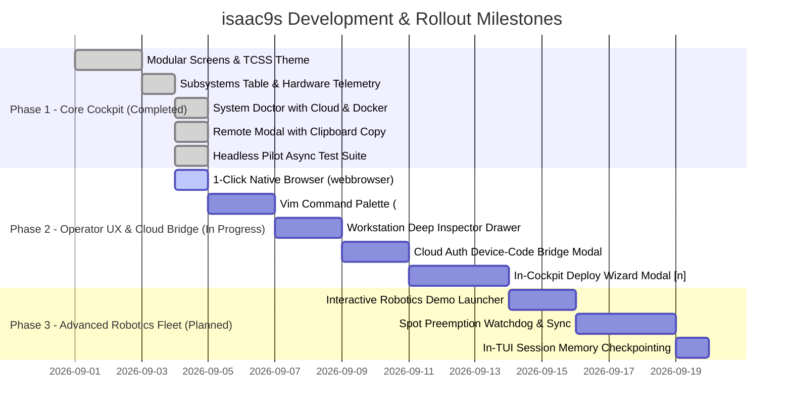

# isaac9s - The k9s-Style Graphical Terminal Interface for Isaac Automator & Isaac Installer
**Python Textual & Rich Architecture Specification with Interactive Terminal UI Previews**

---

## 1. Executive Summary & Design Philosophy

Inspired by **`k9s`**—the gold standard in terminal-based Kubernetes cluster operations—**`isaac9s`** is a high-performance, keyboard-driven Graphical Terminal User Interface (TUI/GUI) engineered specifically for:
1. **Physical Bare-Metal Robotics Workstations** provisioned via [`isaac-installer`](file:///workspaces/IsaacAutomator/isaac-installer/README.md).
2. **Multi-Cloud GPU Workstations** deployed via `IsaacAutomator` across **AWS, GCP, Azure, and Alibaba Cloud**.
3. **Physical AI & Foundation Model Frameworks**: NVIDIA Isaac Sim, Isaac Lab, IsaacLab-Arena, NVIDIA Isaac-GR00T (VLA), and Hugging Face LeRobot.

```text
  ___                               ___        
 |_ _| ___   __ _   __ _   ___     / _ \  ___  
  | | / __| / _` | / _` | / __|   (_) \ \/ __| 
  | | \__ \| (_| || (_| || (__     _   ) \__ \ 
 |___||___/ \__,_| \__,_| \___|   (_) /_/|___/ 
                                               
 Physical AI Workstation & Multi-Cloud Cockpit
```

### 1.1 Why Python (Textual + Rich) is the Optimal Implementation Stack

Unlike Kubernetes tooling that is built in Golang, `isaac9s` is intentionally implemented in **Python 3.10+** utilizing **Textual 8.2** and **Rich 15**:

- **Ecosystem Symmetry**: NVIDIA Isaac Sim, Isaac Lab, Arena, PyTorch, and GR00T are 100% Python-centric. Robotics and AI engineers live in Python.
- **Direct Native Codebase Access**: Imports deployment logic directly from [`src/python/deployer.py`](file:///workspaces/IsaacAutomator/src/python/deployer.py) and cloud SDKs (`boto3`, `google-cloud-compute`, `azure-mgmt-compute`) without brittle CLI subprocess scraping.
- **Modern Reactive TUI**: Textual provides reactive state bindings, declarative CSS (`.tcss`), async event loops (`asyncio`), and smooth 60 FPS rendering with zero compile time.
- **Direct Hardware Telemetry**: Native C-bindings via `pynvml` (`nvidia-ml-py`) and `psutil` sample GPU VRAM, clocks, temperature, and PCIe bandwidth at sub-millisecond speeds.

---

## 2. Interactive Terminal GUI Previews (Visual Screen Mockups)

Below are detailed visual previews of the 7 primary interactive screens in `isaac9s`.

### 2.1 Screen 1: Physical AI Subsystems & Health Auditor (Primary Cockpit)

The default landing screen maps the 14 Physical AI subsystems into a `k9s`-style resource table with live telemetry:

```text
╭─ isaac9s v1.0.0 ───────────────────────────────────────────────────────────────────────────────────────────────────────────── 03:30:15 ─╮
│ Host: workstation-alpha  OS: Ubuntu 22.04 LTS  Kernel: 6.5.0-35-generic  Uptime: 4d 18h                                              │
│ CPU: [████████░░░░░░░░░░░░░░░░░░░░░░] 24% (32 Cores)       RAM: [███████████████░░░░░░░░░░░] 54% (34.2 GB / 64.0 GB)                  │
│ GPU: RTX 4090 (Ada)   VRAM: [██████████░░░░░░░░░░░░░░] 41% (9.8 GB / 24.0 GB)   Temp: 52°C   Fan: 38%   Power: 185W / 450W           │
│ Disk: / [████████████░░░░░░░░░░░░] 48% (912 GB / 1.9 TB NVMe Gen4)                     Profile: default-workstation (Clean)        │
╰───────────────────────────────────────────────────────────────────────────────────────────────────────────────────────────────────────╯
  [1] Subsystems  [2] Workstations  [3] Remote  [4] Logs  [5] Pre-Flight Audit  [6] Profiles  [7] HW Telemetry  [?] Help  [q] Quit
─────────────────────────────────────────────────────────────────────────────────────────────────────────────────────────────────────────
  SUBSYSTEM               CATEGORY         STATUS      VERSION / COMMIT      PATH / PORT             HEALTH DETAILS
─────────────────────────────────────────────────────────────────────────────────────────────────────────────────────────────────────────
▶ NVIDIA Driver           Hardware         [PASS]      550.90.07             /dev/nvidia0            DKMS Loaded, 32 PCIe Lanes, P0 State
  CUDA Runtime            Compute          [PASS]      12.4 (V12.4.131)      /usr/local/cuda-12.4    Driver ABI Compatible, nvcc OK
  Vulkan ICD Bridge       Graphics         [PASS]      1.3.277               /etc/vulkan/icd.d/      nvidia_icd.json verified (Direct 3D)
  Conda Runtime           Environment      [PASS]      Miniconda 24.5.0      ~/miniconda3            base active, envs_dirs mapped
  UV Package Engine       Tooling          [PASS]      0.12.5                ~/.local/bin/uv         Native Rust resolver, 10-50x speed
  Isaac Sim Engine        Simulation       [PASS]      6.0.1 (Standalone)    ~/IsaacSim              Standalone kit binary verified
  Isaac Lab               Robotics Framework [PASS]    v3.0.0-beta2 (Tag)    ~/Documents/GitHub/Lab  Git Clean, editable link verified
  IsaacLab-Arena          Robotics Suite   [PASS]      0.3.0-prerelease      ~/Documents/GitHub/Ar.. Submodule synced, schemas linked
  Isaac-GR00T (VLA)       Foundation Model [WARN]      Cached (No Server)    ~/models/GR00T-N1.7     Weights present (6.2 GB), daemon idle
  Pinocchio / Pink WBC    Whole-Body Ctrl  [PASS]      3.1.0                 conda:isaaclab          CMEK bindings loaded, 120Hz loop
  ZeroMQ Policy IPC       Networking       [PASS]      4.3.5                 Ports: 5555, 5556       Sockets open, 0 zombie processes
  Remote Desktop          Display Server   [PASS]      NoMachine + noVNC     Port 4000 / 6080        Virtual X11 display :1 active
  Dual-Remote Forks       Git Workspaces   [PASS]      Dual-Wired            origin + upstream       Push guard active on upstream
  Security Profile        Cloud Hardening  [PASS]      Simple Mode ($0)      Local /32 IP Whitelist  Caller IP: 198.51.100.24 locked
─────────────────────────────────────────────────────────────────────────────────────────────────────────────────────────────────────────
  <p> Probe All  <h> Heal Drift  <a> Run Audit  <s> Launch Daemon  <r> Open Remote  <y> View Config  </> Filter  <:> Command  <^c> Exit
```

---

### 2.2 Screen 2: Multi-Cloud Workstation Fleet Manager

Pressing `[2]` or `w` displays all cloud-provisioned instances across AWS, GCP, Azure, and local nodes:

```text
╭─ isaac9s » Cloud Fleet & Lifecycle Manager ───────────────────────────────────────────────────────────────────────────────────────────╮
│ Active Cloud Context: GCP (project: robotics-ai-prod, zone: us-central1-a)                                                           │
│ Total Running Cost: $1.24/hr  |  Active Workstations: 2 Running, 1 Stopped  |  Spot Watchdog: ACTIVE (30s watchdog, 10m snapshot)   │
╰───────────────────────────────────────────────────────────────────────────────────────────────────────────────────────────────────────╯
  WORKSTATION NAME    CLOUD     REGION            INSTANCE TYPE   GPU MODEL       IP / INGRESS           STATUS     UPTIME     COST/HR
─────────────────────────────────────────────────────────────────────────────────────────────────────────────────────────────────────────
▶ test03-gcp          GCP       us-central1-a     g2-standard-8   NVIDIA L4 24G   34.120.85.14 (/32)     RUNNING    4h 12m     $0.85/hr
  isaac-spot-aws      AWS       us-east-1         g5.2xlarge      NVIDIA A10G     SSM Tunnel (Private)   RUNNING    1h 05m     $1.21/hr
  dev-workstation-01  AZURE     eastus            NC4as_T4_v3     Tesla T4 16G    52.188.45.92           STOPPED    --         $0.00/hr
  local-robotics-rig  BARE-MET  On-Premise Lab    Physical Host   RTX 4090 24G    192.168.1.150          RUNNING    4d 18h     $0.00/hr
─────────────────────────────────────────────────────────────────────────────────────────────────────────────────────────────────────────
  [Selected: test03-gcp]
  Provider: Google Cloud Platform  |  Preemption: Spot Flex-Start  |  State Bucket: gs://isaac-backups-test03/
  Active Security Profile: Tier 1 - Simple Mode (Dynamic /32 Ingress Lock, Direct Ephemeral Outbound)
─────────────────────────────────────────────────────────────────────────────────────────────────────────────────────────────────────────
  <s> Start VM  <x> Stop VM (Pause Cost)  <c> Connect Remote  <d> Destroy VM  <y> View State  <n> New Deploy  <r> Refresh  </> Search
```

---

### 2.3 Screen 3: Remote Desktop & 3D Streaming Protocol Selector (Modal)

Triggered by pressing `[3]` or `r` on any running workstation:

```text
┌────────────────────────────────────── Connect to Workstation: [test03-gcp] ──────────────────────────────────────┐
│                                                                                                                  │
│ Select desired remote access protocol:                                                                           │
│                                                                                                                  │
│   (•) 1. noVNC Browser Desktop (Port 6080)                                                                       │
│          Zero-install HTML5 browser client. Ideal for 2D UI, terminal, VS Code, and file downloads.              │
│                                                                                                                  │
│   ( ) 2. NoMachine High-Performance 3D (Port 4000)                                                               │
│          Hardware-accelerated H.264 stream. Recommended for live 60 FPS Isaac Sim 3D Viewport.                   │
│                                                                                                                  │
│   ( ) 3. Sunshine + Moonlight GameStream (Port 47989)                                                            │
│          Ultra-low latency NVENC streaming (sub-15ms) for direct teleoperation and VR controllers.               │
│                                                                                                                  │
│   ( ) 4. Zero-Trust SSH Shell Tunnel (Port 22 / IAP / SSM)                                                       │
│          Interactive direct shell without opening public SSH ports to the internet.                              │
│                                                                                                                  │
│ ──────────────────────────────────────────────────────────────────────────────────────────────────────────────── │
│  Target Endpoint:  http://34.120.85.14:6080/vnc.html?autoconnect=true&resize=remote                             │
│  Security Lock:    Strict /32 Caller IP Filter (Your IP: 198.51.100.24)                                          │
│                                                                                                                  │
│                     [ Launch in Browser ]      [ Copy URL ]      [ Cancel (Esc) ]                                │
└──────────────────────────────────────────────────────────────────────────────────────────────────────────────────┘
```

---

### 2.4 Screen 4: Real-Time Subprocess Log Streamer & Pager

Pressing `[4]` or `l` displays live stdout/stderr streams from background installations, builds, or simulation benchmarks:

```text
╭─ isaac9s » Real-Time Task Execution Log Streamer ───────────────────────────────────────────────────────────────────────────────────╮
│ Task: isaac-installer install --profile full  |  PID: 41289 (Async Background Worker)  |  Status: RUNNING  |  Elapsed: 03m 42s       │
╰─────────────────────────────────────────────────────────────────────────────────────────────────────────────────────────────────────╯
[03:32:10] [INFO]  === Stage 4/12: Validating NVIDIA Driver & Vulkan ICD Topology ===
[03:32:11] [PASS]  NVIDIA Driver 550.90.07 detected (Active GPU: NVIDIA RTX 4090, VRAM: 24564 MB)
[03:32:12] [PASS]  Vulkan ICD JSON verified at /etc/vulkan/icd.d/nvidia_icd.json
[03:32:13] [INFO]  === Stage 5/12: Checking Dual-Remote Git Repository Topology ===
[03:32:14] [INFO]  Inspecting workspace: /home/boredengineer/Documents/GitHub/IsaacLab
[03:32:15] [PASS]  Origin remote mapped -> git@github.com:boredengineering/IsaacLab.git (Personal Fork)
[03:32:16] [PASS]  Upstream remote mapped -> https://github.com/isaac-sim/IsaacLab.git (Official Canonical)
[03:32:17] [INFO]  Push guard configured: git push upstream prevented.
[03:32:18] [INFO]  === Stage 6/12: Resolving Hybrid Conda + UV Python Environment ===
[03:32:20] [INFO]  Activating Conda environment: /home/boredengineer/miniconda3/envs/isaaclab
[03:32:21] [INFO]  Invoking UV fast package resolver: uv pip install --no-build-isolation -e .
[03:32:23] [UV]    Resolved 142 dependencies in 184ms
[03:32:25] [UV]    Installed torch==2.4.0, torchvision==0.19.0, isaaclab==3.0.0b2 (editable)
[03:32:26] [PASS]  Conda site-packages verified: isaaclab.pth link active.
[03:32:27] [INFO]  === Stage 7/12: Pre-Caching NVIDIA Isaac-GR00T Foundation Weights ===
[03:32:30] [HUG]   Downloading checkpoint shards for nvidia/GR00T-N1.7-3B...
[03:32:32] [HUG]   Shard 1/3 (2.1 GB): [████████████████████████████████████████████] 100% (84.2 MB/s)
[03:32:35] [HUG]   Shard 2/3 (2.1 GB): [████████████████████████████████████████████] 100% (88.1 MB/s)
[03:32:38] [HUG]   Shard 3/3 (2.0 GB): [████████████████████████░░░░░░░░░░░░░░░░░░░░]  60% (79.4 MB/s)
───────────────────────────────────────────────────────────────────────────────────────────────────────────────────────────────────────
  [Autoscroll: ON]   <space> Pause / Resume Scroll   <c> Clear Buffer   <w> Wrap Lines   </> Search Logs   <q> Return to Cockpit
```

---

### 2.5 Screen 5: Popeye-Style Pre-Flight Audit & Conflict Matrix

Pressing `[5]` or `a` renders a diagnostic audit of all system dependencies, APT package locks, and kernel incompatibilities:

```text
╭─ isaac9s » Pre-Flight Dependency & Conflict Matrix (System Doctor) ───────────────────────────────────────────────────────────────────╮
│ Overall System Health Score: 94 / 100 [GRADE: A]  |  Target Profile: default-workstation.yaml  |  APT Lock: CLEAN (No blockers)       │
╰─────────────────────────────────────────────────────────────────────────────────────────────────────────────────────────────────────╯
  COMPONENT               INSTALLED VERSION       TARGET / REQUIRED       DELTA / STATUS          REMEDIATION ACTION
───────────────────────────────────────────────────────────────────────────────────────────────────────────────────────────────────────
  Ubuntu OS               22.04.4 LTS (Jammy)     22.04 LTS               Exact Match [OK]        None required
  Linux Kernel            6.5.0-35-generic        6.5.x or 5.15.x         Compatible [OK]         None required
  NVIDIA Driver           550.90.07               >= 535.129.03           Compatible [OK]         None required
  Nouveau Driver          Disabled (Blacklisted)  Disabled                Blacklisted [OK]        grub modprobe clean
  CUDA Toolkit            12.4.131                12.1.x / 12.4.x         Compatible [OK]         Symlinked at /usr/local/cuda
  Vulkan Loader           1.3.277                 >= 1.3.204              Compatible [OK]         libvulkan.so.1 present
  NVIDIA Vulkan ICD       /usr/share/vulkan/...   NVIDIA Direct ICD       Verified [OK]           No software fallback
  GLX / Direct Rendering  Enabled (NVIDIA)        Direct Rendering        Verified [OK]           glxinfo direct rendering: Yes
  APT Lock Status         Unlocked (PID: None)    Unlocked                Clean [OK]              apt-get commands permitted
  Miniconda3              24.5.0                  >= 23.1.0               Installed [OK]          Located at ~/miniconda3
  Python in IsaacLab      Python 3.10.12          Python 3.10.x           Compatible [OK]         Pinned runtime
  PyTorch CUDA Support    2.4.0+cu124             torch >= 2.2 + CUDA     Verified [OK]           torch.cuda.is_available() == True
  Git LFS                 3.2.0                   Installed               Verified [OK]           Filters configured
  NVMe Storage Sector     4K Alignment            4096 bytes              Optimal [OK]            Samsung 990 PRO 2TB (SMART 100%)
  X11 Display Dummy       Virtual EDID 1920x1080  EDID Connected          Active [OK]             xorg.conf dummy screen mapped
───────────────────────────────────────────────────────────────────────────────────────────────────────────────────────────────────────
  Summary: 15 Checks Passed, 0 Warnings, 0 Critical Conflicts detected. Machine is certified for Isaac Sim 6.0.1 & Isaac Lab.
───────────────────────────────────────────────────────────────────────────────────────────────────────────────────────────────────────
  <p> Re-run Audit  <h> Auto-Heal Detected Warnings  <y> Export Diagnostic JSON  <q> Return
```

---

### 2.6 Screen 6: Declarative Profile & 3-Tier Security Configurator

Pressing `[6]` allows users to interactively inspect and switch profiles and security tiers:

```text
╭─ isaac9s » Declarative Profile & Multi-Cloud Security Configurator ───────────────────────────────────────────────────────────────────╮
│ Active Workstation: test03-gcp  |  Config File: isaac-installer/config/default-profile.yaml                                          │
╰─────────────────────────────────────────────────────────────────────────────────────────────────────────────────────────────────────╯
  SELECT WORKSTATION PROFILE:
    (•) default-workstation.yaml    Clean interactive robotics workstation (Sim + Lab + Dev Apps + 1ms FTDI)
    ( ) full-ecosystem.yaml         Full ecosystem (+ LeRobot, Arena, GR00T, Manus VR, SpaceMouse)
    ( ) minimal-headless.yaml       Minimal headless node (Simulation server, CI/CD, training)

  SELECT SECURITY & HARDENING TIER:
    (•) Tier 1: Simple Mode (Zero-Cost Frictionless)  [RECOMMENDED FOR INDIE & RESEARCHERS]
        ├── Infrastructure Cost: $0.00 / month added overhead
        ├── Firewall Ingress:   Dynamic /32 IP Whitelist (auto-locked to your current IP: 198.51.100.24)
        ├── Outbound Traffic:   Direct internet access for fast apt/pip/docker package downloads
        └── State Storage:      Local state (.tfstate) stored securely in state/ folder

    ( ) Tier 2: Team Mode (Collaborative Cloud Storage)
        ├── Infrastructure Cost: ~$0.05 / month (Standard GCS/S3 bucket)
        ├── Firewall Ingress:   Dynamic /32 IP Whitelist or shared team subnet
        ├── Outbound Traffic:   Direct internet access
        └── State Storage:      Cloud remote state (GCS/S3) with native distributed state locking

    ( ) Tier 3: Enterprise Mode (Zero-Trust & Compliance)
        ├── Infrastructure Cost: ~$35.00 - $140.00 / month (Cloud NAT + KMS CMEK keys)
        ├── Firewall Ingress:   Zero public IP (Private-only access via GCP IAP or AWS SSM Session Manager)
        ├── Outbound Traffic:   Managed Cloud NAT Gateway with Cloud Router
        └── State Storage:      KMS CMEK-encrypted Cloud Bucket + Cloud Secret Manager credentials
───────────────────────────────────────────────────────────────────────────────────────────────────────────────────────────────────────
  <enter> Apply Configuration  <y> View Raw YAML  <e> Edit in $EDITOR  <Esc> Discard Changes
```

---

### 2.7 Screen 7: Deep Hardware & NVMe Telemetry Dashboard

Pressing `[7]` opens the dedicated hardware diagnostics console:

```text
╭─ isaac9s » Deep Hardware, GPU & NVMe Storage Telemetry ──────────────────────────────────────────────────────────────────────────────╮
│ NVIDIA Ada Lovelace Architecture  |  Driver: 550.90.07  |  CUDA Version: 12.4  |  PCIe Link: Gen4 x16 (31.5 GB/s bidirectional)       │
╰─────────────────────────────────────────────────────────────────────────────────────────────────────────────────────────────────────╯
  GPU CLOCK & THERMAL STATUS                    VRAM ALLOCATION BREAKDOWN (24,564 MB TOTAL)
  GPU Core Clock:      2,550 MHz                Used:   9,824 MB [████████████░░░░░░░░░░░░░░] 40.0%
  Memory Clock:       10,501 MHz                Free:  14,740 MB [░░░░░░░░░░░░░░░░░░░░░░░░░░] 60.0%
  GPU Temperature:    52°C (Throttle: 88°C)     ├── Isaac Sim Engine (Kit):        5,420 MB
  Hotspot Temp:       61°C                      ├── PyTorch CUDA Context:          3,180 MB
  Fan Speed:          38% (Quiet Mode)          └── X11 / Desktop Compositor:      1,224 MB
  Current Power Draw: 185 Watts / 450 Watts

  CPU & MEMORY SUBSYSTEM                        HIGH-SPEED NVMe STORAGE & S.M.A.R.T. HEALTH
  Processor: AMD Ryzen 9 7950X (16c/32t)        Disk 0: Samsung 990 PRO 2TB (PCIe 4.0 x4)
  CPU Governor:      performance                ├── Mountpoint:   / (root filesystem, ext4)
  CPU Temp:          58°C                       ├── Total Space:  1,890 GB
  RAM Allocated:     34.2 GB / 64.0 GB (54%)    ├── Used Space:   912 GB (48%) [████████████░░░░░░░░░░░░]
  RAM Frequency:     DDR5-6000 MT/s (EXPO)      ├── SMART Status: PASSED (Wear Life: 99% Remaining)
  Swap Usage:        0 MB / 8,192 MB (0%)       └── NVMe Temp:    41°C (Safe threshold: < 70°C)
───────────────────────────────────────────────────────────────────────────────────────────────────────────────────────────────────────
  <r> Refresh Metrics (1s interval)  <space> Toggle Auto-Sampling  <q> Return to Cockpit
```

---

## 3. Core Python Architecture & Reactive Engine

### 3.1 Textual 8.2 + Rich 15 Design

`isaac9s` is organized into a clean, modular Python package located in [`src/tui/`](file:///workspaces/IsaacAutomator/src/tui/):

```text
src/tui/
├── __init__.py           # Package export and version definition
├── app.py                # Isaac9sApp main entry, reactive bindings, key routing
├── telemetry.py          # SystemTelemetry sampler (psutil + nvidia-smi / pynvml)
├── backend.py            # WorkstationBackend (state parser, isaac-installer bridge)
├── screens/              # Individual modular view screens
│   ├── subsystems.py     # SubsystemsDataTable and probe card
│   ├── workstations.py   # Cloud fleet manager DataTable and actions
│   ├── remote_modal.py   # ModalScreen for streaming protocol selection
│   ├── log_streamer.py   # RichLog terminal pane with async worker
│   ├── audit_view.py     # Pre-flight conflict matrix & score renderer
│   └── hardware_view.py  # Deep GPU & NVMe telemetry gauges
└── styles/
    └── isaac9s.tcss      # Textual CSS stylesheet for colors and responsive grids
```

---

### 3.2 Reactive State Machine & Concurrency Model

Textual uses reactive properties to automatically trigger DOM updates whenever underlying state changes:

```python
from textual.app import App, ComposeResult
from textual.reactive import reactive
from textual.worker import Worker, work

class SubsystemsView(Widget):
    """Reactive table view for the 14 Physical AI subsystems."""
    
    # Reactive state: updating this automatically re-renders affected UI components
    subsystems_data = reactive(list)
    is_probing = reactive(False)
    
    @work(exclusive=True, thread=True)
    def trigger_background_probe(self) -> None:
        """Asynchronous worker that probes subsystems without blocking the UI event loop."""
        self.is_probing = True
        try:
            results = WorkstationBackend.probe_subsystems()
            # Safely pass data back to Textual's main thread
            self.app.call_from_thread(self._update_table, results)
        finally:
            self.is_probing = False

    def _update_table(self, results: list[dict]) -> None:
        table = self.query_one(DataTable)
        table.clear()
        for item in results:
            badge = self._render_status_badge(item["status"])
            table.add_row(item["name"], item["category"], badge, item["version"], item["details"])
```

---

### 3.3 Direct In-Process Bridge to Cloud Deployer

Instead of invoking shell scripts, `isaac9s` connects directly to `src/python/deployer.py` and cloud APIs:

```python
from src.python.deployer import CloudDeployer
from src.tui.backend import WorkstationState

class CloudWorkstationManager:
    @staticmethod
    async def list_active_workstations() -> list[WorkstationState]:
        """Discovers workstations across AWS, GCP, Azure, and local state."""
        workstations = []
        # Query local state files
        state_dir = Path("state")
        for tfstate in state_dir.glob("*/terraform.tfstate"):
            ws_info = WorkstationState.from_tfstate(tfstate)
            workstations.append(ws_info)
        return workstations

    @staticmethod
    def stop_workstation(name: str, provider: str) -> None:
        """Invokes stop lifecycle asynchronously."""
        deployer = CloudDeployer(name=name, provider=provider)
        deployer.stop()
```

---

### 3.4 Direct Hardware Telemetry Driver (`pynvml` + `psutil`)

```python
import psutil
try:
    import pynvml
    pynvml.nvmlInit()
    HAS_NVML = True
except Exception:
    HAS_NVML = False

class HardwareSampler:
    @staticmethod
    def sample() -> dict:
        data = {
            "cpu_percent": psutil.cpu_percent(),
            "cpu_cores": psutil.cpu_count(logical=True),
            "ram_used_gb": psutil.virtual_memory().used / (1024**3),
            "ram_total_gb": psutil.virtual_memory().total / (1024**3),
            "ram_percent": psutil.virtual_memory().percent,
            "disk_percent": psutil.disk_usage("/").percent,
            "gpu": None
        }
        if HAS_NVML:
            try:
                handle = pynvml.nvmlDeviceGetHandleByIndex(0)
                mem = pynvml.nvmlDeviceGetMemoryInfo(handle)
                temp = pynvml.nvmlDeviceGetTemperature(handle, pynvml.NVML_TEMPERATURE_GPU)
                util = pynvml.nvmlDeviceGetUtilizationRates(handle)
                name = pynvml.nvmlDeviceGetName(handle)
                data["gpu"] = {
                    "name": name if isinstance(name, str) else name.decode("utf-8"),
                    "vram_used_gb": mem.used / (1024**3),
                    "vram_total_gb": mem.total / (1024**3),
                    "vram_percent": round((mem.used / mem.total) * 100, 1),
                    "temp_c": temp,
                    "gpu_util_percent": util.gpu
                }
            except Exception:
                pass
        return data
```

---

## 4. Textual CSS Styling & Theming (`src/tui/styles/isaac9s.tcss`)

`isaac9s` utilizes a customized dark cyber/slate theme inspired by `k9s`:

```css
/* isaac9s master stylesheet */

Screen {
    background: #0f141c;
    color: #e6edf3;
}

Header {
    background: #161b22;
    color: #58a6ff;
    dock: top;
    height: 1;
}

TelemetryBanner {
    height: 3;
    background: #161b22;
    border-bottom: solid #30363d;
    padding: 0 1;
    color: #8b949e;
}

DataTable {
    background: #0d1117;
    color: #c9d1d9;
    height: 1fr;
    border: none;
}

DataTable > .datatable--header {
    background: #21262d;
    color: #58a6ff;
    text-style: bold;
}

DataTable > .datatable--cursor {
    background: #1f6feb;
    color: #ffffff;
    text-style: bold;
}

RichLog {
    background: #05070a;
    color: #7ee787;
    border: solid #30363d;
    height: 1fr;
    padding: 0 1;
}

Footer {
    background: #161b22;
    color: #8b949e;
    dock: bottom;
    height: 1;
}
```

---

---

## 5. Brainstorming & Gap Analysis: What is Missing & How to Improve isaac9s

Based on real-world operator testing, user feedback, and comparison against the Kubernetes `k9s` benchmark, the following key gaps and high-impact improvements have been identified:

```
┌──────────────────────────────────────────────────────────────────────────────────────────────────┐
│                               isaac9s IMPROVEMENT MATRIX & GAPS                                  │
├────────────────────────────────┬───────────────────────┬────────────┬─────────────────────────────┤
│ Feature / Capability           │ Current Status        │ Priority   │ Proposed Improvement        │
├────────────────────────────────┼───────────────────────┼────────────┼─────────────────────────────┤
│ 1. In-Cockpit Deploy Wizard    │ Shell CLI only        │ P0 (High)  │ [n] Interactive Modal       │
│ 2. Cloud Auth Device-Code Flow │ Manual command prompt │ P0 (High)  │ Guided Device-Code Modal    │
│ 3. Vim / k9s Command Palette   │ Number keys only      │ P1 (High)  │ `:` Command bar & `/` filter│
│ 4. Workstation Deep Inspector  │ Table summary only    │ P1 (Med)   │ [Enter] / [i] Detail Drawer │
│ 5. Robotics Demo Launcher      │ Shell scripts on VM   │ P1 (Med)   │ Interactive Demos Screen    │
│ 6. Spot Preemption Watchdog    │ Architecture spec only│ P2 (Med)   │ Cloud metadata poll & alert │
│ 7. 1-Click Native Browser Open │ Clipboard copy only   │ P2 (Quick) │ Python webbrowser.open()    │
│ 8. In-TUI Session Memory Log   │ Manual markdown files │ P2 (Med)   │ [ctrl+s] Auto-Checkpointing │
└────────────────────────────────┴───────────────────────┴────────────┴─────────────────────────────┘
```

---

### 5.1 Gap 1: In-Cockpit Cloud Provisioning Wizard (`[n] New Workstation` Modal)

**The Friction Today:**
Operators must exit `isaac9s` to bash and memorize lengthy CLI flags (e.g. `./deploy-aws test-rig --profile simple --demo humanoid-locomotion`). An unanswered flag hangs non-interactive sessions.

**The Improvement:**
Pressing `n` (or clicking a "New Workstation" button on Screen 2) opens an interactive, non-blocking modal directly within `isaac9s`:

```text
┌────────────────────────────────────── New Isaac Workstation Deployer ──────────────────────────────────────┐
│                                                                                                            │
│  Workstation Name: [ isaac-lab-spot-01                 ]                                                   │
│                                                                                                            │
│  Target Cloud:     (•) AWS EC2    ( ) Google Cloud (GCP)    ( ) Microsoft Azure    ( ) Alibaba Cloud       │
│                                                                                                            │
│  Instance / GPU:   (•) g5.2xlarge (NVIDIA A10G 24GB, 8 vCPU, 32GB RAM) - ~$1.21/hr                        │
│                    ( ) g5.4xlarge (NVIDIA A10G 24GB, 16 vCPU, 64GB RAM) - ~$1.62/hr                       │
│                    ( ) g6e.2xlarge (NVIDIA L4 24GB, Ada Lovelace) - ~$1.10/hr                             │
│                    ( ) g4dn.2xlarge (NVIDIA T4 16GB, Turing Budget) - ~$0.75/hr                            │
│                                                                                                            │
│  Security Tier:    (•) Simple Mode ($0/mo, auto /32 IP lock)                                               │
│                    ( ) Team Mode (<$0.10/mo, GCS/S3 shared state)                                          │
│                    ( ) Enterprise Mode ($35-$180/mo, Cloud NAT, CMEK, Zero-Trust IAP)                     │
│                                                                                                            │
│  Bundled Demos:    [x] Franka Manipulation    [x] Humanoid Locomotion    [ ] Unitree Go2 Quadruped         │
│                                                                                                            │
│  Spot / Preempt:   [x] Enable Spot Instance Pricing (save up to 70%)                                       │
│                                                                                                            │
│ ────────────────────────────────────────────────────────────────────────────────────────────────────────── │
│  Estimated Cost: $0.38/hr (Spot) | Security: Locked to your IP (198.51.100.24/32)                          │
│                                                                                                            │
│                        [ Launch Deployment ]          [ Cancel (Esc) ]                                     │
└────────────────────────────────────────────────────────────────────────────────────────────────────────────┘
```

**Execution Flow:**
1. Validates all inputs non-interactively.
2. Dispatches `deployer.py` in a background worker thread (`run_worker`).
3. Automatically transitions `isaac9s` to **Screen 4 (Logs)** to stream Terraform, Packer, and Ansible output live.

---

### 5.2 Gap 2: Guided Cloud Authentication Device-Code Bridge Modal

**The Friction Today:**
When AWS SSO or GCP ADC tokens expire, the Doctor screen displays a warning, but the user must manually switch to a separate terminal, execute the command, and copy authorization URLs.

**The Improvement:**
Pressing `a` on an unauthenticated cloud provider row in Doctor (or selecting "Authenticate Cloud") launches a guided Device-Code Bridge modal inside `isaac9s`:

```text
┌────────────────────────────── Cloud Authentication Bridge: AWS IAM Identity Center ───────────────────────┐
│                                                                                                            │
│  Device authorization is required to communicate with AWS EC2 & STS.                                      │
│                                                                                                            │
│  Step 1: Copy your one-time verification code:                                                            │
│          ┌───────────────────────────┐                                                                     │
│          │        ABCD - EFGH        │   [ Copy Code to Clipboard ]                                        │
│          └───────────────────────────┘                                                                     │
│                                                                                                            │
│  Step 2: Open the AWS Device Verification Portal in your browser:                                          │
│          https://device.sso.us-east-1.amazonaws.com/                                                       │
│                                                                                                            │
│  Step 3: Paste the code and approve authorization in your browser.                                         │
│                                                                                                            │
│ ────────────────────────────────────────────────────────────────────────────────────────────────────────── │
│  Waiting for browser approval... (Checking STS token every 3s)                                             │
│                                                                                                            │
│                   [ Open Browser (Auto) ]         [ Manual Verify ]         [ Cancel (Esc) ]               │
└────────────────────────────────────────────────────────────────────────────────────────────────────────────┘
```

**Benefits:**
- Eliminates context switching and command memorization.
- Automatically captures the code from `aws sso login --use-device-code` or `gcloud auth application-default login --no-launch-browser`.
- Once verified, automatically re-runs Doctor diagnostics and turns the badge to `[PASS]`.

---

### 5.3 Gap 3: Vim / `k9s` Command Palette (`:` Command Mode & `/` Universal Filter)

**The Friction Today:**
Navigation currently relies on pressing number keys `1`-`6`. Experienced Kubernetes / DevOps engineers expect the fluent Vim-style navigation that makes `k9s` legendary.

**The Improvement:**
- Pressing `:` activates a command input bar at the bottom:
  - `:sub` or `:subsystems` $\to$ Switch to Subsystems Cockpit
  - `:ws` or `:vms` $\to$ Switch to Workstations Fleet
  - `:doc` or `:doctor` $\to$ Switch to Doctor Conflict Matrix
  - `:logs` $\to$ Switch to Subprocess Execution Logs
  - `:telemetry` $\to$ Switch to Deep Hardware Telemetry
  - `:deploy` $\to$ Open New Workstation Deploy Wizard
  - `:quit` or `:q` $\to$ Exit `isaac9s`
- Pressing `/` on any screen activates a universal fuzzy search filter for the active table (e.g. filtering subsystems by "Isaac", or filtering workstations by "gcp").

```text
╭─ isaac9s v1.0.0 ───────────────────────────────────────────────────────────────────────────── 03:30:15 ─╮
│ Host: workstation-alpha  OS: Ubuntu 22.04 LTS  Kernel: 6.5.0-35-generic                                  │
╰──────────────────────────────────────────────────────────────────────────────────────────────────────────╯
  [1] Subsystems  [2] Workstations  [3] Logs  [4] Doctor  [5] Security  [6] Telemetry  [?] Help
────────────────────────────────────────────────────────────────────────────────────────────────────────────
  ... [Filtered Table Rows] ...
────────────────────────────────────────────────────────────────────────────────────────────────────────────
:deploy                                                                                   [Enter: Execute]
```

---

### 5.4 Gap 4: Workstation Deep Inspector Drawer (`Enter` or `i`)

**The Friction Today:**
The Workstations fleet table displays a 6-column summary (Name, Cloud, Status, GPU, IP, Profile). Important runtime telemetry—such as cloud instance ID, VPC subnet, hourly burn rate, disk size, and Terraform state—is hidden.

**The Improvement:**
Pressing `Enter` or `i` on any highlighted workstation slides open the **Workstation Inspector Drawer**:

```text
┌──────────────────────────────── Workstation Inspector: [test03-gcp] ─────────────────────────────────────┐
│                                                                                                            │
│  GENERAL METADATA                      CLOUD NETWORKING & TOPOLOGY                                         │
│  Instance ID:   8392019482910381920    Cloud Provider:    Google Cloud Platform (GCP)                      │
│  Status:        RUNNING                Zone / Region:     us-central1-a                                    │
│  Instance Type: g2-standard-8          Public IP:         34.120.85.14                                     │
│  GPU Model:     NVIDIA L4 24GB VRAM    Private IP:        10.128.0.45                                      │
│  Uptime:        4h 12m                 Ingress Whitelist: 198.51.100.24/32 (Simple Mode)                   │
│                                                                                                            │
│  COST & BILLING MONITOR                STORAGE & DISK SUBSYSTEM                                            │
│  Billing State: ACTIVE (Billed hourly) Boot Disk:         200 GB NVMe (pd-ssd)                             │
│  Instance Rate: $0.85 / hour           IOPS / Throughput: 6,000 IOPS / 240 MB/s                            │
│  Session Cost:  $3.57 accrued          Disk Utilization:  64.2 GB / 200 GB (32%)                           │
│                                                                                                            │
│  INSTALLED PHYSICAL AI STACK                                                                               │
│  Isaac Sim:     6.0.1 Standalone       Active Demos:      humanoid-locomotion (Ready)                      │
│  Isaac Lab:     v3.0.0-beta2           Remote Access:     noVNC (:6080), NoMachine (:4000)                │
│                                                                                                            │
│ ────────────────────────────────────────────────────────────────────────────────────────────────────────── │
│  [s] Start VM   [x] Stop (Pause Cost)   [c] Connect   [d] Destroy VM   [t] Raw State   [Esc] Close         │
└────────────────────────────────────────────────────────────────────────────────────────────────────────────┘
```

---

### 5.5 Gap 5: Out-of-the-Box Robotics Demos Launcher Screen

**The Friction Today:**
Demos (`franka-manipulation`, `humanoid-locomotion`, `quadruped-locomotion`, `gr00t-teleop`) are installed via Ansible and run through desktop icons, but cannot be monitored, launched, or killed directly from `isaac9s`.

**The Improvement:**
Add a dedicated Demos Launcher screen or drawer in `isaac9s`:
- Lists all available pre-packaged Isaac Sim / Isaac Lab / GR00T demos.
- Displays real-time status: `IDLE`, `RUNNING (PID 48192)`, `CRASHED`.
- Shows live simulation performance metrics: Viewport FPS, Physics Step Time (ms), GPU VRAM footprint.
- Provides `[Enter] Launch`, `[k] Kill Process`, and `[l] View Demo Logs`.

---

### 5.6 Gap 6: Spot Preemption Watchdog & Snapshot Safeguard

**The Friction Today:**
Cloud Spot/Preemptible instances offer 70–90% cost savings for robotics training, but cloud providers reclaim them with very short notice:
- **AWS**: 2-minute termination notice via EC2 metadata.
- **GCP**: 30-second preemption notice via Compute metadata.
If an instance terminates unexpectedly, training checkpoints and local simulation files can be lost.

**The Improvement:**
- A background watchdog thread in `isaac9s` polls cloud instance metadata every 10 seconds.
- Upon receiving a termination signal:
  1. Flashes an urgent red alert banner on top of the TUI:
     `[CRITICAL: SPOT PREEMPTION NOTICE RECEIVED - INSTANCE WILL TERMINATE IN 25s]`.
  2. Dispatches an automated state/disk snapshot or `rsync` sync to GCS/S3 before instance shutdown.

---

### 5.7 Gap 7: 1-Click Native Web Browser Integration

**The Friction Today:**
In the Remote Desktop modal, clicking "Launch in Browser" copies the URL to the clipboard, but the operator still has to switch windows, open a browser, and paste the URL.

**The Improvement:**
Integrate Python's native `webbrowser` standard library:
```python
import webbrowser

def launch_remote_browser(url: str) -> None:
    # Opens default system browser directly on host or devcontainer
    webbrowser.open(url, new=2)
```
Clicking `[ Launch in Browser ]` immediately pops open the noVNC remote desktop session in the user's browser in one click.

---

### 5.8 Gap 8: In-TUI Session Memory Checkpointing (`[ctrl+s]` / `:checkpoint`)

**The Friction Today:**
Saving session checkpoints currently requires manual markdown file creation in `.agents/memory/sessions/` adhering to the 25-character UUID standard.

**The Improvement:**
Pressing `ctrl+s` (or typing `:checkpoint`) inside `isaac9s`:
1. Gathers current system health score, active workstations, cost accrual, and doctor checks.
2. Generates the timestamped `YYYYMMDD_HHMMSS_<short_uuid>.md` checkpoint file in `.agents/memory/sessions/`.
3. Appends the record automatically to `.agents/memory/INDEX.md`.
4. Displays a confirmation toast notification in the TUI footer.

---

## 6. Updated Implementation Roadmap & Milestones



---

## 7. Automated Headless Verification & Testing

Every screen and modal in `isaac9s` is tested headlessly via Textual's async pilot harness in CI/CD without needing an X11/Wayland display:

```python
import unittest
from textual.pilot import Pilot
from src.tui.app import Isaac9sApp

class Test_Isaac9sPilot(unittest.IsolatedAsyncioTestCase):
    async def test_isaac9s_full_navigation(self):
        app = Isaac9sApp()
        async with app.run_test() as pilot:
            # 1. Verify initial state & telemetry banner mounted
            self.assertEqual(len(app.query("TelemetryBanner")), 1)
            self.assertGreaterEqual(len(app.query("DataTable")), 1)

            # 2. Switch to Workstations screen
            await pilot.press("2")
            self.assertEqual(app.query_one("#main-tabs").active, "tab-workstations")

            # 3. Switch to Logs screen
            await pilot.press("3")
            self.assertEqual(app.query_one("#main-tabs").active, "tab-logs")

            # 4. Trigger remote desktop modal
            await pilot.press("c")
            await pilot.pause()
            await pilot.press("escape")

            # 5. Clean exit
            await pilot.press("q")

if __name__ == "__main__":
    unittest.main()
```

---

## 8. How to Launch and Use `isaac9s`

```bash
# Launch directly from repo root
./isaac9s

# Or via isaac-installer CLI
./isaac-installer/bin/isaac-installer gui

# Run automated headless tests across all 5 test suites
PYTHONPATH=. ./src/tests/run_all.sh
```

