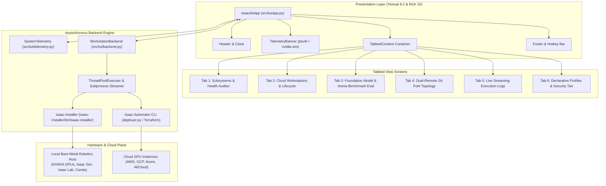

# isaac9s - The k9s-Style Graphical Terminal Interface for Isaac Automator & Isaac Installer
**Architecture & Implementation Specification for the Physical AI & Robotics Workstation Terminal Cockpit**

---

## 1. Executive Summary & Design Philosophy

Inspired by **`k9s`**—the gold standard in terminal-based Kubernetes operations—**`isaac9s`** is an interactive, keyboard-driven Graphical Terminal User Interface (TUI/GUI) engineered for:
1. **Physical Bare-Metal Robotics Workstations** provisioned via [`isaac-installer`](file:///workspaces/IsaacAutomator/isaac-installer/README.md).
2. **Multi-Cloud GPU Workstations** deployed via `IsaacAutomator` across **AWS, GCP, Azure, and Alibaba Cloud**.
3. **Physical AI & Foundation Model Frameworks**: NVIDIA Isaac Sim, Isaac Lab, IsaacLab-Arena, NVIDIA Isaac-GR00T (VLA), and Hugging Face LeRobot.

```text
  ___                               ___        
 |_ _| ___   __ _   __ _   ___     / _ \  ___  
  | | / __| / _` | / _` | / __|   (_) \ \/ __| 
  | | \__ \| (_| || (_| || (__     _   ) \__ \ 
 |___||___/ \__,_| \__,_| \___|   (_) /_/|___/ 
                                               
 Physical AI Workstation & Multi-Cloud Cockpit
```

### 1.1 The k9s Paradigm Mapped to Physical AI & Cloud Robotics

| `k9s` Kubernetes Concept | `isaac9s` Physical AI & Workstation Counterpart |
| :--- | :--- |
| **Clusters / Contexts** | Multi-Cloud Deployments (GCP, AWS, Azure, AliCloud) and Local Bare-Metal Workstations |
| **Pods / Workload Health** | The 14 Physical AI Subsystems (Driver, CUDA, Vulkan, Conda, Isaac Sim, Isaac Lab, Arena, GR00T, WBC, etc.) |
| **Describe & Status** | Deep hardware probing, PCIe link speed, thermal throttles, and pre-flight dependency audits |
| **Logs Streamer (`<l>`)** | Real-time asynchronous subprocess execution window with ANSI color parsing and autoscroll |
| **Self-Healing Reconciler** | Automated workspace hierarchy, branch drift, tag drift, and broken symlink self-healing (`repair`) |
| **CRDs & YAML Config (`<y>`)** | Declarative Profile Editor (`default-profile.yaml`, `full-ecosystem.yaml`, `.tfvars.json`) |
| **Port Forwarding (`<shift-f>`)** | ZeroMQ policy ports (5555/5556), WebRTC livestream (8211), and IAP/SSM zero-trust tunnels |
| **Command Mode (`:`)** | Command palette (`:doctor`, `:drift`, `:repair`, `:eval`, `:deploy`, `:ssh`, `:quit`) |
| **Filter Mode (`/`)** | Real-time instant text and regex filtering across all table views |

---

## 2. System Architecture & Reactive Component Hierarchy

`isaac9s` is engineered with **Textual 8.2** and **Rich 15**, utilizing a fully reactive, asynchronous event-driven architecture that guarantees a silky-smooth 60 FPS terminal experience without blocking the UI during long-running tasks:



---

## 3. Detailed Screen & View Specifications

### 3.1 Live Hardware Telemetry Banner (Permanent Header)
Located directly beneath the main header, the telemetry banner samples host and GPU metrics every 2 seconds:

```text
Host: robotics-rig | OS: Ubuntu 22.04 LTS | CPU: 14% (32 cores) | RAM: 22.1G / 91.4G (24%) | Disk: 41% | GPU: RTX 4090 (44°C, 18%, 4.2G/24G)
```

**Data Sources**:
- **CPU & Memory**: Polled via `psutil.cpu_percent()` and `psutil.virtual_memory()`.
- **Disk Usage**: Polled via `psutil.disk_usage('/')`.
- **GPU Telemetry**: Polled via `nvidia-smi --query-gpu=... --format=csv,noheader,nounits` (GPU index, name, driver version, memory total/used, temperature, and utilization). If no GPU driver is loaded, gracefully displays `No GPU (CPU Mode)`.

---

### 3.2 View 1: Physical AI Subsystems & Health Auditor (`[1]`)
An interactive DataTable tracking the 14 Physical AI subsystems required for physical robotics:

| Subsystem | Category | Detection & Probe Method | Self-Healing / Action Trigger |
| :--- | :--- | :--- | :--- |
| **NVIDIA Driver** | Hardware | `nvidia-smi` query / `/proc/driver/nvidia/version` | Alerts on missing driver; prompts `isaac-installer driver` |
| **CUDA Runtime** | Compute | `nvcc --version` and `/usr/local/cuda/version.json` | Validates CUDA 12.x / 11.8 ABI compatibility |
| **Vulkan ICD Bridge** | Graphics | Probes `/etc/vulkan/icd.d/nvidia_icd.json` and `VK_ICD_FILENAMES` | Restores dynamic symlinks to fix Kit viewport segfaults |
| **Conda Runtime** | Python | Checks `~/miniconda3/envs/isaaclab` and `/opt/conda/envs` | Automatically registers `envs_dirs` in `~/.condarc` |
| **UV Package Engine** | Python | Verifies `/root/.local/bin/uv` or system `uv` | Accelerated pip resolver (10–50x speedup) |
| **Isaac Sim Engine** | Simulation | Verifies standalone path (`~/IsaacSim` or `/isaac-sim`) | Deploys `setup_conda_env.sh` compatibility bridge |
| **Isaac Lab** | Robotics | Inspects git commit, release tag (`v3.0.0-beta2`), and editable link | Validates `isaaclab.pth` in conda site-packages |
| **IsaacLab-Arena** | Robotics | Checks `IsaacLab-Arena` directory and submodule integrity | Runs submodule clean sync and standalone linking |
| **Isaac-GR00T VLA** | Foundation Model | Verifies weights (`nvidia/GR00T-N1.7-3B`) & Cosmos VLM | Pre-caches model checkpoints; verifies torchcodec |
| **Pinocchio / Pink WBC** | Control | Verifies CMEK whole-body control package manifest | Installs CMEK Python bindings for humanoid locomotion |
| **ZeroMQ Policy IPC** | Network | Checks ports 5555, 5556, and 8211 availability | Terminates orphaned zombie policy server processes |
| **Remote Desktop** | Display | Probes noVNC, KasmVNC, and NoMachine systemd services | Configures virtual X11 display and EDID dummy plug |
| **Dual-Remote Forks** | Git/Workspace | Audits `origin` (user fork) vs `upstream` (NVIDIA canonical) | Re-wires remote URLs and configures push guards |
| **Security Profile** | Security | Inspects active tier: Simple ($0), Team, or Enterprise | Toggles CMEK, Secret Manager, and IAP/SSM tunnels |

**Subsystem Status Indicators**:
- `[PASS]` (Green): Fully verified, functional, and matching pinned baseline.
- `[WARN]` (Yellow): Functional with software fallbacks (e.g. software Vulkan or non-pinned tag).
- `[FAIL]` (Red): Broken dependency, segfault detected, or missing kernel driver.
- `[PENDING]` (Cyan): Not yet cloned or installed.

**Actions**:
- `[p]` **Probe**: Executes `isaac-installer doctor` and refreshes the table.
- `[h]` **Heal Drift**: Executes `isaac-installer repair` to resolve branch drift, missing remotes, and broken symlinks.
- `[a]` **Audit**: Executes `isaac-installer plan` to perform pre-flight conflict analysis.

---

### 3.3 View 2: Cloud Workstations & Deployments (`[2]`)
An interactive dashboard displaying all provisioned cloud and local workstations:

- **DataTable Columns**:
  - `Workstation Name` (e.g. `test03`, `robotics-lab`, `local-rig`)
  - `Cloud Provider` (`GCP`, `AWS`, `AZURE`, `ALICLOUD`, `BARE-METAL`)
  - `Status` (`RUNNING`, `STOPPED`, `PROVISIONING`, `TERMINATED`)
  - `GPU Model` (`NVIDIA L4`, `Tesla T4`, `A100-SXM4-80GB`, `RTX 4090`)
  - `IP Address` (External public IP or `IAP/SSM Private`)
  - `Security Profile` (`Simple ($0)`, `Team`, `Enterprise`)
  - `Uptime` (Live uptime counter derived from start timestamps)
- **Lifecycle Actions**:
  - `[s]` **Start VM**: Powers on stopped instance via cloud CLI.
  - `[x]` **Stop VM**: Stops running instance to immediately pause billing.
  - `[c]` **Connect**: Prompts connection modal (launches noVNC in default browser, opens SSH terminal, or creates an IAP/SSM tunnel).
  - `[d]` **Destroy VM**: Triggers a safety confirmation dialog requiring explicit confirmation before running `./destroy <name> --yes`.
  - `[n]` **New Deployment**: Opens the Interactive Deployment Wizard.

---

### 3.4 View 3: Foundation Models & Arena Policy Evaluation (`[3]`)
A dedicated evaluation cockpit for running NVIDIA Isaac-GR00T and IsaacLab-Arena benchmarks:

```text
╭────────────────────────────── NVIDIA Isaac-GR00T Foundation Model Cockpit ──────────────────────────────╮
│ Model: nvidia/GR00T-N1.7-3B | Backbone: Cosmos-Reason2-2B | Weights: CACHED (6.2 GB) | Server: 127.0.0.1:5555   │
╰─────────────────────────────────────────────────────────────────────────────────────────────────────────╯
```

- **Metrics Displayed**:
  - **Inference Latency**: Real-time evaluation loop latency (e.g. `89.9 ms`).
  - **Action Trajectory MSE**: Mean squared error over DROID evaluation trajectories (e.g. `0.00328`).
  - **Physics Simulation Rate**: Real-time Isaac Sim step rate (e.g. `120 Hz`).
- **Interactive Actions**:
  - `[r]` **Run Open-Loop Eval**: Evaluates policy against recorded DROID trajectories.
  - `[g]` **Launch ZeroMQ Server**: Starts the headless background GR00T inference daemon.
  - `[k]` **Kill Policy Server**: Frees GPU memory and shuts down ZeroMQ endpoints.

---

### 3.5 View 4: Dual-Remote Git Fork Topology & Workspace Layout (`[4]`)
Provides visual representation of the dual-remote fork topology:

```text
Repository               Branch / Tag           Origin (Your Fork)                     Upstream (NVIDIA Canonical)       Push Guard
────────────────────────────────────────────────────────────────────────────────────────────────────────────────────────────────────
IsaacLab                 v3.0.0-beta2 (Tag)     boredengineering/IsaacLab              isaac-sim/IsaacLab                PROTECTED
IsaacLab-Arena           release/0.3.0-prerel   boredengineering/IsaacLab-Arena        isaac-sim/IsaacLab-Arena          PROTECTED
lerobot                  v0.4.3 (Tag)           boredengineering/lerobot               huggingface/lerobot               PROTECTED
Isaac-GR00T              main                   boredengineering/Isaac-GR00T           NVIDIA/Isaac-GR00T                PROTECTED
```

- **Actions**:
  - `[s]` **Sync Upstream**: Rebase or fast-forward active branch from NVIDIA upstream.
  - `[t]` **Switch Release Tag**: Select and checkout official pinned release tags.
  - `[f]` **Auto-Fork**: Automatically generates user fork on GitHub via `gh repo fork`.

---

### 3.6 View 5: Live Action Execution & Log Streamer (`[5]`)
An embedded terminal running `RichLog` that captures stdout/stderr in real time:

- **Features**:
  - Full ANSI 256-color and truecolor styling.
  - Asynchronous background execution (UI remains responsive during 15-minute installs).
  - Search and filter within logs (`/`).
  - Autoscroll toggle and one-key log clearance (`c`).

---

### 3.7 View 6: Declarative Profiles & Security Tier Selector (`[6]`)
Inspects and switches between configuration profiles:
- **`default-profile.yaml`**: Standard interactive robotics workstation (NVIDIA driver, Isaac Sim, Isaac Lab, clean X11).
- **`full-ecosystem.yaml`**: Complete stack with IsaacLab-Arena, Isaac-GR00T VLA, Pinocchio WBC, and LeRobot.
- **`minimal-headless.yaml`**: Headless simulation runner for CI/CD and cloud GPU instances.
- **Security Profile Toggle**:
  - `[1] Simple Mode`: $0.00 added cost, dynamic `/32` IP whitelisting, local state.
  - `[2] Team Mode`: <$0.10 added cost, cloud remote state with locking.
  - `[3] Enterprise Mode`: KMS CMEK encryption, Secret Manager, IAP/SSM zero-trust private access.

---

## 4. Keyboard Navigation & Shortcuts (k9s Keybindings)

```text
┌─────────────────────────────────────── Keyboard Navigation ───────────────────────────────────────┐
│ [1] Subsystems  [2] Workstations  [3] Eval  [4] Forks  [5] Logs  [6] Profiles  [?] Help  [q] Quit │
│ [p] Probe       [h] Heal Drift    [a] Audit [s] Start  [x] Stop  [c] Connect   [d] Destroy        │
└───────────────────────────────────────────────────────────────────────────────────────────────────┘
```

| Key | Context | Action |
| :---: | :--- | :--- |
| `1` – `6` | Global | Switch between the 6 primary dashboard screens |
| `p` | Global / Subsystems | Trigger hardware probing and doctor diagnostics |
| `h` | Global / Subsystems | Execute automated self-healing state drift repair |
| `a` | Global / Subsystems | Run pre-flight architecture audit & dependency diff |
| `s` | Workstations | Start selected workstation instance |
| `x` | Workstations | Stop selected workstation instance (pause billing) |
| `c` | Workstations | Connect to workstation (SSH / noVNC / IAP) |
| `d` | Workstations | Destroy workstation (with safety modal confirmation) |
| `r` | Evaluation | Run benchmark policy evaluation |
| `/` | Tables / Logs | Open search filter bar (filter rows / text in real time) |
| `:` | Global | Open command palette (e.g. `:doctor`, `:repair`, `:deploy`, `:quit`) |
| `?` | Global | Display help modal with complete keybinding documentation |
| `q` | Global | Gracefully exit `isaac9s` |

---

## 5. Asynchronous Concurrency & Subprocess Execution Engine

To ensure that heavy operations (like running `apt-get`, building custom Isaac Sim extensions, downloading 6GB GR00T weights, or applying Terraform) do not freeze the UI, `isaac9s` uses a dual-plane execution model:

```python
def run_async_command(self, cmd: str, on_line=None, on_finish=None):
    """
    Spawns child subprocess inside a background thread executor.
    Streams output line-by-line back to the Textual main thread via call_from_thread.
    """
    def worker():
        proc = subprocess.Popen(
            cmd,
            shell=True,
            stdout=subprocess.PIPE,
            stderr=subprocess.STDOUT,
            text=True,
            bufsize=1,
            universal_newlines=True
        )
        for line in proc.stdout:
            self.call_from_thread(self.log_message, f"  {line.rstrip()}")
        proc.wait()
        self.call_from_thread(self.log_message, f"[bold green]Finished with exit code {proc.returncode}[/]")
        if on_finish:
            self.call_from_thread(on_finish, proc.returncode)

    asyncio.get_event_loop().run_in_executor(None, worker)
```

---

## 6. Verification, Testing & Quality Assurance Runbook

### 6.1 Automated Headless Testing
Textual includes a headless testing harness allowing continuous integration without a physical display:

```python
import asyncio
from src.tui.app import Isaac9sApp

async def test_tui_workflow():
    app = Isaac9sApp()
    async with app.run_test() as pilot:
        # Verify initial mounting
        assert len(app.query("*")) >= 40
        
        # Test tab switching
        app.action_tab_workstations()
        await pilot.pause()
        assert app.query_one("#main-tabs").active == "tab-workstations"
        
        # Test probe action trigger
        app.action_run_probe()
        await pilot.pause()
        
        # Test quit
        await pilot.press("q")

asyncio.run(test_tui_workflow())
```

### 6.2 Manual Verification Checklist
1. **Launch**: Run `./isaac9s` from repo root. Verify header displays live CPU/RAM/GPU telemetry.
2. **Subsystems Table**: Verify all 14 Physical AI subsystems render with proper status badges (`PASS`, `WARN`, `FAIL`, `PENDING`).
3. **Probe Trigger**: Press `p`. Verify execution log updates and table refreshes.
4. **Workstations Table**: Press `2`. Verify local and cloud workstations are discovered and listed.
5. **Log Streaming**: Press `3`. Verify streaming log pane scrolls cleanly.
6. **Exit**: Press `q`. Verify terminal state is restored cleanly without artifacting.

---

## 7. How to Launch `isaac9s`

```bash
# From repository root:
./isaac9s

# Or via Python module:
python3 -m src.tui.app

# Or via isaac-installer CLI:
./isaac-installer/bin/isaac-installer gui
```
