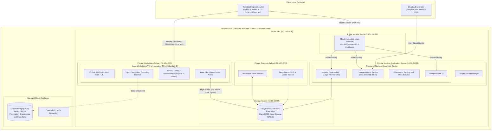
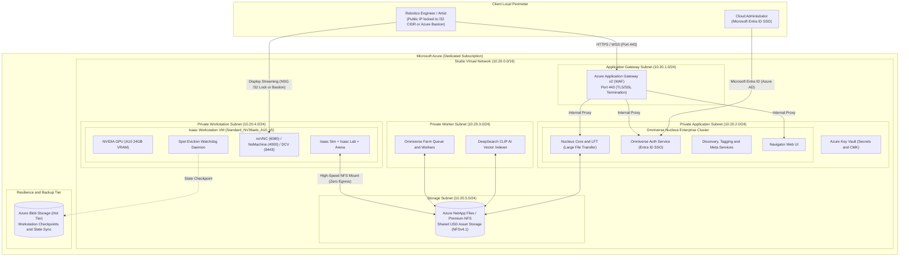

# Network Topologies & Architectural Plan: Omniverse Nucleus & Isaac Workstations
# Single-Cloud Architectures for AWS, GCP, and Azure

This reference document defines and diagrams production cloud network topologies for deploying **NVIDIA Omniverse Nucleus Enterprise** and **Isaac Sim / Isaac Lab Workstations** across the three primary supported clouds:

1. **Google Cloud Platform (GCP)**
2. **Microsoft Azure**
3. **Amazon Web Services (AWS)**

> [!IMPORTANT]
> **Single-Cloud Policy (No Multi-Cloud Overhead)**:
> In accordance with operational efficiency, security perimeters, and cloud egress optimization, each architecture detailed below operates **100% within a single cloud provider**. There is zero cross-cloud traffic, no external egress cost between simulation compute and asset storage, and no inter-cloud latency penalties.

---

## 1. Cloud-Native Services Parity Matrix

The following table maps the required infrastructure primitives across the three major supported cloud providers:

| Architectural Component | Role in Omniverse / Isaac Stack | Google Cloud Platform (GCP) | Microsoft Azure | Amazon Web Services (AWS) |
| :--- | :--- | :--- | :--- | :--- |
| **Ingress & TLS Termination** | Unified HTTPS/WSS entry point (Port 443 only) | **Cloud Application Load Balancer** (External/Internal with Managed SSL) | **Azure Application Gateway v2** (WAF + TLS Termination) | **Application Load Balancer (ALB)** (AWS WAF + ACM Managed SSL) |
| **Robotics Workstation Compute** | Isaac Sim, Isaac Lab, IsaacLab-Arena, GPU physics | **Compute Engine GPU VM** (`g4-standard-48` / `g2-standard-8`) | **Azure Virtual Machine** (`Standard_NV36ads_A10_v5` / `Standard_NC8as_T4_v3`) | **EC2 GPU Instance** (`g5.2xlarge` / `g5.4xlarge`) |
| **Nucleus Core / LFT Compute** | Large File Transfer, asset database, sync engine | **Compute Engine VM** (`c2-standard-8` / `n2-standard-8`) | **Azure Virtual Machine** (`Standard_D8s_v5` / `Standard_F8s_v2`) | **EC2 Compute Instance** (`c5.4xlarge` / `m6i.2xlarge`) |
| **Farm & DeepSearch Workers** | Synthetic data generation & AI CLIP embedding | **Compute Engine VM** (`g2-standard-4` / `n2-standard-4`) | **Azure Virtual Machine** (`Standard_NC4as_T4_v3` / `Standard_D4s_v5`) | **EC2 Compute Instance** (`g5.xlarge` / `c5.xlarge`) |
| **Shared USD Asset Storage** | Centralized, multi-client high-throughput USD share | **Google Cloud Filestore Enterprise** (NFSv3, sub-ms latency) | **Azure NetApp Files** / **Azure Files Premium** (NFSv4.1) | **Amazon EFS Elastic Throughput** (or FSx for Lustre) |
| **Zero-Trust Private Access** | Shell and GUI access without direct public IPs | **Cloud IAP (Identity-Aware Proxy)** TCP Forwarding | **Azure Bastion** | **AWS Systems Manager (SSM)** Session Manager |
| **Identity & SSO Federation** | Centralized user authentication & RBAC | **Google Cloud Identity** / OS Login 2FA | **Microsoft Entra ID** (formerly Azure AD) SAML/OIDC | **AWS IAM Identity Center** (AWS SSO) SAML/OIDC |
| **Secrets & Encryption** | Credential management and Customer Keys (CMEK/CMK) | **Secret Manager** + **Cloud KMS** | **Azure Key Vault** + **Customer-Managed Keys (CMK)** | **AWS Secrets Manager** + **AWS KMS (CMK)** |
| **Spot Resilience & Backups** | Workstation preemption checkpoints and sync | **Google Cloud Storage (GCS)** | **Azure Blob Storage** (Hot Tier) | **Amazon S3 Standard** |

---

## 2. Architecture 1: Standalone Google Cloud Platform (GCP) Studio

### 2.1 GCP Architectural Description
This architecture runs entirely within a single GCP Virtual Private Cloud (VPC) in a target region (e.g. `us-central1`):

1. **Perimeter Ingress (`10.10.1.0/24`)**:
   * Google Cloud External Application Load Balancer terminates incoming TLS/SSL traffic on **Port 443**.
   * Routes traffic to Nucleus web endpoints (Navigator on port 3400, Core/LFT on port 3100, Auth on port 3333).
   * Backed by Cloud Armor for DDoS and IP rate limiting.
2. **Private Application Subnet (`10.10.2.0/24`)**:
   * Dedicated GCE VMs run the containerized Omniverse Nucleus Enterprise microservices.
   * Internal services communicate across a private Docker bridge (`192.168.2.0/26`).
   * Authenticates with corporate IAM via Cloud Identity / SAML 2.0.
3. **Private AI & Rendering Subnet (`10.10.3.0/24`)**:
   * Houses Omniverse Farm Queue workers and DeepSearch vector indexing daemons.
4. **Private Workstation Subnet (`10.10.4.0/24`)**:
   * Houses GPU instances (`g4-standard-48` with NVIDIA RTX PRO 6000 or `g2-standard-8` with NVIDIA L4).
   * Runs Isaac Sim, Isaac Lab, and IsaacLab-Arena.
   * Remote desktop connections (noVNC 6080, NoMachine 4000, NICE DCV 8443) are accessed via dynamic `/32` firewall lock or Cloud IAP tunneling.
   * Spot preemption watchdog (30s daemon) and continuous backup timer (10m) automatically snapshot state to GCS.
5. **High-Throughput Filestore Tier (`10.10.5.0/24`)**:
   * Google Cloud Filestore Enterprise instance exports NFS shares directly to Nucleus and Workstations with zero egress fees and sub-millisecond read/write latency.

### 2.2 GCP Mermaid Flowchart

---

## 3. Architecture 2: Standalone Microsoft Azure Studio

### 3.1 Azure Architectural Description
This architecture runs entirely within a single Azure Virtual Network (VNet) in a target region (e.g. `eastus2` or `westus2`):

1. **Ingress Subnet (`10.20.1.0/24`)**:
   * **Azure Application Gateway v2** with Web Application Firewall (WAF) handles public TLS/SSL termination on **Port 443**.
   * Routes traffic to Nucleus Navigator (port 3400), Core/LFT (port 3100), and Auth (port 3333).
2. **Private Application Subnet (`10.20.2.0/24`)**:
   * Azure Virtual Machines (e.g. `Standard_D8s_v5`) host containerized Nucleus Enterprise microservices.
   * Centralized user login federated via **Microsoft Entra ID** (formerly Azure Active Directory) over SAML 2.0 / OIDC.
   * Credentials and encryption keys managed via **Azure Key Vault**.
3. **Private Compute / Worker Subnet (`10.20.3.0/24`)**:
   * Houses Azure VMs (e.g. `Standard_D4s_v5` or `Standard_NC4as_T4_v3`) executing Omniverse Farm render tasks and DeepSearch vector embedding jobs.
4. **Private Workstation Subnet (`10.20.4.0/24`)**:
   * Hosts GPU-accelerated Azure VMs (`Standard_NV36ads_A10_v5` with NVIDIA A10 or `Standard_NC8as_T4_v3` with NVIDIA T4).
   * Runs Isaac Sim, Isaac Lab, and Arena.
   * Secured by **Azure Network Security Groups (NSGs)** locking inbound streaming to operator `/32` IP or **Azure Bastion**.
   * Spot VM eviction listener monitors Azure Scheduled Events metadata and automatically snapshots workspace state to Azure Blob Storage.
5. **High-Throughput Storage Tier (`10.20.5.0/24`)**:
   * **Azure NetApp Files** (or Azure Files Premium NFSv4.1) provides sub-millisecond shared storage for all USD assets, accessible concurrently by Workstations, Farm workers, and Nucleus.

### 3.2 Azure Mermaid Flowchart

---

## 4. Architecture 3: Standalone Amazon Web Services (AWS) Studio

### 4.1 AWS Architectural Description
This architecture runs entirely within a single AWS Virtual Private Cloud (VPC) in a target region (e.g. `us-east-1` or `us-west-2`):

1. **Public Ingress Subnet (`10.30.1.0/24`)**:
   * **AWS Application Load Balancer (ALB)** with **AWS WAF** handles external TLS/SSL certificate termination on **Port 443** via AWS Certificate Manager (ACM).
   * Routes traffic to private target groups: Navigator (port 3400), Core/LFT (port 3100), and Auth (port 3333).
2. **Private Application Subnet (`10.30.2.0/24`)**:
   * Dedicated Amazon EC2 instances (e.g. `c5.4xlarge` or `m6i.2xlarge`) host containerized Nucleus Enterprise microservices.
   * Centralized user login federated via **AWS IAM Identity Center** (AWS SSO) over SAML 2.0 / OIDC.
   * Database credentials and secrets managed via **AWS Secrets Manager**, encrypted by **AWS KMS** Customer Managed Keys (CMK).
3. **Private Compute / Worker Subnet (`10.30.3.0/24`)**:
   * Houses EC2 instances (`c5.xlarge` or GPU-accelerated `g5.xlarge`) executing Omniverse Farm render tasks and DeepSearch vector indexing jobs.
4. **Private Workstation Subnet (`10.30.4.0/24`)**:
   * Hosts GPU-accelerated EC2 instances (`g5.2xlarge` or `g5.4xlarge` with NVIDIA A10G 24GB VRAM).
   * Runs Isaac Sim, Isaac Lab, and Arena.
   * Secured by **AWS Security Groups** locking inbound traffic to operator `/32` IP or **AWS Systems Manager (SSM)** Session Manager for zero public IP access.
   * Spot interruption listener monitors the 2-minute EC2 Spot Interruption Notice via instance metadata and flushes workspace state to Amazon S3.
5. **High-Throughput Storage Tier (`10.30.5.0/24`)**:
   * **Amazon EFS with Elastic Throughput** (or Amazon FSx for Lustre) provides sub-millisecond, multi-client NFSv4 access to all shared USD assets with zero external egress fees.

### 4.2 AWS Mermaid Flowchart

---

## 5. Topology Rating & Comparative Assessment

| Evaluation Metric | Standalone GCP Studio (Architecture 1) | Standalone Azure Studio (Architecture 2) | Standalone AWS Studio (Architecture 3) | Monolithic VM Antipattern (`GCP-Nucleus-Server`) |
| :--- | :--- | :--- | :--- | :--- |
| **Architectural Rating** | **9.5 / 10** | **9.3 / 10** | **9.4 / 10** | **5.0 / 10** |
| **Ingress Security** | Unified Port 443 with Cloud Armor & Managed SSL | Unified Port 443 with App Gateway v2 WAF & Key Vault SSL | Unified Port 443 with ALB, AWS WAF & ACM Managed SSL | Broad raw microservice port exposure (`3009`, `3100`, `3180`, `3333`, `3400`) |
| **Zero-Trust Access** | Cloud IAP TCP tunneling (zero public IP) | Azure Bastion native tunneling | AWS Systems Manager (SSM) Session Manager | Requires public IP with raw SSH / VNC firewall open |
| **Storage Performance** | Filestore Enterprise (sub-ms NFSv3, dedicated bandwidth) | Azure NetApp Files (ultra-low latency, high IOPS) | Amazon EFS Elastic Throughput (or FSx for Lustre) | Shared single Persistent Disk (`pd-ssd`) bottleneck |
| **Workstation-Nucleus Latency** | Sub-millisecond internal VPC fabric | Sub-millisecond internal VNet fabric | Sub-millisecond internal VPC fabric | Varies; shared disk I/O degrades under concurrent load |
| **Network Egress Cost** | **$0.00** (Same-region internal VPC transit) | **$0.00** (Same-region internal VNet transit) | **$0.00** (Same-region internal VPC transit) | High if workstations access VM across public IP |
| **Disaster Recovery** | Automated Spot watchdog + GCS snapshotting | Automated Eviction watchdog + Azure Blob snapshotting | Automated Spot watchdog + Amazon S3 snapshotting | None (manual disk snapshot required) |

---

## 6. Deployment Recommendations for Single-Cloud Operators

1. **Select One Cloud and Keep Workstations & Nucleus Co-Located**:
   * **GCP**: Place both the Isaac Workstation (via `./deploy-gcp`) and the Nucleus cluster in the same GCP project and region (`us-central1`).
   * **Azure**: Place both the Isaac Workstation (via `./deploy-azure`) and the Nucleus cluster in the same Azure Resource Group and VNet.
   * **AWS**: Place both the Isaac Workstation (via `./deploy-aws`) and the Nucleus cluster in the same AWS Account, VPC, and region (`us-east-1` or `us-west-2`).
2. **Never Route USD Traffic Over Public IPs**:
   * Mounting USD shares over the internal VPC/VNet (Filestore on GCP, NetApp on Azure, or EFS on AWS) achieves maximum simulation framerates and completely avoids cloud egress fees.
3. **Use Spot / Low-Priority for Workstations, On-Demand for Nucleus**:
   * Robotics workstations are stateless compute nodes that can be paused, started, or preempted with automated GCS/Blob/S3 state restoration.
   * Nucleus Core and shared NFS storage should always run On-Demand to provide 100% availability for team collaboration.
