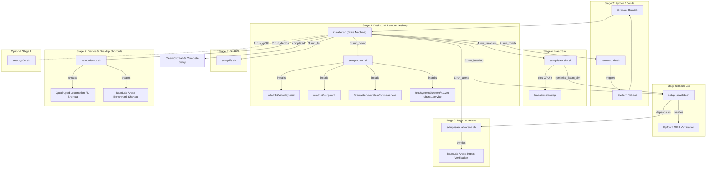

# Script Reference Index & Execution Relationships

Master catalog of installation scripts, setup modules, and supporting configuration files for provisioning a fresh Ubuntu 22.04 LTS GPU system into a fully configured **Isaac Workstation** with **Isaac Sim**, **Isaac Lab**, and **IsaacLab-Arena**.

---

## 1. Script Catalog

| Script / Config File | Stage / Role | Invoked By / Depends On | Target Installed Location / Output | Status |
| :--- | :--- | :--- | :--- | :--- |
| [`installer.sh`](./installer.sh) | Master Orchestrator | System Crontab (`@reboot`) | State in `/var/log/install_progress.log` | Active |
| [`setup-novnc.sh`](./setup-novnc.sh) | Stage 1: Desktop & noVNC | `installer.sh` (`run_novnc`) | Configures XFCE, GDM, VS Code, noVNC, x11vnc | Active |
| [`setup-conda.sh`](./setup-conda.sh) | Stage 2: Conda Environment | `installer.sh` (`run_conda`) | Installs Miniconda/Conda, reboots machine | Active |
| [`setup-lfs.sh`](./setup-lfs.sh) | Stage 3: Git LFS | `installer.sh` (`run_lfs`) | Installs & initializes `git-lfs` | Active |
| [`setup-isaacsim.sh`](./setup-isaacsim.sh) | Stage 4: Isaac Sim | `installer.sh` (`run_isaacsim`) | Downloads/builds Isaac Sim, accepts EULA, pins GPU 0 | Active |
| [`setup-isaaclab.sh`](./setup-isaaclab.sh) | Stage 5: Isaac Lab | `installer.sh` (`run_isaaclab`) | Clones & installs Isaac Lab, symlinks `_isaac_sim` | Active |
| [`setup-isaaclab-arena.sh`](./setup-isaaclab-arena.sh) | Stage 6: IsaacLab-Arena | `installer.sh` (`run_arena`) | Clones & installs IsaacLab-Arena multi-agent benchmarks | Active |
| [`setup-demos.sh`](./setup-demos.sh) | Stage 7: Demos & Shortcuts | `installer.sh` (`run_demos`) | Creates desktop shortcuts & demo launchers | Active |
| [`setup-gr00t.sh`](./setup-gr00t.sh) | Stage 8: Isaac-GR00T (Optional) | `installer.sh` (`run_gr00t`) | Installs GR00T policy/model dependencies | Optional |
| [`vdisplay.edid`](./vdisplay.edid) | X11 EDID Binary | `setup-novnc.sh` | Installed to `/etc/X11/vdisplay.edid` | Active Config |
| [`xorg.conf`](./xorg.conf) | X11 GPU Virtual Display Config | `setup-novnc.sh` | Installed to `/etc/X11/xorg.conf` | Active Config |
| [`novnc.service`](./novnc.service) | Systemd Service for noVNC | `setup-novnc.sh` | Installed to `/etc/systemd/system/novnc.service` | Active Service |
| [`x11vnc-ubuntu.service`](./x11vnc-ubuntu.service) | Systemd Service for x11vnc | `setup-novnc.sh` | Installed to `/etc/systemd/system/x11vnc-ubuntu.service` | Active Service |

---

## 2. Execution Sequence & Dependency Flow

